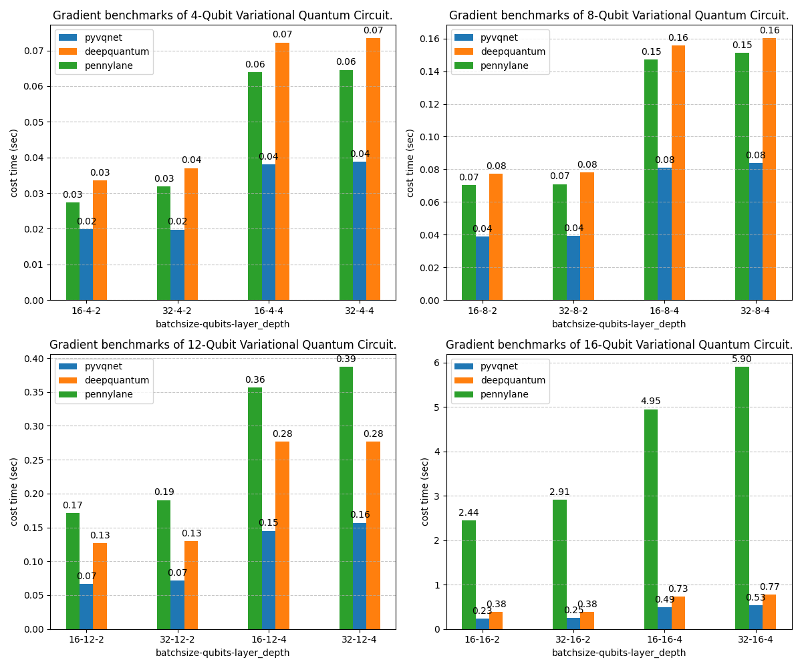

.. _benchmarks:

批量数据量子梯度基准测试
***********************************

在量子机器学习中，梯度计算是影响变分量子线路效率的关键环节。为评估不同框架的量子梯度计算性能，本文在 Linux 系统下使用 GPU，对 VQNet、Deepquantum 与 Pennylane 进行了基准测试。测试在不同批量数据规模、线路深度与量子比特数目下分别进行，统计了各框架运行 10 次的平均耗时。其中，Deepquantum 和 Pennylane 基于 Torch 的 GPU 后端实现，VQNet 则使用自研代码实现GPU运算。

|

.. code-block::

    import time
    import json
    from functools import reduce
    import numpy as np
    import pennylane as qml

    import matplotlib.pyplot as plt
    def benchmark(f, *args, trials=10):
        time0 = time.time()
        r = f(*args)
        time1 = time.time()
        for _ in range(trials):
            r = f(*args)
        time2 = time.time()
        if trials > 0:
            time21 = (time2 - time1) / trials
        else:
            time21 = 0
        ts = (time1 - time0, time21)

        if trials > 0:
            print('running time: %.6f s' % ts[1])
        return r, ts[1]

    import torch
    import deepquantum as dq
    def grad_dq(b, n, l, trials=10):
        def get_grad_dq(params):
            if params.grad != None:
                params.grad.zero_()
            cir = dq.QubitCircuit(n)
            for j in range(l):

                for i in range(n - 1):
                    cir.cnot(i, i + 1)
                cir.rxlayer(encode=True)
                cir.rzlayer(encode=True)
                cir.rxlayer(encode=True)
            for w in range(n):
                cir.observable(basis='z',wires=w)
            cir.to("cuda:0")
            cir(data=params)
            exp = cir.expectation()
            exp.backward(torch.ones_like(exp))
            return params.grad

        return benchmark(get_grad_dq, torch.ones([b,3 * n * l], requires_grad=True,device="cuda:0"))

    def grad_pl_torchlayer(b, n, l,t):

        dev = qml.device("default.qubit", wires=n)
        
        @qml.qnode(dev, interface="torch")
        def circuit(inputs,weights):
            params = inputs
            
            for j in range(l):
                for i in range(n - 1):
                    qml.CNOT(wires=[i, i + 1])
                for i in range(n):
                    qml.RX(params[:,3 * n * j + i], i)
                for i in range(n):
                    qml.RZ(params[:,3 * n * j + i + n], i)
                for i in range(n):
                    qml.RX(params[:,3 * n * j + i + 2 * n], i)

            obs = reduce(lambda x, y: x @ y, [qml.PauliZ(i) for i in range(n)])
            y = qml.expval(obs)
            return y
        
        def get_grad_pl(params):
            params.grad = None
            weight_shapes = {"weights": 1}

            qlayer = qml.qnn.TorchLayer(circuit, weight_shapes = weight_shapes)
            qlayer.to("cuda:0")
            y = qlayer(params)
            
            y.backward(torch.ones_like(y))
            return params.grad
        return benchmark(get_grad_pl, torch.ones([b,3 * n * l],device="cuda:0", requires_grad=True),trials=t)

    def grad_pyvqnet_vqc(b, n, l, t):
        from pyvqnet.qnn.vqc import QMachine,cnot,rx,rz,ry,MeasureAll
        from pyvqnet.tensor import tensor
        import pyvqnet
        pyvqnet.backends.set_backend("pyvqnet-ad")
        def pqctest(qm,param):
            param.zero_grad()
            qm.reset_states(param.shape[0])
            for j in range(l):
                for i in range(n - 1):
                    cnot(qm,[i, i + 1])
                for i in range(n):
                    rx(qm, i, param[:,3 * n * j + i])
                for i in range(n):
                    rz(qm, i, param[:,3 * n * j + i + n])
                for i in range(n):
                    rx(qm, i, param[:,3 * n * j + i + 2 * n])
            pauli_str =""
            for position in range(n):
                pauli_str += "Z" + str(position)+" "
            p_dict = {pauli_str:1}
            ma = MeasureAll(obs=p_dict)

            y = ma(qm)
            y.backward()

            return param.grad

        def get_grad(qm,values):
            r = pqctest(qm,values)

            return r

        input = tensor.ones([b,3 * n * l],device=pyvqnet.DEV_GPU)
        input.requires_grad = True
        qm = QMachine(n)
        qm.toGPU(pyvqnet.DEV_GPU)
        return benchmark(get_grad, qm, input, trials=t)

    N_LIST = [ 4,8,12,16 ]
    L_LIST =[2,4]
    B_LIST =[16, 32]
    def test_1():
        results ={}
        config_key = []
        for n in N_LIST:
            for l in L_LIST:
                for b in B_LIST:
                    for t in [10,]:
                        config_key.append(str(b) + '-' + str(n) + '-' + str(l))

                        dqr, ts1 = grad_pl_torchlayer(b,n, l, t)
                        results[str(b) + '-' + str(n) + '-' + str(l) + '-' + 'grad' + '-pl'] = ts1
                        print(f'pennylane 批次数：{b} 比特数：{n} 线路层数: {l}  迭代: {t}, 计算grad平均耗时 {ts1:4f}秒' )

                        dqr, ts3 = grad_dq(b, n, l, t)
                        results[str(b) + '-' + str(n) + '-' + str(l) + '-' + 'grad' + '-dq'] = ts3
                        print(f'dq 批次数：{b} 比特数：{n} 线路层数: {l}  迭代: {t}, 计算grad平均耗时 {ts3:4f}秒' )

                        result, ts2 = grad_pyvqnet_vqc(b, n, l, t)
                        results[str(b) + '-' + str(n) + '-' + str(l) + '-' + 'grad' + '-pyvqnet'] = ts2
                        print(f'pyvqnet 批次数：{b} 比特数：{n} 线路层数: {l}  迭代: {t}, 计算grad平均耗时 {ts2:4f}秒' )

        with open('gradient_results.data', 'w') as f:
            json.dump(results, f)
        
        with open('gradient_results.data', 'r') as f:
            results = json.load(f)
        
        data = results
        
        sub_w  = 2
        sub_l = int(len(N_LIST)/2)
        assert len(N_LIST)%2==0
        fig, axes = plt.subplots(sub_w, sub_l, figsize=(12, 10))
        ax_i=0
        for n in N_LIST:
            config_key = []
            for l in L_LIST:
                for b in B_LIST:
                    for t in [10,]:
                        config_key.append(str(b) + '-' + str(n) + '-' + str(l))
            groups = config_key 
            pl_times = [data[f'{group}-grad-pl'] for group in groups]
            dq_times = [data[f'{group}-grad-dq'] for group in groups]
            pyvqnet_times = [data[f'{group}-grad-pyvqnet'] for group in groups]

            x = np.arange(len(groups))
            width = 0.15

            ax = axes[int(ax_i/sub_w), ax_i %sub_w]
            ax_i +=1
            #fig, ax = plt.subplots(figsize=(10, 6))

            
            rects2 = ax.bar(x , pyvqnet_times, width, label='pyvqnet')
            rects3 = ax.bar(x + width, dq_times, width, label='deepquantum')
            rects1 = ax.bar(x - width, pl_times, width, label='pennylane')

            ax.set_ylabel('cost time (sec)')
            ax.set_title(f'Gradient benchmarks of {n}-Qubit Variational Quantum Circuit.')
            ax.set_xticks(x)
            ax.set_xlabel('batchsize-qubits-layer_depth')
            ax.set_xticklabels(groups)
            ax.legend()
            ax.grid(axis='y', linestyle='--', alpha=0.7)

            def autolabel(rects):

                for rect in rects:
                    height = rect.get_height()
                    ax.annotate(f'{height:.2f}',
                                xy=(rect.get_x() + rect.get_width() / 2, height),
                                xytext=(0, 3),  # 3 points vertical offset
                                textcoords="offset points",
                                ha='center', va='bottom')

            autolabel(rects1)
            autolabel(rects2)
            autolabel(rects3)
        fig.tight_layout()
        plt.savefig(f"grad-benchmarks.png")

    test_1()

+----------------+----------+
| 项目           | 规格     |
+================+==========+
| CPU            | i9-9900K |
+----------------+----------+
| 显卡           | GTX3090  |
+----------------+----------+
| 内存           | 64GB     |
+----------------+----------+
| deepquantum    | 4.4.0    |
+----------------+----------+
| pennylane      | 0.42.3   |
+----------------+----------+
| torch          | 2.6.0    |
+----------------+----------+
| pyvqnet        | 2.17.2   |
+----------------+----------+
