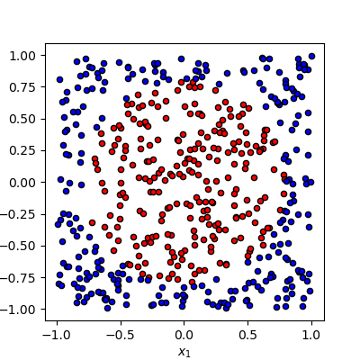
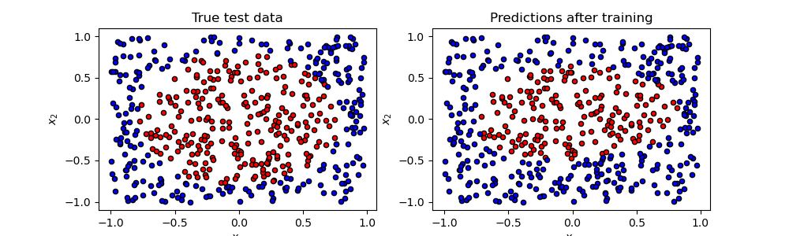

VQNet 安装步骤
==================================

VQNet python包安装
----------------------------------

我们提供了Linux,Windows,MacOS上的python预编译包供安装，需要python==3.8。还需要numpy>=1.18.5,pyqpanda>=3.7.8。

.. code-block::

    pip install pyvqnet

VQNet 测试安装成功
----------------------------------

.. code-block::

    import pyvqnet 
    from pyvqnet.tensor import *
    a = arange(1,25).reshape([2, 3, 4])
    print(a)

VQNet 的一个简单例子
---------------------

这里使用VQNet的经典神经网络模块以及量子模块完成一个机器学习模型的整体流程的例子介绍。该例子参考 `Data re-uploading for a universal quantum classifier <https://arxiv.org/abs/1907.02085>`_
。
量子机器学习中的量子计算模块一般有如下几个部分：

（1）编码线路（Encoder），用于将经典数据编码到量子数据；
（2）可变参数的量子线路（Ansatz），用于训练带参量子门中的参数；
（3）测量模块(Measurement)，用于检测测量值（也就是某个量子比特的量子态在某些轴上的投影）。

量子计算模块与经典神经网络的运算模块一样是可微分的，是量子经典神经网络混合模型的理论基础。
VQNet支持将量子计算模块与经典计算模块（例如：卷积，池化，全连接层，激活函数等）一起构成混合机器学习模型，提供多种优化算法优化参数。

.. figure:: ./images/classic-quantum.PNG

在量子计算模块，VQNet支持使用本源量子高效的量子软件计算包 `pyQPanda <https://pyqpanda-toturial.readthedocs.io/zh/latest/>`_  进行量子模块构建。
使用pyQPanda提供的各种常用 `量子逻辑门函数接口 <https://pyqpanda-toturial.readthedocs.io/zh/latest/QGate.html>`_ ， `量子线路接口 <https://pyqpanda-toturial.readthedocs.io/zh/latest/QCircuit.html>`_ , `量子虚拟机函数接口 <https://pyqpanda-toturial.readthedocs.io/zh/latest/QuantumMachine.html>`_ ， `测量函数接口 <https://pyqpanda-toturial.readthedocs.io/zh/latest/Measure.html>`_，用户可以快速构建量子计算模块。

接下来的例子我们使用pyQPanda构建了一个量子计算模块。通过VQNet，该量子计算模块可以直接嵌入到混合机器学习模型中进行量子线路参数训练。
本例使用1个量子比特，使用了多个带参数的旋转门 `RZ`，`RY`，`RZ` 对输入x进行编码，并使用 `prob_run_dict()` 函数观测量子比特的概率测量结果作为输出。

.. code-block::

    import pyqpanda as pq
    def qdrl_circuit(input,weights,qlist,clist,machine):

            x1 = input.squeeze()
            param1 = weights.squeeze()
            #使用pyqpanda接口构建量子线路实例
            circult = pq.QCircuit()
            #使用pyqpanda接口在第一个量子比特上插入逻辑门RZ门，参数位x1[0]
            circult.insert(pq.RZ(qlist[0], x1[0]))
            #使用pyqpanda接口在第一个量子比特上插入逻辑门RY门，参数位x1[1]
            circult.insert(pq.RY(qlist[0], x1[1]))
            #使用pyqpanda接口在第一个量子比特上插入逻辑门RZ门，参数位x1[2]
            circult.insert(pq.RZ(qlist[0], x1[2]))
            #使用pyqpanda接口在第一个量子比特上插入逻辑门RZ门，参数位param1[0]
            circult.insert(pq.RZ(qlist[0], param1[0]))
            #使用pyqpanda接口在第一个量子比特上插入逻辑门RY门，参数位param1[1]
            circult.insert(pq.RY(qlist[0], param1[1]))
            #使用pyqpanda接口在第一个量子比特上插入逻辑门RZ门，参数位param1[2]
            circult.insert(pq.RZ(qlist[0], param1[2]))
            #使用pyqpanda接口在第一个量子比特上插入逻辑门RZ门，参数位x1[0]
            circult.insert(pq.RZ(qlist[0], x1[0]))
            #使用pyqpanda接口在第一个量子比特上插入逻辑门RY门，参数位x1[1]
            circult.insert(pq.RY(qlist[0], x1[1]))
            #使用pyqpanda接口在第一个量子比特上插入逻辑门RZ门，参数位x1[2]
            circult.insert(pq.RZ(qlist[0], x1[2]))
            #使用pyqpanda接口在第一个量子比特上插入逻辑门RZ门，参数位param1[3]
            circult.insert(pq.RZ(qlist[0], param1[3]))
            #使用pyqpanda接口在第一个量子比特上插入逻辑门RY门，参数位param1[4]
            circult.insert(pq.RY(qlist[0], param1[4]))
            #使用pyqpanda接口在第一个量子比特上插入逻辑门RZ门，参数位param1[5]
            circult.insert(pq.RZ(qlist[0], param1[5]))
            #使用pyqpanda接口在第一个量子比特上插入逻辑门RZ门，参数位x1[0]
            circult.insert(pq.RZ(qlist[0], x1[0]))
            #使用pyqpanda接口在第一个量子比特上插入逻辑门RY门，参数位x1[1]
            circult.insert(pq.RY(qlist[0], x1[1]))
            #使用pyqpanda接口在第一个量子比特上插入逻辑门RZ门，参数位x1[2]
            circult.insert(pq.RZ(qlist[0], x1[2]))
            #使用pyqpanda接口在第一个量子比特上插入逻辑门RZ门，参数位param1[6]
            circult.insert(pq.RZ(qlist[0], param1[6]))
            #使用pyqpanda接口在第一个量子比特上插入逻辑门RY门，参数位param1[7]
            circult.insert(pq.RY(qlist[0], param1[7]))
            #使用pyqpanda接口在第一个量子比特上插入逻辑门RZ门，参数位param1[8]
            circult.insert(pq.RZ(qlist[0], param1[8]))
            #构建量子程序
            prog = pq.QProg()
            prog.insert(circult)
            #获取概率测量值
            prob = machine.prob_run_dict(prog, qlist, -1)
            prob = list(prob.values())
            return prob

本例子中机器学习的任务是对随机生成的数据根据进行二分类，其中下图是该数据样例，零为圆点，半径为1以内红色的二维点为一类，蓝色的点为另一类。

训练测试代码流程

.. code-block::

    #导入必须的库和函数
    from pyvqnet.qnn.qdrl.vqnet_model import qdrl_circuit
    from pyvqnet.qnn.quantumlayer import QuantumLayer
    from pyvqnet.optim import adam
    from pyvqnet.nn.loss import CategoricalCrossEntropy
    from pyvqnet.tensor import QTensor
    import numpy as np
    from pyvqnet.nn.module import Module

定义模型Model，其中 `__init__` 函数定义内部各个神经网络模块以及量子模块，`forward` 函数定义前传函数。`QuantumLayer` 为封装量子计算的抽象类。
您只需将刚才定义的量子计算函数 `qdrl_circuit`，待训练参数个数 `param_num` ，运行后端配置 `"cpu"` , 量子比特数 `qbit_num` 输入参数，该类就在 `VQNet` 中自动计算参数梯度。

.. code-block::

    #待训练参数个数
    param_num = 9
    #量子计算模块量子比特数
    qbit_num  = 1
    #定义一个继承于Module的机器学习模型类
    class Model(Module):
        def __init__(self):
            super(Model, self).__init__()
            #使用QuantumLayer类，可以把带训练参数的量子线路纳入VQNet的自动微分的训练流程中
            self.pqc = QuantumLayer(qdrl_circuit,param_num,"cpu",qbit_num)
        #定义模型前向函数    
        def forward(self, x):
            x = self.pqc(x)
            return x

定义一些训练模型需要的函数

.. code-block::

    # 随机产生待训练数据的函数
    def circle(samples:int,  rads =  np.sqrt(2/np.pi)) :
        data_x, data_y = [], []
        for i in range(samples):
            x = 2*np.random.rand(2) - 1
            y = [0,1]
            if np.linalg.norm(x) < rads:
                y = [1,0]
            data_x.append(x)
            data_y.append(y)
        return np.array(data_x), np.array(data_y)

    # 数据载入函数
    def get_minibatch_data(x_data, label, batch_size):
        for i in range(0,x_data.shape[0]-batch_size+1,batch_size):
            idxs = slice(i, i + batch_size)
            yield x_data[idxs], label[idxs]

    #计算准确率的函数
    def get_score(pred, label):
        pred, label = np.array(pred.data), np.array(label.data)
        pred = np.argmax(pred,axis=1)
        score = np.argmax(label,1)
        score = np.sum(pred == score)
        return score

VQNet遵循机器学习一般的训练测试流程: 迭代进行载入数据，前传计算，损失函数计算，反向计算，更新参数的操作。

.. code-block::

    #实例化定义的模型
    model = Model()
    #定义一个优化器，这里用的是Adam
    optimizer = adam.Adam(model.parameters(),lr =0.6)
    #定义一个损失函数，这里用的交叉熵损失函数
    Closs = CategoricalCrossEntropy()

训练模型部分的函数

.. code-block::

    def train():
        
        # 随机产生待训练数据        
        x_train, y_train = circle(500)
        x_train = np.hstack((x_train, np.zeros((x_train.shape[0], 1))))  
        # 定义每个批次训练的数据个数
        batch_size = 32
        # 最大训练迭代次数
        epoch = 10
        print("start training...........")
        for i in range(epoch):
            model.train()
            accuracy = 0
            count = 0
            loss = 0
            for data, label in get_minibatch_data(x_train, y_train,batch_size):
                # 优化器中缓存梯度清零
                optimizer.zero_grad()
                # 模型前向计算
                output = model(data)
                # 损失函数计算
                losss = Closs(label, output)
                # 损失反向传播
                losss.backward()
                # 优化器参数更新
                optimizer._step()
                # 计算准确率等指标
                accuracy += get_score(output,label)

                loss += losss.item()
                count += batch_size
                
            print(f"epoch:{i}, train_accuracy:{accuracy/count}")
            print(f"epoch:{i}, train_loss:{loss/count}\n")
            
验证模型部分的函数

.. code-block::

    def test():
        
        batch_size = 1
        model.eval()
        print("start eval...................")
        xtest, y_test = circle(500)
        test_accuracy = 0
        count = 0
        x_test = np.hstack((xtest, np.zeros((xtest.shape[0], 1))))
        predicted_test = []
        for test_data, test_label in get_minibatch_data(x_test,y_test, batch_size):

            test_data, test_label = QTensor(test_data),QTensor(test_label)
            output = model(test_data)
            test_accuracy += get_score(output, test_label)
            count += batch_size

        print(f"test_accuracy:{test_accuracy/count}")

训练测试结果图：

.. code-block::

    start training...........
    epoch:0, train_accuracy:0.6145833333333334
    epoch:0, train_loss:0.020432369535168013

    epoch:1, train_accuracy:0.6854166666666667
    epoch:1, train_loss:0.01872217481335004

    epoch:2, train_accuracy:0.8104166666666667
    epoch:2, train_loss:0.016634768371780715

    epoch:3, train_accuracy:0.7479166666666667
    epoch:3, train_loss:0.016975031544764835

    epoch:4, train_accuracy:0.7875
    epoch:4, train_loss:0.016502128106852372

    epoch:5, train_accuracy:0.8083333333333333
    epoch:5, train_loss:0.0163204787299037

    epoch:6, train_accuracy:0.8083333333333333
    epoch:6, train_loss:0.01634311651190122

    epoch:7, train_loss:0.016330583145221074

    epoch:8, train_accuracy:0.8125
    epoch:8, train_loss:0.01629052646458149

    epoch:9, train_accuracy:0.8083333333333333
    epoch:9, train_loss:0.016270687493185203

    start eval...................
    test_accuracy:0.826

