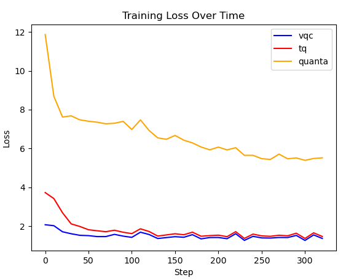
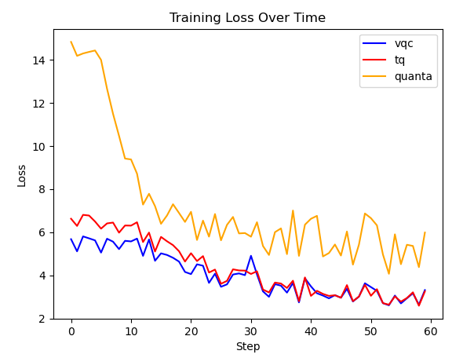

量子大模型微调示例
***********************************

近些年随着大模型的普及，以及大模型规模的逐渐增加，导致训练大规模的量子机器学习模型会导致训练成本显著增加，为了减少大模型在微调过程中所需要的训练资源，
一些大模型微调方法被提出，不再对大模型全参数进行微调，而是通过提出的微调方法对少量的参数进行训练，从而使大模型在下游任务中依旧能取得不弱于全参数微调的效果，
而基于量子线路来进行微调的方式尚未得到普及。

``VQNet`` 通过与 ``Llama factory``, ``peft`` 结合, 实现基于量子线路来进行大模型微调任务。

量子大模型微调依赖包安装
-------------------------

该模块介绍在使用量子线路用于大模型微调中, 如何去对所需依赖包进行安装。

使用量子大模型微调, 主要需要 ``llama_factory_peft_vqc`` 和 ``pyvqnet`` 两个包即可， 其中 ``llama_factory_peft_vqc`` 目前是内部文件， ``pyvqnet`` 版本要求 ``2.15.0`` 或者以上即可。

首先介绍 ``llama_factory_peft_vqc`` 内部库的安装

.. code-block::
    
    git clone git@gitlab.qpanda.cn:BY200002/quantum-llm.git

    # 切换到0.1分支，目前代码文件均在0.1分支上
    git checkout -b 0.1 origin/0.1

随后根据 ``llama_factory_peft_vqc`` 中 ``README.md`` 文档中内容完成其他依赖库以及文件安装

.. code-block::
    
    # 下载其他库
    pip install -r requirements.txt

    # 安装peft_vqc
    cd peft_vqc pip install -e .

完成 ``llama_factory_peft_vqc`` 库以及依赖库安装后，则对 ``pyvqnet`` 进行安装
.. code-block::
    
    # 安装VQNet
    pip install pyvqnet==2.15.0 --index-url https://pypi.originqc.com.cn

量子大模型微调训练步骤
-------------------------

完成需求包安装后, 可以参考文件目录 ``/llama_factory_peft_vqc/examples/qlora_single_gpu/`` 下 ``train.sh`` 等脚本, 根据脚本指定训练基准模型，微调模块选择，微调模块输出路径等参数.

``train.sh`` 脚本样例如下，确定基准模型、数据集、输出的路径等参数信息：

.. code-block::

    #!/bin/bash

    CUDA_VISIBLE_DEVICES=1 python ../../src/train_bash.py \
        --stage sft \
        --model_name_or_path /data/kxf/models/Qwen2.5-0.5B/ \
        --dataset alpaca_gpt4_en \
        --tokenized_path ../../data/tokenized/alpaca_gpt4_en/ \
        --dataset_dir ../../data \
        --template default \
        --finetuning_type vqc \
        --lora_target q_proj,v_proj \
        --output_dir ../../saves/LLaMA2-7B/lora/Qwen2.5-0.5B/vqc/alpaca_gpt4_en \
        --overwrite_cache \
        --overwrite_output_dir \
        --cutoff_len 1024 \
        --preprocessing_num_workers 16 \
        --per_device_train_batch_size 1 \
        --per_device_eval_batch_size 1 \
        --gradient_accumulation_steps 8 \
        --lr_scheduler_type cosine \
        --logging_steps 10 \
        --warmup_steps 20 \
        --save_steps 100 \
        --eval_steps 100 \
        --evaluation_strategy steps \
        --load_best_model_at_end \
        --learning_rate 5e-5 \
        --num_train_epochs 3.0 \
        --max_samples 1000 \
        --val_size 0.1 \
        --plot_loss \
        --fp16 \
        --do-train \

在量子大模型微调模块中, 相较经典的大模型微调模块, 添加了三种额外的微调方式, 分别为：

``vqc`` : 基于VQNet实现的vqc微调模块 

``quanTA`` : 量子张量分解模块 

``tq`` : 基于torch quantum实现的vqc模块  

上述的 ``train.sh`` 样例中是 ``vqc`` 模块微调的脚本样例, 若使用另外两种微调模块则将 ``finetuning_type`` 改为 ``quanTA`` , ``tq`` 即可，将三个模块实验结果记录并绘图， 结果如下:

|

上图则是基于 ``Qwen2.5-0.5B`` 基准模型在数据集 ``alpaca_gpt4_en`` 下的训练结果， 其中, 可以观察到, 基于VQNet的 ``vqc`` 模块取得了最好的实验结果，以此证明了基于量子线路来做大模型微调任务的有效性。

在不同的基准模型下如 ``Llama-3.2-1B`` 下同样也能取得同样的结果，在数据集 ``identity`` 上的训练脚本样例如下：

.. code-block::

    #!/bin/bash

    CUDA_VISIBLE_DEVICES=1 python ../../src/train_bash.py \
        --stage sft \
        --model_name_or_path /data/kxf/models/Llama-3.2-1B \
        --dataset identity \
        --tokenized_path ../../data/tokenized/identity/ \
        --dataset_dir ../../data \
        --template default \
        --finetuning_type quanTA \
        --lora_target q_proj,v_proj \
        --output_dir ../../saves/LLaMA2-7B/lora/Llama-3.2-1B/quanTA/identity/2024_12_05 \
        --overwrite_cache \
        --overwrite_output_dir \
        --cutoff_len 1024 \
        --preprocessing_num_workers 16 \
        --per_device_train_batch_size 1 \
        --per_device_eval_batch_size 1 \
        --gradient_accumulation_steps 8 \
        --lr_scheduler_type cosine \
        --logging_steps 10 \
        --warmup_steps 20 \
        --save_steps 100 \
        --eval_steps 100 \
        --evaluation_strategy steps \
        --load_best_model_at_end \
        --learning_rate 5e-5 \
        --num_train_epochs 3.0 \
        --max_samples 1000 \
        --val_size 0.1 \
        --plot_loss \
        --fp16 \
        --do-train \

通过 ``finetuning_type`` 设置其他的微调模块进行微调训练，结果如下图所示:

|

上述则是在不同模型下进行训练的实验结果, 通过 ``train.sh`` 训练脚本，可以将微调训练后的模块参数保存到指定目录下，而要使用该微调模块，还需要将该微调模块与基准模型融合，生成新的大模型微调模块，
通过相同目录 ``/llama_factory_peft_vqc/examples/qlora_single_gpu/`` 下的 ``merge.sh`` 脚本将微调模块与基准模型模块融合，并在指定路径下生成文件, 脚本内容如下：

.. code-block::

    #!/bin/bash

    CUDA_VISIBLE_DEVICES=0 python ../../src/export_model.py \
        --model_name_or_path /data/kxf/models/Qwen2.5-0.5B/ \
        --template default \
        --finetuning_type vqc \
        --adapter_name_or_path ../../saves/LLaMA2-7B/lora/Qwen2.5-0.5B/vqc/alpaca_gpt4_en
        --export_dir ../../saves/export_model/Qwen2.5-0.5B/vqc/alpaca_gpt4_en \
        --export_size 2 \

随后可以调用生成后的模型进行微调训练, 查看是否能够收敛, 将脚本 ``train.sh`` 中参数 ``model_name_or_path`` 改成生成的模型路径 ``../../saves/export_model/Qwen2.5-0.5B/vqc/alpaca_gpt4_en`` 即可。

更多相关参数具体介绍
-------------------------

==============================     ===================================================================
                        微调模块参数介绍
------------------------------------------------------------------------------------------------------
参数名                                  详细介绍
==============================     ===================================================================
stage                               确定大模型训练模式, pt为预训练, sft为微调阶段, 实验为sft.
model_name_or_path                  选择基准模型的路径.
dataset                             选择数据集, 如identity, alpaca_gpt4_zh等.
tokenized_path                      选择数据集tokenized路径.
dataset_dir                         选择数据集路径.
template                            模型模板类型, 如llama3等.
finetuning_type                     指定微调方法, 如lora, tq, vqc, quanTA.
lora_target                         作用模块为q_proj,v_proj
output_dir                          微调模块保存路径
overwrite_cache                     是否覆盖缓存的训练集和评估集
overwrite_output_dir                是否覆盖输出目录中已存在的文件
cutoff_len                          指定处理数据时的截断长度
preprocessing_num_workers           指定预处理数据时使用的工作进程数量
per_device_train_batch_size         每个gpu的批处理大小, 训练参数
per_device_eval_batch_size          评估时批次，训练参数
gradient_accumulation_steps         梯度累计的步数，训练参数
lr_scheduler_type                   学习率调度器，训练参数
logging_steps                       打印间隔
warmup_steps                        预热步数
save_steps                          模型保存间隔
eval_steps                          评估保存间隔
evaluation_strategy                 评估策略，这里设置为按步骤评估
load_best_model_at_end              训练结束时加载表现最好的模型
learning_rate                       学习率，训练参数
num_train_epochs                    需要执行的训练轮数，训练参数
max_samples                         训练最大样本数
val_size                            验证集大小 
plot_loss                           是否保存训练损失曲线
fp16                                是否使用fp16混合精度训练, 在vqc模块使用float32
do-train                            是否指定是训练任务
adapter_name_or_path                选择训练结束后生成文件路径
export_dir                          合成后的模型路径
export_size                         导出模型的批次大小 
export_legacy_format                这个参数指定是否使用旧的导出格式，确定到处格式可以在其他环境中部署
==============================     ===================================================================

其中参数详细介绍可以参考网址 https://llamafactory.readthedocs.io/zh-cn/latest/advanced/arguments.html
