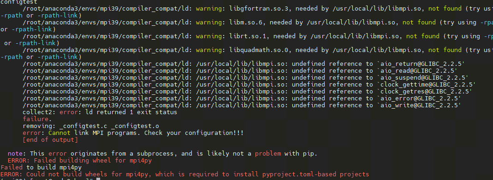

经典神经网络模块
######################

基本例子
*********************************************************

CPU下模型训练
=================================

以下的经典神经网络模块均支持自动反向传播计算。当您运行前传函数以后，再执行反向函数就可以计算梯度。一个卷积层的简单例子如下:

.. code-block::

    from pyvqnet.tensor import arange
    from pyvqnet import kfloat32
    from pyvqnet.nn import Conv2D

    # an image feed into two dimension convolution layer
    b = 2        # batch size 
    ic = 2       # input channels
    oc = 2      # output channels
    hw = 4      # input width and heights

    # two dimension convolution layer
    test_conv = Conv2D(ic,oc,(2,2),(2,2),"same")

    # input of shape [b,ic,hw,hw]
    x0 = arange(1,b*ic*hw*hw+1,requires_grad=True,dtype=kfloat32)

    x1 = x0.reshape([b,ic,hw,hw])

    #forward function
    y = test_conv(x1)

    #backward function with autograd
    y.backward()
    print(x0.grad)
    # [-0.0008376 -0.2780731 -0.0008376 -0.2780731  0.1125833  0.2805848
    #   0.1125833  0.2805848 -0.0008376 -0.2780731 -0.0008376 -0.2780731
    #   0.1125833  0.2805848  0.1125833  0.2805848  0.5759128 -0.057339
    #   0.5759128 -0.057339  -0.342508  -0.4853693 -0.342508  -0.4853693
    #   0.5759128 -0.057339   0.5759128 -0.057339  -0.342508  -0.4853693
    #  -0.342508  -0.4853693 -0.0008376 -0.2780731 -0.0008376 -0.2780731
    #   0.1125833  0.2805848  0.1125833  0.2805848 -0.0008376 -0.2780731
    #  -0.0008376 -0.2780731  0.1125833  0.2805848  0.1125833  0.2805848
    #   0.5759128 -0.057339   0.5759128 -0.057339  -0.342508  -0.4853693
    #  -0.342508  -0.4853693  0.5759128 -0.057339   0.5759128 -0.057339
    #  -0.342508  -0.4853693 -0.342508  -0.4853693]

GPU下模型训练
=================================

您需要安装linux版本下的pyvqnet才能使用GPU。需要保证数据QTensor以及Module均在GPU上。可使用 `toGPU` 转移数据或者 `gpu` 创建副本，或者在数据创建函数中使用device指定。

请参考以下例子：

.. code-block::

    from pyvqnet.tensor import arange
    from pyvqnet import kfloat32,DEV_GPU_0
    from pyvqnet.nn import Conv2D

    b = 2        # batch size 
    ic = 2       # input channels
    oc = 2      # output channels
    hw = 4      # input width and heights

    test_conv = Conv2D(ic,oc,(2,2),(2,2),"same")
    #复制到gpu上DEV_GPU_0
    test_conv.toGPU(DEV_GPU_0)
    # input of shape [b,ic,hw,hw]
    x0 = arange(1,b*ic*hw*hw+1,requires_grad=True,dtype=kfloat32).reshape([b,ic,hw,hw])

    #使用gpu 复制数据到DEV_GPU_0，亦可以在函数内指定ID，也可以使用相关tensor接口的device进行指定
    x0 = x0.GPU(DEV_GPU_0)
    x0.requires_grad = True
    #forward function
    x = test_conv(x0)

    #backward function with autograd
    x.backward()
    print(x0.grad)

.. currentmodule:: pyvqnet.nn

Module类
*********************************************************

abstract calculation module

Module
=================================

.. py:class:: pyvqnet.nn.module.Module

    所有神经网络模块的基类,包括量子模块或经典模块。您的模型也应该是此类的子类,用于 autograd 计算。
    模块还可以包含其他Module类,允许将它们嵌套在树状结构。 您可以将子模块分配为常规属性::

        class Model(Module):
            def __init__(self):
                super(Model, self).__init__()
                self.conv1 = pyvqnet.nn.Conv2d(1, 20, (5,5))
                self.conv2 = pyvqnet.nn.Conv2d(20, 20, (5,5))
            def forward(self, x):
                x = pyvqnet.nn.activation.relu(self.conv1(x))
                return pyvqnet.nn.activation.relu(self.conv2(x))

    以这种方式分配的子模块将被注册。

forward
=================================

.. py:function:: pyvqnet.nn.module.Module.forward(x, *args, **kwargs)

    Module类抽象前向计算函数

    :param x: 输入QTensor。
    :param \*args: 非关键字可变参数。
    :param \*\*kwargs: 关键字可变参数。

    :return: 模型输出。

    Example::

        import numpy as np
        from pyvqnet.tensor import QTensor
        import pyvqnet as vq
        from pyvqnet.nn import Conv2D
        b = 2
        ic = 3
        oc = 2
        test_conv = Conv2D(ic, oc, (3, 3), (2, 2), "same")
        x0 = QTensor(np.arange(1, b * ic * 5 * 5 + 1).reshape([b, ic, 5, 5]),
                    requires_grad=True,
                    dtype=vq.kfloat32)
        x = test_conv.forward(x0)
        print(x)

        # [
        # [[[4.3995643, 3.9317808, -2.0707254],
        #  [20.1951981, 21.6946659, 14.2591858],
        #  [38.4702759, 31.9730244, 24.5977650]],
        # [[-17.0607567, -31.5377998, -7.5618000],
        #  [-22.5664024, -40.3876266, -15.1564388],
        #  [-3.1080279, -18.5986233, -8.0648050]]],
        # [[[6.6493244, -13.4840755, -20.2554188],
        #  [54.4235802, 34.4462433, 26.8171902],
        #  [90.2827682, 62.9092331, 51.6892929]],
        # [[-22.3385429, -45.2448578, 5.7101378],
        #  [-32.9464149, -60.9557228, -10.4994345],
        #  [5.9029331, -20.5480480, -0.9379558]]]
        # ]

        
state_dict 
=================================

.. py:function:: pyvqnet.nn.module.Module.state_dict(destination=None, prefix='')

    返回包含模块整个状态的字典:包括参数和缓存值。
    键是对应的参数和缓存值名称。

    :param destination: 返回保存模型内部模块,参数的字典。
    :param prefix: 使用的参数和缓存值的命名前缀。

    :return: 包含模块整个状态的字典。

    Example::

        from pyvqnet.nn import Conv2D
        test_conv = Conv2D(2,3,(3,3),(2,2),"same")
        print(test_conv.state_dict().keys())
        #odict_keys(['weights', 'bias'])

toGPU
=================================

.. py:function:: pyvqnet.nn.module.Module.toGPU(device: int = DEV_GPU_0)

    将模块和其子模块的参数和缓冲数据移动到指定的 GPU 设备中。

    device 指定存储其内部数据的设备。 当device >= DEV_GPU_0时，数据存储在GPU上。如果您的计算机有多个GPU，
    则可以指定不同的设备来存储数据。例如device = DEV_GPU_1 , DEV_GPU_2, DEV_GPU_3, ... 表示存储在不同序列号的GPU上。
    
    .. note::
        Module在不同GPU上无法进行计算。
        如果您尝试在 ID 超过验证 GPU 最大数量的 GPU 上创建 QTensor，将引发 Cuda 错误。

    :param device: 当前保存QTensor的设备，默认=DEV_GPU_0。device= pyvqnet.DEV_GPU_0，存储在第一个 GPU 中，devcie = DEV_GPU_1，存储在第二个 GPU 中，依此类推
    :return: Module 移动到 GPU 设备。

    Examples::

        from pyvqnet.nn.conv import ConvT2D 
        test_conv = ConvT2D(3, 2, [4,4], [2, 2], "same")
        test_conv = test_conv.toGPU()
        print(test_conv.backend)
        #1000

toCPU
=================================

.. py:function:: pyvqnet.nn.module.Module.toCPU()

    将模块和其子模块的参数和缓冲数据移动到特定的 CPU 设备中。

    :return: Module 移动到 CPU 设备。

    Examples::

        from pyvqnet.nn.conv import ConvT2D 
        test_conv = ConvT2D(3, 2, [4,4], [2, 2], "same")
        test_conv = test_conv.toCPU()
        print(test_conv.backend)
        #0

模型参数保存和载入
*********************************************************

以下接口可以进行模型参数保存到文件中，或从文件中读取参数文件。但请注意，文件中不保存模型结构，需要用户手动构建模型结构。

save_parameters
=================================

.. py:function:: pyvqnet.utils.storage.save_parameters(obj, f)

    保存模型参数的字典到一个文件。

    :param obj: 需要保存的字典。
    :param f: 保存参数的文件名。

    :return: 无。

    Example::

        from pyvqnet.nn import Module,Conv2D
        import pyvqnet
        class Net(Module):
            def __init__(self):
                super(Net, self).__init__()
                self.conv1 = Conv2D(input_channels=1, output_channels=6, kernel_size=(5, 5), stride=(1, 1), padding="valid")

            def forward(self, x):
                return super().forward(x)

        model = Net() 
        pyvqnet.utils.storage.save_parameters(model.state_dict(),"tmp.model")

load_parameters
=================================

.. py:function:: pyvqnet.utils.storage.load_parameters(f)

    从文件中载入参数到一个字典中。

    :param f: 保存参数的文件名。

    :return: 保存参数的字典。

    Example::

        from pyvqnet.nn import Module, Conv2D
        import pyvqnet

        class Net(Module):
            def __init__(self):
                super(Net, self).__init__()
                self.conv1 = Conv2D(input_channels=1,
                                    output_channels=6,
                                    kernel_size=(5, 5),
                                    stride=(1, 1),
                                    padding="valid")

            def forward(self, x):
                return super().forward(x)

        model = Net()
        model1 = Net()  # another Module object
        pyvqnet.utils.storage.save_parameters(model.state_dict(), "tmp.model")
        model_para = pyvqnet.utils.storage.load_parameters("tmp.model")
        model1.load_state_dict(model_para)

ModuleList
*********************************************************
.. py:class:: pyvqnet.nn.module.ModuleList([pyvqnet.nn.module.Module])

    将子模块保存在列表中。 ModuleList 可以像普通的 Python 列表一样被索引， 它包含的Module的内部参数等可以被保存起来。

    :param modules: nn.Modules 列表

    :return: 一个模块列表

    Example::

        from pyvqnet.tensor import *
        from pyvqnet.nn import Module,Linear,ModuleList
        from pyvqnet.qnn import ProbsMeasure,QuantumLayer
        import pyqpanda as pq
        def pqctest (input,param,qubits,cubits,m_machine):
            circuit = pq.QCircuit()
            circuit.insert(pq.H(qubits[0]))
            circuit.insert(pq.H(qubits[1]))
            circuit.insert(pq.H(qubits[2]))
            circuit.insert(pq.H(qubits[3]))

            circuit.insert(pq.RZ(qubits[0],input[0]))
            circuit.insert(pq.RZ(qubits[1],input[1]))
            circuit.insert(pq.RZ(qubits[2],input[2]))
            circuit.insert(pq.RZ(qubits[3],input[3]))

            circuit.insert(pq.CNOT(qubits[0],qubits[1]))
            circuit.insert(pq.RZ(qubits[1],param[0]))
            circuit.insert(pq.CNOT(qubits[0],qubits[1]))

            circuit.insert(pq.CNOT(qubits[1],qubits[2]))
            circuit.insert(pq.RZ(qubits[2],param[1]))
            circuit.insert(pq.CNOT(qubits[1],qubits[2]))

            circuit.insert(pq.CNOT(qubits[2],qubits[3]))
            circuit.insert(pq.RZ(qubits[3],param[2]))
            circuit.insert(pq.CNOT(qubits[2],qubits[3]))
            #print(circuit)

            prog = pq.QProg()
            prog.insert(circuit)

            rlt_prob = ProbsMeasure([0,2],prog,m_machine,qubits)
            return rlt_prob

        class M(Module):
            def __init__(self):
                super(M, self).__init__()
                self.pqc2 = ModuleList([QuantumLayer(pqctest,3,"cpu",4,1), Linear(4,1)
                ])

            def forward(self, x, *args, **kwargs):
                y = self.pqc2[0](x)  + self.pqc2[1](x)
                return y

        mm = M()
        print(mm.state_dict().keys())
        #odict_keys(['pqc2.0.m_para', 'pqc2.1.weights', 'pqc2.1.bias'])

ParameterList
*********************************************************
.. py:class:: pyvqnet.nn.module.ParameterList([pyvqnet.nn.module.Module])

    将参数保存在列表中, ParameterList 可以像普通的 Python 列表一样被索引， 它包含的Parameter的内部参数等可以被保存起来。

    :param modules: nn.Parameter 列表

    :return: 一个参数列表

    Example::

        from pyvqnet import nn
        class MyModule(nn.Module):
            def __init__(self):
                super().__init__()
                self.params = nn.ParameterList([nn.Parameter((10, 10)) for i in range(10)])
            def forward(self, x):

                # ParameterList can act as an iterable, or be indexed using ints
                for i, p in enumerate(self.params):
                    x = self.params[i // 2] * x + p * x
                return x

        model = MyModule()
        print(model.state_dict().keys())

Sequential
*********************************************************
.. py:class:: pyvqnet.nn.module.Sequential([pyvqnet.nn.module.Module])

    模块将按照传递的顺序添加模块。或者，也可以将模块的 ``OrderedDict`` 传入。``Sequential`` 的 ``forward()`` 方法接受任何输入，并将其转发给它的第一个模块。
    然后将输出依次 "链 "到其后每个模块的输入、最后返回最后一个模块的输出。

    :param modules: 添加的Module

    :return: Sequential

    Example::
        
        from pyvqnet import nn
        from collections import OrderedDict

        # 使用Sequential创建一个小模型
        model = nn.Sequential(
                  nn.Conv2D(1,20,(5, 5)),
                  nn.ReLu(),
                  nn.Conv2D(20,64,(5, 5)),
                  nn.ReLu()
                )
        print(model.state_dict().keys())

        # 基于OrderedDict来使用Sequential, 代码如下
                
        model = nn.Sequential(OrderedDict([
                  ('conv1', nn.Conv2D(1,20,(5, 5))),
                  ('relu1', nn.ReLu()),
                  ('conv2', nn.Conv2D(20,64,(5, 5))),
                  ('relu2', nn.ReLu())
                ]))
        print(model.state_dict().keys())

经典神经网络层
*********************************************************

以下实现了一些经典神经网络层：卷积，转置卷积，池化，归一化，循环神经网络等。

Conv1D
=================================

.. py:class:: pyvqnet.nn.Conv1D(input_channels:int,output_channels:int,kernel_size:int ,stride:int= 1,padding = "valid",use_bias:bool = True,kernel_initializer = None,bias_initializer =None, dilation_rate: int = 1, group: int = 1, dtype = None, name = "")

    在输入上进行一维卷积运算。 Conv1D模块的输入具有形状(batch_size、input_channels、in_height)。

    :param input_channels: `int` - 输入数据的通道数。
    :param output_channels: `int` - 输出数据的通道数。
    :param kernel_size: `int` - 卷积核的尺寸. 卷积核形状 = [output_channels,input_channels/group,kernel_size,1]。
    :param stride: `int` - 步长, 默认为1。
    :param padding: `str|int` - 填充选项, 它可以是一个字符串 {'valid', 'same'} 或一个整数，给出应用在输入上的填充量。 默认 "valid"。
    :param use_bias: `bool` - 是否使用偏置项, 默认使用。
    :param kernel_initializer: `callable` - 卷积核初始化方法。默认为空,使用kaiming_uniform。
    :param bias_initializer: `callable` - 偏置初始化方法。默认为空,使用kaiming_uniform。
    :param dilation_rate: `int` - 空洞大小,defaults: 1。
    :param group: `int` -  分组卷积的分组数. Default: 1。
    :param dtype: 参数的数据类型，defaults：None，使用默认数据类型:kfloat32,代表32位浮点数。
    :param name: 模块的名字,default:""。

    :return: 一维卷积实例。

    .. note::
        ``padding='valid'`` 不进行填充。

        ``padding='same'`` 补零填充输入,输出的out_height 为 = ceil(in_height / stride)。

    Example::

        import numpy as np
        from pyvqnet.tensor import QTensor
        from pyvqnet.nn import Conv1D
        import pyvqnet
        b= 2
        ic =3
        oc = 2
        test_conv = Conv1D(ic,oc,3,2,"same")
        x0 = QTensor(np.arange(1,b*ic*5*5 +1).reshape([b,ic,25]),requires_grad=True,dtype=pyvqnet.kfloat32)
        x = test_conv.forward(x0)
        print(x)

        # [
        # [[12.4438553, 14.8618164, 15.5595102, 16.2572021, 16.9548950, 17.6525879, 18.3502808, 19.0479736, 19.7456665, 20.4433594, 21.1410522, 21.8387432, 10.5725441],
        #  [-13.7539215, 1.0263026, 1.2747254, 1.5231485, 1.7715728, 2.0199962, 2.2684195, 2.5168428, 2.7652662, 3.0136888, 3.2621140, 3.5105357, 14.0515862]],
        # [[47.4924164, 41.0252953, 41.7229881, 42.4206772, 43.1183739, 43.8160667, 44.5137596, 45.2114487, 45.9091415, 46.6068344, 47.3045311, 48.0022240, 18.3216572],
        #  [-47.2381554, 10.3421783, 10.5906038, 10.8390274, 11.0874519, 11.3358765, 11.5842953, 11.8327246, 12.0811434, 12.3295631, 12.5779924, 12.8264122, 39.4719162]]
        # ]

Conv2D
=================================

.. py:class:: pyvqnet.nn.Conv2D(input_channels:int,output_channels:int,kernel_size:tuple,stride:tuple=(1, 1),padding="valid",use_bias = True,kernel_initializer=None,bias_initializer=None, dilation_rate: int = 1, group: int = 1, dtype = None, name = "")

    在输入上进行二维卷积运算。 Conv2D模块的输入具有形状(batch_size, input_channels, height, width)。

    :param input_channels: `int` - 输入数据的通道数。
    :param output_channels: `int` - 输出数据的通道数。
    :param kernel_size: `tuple|list` - 卷积核的尺寸. 卷积核形状 = [output_channels,input_channels/group,kernel_size,kernel_size]。
    :param stride: `tuple|list` - 步长, 默认为 (1, 1)|[1,1]。
    :param padding: `str|tuple` - 填充选项, 它可以是一个字符串 {'valid', 'same'} 或一个整数元组，给出在两边应用的隐式填充量。 默认 "valid"。
    :param use_bias: `bool` - 是否使用偏置项, 默认使用。
    :param kernel_initializer: `callable` - 卷积核初始化方法。默认为空,使用kaiming_uniform。
    :param bias_initializer: `callable` - 偏置初始化方法。默认为空,使用kaiming_uniform。
    :param dilation_rate: `int` - 空洞大小,defaults: 1。
    :param group: `int` -  分组卷积的分组数. Default: 1。
    :param dtype: 参数的数据类型，defaults：None，使用默认数据类型:kfloat32,代表32位浮点数。
    :param name: 模块的名字,default:""。

    :return: 二维卷积实例。

    .. note::
        ``padding='valid'`` 不进行填充。

        ``padding='same'`` 补零填充输入,输出的height 为 = ceil(height / stride), 输出的width 为 = ceil(width / stride)。

    Example::

        import numpy as np
        from pyvqnet.tensor import QTensor
        from pyvqnet.nn import Conv2D
        import pyvqnet
        b= 2
        ic =3
        oc = 2
        test_conv = Conv2D(ic,oc,(3,3),(2,2),"same")
        x0 = QTensor(np.arange(1,b*ic*5*5+1).reshape([b,ic,5,5]),requires_grad=True,dtype=pyvqnet.kfloat32)
        x = test_conv.forward(x0)
        print(x)

        # [
        # [[[-0.1256833, 23.8978596, 26.7449780],
        #  [-7.2959919, 33.4023743, 42.1283913],
        #  [-8.7684336, 25.2698975, 40.4024887]],
        # [[33.0653763, 40.3120155, 27.3781891],
        #  [39.2921371, 45.8685760, 38.1885109],
        #  [23.1873779, 12.0480318, 12.7278290]]],
        # [[[-0.9730744, 61.3967094, 79.0511856],
        #  [-29.3652401, 75.0349350, 112.7325439],
        #  [-26.4682808, 59.0924797, 104.2572098]],
        # [[66.8064194, 96.0953140, 72.9157486],
        #  [90.9154129, 110.7232437, 91.2616043],
        #  [56.8825951, 34.6904907, 30.1957760]]]
        # ]
        

ConvT2D
=================================

.. py:class:: pyvqnet.nn.ConvT2D(input_channels,output_channels,kernel_size,stride=[1, 1],padding="valid",use_bias="True", kernel_initializer=None,bias_initializer=None, dilation_rate: int = 1, group: int = 1, dtype = None, name = "")

    在输入上进行二维转置卷积运算。 Conv2D模块的输入具有形状(batch_size, input_channels, height, width)。

    :param input_channels: `int` - 输入数据的通道数。
    :param output_channels: `int` - 输出数据的通道数。
    :param kernel_size: `tuple|list` - 卷积核的尺寸,卷积核形状 = [input_channels,output_channels/group,kernel_size,kernel_size]。 
    :param stride: `tuple|list` - 步长, 默认为 (1, 1)|[1,1]。
    :param padding: `str|tuple` - 填充选项, 它可以是一个字符串 {'valid', 'same'} 或一个整数元组，给出在两边应用的隐式填充量。 默认 "valid"。
    :param use_bias: `bool` - 是否使用偏置项, 默认使用。
    :param kernel_initializer: `callable` - 卷积核初始化方法。默认为空,使用kaiming_uniform。
    :param bias_initializer: `callable` - 偏置项初始化方法。默认为空,使用kaiming_uniform。
    :param dilation_rate: `int` - 空洞大小,defaults: 1。
    :param group: `int` -  分组卷积的分组数. Default: 1。
    :param dtype: 参数的数据类型，defaults：None，使用默认数据类型:kfloat32,代表32位浮点数。
    :param name: 模块的名字,default:""。

    :return: 二维转置卷积实例。
    
    .. note::
        ``padding='valid'`` 不进行填充。

        ``padding='same'`` 补零填充输入,输出的height 为 = ceil(height / stride)。

    Example::

        import numpy as np
        from pyvqnet.tensor import QTensor
        from pyvqnet.nn import ConvT2D
        import pyvqnet
        test_conv = ConvT2D(3, 2, (3, 3), (1, 1), "valid")
        x = QTensor(np.arange(1, 1 * 3 * 5 * 5+1).reshape([1, 3, 5, 5]), requires_grad=True,dtype=pyvqnet.kfloat32)
        y = test_conv.forward(x)
        print(y)

        # [
        # [[[-3.3675897, 4.8476148, 14.2448473, 14.8897810, 15.5347166, 20.0420666, 10.9831696],
        #  [-14.0110836, -3.2500827, 6.4022207, 6.5149083, 6.6275964, 23.7946320, 12.1828709],
        #  [-22.2661152, -3.5112300, 12.9493723, 13.5486069, 14.1478367, 39.6327629, 18.8349991],
        #  [-24.4063797, -3.0093837, 15.9455290, 16.5447617, 17.1439915, 44.7691879, 21.3293095],
        #  [-26.5466480, -2.5075383, 18.9416828, 19.5409145, 20.1401463, 49.9056053, 23.8236179],
        #  [-24.7624626, -13.7395811, -7.9510674, -7.9967723, -8.0424776, 19.2783546, 7.0562835],
        #  [-3.5170188, 10.2280807, 16.1939259, 16.6804695, 17.1670132, 21.2262039, 6.2889833]],
        # [[-2.0570512, -9.5056667, -25.0429192, -25.9464111, -26.8499031, -24.7305946, -16.9881954],
        #  [-0.7620960, -18.3383904, -49.8948288, -51.2528229, -52.6108208, -52.2179604, -34.3664169],
        #  [-11.7121849, -27.1864738, -62.2154846, -63.6433640, -65.0712280, -52.6787071, -38.4497032],
        #  [-13.3643141, -29.0211792, -69.3548126, -70.7826691, -72.2105408, -58.1659012, -43.7543182],
        #  [-15.0164423, -30.8558884, -76.4941254, -77.9219971, -79.3498535, -63.6530838, -49.0589256],
        #  [-11.6070204, -14.1940546, -35.5471687, -36.0715408, -36.5959129, -23.9147663, -22.8668022],
        #  [-14.4390459, -4.9011412, -6.4719801, -6.5418491, -6.6117167, 9.3329525, -1.7254852]]]
        # ]

AvgPool1D
=================================

.. py:class:: pyvqnet.nn.AvgPool1D(kernel, stride, padding="valid", name = "")

    对一维输入进行平均池化。输入具有形状(batch_size, input_channels, in_height)。

    :param kernel: 平均池化的窗口大小。
    :param strides: 窗口移动的步长。
    :param padding: 填充选项, "valid" or "same" 或者整数指定填充长度。 默认 "valid"。
    :param name: 模块的名字,default:""。

    :return: 一维平均池化层实例。

    .. note::
        ``padding='valid'`` 不进行填充。

        ``padding='same'`` 补零填充输入,输出的out_height 为 = ceil(in_height / stride)。

    Example::

        import numpy as np
        from pyvqnet.tensor import QTensor
        from pyvqnet.nn import AvgPool1D
        test_mp = AvgPool1D([3],[2],"same")
        x= QTensor(np.array([0, 1, 0, 4, 5,
                                    2, 3, 2, 1, 3,
                                    4, 4, 0, 4, 3,
                                    2, 5, 2, 6, 4,
                                    1, 0, 0, 5, 7],dtype=float).reshape([1,5,5]),requires_grad=True)

        y= test_mp.forward(x)
        print(y)
        # [
        # [[0.3333333, 1.6666666, 3.],
        #  [1.6666666, 2., 1.3333334],
        #  [2.6666667, 2.6666667, 2.3333333],
        #  [2.3333333, 4.3333335, 3.3333333],
        #  [0.3333333, 1.6666666, 4.]]
        # ]
        

MaxPool1D
=================================

.. py:class:: pyvqnet.nn.MaxPool1D(kernel, stride, padding="valid",name="")

    对一维输入进行最大池化。输入具有形状(batch_size, input_channels, in_height)。

    :param kernel: 最大池化的窗口大小。
    :param strides: 窗口移动的步长。
    :param padding: 填充选项, "valid" or "same" 或者整数指定填充长度。 默认 "valid"。
    :param name: 命名,默认为""。

    :return: 一维最大池化层实例。

    .. note::
        ``padding='valid'`` 不进行填充。

        ``padding='same'`` 补零填充输入,输出的out_height 为 = ceil(in_height / stride)。

    Example::

        import numpy as np
        from pyvqnet.tensor import QTensor
        from pyvqnet.nn import MaxPool1D
        test_mp = MaxPool1D([3],[2],"same")
        x= QTensor(np.array([0, 1, 0, 4, 5,
                                    2, 3, 2, 1, 3,
                                    4, 4, 0, 4, 3,
                                    2, 5, 2, 6, 4,
                                    1, 0, 0, 5, 7],dtype=float).reshape([1,5,5]),requires_grad=True)

        y= test_mp.forward(x)
        print(y)
        #[[[1. 4. 5.]
        #   [3. 3. 3.]
        #   [4. 4. 4.]
        #   [5. 6. 6.]
        #   [1. 5. 7.]]]

AvgPool2D
=================================

.. py:class:: pyvqnet.nn.AvgPool2D( kernel, stride, padding="valid",name="")

    对二维输入进行平均池化。输入具有形状(batch_size, input_channels, height, width)。

    :param kernel: 平均池化的窗口大小。
    :param strides: 窗口移动的步长。
    :param padding: 填充选项, "valid" or "same" 或包含2个整数的元组，整数为两个维度上的填充长度。 默认 "valid"。
    :param name: 命名,默认为""。

    :return: 二维平均池化层实例。

    .. note::
        ``padding='valid'`` 不进行填充。

        ``padding='same'`` 补零填充输入,输出的height 为 = ceil(height / stride), 输出的width 为 = ceil(width / stride)。

    Example::

        import numpy as np
        from pyvqnet.tensor import QTensor
        from pyvqnet.nn import AvgPool2D
        test_mp = AvgPool2D([2,2],[2,2],"valid")
        x= QTensor(np.array([0, 1, 0, 4, 5,
                                    2, 3, 2, 1, 3,
                                    4, 4, 0, 4, 3,
                                    2, 5, 2, 6, 4,
                                    1, 0, 0, 5, 7],dtype=float).reshape([1,1,5,5]),requires_grad=True)

        y= test_mp.forward(x)
        print(y)
        #[[[[1.5  1.75]
        #    [3.75 3.  ]]]]
        

MaxPool2D
=================================

.. py:class:: pyvqnet.nn.MaxPool2D(kernel, stride, padding="valid",name="")

    对二维输入进行最大池化。输入具有形状(batch_size, input_channels, height, width)。

    :param kernel: 最大池化的窗口大小。
    :param strides: 窗口移动的步长。
    :param padding: 填充选项, "valid" or "same" 或包含2个整数的元组，整数为两个维度上的填充长度。 默认 "valid"。
    :param name: 命名,默认为""。

    :return: 二维最大池化层实例。

    .. note::
        ``padding='valid'`` 不进行填充。

        ``padding='same'`` 补零填充输入,输出的height 为 = ceil(height / stride), 输出的width 为 = ceil(width / stride)。

    Example::

        import numpy as np
        from pyvqnet.tensor import QTensor
        from pyvqnet.nn import MaxPool2D
        test_mp = MaxPool2D([2,2],[2,2],"valid")
        x= QTensor(np.array([0, 1, 0, 4, 5,
                                    2, 3, 2, 1, 3,
                                    4, 4, 0, 4, 3,
                                    2, 5, 2, 6, 4,
                                    1, 0, 0, 5, 7],dtype=float).reshape([1,1,5,5]),requires_grad=True)

        y= test_mp.forward(x)
        print(y)
        # [[[[3. 4.]
        #    [5. 6.]]]]
        

Embedding
=================================

.. py:class:: pyvqnet.nn.embedding.Embedding(num_embeddings, embedding_dim, weight_initializer=xavier_normal, dtype=None, name: str = "")

    该模块通常用于存储词嵌入并使用索引检索它们。模块的输入是索引列表,输出是对应的词嵌入。
    该层的输入应该是kint64。 

    :param num_embeddings: `int` - 嵌入字典的大小。
    :param embedding_dim: `int` - 每个嵌入向量的大小
    :param weight_initializer: `callable` - 参数初始化方式,默认正态分布。
    :param dtype: 参数的数据类型，defaults：None，使用默认数据类型:kfloat32,代表32位浮点数。
    :param name: 嵌入层的命名,默认为""。

    :return: a Embedding 实例。

    Example::

        import numpy as np
        from pyvqnet.tensor import QTensor
        from pyvqnet.nn.embedding import Embedding
        import pyvqnet
        vlayer = Embedding(30,3)
        x = QTensor(np.arange(1,25).reshape([2,3,2,2]),dtype= pyvqnet.kint64)
        y = vlayer(x)
        print(y)

        # [
        # [[[[-0.3168081, 0.0329394, -0.2934906],
        #  [0.1057295, -0.2844988, -0.1687456]],
        # [[-0.2382513, -0.3642318, -0.2257225],
        #  [0.1563180, 0.1567665, 0.3038477]]],
        # [[[-0.4131152, -0.0564500, -0.2804018],
        #  [-0.2955172, -0.0009581, -0.1641144]],
        # [[0.0692555, 0.1094901, 0.4099118],
        #  [0.4348361, 0.0304361, -0.0061203]]],
        # [[[-0.3310401, -0.1836129, 0.1098949],
        #  [-0.1840732, 0.0332474, -0.0261806]],
        # [[-0.1489778, 0.2519453, 0.3299376],
        #  [-0.1942692, -0.1540277, -0.2335350]]]],
        # [[[[-0.2620637, -0.3181309, -0.1857461],
        #  [-0.0878164, -0.4180320, -0.1831555]],
        # [[-0.0738970, -0.1888980, -0.3034399],
        #  [0.1955448, -0.0409723, 0.3023460]]],
        # [[[0.2430045, 0.0880465, 0.4309453],
        #  [-0.1796514, -0.1432367, -0.1253638]],
        # [[-0.5266719, 0.2386262, -0.0329155],
        #  [0.1033449, -0.3442690, -0.0471130]]],
        # [[[-0.5336705, -0.1939755, -0.3000667],
        #  [0.0059001, 0.5567381, 0.1926173]],
        # [[-0.2385869, -0.3910453, 0.2521235],
        #  [-0.0246447, -0.0241158, -0.1402829]]]]
        # ]
        

BatchNorm2d
=================================

.. py:class:: pyvqnet.nn.BatchNorm2d(channel_num:int, momentum:float=0.1, epsilon:float = 1e-5,beta_initializer=zeros, gamma_initializer=ones, dtype=None, name="")
    
    在 4D 输入(B、C、H、W)上应用批归一化。参照论文
    `Batch Normalization: Accelerating Deep Network Training by Reducing
    Internal Covariate Shift <https://arxiv.org/abs/1502.03167>`__ 。
    
    .. math::

        y = \frac{x - \mathrm{E}[x]}{\sqrt{\mathrm{Var}[x] + \epsilon}} * \gamma + \beta

    其中 :math:`\gamma` 和 :math:`\beta` 为待训练参数。此外,默认情况下,在训练期间,该层会继续运行估计其计算的均值和方差,然后在评估期间用于归一化。平均方差均值保持默认动量 0.1。

    :param channel_num: `int` - 输入通道数。
    :param momentum: `float` - 计算指数加权平均时的动量,默认为 0.1。
    :param beta_initializer: `callable` - beta的初始化方式,默认全零初始化。
    :param gamma_initializer: `callable` - gamma的的初始化方式,默认全一初始化。
    :param epsilon: `float` - 数值稳定参数, 默认 1e-5。
    :param dtype: 参数的数据类型，defaults：None，使用默认数据类型:kfloat32,代表32位浮点数。
    :param name: 批归一化层命名,默认为""。

    :return: 二维批归一化层实例。

    Example::

        import numpy as np
        from pyvqnet.tensor import QTensor
        from pyvqnet.nn import BatchNorm2d
        import pyvqnet
        b = 2
        ic = 2
        test_conv = BatchNorm2d(ic)

        x = QTensor(np.arange(1, 17).reshape([b, ic, 4, 1]),
                    requires_grad=True,
                    dtype=pyvqnet.kfloat32)
        y = test_conv.forward(x)
        print(y)

        # [
        # [[[-1.3242440],
        #  [-1.0834724],
        #  [-0.8427007],
        #  [-0.6019291]],
        # [[-1.3242440],
        #  [-1.0834724],
        #  [-0.8427007],
        #  [-0.6019291]]],
        # [[[0.6019291],
        #  [0.8427007],
        #  [1.0834724],
        #  [1.3242440]],
        # [[0.6019291],
        #  [0.8427007],
        #  [1.0834724],
        #  [1.3242440]]]
        # ]
        

BatchNorm1d
=================================

.. py:class:: pyvqnet.nn.BatchNorm1d(channel_num:int, momentum:float=0.1, epsilon:float = 1e-5, beta_initializer=zeros, gamma_initializer=ones, dtype=None, name="")

    在 2D 输入 (B,C) 上进行批归一化操作。 参照论文
    `Batch Normalization: Accelerating Deep Network Training by Reducing
    Internal Covariate Shift <https://arxiv.org/abs/1502.03167>`__ 。
    
    .. math::

        y = \frac{x - \mathrm{E}[x]}{\sqrt{\mathrm{Var}[x] + \epsilon}} * \gamma + \beta

    其中 :math:`\gamma` 和 :math:`\beta` 为待训练参数。此外,默认情况下,在训练期间,该层会继续运行估计其计算的均值和方差,然后在评估期间用于归一化。平均方差均值保持默认动量 0.1。

    :param channel_num: `int` - 输入通道数。
    :param momentum: `float` - 计算指数加权平均时的动量,默认为 0.1。
    :param beta_initializer: `callable` - beta的初始化方式,默认全零初始化。
    :param gamma_initializer: `callable` - gamma的的初始化方式,默认全一初始化。
    :param epsilon: `float` - 数值稳定性常数,默认为 1e-5。
    :param dtype: 参数的数据类型，defaults：None，使用默认数据类型:kfloat32,代表32位浮点数。
    
    :param name: 批归一化层命名,默认为""。

    :return: 一维批归一化层实例。

    Example::

        import numpy as np
        from pyvqnet.tensor import QTensor
        from pyvqnet.nn import BatchNorm1d
        import pyvqnet
        test_conv = BatchNorm1d(4)

        x = QTensor(np.arange(1, 17).reshape([4, 4]),
                    requires_grad=True,
                    dtype=pyvqnet.kfloat32)
        y = test_conv.forward(x)
        print(y)

        # [
        # [-1.3416405, -1.3416405, -1.3416405, -1.3416405],
        # [-0.4472135, -0.4472135, -0.4472135, -0.4472135],
        # [0.4472135, 0.4472135, 0.4472135, 0.4472135],
        # [1.3416405, 1.3416405, 1.3416405, 1.3416405]
        # ]

LayerNormNd
=================================

.. py:class:: pyvqnet.nn.layer_norm.LayerNormNd(normalized_shape: list, epsilon: float = 1e-5, affine: bool = True, dtype=None, name="")

    在任意输入的后D个维度上进行层归一化。具体方式如论文所述:
    `Layer Normalization <https://arxiv.org/abs/1607.06450>`__。

    .. math::
        y = \frac{x - \mathrm{E}[x]}{ \sqrt{\mathrm{Var}[x] + \epsilon}} * \gamma + \beta

    对于像 (B,C,H,W,D) 这样的输入， ``norm_shape`` 可以是 [C,H,W,D],[H,W,D],[W,D] 或 [D] .

    :param norm_shape: `float` - 标准化形状。
    :param epsilon: `float` - 数值稳定性常数，默认为 1e-5。
    :param affine: `bool` - 是否使用应用仿射变换，默认为 True。
    :param dtype: 参数的数据类型，defaults：None，使用默认数据类型:kfloat32,代表32位浮点数。
    :param name: 这个模块的名字， 默认为""。

    :return: 一个 LayerNormNd 类

    Example::

        import numpy as np
        from pyvqnet.tensor import QTensor,kfloat32
        from pyvqnet.nn.layer_norm import LayerNormNd
        ic = 4
        test_conv = LayerNormNd([2,2])
        x = QTensor(np.arange(1,17).reshape([2,2,2,2]),requires_grad=True,dtype=kfloat32)
        y = test_conv.forward(x)
        print(y)
        # [
        # [[[-1.3416355, -0.4472118],
        #  [0.4472118, 1.3416355]],
        # [[-1.3416355, -0.4472118],
        #  [0.4472118, 1.3416355]]],
        # [[[-1.3416355, -0.4472118],
        #  [0.4472118, 1.3416355]],
        # [[-1.3416355, -0.4472118],
        #  [0.4472118, 1.3416355]]]
        # ]

LayerNorm2d
=================================

.. py:class:: pyvqnet.nn.layer_norm.LayerNorm2d(norm_size:int, epsilon:float = 1e-5,  affine: bool = True, dtype=None, name="")

    在 4D 输入上进行层归一化。具体方式如论文所述:
    `Layer Normalization <https://arxiv.org/abs/1607.06450>`__。

    .. math::
        y = \frac{x - \mathrm{E}[x]}{ \sqrt{\mathrm{Var}[x] + \epsilon}} * \gamma + \beta

    平均值和标准差是在除去第一个维度以外的剩余维度数据上计算的。对于像 (B,C,H,W) 这样的输入, ``norm_size`` 应该等于 C * H * W。

    :param norm_size: `float` - 归一化大小,应该等于 C * H * W。
    :param epsilon: `float` - 数值稳定性常数,默认为 1e-5。
    :param affine: `bool` - 是否使用应用仿射变换，默认为 True。
    :param dtype: 参数的数据类型，defaults：None，使用默认数据类型:kfloat32,代表32位浮点数。
    :param name: 这个模块的名字， 默认为""。

    :return: 二维层归一化实例。

    Example::

        import numpy as np
        import pyvqnet
        from pyvqnet.tensor import QTensor
        from pyvqnet.nn.layer_norm import LayerNorm2d
        ic = 4
        test_conv = LayerNorm2d(8)
        x = QTensor(np.arange(1,17).reshape([2,2,4,1]),requires_grad=True,dtype=pyvqnet.kfloat32)
        y = test_conv.forward(x)
        print(y)

        # [
        # [[[-1.5275238],
        #  [-1.0910884],
        #  [-0.6546531],
        #  [-0.2182177]],
        # [[0.2182177],
        #  [0.6546531],
        #  [1.0910884],
        #  [1.5275238]]],
        # [[[-1.5275238],
        #  [-1.0910884],
        #  [-0.6546531],
        #  [-0.2182177]],
        # [[0.2182177],
        #  [0.6546531],
        #  [1.0910884],
        #  [1.5275238]]]
        # ]
        

LayerNorm1d
=================================

.. py:class:: pyvqnet.nn.layer_norm.LayerNorm1d(norm_size:int, epsilon:float = 1e-5, affine: bool = True, dtype=None, name="")
    
    在 2D 输入上进行层归一化。具体方式如论文所述:
    `Layer Normalization <https://arxiv.org/abs/1607.06450>`__。

    .. math::
        y = \frac{x - \mathrm{E}[x]}{ \sqrt{\mathrm{Var}[x] + \epsilon}} * \gamma + \beta

    均值和标准差是在最后一个维度大小上计算的,其中“norm_size” 是 ``norm_size`` 的值。

    :param norm_size: `float` - 归一化大小,应该等于最后一维大小。
    :param epsilon: `float` - 数值稳定性常数,默认为 1e-5。
    :param affine: `bool` - 是否使用应用仿射变换，默认为 True。
    :param dtype: 参数的数据类型，defaults：None，使用默认数据类型:kfloat32,代表32位浮点数。
    :param name: 这个模块的名字， 默认为""。

    :return: 一维层归一化实例。

    Example::

        import numpy as np
        import pyvqnet
        from pyvqnet.tensor import QTensor
        from pyvqnet.nn.layer_norm import LayerNorm1d
        test_conv = LayerNorm1d(4)
        x = QTensor(np.arange(1,17).reshape([4,4]),requires_grad=True,dtype=pyvqnet.kfloat32)
        y = test_conv.forward(x)
        print(y)

        # [
        # [-1.3416355, -0.4472118, 0.4472118, 1.3416355],
        # [-1.3416355, -0.4472118, 0.4472118, 1.3416355],
        # [-1.3416355, -0.4472118, 0.4472118, 1.3416355],
        # [-1.3416355, -0.4472118, 0.4472118, 1.3416355]
        # ]
        

Linear
=================================

.. py:class:: pyvqnet.nn.Linear(input_channels, output_channels, weight_initializer=None, bias_initializer=None,use_bias=True, dtype=None, name: str = "")

    线性模块(全连接层)。
    :math:`y = Ax + b`

    :param input_channels: `int` - 输入数据通道数。
    :param output_channels: `int` - 输出数据通道数。
    :param weight_initializer: `callable` - 权重初始化函数,默认为空,使用he_uniform。
    :param bias_initializer: `callable` - 偏置初始化参数,默认为空,使用he_uniform。
    :param use_bias: `bool` - 是否使用偏置项, 默认使用。
    :param dtype: 参数的数据类型，defaults：None，使用默认数据类型:kfloat32,代表32位浮点数。
    :param name: 线性层的命名,默认为""。

    :return: 线性层实例。

    Example::

        import numpy as np
        import pyvqnet
        from pyvqnet.tensor import QTensor
        from pyvqnet.nn import Linear
        c1 =2
        c2 = 3
        cin = 7
        cout = 5
        n = Linear(cin,cout)
        input = QTensor(np.arange(1,c1*c2*cin+1).reshape((c1,c2,cin)),requires_grad=True,dtype=pyvqnet.kfloat32)
        y = n.forward(input)
        print(y)

        # [
        # [[4.3084583, -1.9228780, -0.3428757, 1.2840536, -0.5865945],
        #  [9.8339605, -5.5135884, -3.1228657, 4.3025794, -4.1492314],
        #  [15.3594627, -9.1042995, -5.9028554, 7.3211040, -7.7118683]],
        # [[20.8849659, -12.6950111, -8.6828451, 10.3396301, -11.2745066],
        #  [26.4104652, -16.2857227, -11.4628344, 13.3581581, -14.8371439],
        #  [31.9359703, -19.8764324, -14.2428246, 16.3766804, -18.3997803]]
        # ]
        

Dropout
=================================

.. py:class:: pyvqnet.nn.dropout.Dropout(dropout_rate = 0.5)

    Dropout 模块。dropout 模块将一些单元的输出随机设置为零,同时根据给定的 dropout_rate 概率升级其他单元。

    :param dropout_rate: `float` - 神经元被设置为零的概率。
    :param name: 这个模块的名字， 默认为""。

    :return: Dropout实例。

    Example::

        import numpy as np
        from pyvqnet.nn.dropout import Dropout
        from pyvqnet.tensor import QTensor
        b = 2
        ic = 2
        x = QTensor(np.arange(-1 * ic * 2 * 2,
                            (b - 1) * ic * 2 * 2).reshape([b, ic, 2, 2]),
                    requires_grad=True)
        droplayer = Dropout(0.5)
        droplayer.train()
        y = droplayer(x)
        print(y)

        # [
        # [[[-16., -14.],
        #  [-0., -0.]],
        # [[-8., -6.],
        #  [-4., -2.]]],
        # [[[0., 2.],
        #  [4., 6.]],
        # [[8., 10.],
        #  [0., 14.]]]
        # ]

DropPath
=================================

.. py:class:: pyvqnet.nn.dropout.DropPath(dropout_rate = 0.5,name="")

    DropPath 模块将逐样本丢弃路径（随机深度）。

    :param dropout_rate: `float` - 神经元被设置为零的概率。
    :param name: 这个模块的名字， 默认为""。

    :return: DropPath实例。

    Example::

        import pyvqnet.nn as nn
        import pyvqnet.tensor as tensor

        x = tensor.randu([4])
        y = nn.DropPath()(x)
        print(y)
        #[0.9074978,0.9350062,0.6896403,0.3541051]

Pixel_Shuffle 
=================================

.. py:class:: pyvqnet.nn.pixel_shuffle.Pixel_Shuffle(upscale_factors, name="")

    重新排列形状为：(*, C * r^2, H, W)  的张量
    到形状为 (*, C, H * r, W * r) 的张量，其中 r 是尺度变换因子。

    :param upscale_factors: 增加尺度变换的因子
    :param name: 这个模块的名字， 默认为""。

    :return:
            Pixel_Shuffle 模块

    Example::

        from pyvqnet.nn import Pixel_Shuffle
        from pyvqnet.tensor import tensor
        ps = Pixel_Shuffle(3)
        inx = tensor.ones([5,2,3,18,4,4])
        inx.requires_grad=  True
        y = ps(inx)
        print(y.shape)
        #[5, 2, 3, 2, 12, 12]

Pixel_Unshuffle 
=================================

.. py:class:: pyvqnet.nn.pixel_shuffle.Pixel_Unshuffle(downscale_factors, name="")

    通过重新排列元素来反转 Pixel_Shuffle 操作. 将 (*, C, H * r, W * r) 形状的张量变化为 (*, C * r^2, H, W) ，其中 r 是缩小因子。

    :param downscale_factors: 增加尺度变换的因子
    :param name: 这个模块的名字， 默认为""。

    :return:
            Pixel_Unshuffle 模块

    Example::

        from pyvqnet.nn import Pixel_Unshuffle
        from pyvqnet.tensor import tensor
        ps = Pixel_Unshuffle(3)
        inx = tensor.ones([5, 2, 3, 2, 12, 12])
        inx.requires_grad = True
        y = ps(inx)
        print(y.shape)
        #[5, 2, 3, 18, 4, 4]

GRU
=================================

.. py:class:: pyvqnet.nn.gru.GRU(input_size, hidden_size, num_layers=1, nonlinearity='tanh', batch_first=True, use_bias=True, bidirectional=False, dtype=None, name: str = "")

    门控循环单元 (GRU) 模块。支持多层堆叠，双向配置。单层单向GRU的计算公式如下:

    .. math::
        \begin{array}{ll}
            r_t = \sigma(W_{ir} x_t + b_{ir} + W_{hr} h_{(t-1)} + b_{hr}) \\
            z_t = \sigma(W_{iz} x_t + b_{iz} + W_{hz} h_{(t-1)} + b_{hz}) \\
            n_t = \tanh(W_{in} x_t + b_{in} + r_t * (W_{hn} h_{(t-1)}+ b_{hn})) \\
            h_t = (1 - z_t) * n_t + z_t * h_{(t-1)}
        \end{array}

    :param input_size: 输入特征维度。
    :param hidden_size:  隐藏特征维度。
    :param num_layers: 堆叠GRU层数， 默认: 1。
    :param batch_first: 如果为 True， 则输入形状为 [batch_size,seq_len,feature_dim]，
     如果为 False， 则输入形状为 [seq_len,batch_size,feature_dim]，默认为 True。
    :param use_bias: 如果为 False，该模块不适用偏置项，默认: True。
    :param bidirectional: 如果为 True, 变为双向GRU， 默认: False。
    :param dtype: 参数的数据类型，defaults：None，使用默认数据类型:kfloat32,代表32位浮点数。
    :param name: 这个模块的名字， 默认为""。

    :return: GRU 实例

    Example::

        from pyvqnet.nn import GRU
        from pyvqnet.tensor import tensor

        rnn2 = GRU(4, 6, 2, batch_first=False, bidirectional=True)

        input = tensor.ones([5, 3, 4])
        h0 = tensor.ones([4, 3, 6])

        output, hn = rnn2(input, h0)
        print(output)
        print(hn)
        # [
        # [[0.2815045, 0.2056844, 0.0750246, 0.5802019, 0.3536537, 0.8136684, -0.0034523, 0.1634004, 0.6099871, 0.8451654, -0.2833570, 0.7294812],
        #  [0.2815045, 0.2056844, 0.0750246, 0.5802019, 0.3536537, 0.8136684, -0.0034523, 0.1634004, 0.6099871, 0.8451654, -0.2833570, 0.7294812],
        #  [0.2815045, 0.2056844, 0.0750246, 0.5802019, 0.3536537, 0.8136684, -0.0034523, 0.1634004, 0.6099871, 0.8451654, -0.2833570, 0.7294812]],
        # [[0.0490867, 0.0115325, -0.2797680, 0.4711050, -0.0687061, 0.7216146, 0.0258964, 0.0619203, 0.6341010, 0.8445141, -0.4164453, 0.7409840],
        #  [0.0490867, 0.0115325, -0.2797680, 0.4711050, -0.0687061, 0.7216146, 0.0258964, 0.0619203, 0.6341010, 0.8445141, -0.4164453, 0.7409840],
        #  [0.0490867, 0.0115325, -0.2797680, 0.4711050, -0.0687061, 0.7216146, 0.0258964, 0.0619203, 0.6341010, 0.8445141, -0.4164453, 0.7409840]],
        # [[0.0182974, -0.0536071, -0.4478674, 0.4315647, -0.2191887, 0.6492687, 0.1572548, 0.0839213, 0.6707115, 0.8444533, -0.3811499, 0.7448123],
        #  [0.0182974, -0.0536071, -0.4478674, 0.4315647, -0.2191887, 0.6492687, 0.1572548, 0.0839213, 0.6707115, 0.8444533, -0.3811499, 0.7448123],
        #  [0.0182974, -0.0536071, -0.4478674, 0.4315647, -0.2191887, 0.6492687, 0.1572548, 0.0839213, 0.6707115, 0.8444533, -0.3811499, 0.7448123]],
        # [[0.0722285, -0.0636698, -0.5457084, 0.3817562, -0.1890205, 0.5696942, 0.3855782, 0.2057217, 0.7370453, 0.8646453, -0.1967214, 0.7630759],
        #  [0.0722285, -0.0636698, -0.5457084, 0.3817562, -0.1890205, 0.5696942, 0.3855782, 0.2057217, 0.7370453, 0.8646453, -0.1967214, 0.7630759],
        #  [0.0722285, -0.0636698, -0.5457084, 0.3817562, -0.1890205, 0.5696942, 0.3855782, 0.2057217, 0.7370453, 0.8646453, -0.1967214, 0.7630759]],
        # [[0.1834545, -0.0489200, -0.6343678, 0.3061281, -0.0449328, 0.4901535, 0.6941375, 0.4570828, 0.8433002, 0.9152645, 0.2342478, 0.8299093],
        #  [0.1834545, -0.0489200, -0.6343678, 0.3061281, -0.0449328, 0.4901535, 0.6941375, 0.4570828, 0.8433002, 0.9152645, 0.2342478, 0.8299093],
        #  [0.1834545, -0.0489200, -0.6343678, 0.3061281, -0.0449328, 0.4901535, 0.6941375, 0.4570828, 0.8433002, 0.9152645, 0.2342478, 0.8299093]]
        # ]
        # [
        # [[-0.8070476, -0.5560303, 0.7575479, -0.2368367, 0.4228620, -0.2573725],
        #  [-0.8070476, -0.5560303, 0.7575479, -0.2368367, 0.4228620, -0.2573725],
        #  [-0.8070476, -0.5560303, 0.7575479, -0.2368367, 0.4228620, -0.2573725]],
        # [[-0.3857390, -0.3195596, 0.0281313, 0.8734715, -0.4499536, 0.2270730],
        #  [-0.3857390, -0.3195596, 0.0281313, 0.8734715, -0.4499536, 0.2270730],
        #  [-0.3857390, -0.3195596, 0.0281313, 0.8734715, -0.4499536, 0.2270730]],
        # [[0.1834545, -0.0489200, -0.6343678, 0.3061281, -0.0449328, 0.4901535],
        #  [0.1834545, -0.0489200, -0.6343678, 0.3061281, -0.0449328, 0.4901535],
        #  [0.1834545, -0.0489200, -0.6343678, 0.3061281, -0.0449328, 0.4901535]],
        # [[-0.0034523, 0.1634004, 0.6099871, 0.8451654, -0.2833570, 0.7294812],
        #  [-0.0034523, 0.1634004, 0.6099871, 0.8451654, -0.2833570, 0.7294812],
        #  [-0.0034523, 0.1634004, 0.6099871, 0.8451654, -0.2833570, 0.7294812]]
        # ]

RNN 
=================================

.. py:class:: pyvqnet.nn.rnn.RNN(input_size, hidden_size, num_layers=1, nonlinearity='tanh', batch_first=True, use_bias=True, bidirectional=False, dtype=None, name: str = "")

    循环神经网络(RNN)模块，使用 :math:`\tanh` 或 :math:`\text{ReLU}` 作为激活函数。支持双向，多层配置。
    单层单向RNN计算公式如下:

    .. math::
        h_t = \tanh(W_{ih} x_t + b_{ih} + W_{hh} h_{(t-1)} + b_{hh})

    如果 :attr:`nonlinearity` 是 ``'relu'``, 则 :math:`\text{ReLU}` 将替代 :math:`\tanh`。

    :param input_size: 输入特征维度。
    :param hidden_size:  隐藏特征维度。
    :param num_layers: 堆叠RNN层数， 默认: 1。
    :param nonlinearity: 非线性激活函数，默认为 ``'tanh'``。
    :param batch_first: 如果为 True， 则输入形状为 [batch_size,seq_len,feature_dim]，
     如果为 False， 则输入形状为 [seq_len,batch_size,feature_dim]，默认为 True。
    :param use_bias: 如果为 False， 该模块不适用偏置项，默认: True。
    :param bidirectional: 如果为 True，变为双向RNN，默认: False。
    :param dtype: 参数的数据类型，defaults：None，使用默认数据类型:kfloat32,代表32位浮点数。
    :param name: 这个模块的名字， 默认为""。

    :return: RNN 实例

    Example::

        from pyvqnet.nn import RNN
        from pyvqnet.tensor import tensor

        rnn2 = RNN(4, 6, 2, batch_first=False, bidirectional = True)

        input = tensor.ones([5, 3, 4])
        h0 = tensor.ones([4, 3, 6])
        output, hn = rnn2(input, h0)
        print(output)
        print(hn)

        # [[[-0.413501  -0.4584284 -0.7530673  0.017902   0.5038776  0.6589128
        #    -0.3040171  0.6689512 -0.5059364 -0.4492912 -0.1206206 -0.3208488]
        #   [-0.413501  -0.4584284 -0.7530673  0.017902   0.5038776  0.6589128
        #    -0.3040171  0.6689512 -0.5059364 -0.4492912 -0.1206206 -0.3208488]
        #   [-0.413501  -0.4584284 -0.7530673  0.017902   0.5038776  0.6589128
        #    -0.3040171  0.6689512 -0.5059364 -0.4492912 -0.1206206 -0.3208488]]

        #  [[ 0.2127696 -0.6644132 -0.3884572 -0.0344413  0.35414    0.5639224
        #    -0.2358238  0.7706838 -0.3650029 -0.54729   -0.2392456 -0.3285939]
        #   [ 0.2127696 -0.6644132 -0.3884572 -0.0344413  0.35414    0.5639224
        #    -0.2358238  0.7706838 -0.3650029 -0.54729   -0.2392456 -0.3285939]
        #   [ 0.2127696 -0.6644132 -0.3884572 -0.0344413  0.35414    0.5639224
        #    -0.2358238  0.7706838 -0.3650029 -0.54729   -0.2392456 -0.3285939]]

        #  [[ 0.0432173 -0.3811357 -0.4611054 -0.255436   0.4998702  0.6649145
        #    -0.3132874  0.5965794 -0.5760088 -0.5618317 -0.2404964 -0.4669401]
        #   [ 0.0432173 -0.3811357 -0.4611054 -0.255436   0.4998702  0.6649145
        #    -0.3132874  0.5965794 -0.5760088 -0.5618317 -0.2404964 -0.4669401]
        #   [ 0.0432173 -0.3811357 -0.4611054 -0.255436   0.4998702  0.6649145
        #    -0.3132874  0.5965794 -0.5760088 -0.5618317 -0.2404964 -0.4669401]]

        #  [[ 0.1083845 -0.4397578 -0.4745184 -0.2148822  0.3674186  0.6907974
        #    -0.061549   0.452508  -0.5262724 -0.3184315 -0.4691838 -0.0438465]
        #   [ 0.1083845 -0.4397578 -0.4745184 -0.2148822  0.3674186  0.6907974
        #    -0.061549   0.452508  -0.5262724 -0.3184315 -0.4691838 -0.0438465]
        #   [ 0.1083845 -0.4397578 -0.4745184 -0.2148822  0.3674186  0.6907974
        #    -0.061549   0.452508  -0.5262724 -0.3184315 -0.4691838 -0.0438465]]

        #  [[-0.1835401 -0.6232781 -0.3571274  0.2283377  0.5426646  0.6719067
        #    -0.8672301  0.0971878 -0.7561615 -0.5063094  0.5117968 -0.0985391]
        #   [-0.1835401 -0.6232781 -0.3571274  0.2283377  0.5426646  0.6719067
        #    -0.8672301  0.0971878 -0.7561615 -0.5063094  0.5117968 -0.0985391]
        #   [-0.1835401 -0.6232781 -0.3571274  0.2283377  0.5426646  0.6719067
        #    -0.8672301  0.0971878 -0.7561615 -0.5063094  0.5117968 -0.0985391]]]
        # [[[ 0.2451548  0.9127097 -0.6998036  0.6434992  0.1046313  0.6530996]
        #   [ 0.2451548  0.9127097 -0.6998036  0.6434992  0.1046313  0.6530996]
        #   [ 0.2451548  0.9127097 -0.6998036  0.6434992  0.1046313  0.6530996]]

        #  [[-0.1760802 -0.546555   0.7547818  0.8418489 -0.2011115  0.1687339]
        #   [-0.1760802 -0.546555   0.7547818  0.8418489 -0.2011115  0.1687339]
        #   [-0.1760802 -0.546555   0.7547818  0.8418489 -0.2011115  0.1687339]]

        #  [[-0.1835401 -0.6232781 -0.3571274  0.2283377  0.5426646  0.6719067]
        #   [-0.1835401 -0.6232781 -0.3571274  0.2283377  0.5426646  0.6719067]
        #   [-0.1835401 -0.6232781 -0.3571274  0.2283377  0.5426646  0.6719067]]

        #  [[-0.3040171  0.6689512 -0.5059364 -0.4492912 -0.1206206 -0.3208488]
        #   [-0.3040171  0.6689512 -0.5059364 -0.4492912 -0.1206206 -0.3208488]
        #   [-0.3040171  0.6689512 -0.5059364 -0.4492912 -0.1206206 -0.3208488]]]

LSTM
=================================

.. py:class:: pyvqnet.nn.lstm.LSTM(input_size, hidden_size, num_layers=1, batch_first=True, use_bias=True, bidirectional=False, dtype=None, name: str = "")

    长短期记忆(LSTM)模块。支持双向LSTM， 堆叠多层LSTM等配置。单层单向LSTM计算公式如下:

    .. math::
        \begin{array}{ll} \\
            i_t = \sigma(W_{ii} x_t + b_{ii} + W_{hi} h_{t-1} + b_{hi}) \\
            f_t = \sigma(W_{if} x_t + b_{if} + W_{hf} h_{t-1} + b_{hf}) \\
            g_t = \tanh(W_{ig} x_t + b_{ig} + W_{hg} h_{t-1} + b_{hg}) \\
            o_t = \sigma(W_{io} x_t + b_{io} + W_{ho} h_{t-1} + b_{ho}) \\
            c_t = f_t \odot c_{t-1} + i_t \odot g_t \\
            h_t = o_t \odot \tanh(c_t) \\
        \end{array}

    :param input_size: 输入特征维度。
    :param hidden_size:  隐藏特征维度。
    :param num_layers: 堆叠LSTM层数，默认: 1。
    :param batch_first: 如果为 True，则输入形状为 [batch_size,seq_len,feature_dim]，
     如果为 False, 则输入形状为 [seq_len,batch_size,feature_dim]，默认为 True。
    :param use_bias: 如果为 False，该模块不适用偏置项， 默认: True。
    :param bidirectional: 如果为 True，变为双向LSTM， 默认: False。
    :param dtype: 参数的数据类型，defaults：None，使用默认数据类型:kfloat32,代表32位浮点数。
    :param name: 这个模块的名字， 默认为""。

    :return: LSTM 实例

    Example::

        from pyvqnet.nn import LSTM
        from pyvqnet.tensor import tensor

        rnn2 = LSTM(4, 6, 2, batch_first=False, bidirectional = True)

        input = tensor.ones([5, 3, 4])
        h0 = tensor.ones([4, 3, 6])
        c0 = tensor.ones([4, 3, 6])
        output, (hn, cn) = rnn2(input, (h0, c0))

        print(output)
        print(hn)
        print(cn)

        # [[[ 0.2732482  0.1701475  0.1449948  0.0736707  0.1340735  0.1299259 
        #     0.0551452  0.2563322  0.040974   0.1358014 -0.1953781 -0.061493 ]
        #   [ 0.2732482  0.1701475  0.1449948  0.0736707  0.1340735  0.1299259
        #     0.0551452  0.2563322  0.040974   0.1358014 -0.1953781 -0.061493 ]
        #   [ 0.2732482  0.1701475  0.1449948  0.0736707  0.1340735  0.1299259
        #     0.0551452  0.2563322  0.040974   0.1358014 -0.1953781 -0.061493 ]]

        #  [[ 0.0973835  0.2728153  0.0826659  0.1486651  0.001023  -0.0002572
        #     0.0662036  0.2953667  0.0374205  0.1520839 -0.1803852 -0.0302957]
        #   [ 0.0973835  0.2728153  0.0826659  0.1486651  0.001023  -0.0002572
        #     0.0662036  0.2953667  0.0374205  0.1520839 -0.1803852 -0.0302957]
        #   [ 0.0973835  0.2728153  0.0826659  0.1486651  0.001023  -0.0002572
        #     0.0662036  0.2953667  0.0374205  0.1520839 -0.1803852 -0.0302957]]

        #  [[ 0.0228571  0.1898227  0.0312898  0.1559544 -0.0909701 -0.0543313
        #     0.0921322  0.3542943  0.0323457  0.1877485 -0.1509136  0.0398105]
        #   [ 0.0228571  0.1898227  0.0312898  0.1559544 -0.0909701 -0.0543313
        #     0.0921322  0.3542943  0.0323457  0.1877485 -0.1509136  0.0398105]
        #   [ 0.0228571  0.1898227  0.0312898  0.1559544 -0.0909701 -0.0543313
        #     0.0921322  0.3542943  0.0323457  0.1877485 -0.1509136  0.0398105]]

        #  [[-0.0164866  0.1411722 -0.002618   0.1457977 -0.1280925 -0.0702658
        #     0.1419625  0.4266106  0.0363048  0.2426503 -0.0849762  0.1489675]
        #   [-0.0164866  0.1411722 -0.002618   0.1457977 -0.1280925 -0.0702658
        #     0.1419625  0.4266106  0.0363048  0.2426503 -0.0849762  0.1489675]
        #   [-0.0164866  0.1411722 -0.002618   0.1457977 -0.1280925 -0.0702658
        #     0.1419625  0.4266106  0.0363048  0.2426503 -0.0849762  0.1489675]]

        #  [[-0.0223669  0.1591602 -0.0311901  0.0958475 -0.122227  -0.0682742
        #     0.2645994  0.4319879  0.0528811  0.3815826  0.1058483  0.1233259]
        #   [-0.0223669  0.1591602 -0.0311901  0.0958475 -0.122227  -0.0682742
        #     0.2645994  0.4319879  0.0528811  0.3815826  0.1058483  0.1233259]
        #   [-0.0223669  0.1591602 -0.0311901  0.0958475 -0.122227  -0.0682742
        #     0.2645994  0.4319879  0.0528811  0.3815826  0.1058483  0.1233259]]]
        # [[[ 0.1752738 -0.0356635  0.2989266  0.20517   -0.0896036  0.5098922]
        #   [ 0.1752738 -0.0356635  0.2989266  0.20517   -0.0896036  0.5098922]
        #   [ 0.1752738 -0.0356635  0.2989266  0.20517   -0.0896036  0.5098922]]

        #  [[-0.2443907 -0.0827548 -0.1557958  0.1731217 -0.0342197 -0.1101249]
        #   [-0.2443907 -0.0827548 -0.1557958  0.1731217 -0.0342197 -0.1101249]
        #   [-0.2443907 -0.0827548 -0.1557958  0.1731217 -0.0342197 -0.1101249]]

        #  [[-0.0223669  0.1591602 -0.0311901  0.0958475 -0.122227  -0.0682742]
        #   [-0.0223669  0.1591602 -0.0311901  0.0958475 -0.122227  -0.0682742]
        #   [-0.0223669  0.1591602 -0.0311901  0.0958475 -0.122227  -0.0682742]]

        #  [[ 0.0551452  0.2563322  0.040974   0.1358014 -0.1953781 -0.061493 ]
        #   [ 0.0551452  0.2563322  0.040974   0.1358014 -0.1953781 -0.061493 ]
        #   [ 0.0551452  0.2563322  0.040974   0.1358014 -0.1953781 -0.061493 ]]]
        # [[[ 0.3543518 -0.1842273  0.8745036  0.6013567 -0.1227313  1.0065726]
        #   [ 0.3543518 -0.1842273  0.8745036  0.6013567 -0.1227313  1.0065726]
        #   [ 0.3543518 -0.1842273  0.8745036  0.6013567 -0.1227313  1.0065726]]

        #  [[-0.5912023 -0.2058601 -0.4632604  0.3671726 -0.0673411 -0.327456 ]
        #   [-0.5912023 -0.2058601 -0.4632604  0.3671726 -0.0673411 -0.327456 ]
        #   [-0.5912023 -0.2058601 -0.4632604  0.3671726 -0.0673411 -0.327456 ]]

        #  [[-0.0393696  0.301177  -0.0757513  0.196299  -0.3163165 -0.1804099]
        #   [-0.0393696  0.301177  -0.0757513  0.196299  -0.3163165 -0.1804099]
        #   [-0.0393696  0.301177  -0.0757513  0.196299  -0.3163165 -0.1804099]]

        #  [[ 0.1547394  0.4916601  0.1061193  0.2582704 -0.3499697 -0.1048216]
        #   [ 0.1547394  0.4916601  0.1061193  0.2582704 -0.3499697 -0.1048216]
        #   [ 0.1547394  0.4916601  0.1061193  0.2582704 -0.3499697 -0.1048216]]]

Dynamic_GRU
=================================

.. py:class:: pyvqnet.nn.gru.Dynamic_GRU(input_size,hidden_size, num_layers=1, batch_first=True, use_bias=True, bidirectional=False, dtype=None, name: str = "")

    将多层门控循环单元 (GRU) RNN 应用于动态长度输入序列。

    第一个输入应该是定义了可变长度的批处理序列输入
    通过 ``tensor.PackedSequence`` 类。
    ``tensor.PackedSequence`` 类可以构造为
    连续调用下一个函数: ``pad_sequence`` 、 ``pack_pad_sequence``。

    Dynamic_GRU 的第一个输出也是一个 ``tensor.PackedSequence`` 类，
    可以使用 ``tensor.pad_pack_sequence`` 将其解压缩为普通 QTensor。

    对于输入序列中的每个元素，每一层计算以下公式：

    .. math::
        \begin{array}{ll}
            r_t = \sigma(W_{ir} x_t + b_{ir} + W_{hr} h_{(t-1)} + b_{hr}) \\
            z_t = \sigma(W_{iz} x_t + b_{iz} + W_{hz} h_{(t-1)} + b_{hz}) \\
            n_t = \tanh(W_{in} x_t + b_{in} + r_t * (W_{hn} h_{(t-1)}+ b_{hn})) \\
            h_t = (1 - z_t) * n_t + z_t * h_{(t-1)}
        \end{array}

    :param input_size: 输入特征维度。
    :param hidden_size: 隐藏的特征维度。
    :param num_layers: 循环层数。 默认值：1
    :param batch_first: 如果为 True，输入形状提供为 [批大小,序列长度,特征维度]。如果为 False，输入形状提供为 [序列长度,批大小,特征维度]，默认为 True。
    :param use_bias: 如果为False，则该层不使用偏置权重b_ih和b_hh。 默认值：True。
    :param bidirectional: 如果为真，则成为双向 GRU。 默认值：False。
    :param dtype: 参数的数据类型，defaults：None，使用默认数据类型:kfloat32,代表32位浮点数。
    :param name: 这个模块的名字， 默认为""。

    :return: 一个 Dynamic_GRU 类

    Example::

        from pyvqnet.nn import Dynamic_GRU
        from pyvqnet.tensor import tensor
        seq_len = [4,1,2]
        input_size = 4
        batch_size =3
        hidden_size = 2
        ml = 2
        rnn2 = Dynamic_GRU(input_size,
                        hidden_size=2,
                        num_layers=2,
                        batch_first=False,
                        bidirectional=True)

        a = tensor.arange(1, seq_len[0] * input_size + 1).reshape(
            [seq_len[0], input_size])
        b = tensor.arange(1, seq_len[1] * input_size + 1).reshape(
            [seq_len[1], input_size])
        c = tensor.arange(1, seq_len[2] * input_size + 1).reshape(
            [seq_len[2], input_size])

        y = tensor.pad_sequence([a, b, c], False)

        input = tensor.pack_pad_sequence(y,
                                        seq_len,
                                        batch_first=False,
                                        enforce_sorted=False)

        h0 = tensor.ones([ml * 2, batch_size, hidden_size])

        output, hn = rnn2(input, h0)

        seq_unpacked, lens_unpacked = \
        tensor.pad_packed_sequence(output, batch_first=False)
        print(seq_unpacked)
        print(lens_unpacked)
        # [
        # [[-0.3918380, 0.0056273, 0.9018179, 0.9006662],
        #  [-0.3715909, 0.0307644, 0.9756137, 0.9705784],
        #  [-0.3917399, 0.0057521, 0.9507942, 0.9456232]],
        # [[-0.6348240, -0.0603764, 0.9014163, 0.8903066],
        #  [0., 0., 0., 0.],
        #  [-0.6333261, -0.0592172, 0.9660671, 0.9580816]],
        # [[-0.4571511, 0.0210018, 0.9151242, 0.9011748],
        #  [0., 0., 0., 0.],
        #  [0., 0., 0., 0.]],
        # [[-0.3585358, 0.0918219, 0.9496037, 0.9391552],
        #  [0., 0., 0., 0.],
        #  [0., 0., 0., 0.]]
        # ]
        # [4 1 2]

Dynamic_RNN 
=================================

.. py:class:: pyvqnet.nn.rnn.Dynamic_RNN(input_size, hidden_size, num_layers=1, nonlinearity='tanh', batch_first=True, use_bias=True, bidirectional=False, dtype=None, name: str = "")

    将循环神经网络 RNN 应用于动态长度输入序列。

    第一个输入应该是定义了可变长度的批处理序列输入
    通过 ``tensor.PackedSequence`` 类。
    ``tensor.PackedSequence`` 类可以构造为
    连续调用下一个函数: ``pad_sequence`` 、 ``pack_pad_sequence``。

    Dynamic_RNN 的第一个输出也是一个 ``tensor.PackedSequence`` 类，
    可以使用 ``tensor.pad_pack_sequence`` 将其解压缩为普通 QTensor。

    循环神经网络(RNN)模块，使用 :math:`\tanh` 或 :math:`\text{ReLU}` 作为激活函数。支持双向，多层配置。
    单层单向RNN计算公式如下:

    .. math::
        h_t = \tanh(W_{ih} x_t + b_{ih} + W_{hh} h_{(t-1)} + b_{hh})

    如果 :attr:`nonlinearity` 是 ``'relu'``, 则 :math:`\text{ReLU}` 将替代 :math:`\tanh`。

    :param input_size: 输入特征维度。
    :param hidden_size:  隐藏特征维度。
    :param num_layers: 堆叠RNN层数， 默认: 1。
    :param nonlinearity: 非线性激活函数，默认为 ``'tanh'``。
    :param batch_first: 如果为 True， 则输入形状为 [批大小,序列长度,特征维度]，
     如果为 False， 则输入形状为 [序列长度,批大小,特征维度]，默认为 True。
    :param use_bias: 如果为 False， 该模块不适用偏置项，默认: True。
    :param bidirectional: 如果为 True，变为双向RNN，默认: False。
    :param dtype: 参数的数据类型，defaults：None，使用默认数据类型:kfloat32,代表32位浮点数。
    :param name: 这个模块的名字， 默认为""。

    :return: Dynamic_RNN 实例

    Example::

        from pyvqnet.nn import Dynamic_RNN
        from pyvqnet.tensor import tensor
        seq_len = [4,1,2]
        input_size = 4
        batch_size =3
        hidden_size = 2
        ml = 2
        rnn2 = Dynamic_RNN(input_size,
                        hidden_size=2,
                        num_layers=2,
                        batch_first=False,
                        bidirectional=True,
                        nonlinearity='relu')

        a = tensor.arange(1, seq_len[0] * input_size + 1).reshape(
            [seq_len[0], input_size])
        b = tensor.arange(1, seq_len[1] * input_size + 1).reshape(
            [seq_len[1], input_size])
        c = tensor.arange(1, seq_len[2] * input_size + 1).reshape(
            [seq_len[2], input_size])

        y = tensor.pad_sequence([a, b, c], False)

        input = tensor.pack_pad_sequence(y,
                                        seq_len,
                                        batch_first=False,
                                        enforce_sorted=False)

        h0 = tensor.ones([ml * 2, batch_size, hidden_size])

        output, hn = rnn2(input, h0)

        seq_unpacked, lens_unpacked = \
        tensor.pad_packed_sequence(output, batch_first=False)
        print(seq_unpacked)
        print(lens_unpacked)

        # [
        # [[1.2980951, 0., 0., 0.],
        #  [1.5040692, 0., 0., 0.],
        #  [1.4927036, 0., 0., 0.1065927]],
        # [[2.6561704, 0., 0., 0.2532321],
        #  [0., 0., 0., 0.],
        #  [3.1472805, 0., 0., 0.]],
        # [[5.1231661, 0., 0., 0.7596353],
        #  [0., 0., 0., 0.],
        #  [0., 0., 0., 0.]],
        # [[8.4954977, 0., 0., 0.8191229],
        #  [0., 0., 0., 0.],
        #  [0., 0., 0., 0.]]
        # ]
        # [4 1 2]

Dynamic_LSTM
=================================

.. py:class:: pyvqnet.nn.lstm.Dynamic_LSTM(input_size, hidden_size, num_layers=1, batch_first=True, use_bias=True, bidirectional=False, dtype=None, name: str = "")

    将长短期记忆(LSTM) RNN 应用于动态长度输入序列。

    第一个输入应该是定义了可变长度的批处理序列输入
    通过 ``tensor.PackedSequence`` 类。
    ``tensor.PackedSequence`` 类可以构造为
    连续调用下一个函数: ``pad_sequence`` 、 ``pack_pad_sequence``。

    Dynamic_LSTM 的第一个输出也是一个 ``tensor.PackedSequence`` 类，
    可以使用 ``tensor.pad_pack_sequence`` 将其解压缩为普通 QTensor。

    循环神经网络(RNN)模块，使用 :math:`\tanh` 或 :math:`\text{ReLU}` 作为激活函数。支持双向，多层配置。
    单层单向RNN计算公式如下:

    .. math::
        \begin{array}{ll} \\
            i_t = \sigma(W_{ii} x_t + b_{ii} + W_{hi} h_{t-1} + b_{hi}) \\
            f_t = \sigma(W_{if} x_t + b_{if} + W_{hf} h_{t-1} + b_{hf}) \\
            g_t = \tanh(W_{ig} x_t + b_{ig} + W_{hg} h_{t-1} + b_{hg}) \\
            o_t = \sigma(W_{io} x_t + b_{io} + W_{ho} h_{t-1} + b_{ho}) \\
            c_t = f_t \odot c_{t-1} + i_t \odot g_t \\
            h_t = o_t \odot \tanh(c_t) \\
        \end{array}

    :param input_size: 输入特征维度。
    :param hidden_size:  隐藏特征维度。
    :param num_layers: 堆叠LSTM层数，默认: 1。
    :param batch_first: 如果为 True，则输入形状为 [批大小,序列长度,特征维度]，
     如果为 False, 则输入形状为 [序列长度,批大小,特征维度]，默认为 True。
    :param use_bias: 如果为 False，该模块不适用偏置项， 默认: True。
    :param bidirectional: 如果为 True，变为双向LSTM， 默认: False。
    :param dtype: 参数的数据类型，defaults：None，使用默认数据类型:kfloat32,代表32位浮点数。
    :param name: 这个模块的名字， 默认为""。

    :return: Dynamic_LSTM 实例

    Example::

        from pyvqnet.nn import Dynamic_LSTM
        from pyvqnet.tensor import tensor

        input_size = 2
        hidden_size = 2
        ml = 2
        seq_len = [3, 4, 1]
        batch_size = 3
        rnn2 = Dynamic_LSTM(input_size,
                            hidden_size=hidden_size,
                            num_layers=ml,
                            batch_first=False,
                            bidirectional=True)

        a = tensor.arange(1, seq_len[0] * input_size + 1).reshape(
            [seq_len[0], input_size])
        b = tensor.arange(1, seq_len[1] * input_size + 1).reshape(
            [seq_len[1], input_size])
        c = tensor.arange(1, seq_len[2] * input_size + 1).reshape(
            [seq_len[2], input_size])
        a.requires_grad = True
        b.requires_grad = True
        c.requires_grad = True
        y = tensor.pad_sequence([a, b, c], False)

        input = tensor.pack_pad_sequence(y,
                                        seq_len,
                                        batch_first=False,
                                        enforce_sorted=False)

        h0 = tensor.ones([ml * 2, batch_size, hidden_size])
        c0 = tensor.ones([ml * 2, batch_size, hidden_size])

        output, (hn, cn) = rnn2(input, (h0, c0))

        seq_unpacked, lens_unpacked = \
        tensor.pad_packed_sequence(output, batch_first=False)

        print(seq_unpacked)
        print(lens_unpacked)

        # [
        # [[0.2038177, 0.1139005, 0.2312966, -0.1140076],
        #  [0.1992285, 0.1221137, 0.2277344, -0.3147154],
        #  [0.2293468, 0.0681745, 0.2426863, 0.2572871]],
        # [[0.1398094, -0.0150359, 0.2513067, 0.0783743],
        #  [0.1328388, -0.0031956, 0.2324090, -0.1962151],
        #  [0., 0., 0., 0.]],
        # [[0.0898260, -0.0706460, 0.2396922, 0.2323916],
        #  [0.0817787, -0.0449937, 0.2388873, -0.0000469],
        #  [0., 0., 0., 0.]],
        # [[0., 0., 0., 0.],
        #  [0.0532839, -0.0870574, 0.2397324, 0.2103822],
        #  [0., 0., 0., 0.]]
        # ]
        # [3 4 1]

损失函数层
*********************************************************

以下为神经网络常用的损失层。

    .. note::

            请注意，跟pytorch等框架不同的是，以下loss函数的前向函数中，第一个参数为标签，第二个参数为预测值。

MeanSquaredError
=================================

.. py:class:: pyvqnet.nn.MeanSquaredError(name="")

    计算输入 :math:`x` 和目标值 :math:`y` 之间的均方根误差。

    若平方根误差可由如下函数描述:

    .. math::
        \ell(x, y) = L = \{l_1,\dots,l_N\}^\top, \quad
        l_n = \left( x_n - y_n \right)^2,

    :math:`x` 和 :math:`y` 是任意形状的 QTensor , 总 :math:`n` 个元素的均方根误差由下式计算。

    .. math::
        \ell(x, y) =
            \operatorname{mean}(L)

    :param name: 这个模块的名字， 默认为""。
    :return: 一个均方根误差实例。

    均方根误差前向计算函数的所需参数:

        x: :math:`(N, *)` 预测值,其中 :math:`*` 表示任意维度。

        y: :math:`(N, *)`, 目标值, 和输入一样维度的 QTensor 。

    .. note::

            请注意，跟pytorch等框架不同的是，以下MeanSquaredError函数的前向函数中，第一个参数为目标值，第二个参数为预测值。

    Example::

        from pyvqnet.tensor import QTensor, kfloat64
        from pyvqnet.nn import MeanSquaredError
        y = QTensor([[0, 0, 1, 0, 0, 0, 0, 0, 0, 0]],
                    requires_grad=False,
                    dtype=kfloat64)
        x = QTensor([[0.1, 0.05, 0.7, 0, 0.05, 0.1, 0, 0, 0, 0]],
                    requires_grad=True,
                    dtype=kfloat64)

        loss_result = MeanSquaredError()
        result = loss_result(y, x)
        print(result)
        # [0.0115000]
        

BinaryCrossEntropy
=================================

.. py:class:: pyvqnet.nn.BinaryCrossEntropy(name="")

    测量目标和输入之间的平均二元交叉熵损失。

    未做平均运算的二元交叉熵如下式:

    .. math::
        \ell(x, y) = L = \{l_1,\dots,l_N\}^\top, \quad
        l_n = - w_n \left[ y_n \cdot \log x_n + (1 - y_n) \cdot \log (1 - x_n) \right],

    若 :math:`N` 为批的大小,则平均二元交叉熵.

    .. math::
        \ell(x, y) = \operatorname{mean}(L)

    :param name: 这个模块的名字， 默认为""。
    :return: 一个平均二元交叉熵实例。

    平均二元交叉熵误差前向计算函数的所需参数:

        x: :math:`(N, *)` 预测值,其中 :math:`*` 表示任意维度。

        y: :math:`(N, *)`, 目标值,和输入一样维度的 QTensor 。

    .. note::

            请注意，跟pytorch等框架不同的是，BinaryCrossEntropy函数的前向函数中，第一个参数为目标值，第二个参数为预测值。

    Example::

        from pyvqnet.tensor import QTensor
        from pyvqnet.nn import BinaryCrossEntropy
        x = QTensor([[0.3, 0.7, 0.2], [0.2, 0.3, 0.1]], requires_grad=True)
        y = QTensor([[0.0, 1.0, 0], [0.0, 0, 1]], requires_grad=False)

        loss_result = BinaryCrossEntropy()
        result = loss_result(y, x)
        result.backward()
        print(result)
        # [0.6364825]
        

CategoricalCrossEntropy
=================================

.. py:class:: pyvqnet.nn.CategoricalCrossEntropy(name="")

    该损失函数将 LogSoftmax 和 NLLLoss 同时计算的平均分类交叉熵。

    损失函数计算方式如下,其中 class 为目标值的对应分类标签:

    .. math::
        \text{loss}(x, y) = -\log\left(\frac{\exp(x[class])}{\sum_j \exp(x[j])}\right)
                       = -x[class] + \log\left(\sum_j \exp(x[j])\right)

    :param name: 这个模块的名字， 默认为""。
    :return: 平均分类交叉熵实例。

    误差前向计算函数的所需参数:

        x: :math:`(N, *)` 预测值,其中 :math:`*` 表示任意维度。

        y: :math:`(N, *)`, 目标值,和输入一样维度的 QTensor 。必须为64位整数,kint64。

    .. note::

            请注意，跟pytorch等框架不同的是，CategoricalCrossEntropy函数的前向函数中，第一个参数为目标值，第二个参数为预测值。

    Example::

        from pyvqnet.tensor import QTensor,kfloat32,kint64
        from pyvqnet.nn import CategoricalCrossEntropy
        x = QTensor([[1, 2, 3, 4, 5],
        [1, 2, 3, 4, 5],
        [1, 2, 3, 4, 5]], requires_grad=True,dtype=kfloat32)
        y = QTensor([[0, 1, 0, 0, 0], [0, 1, 0, 0, 0], [1, 0, 0, 0, 0]], requires_grad=False,dtype=kint64)
        loss_result = CategoricalCrossEntropy()
        result = loss_result(y, x)
        print(result)
        # [3.7852428]

SoftmaxCrossEntropy
=================================

.. py:class:: pyvqnet.nn.SoftmaxCrossEntropy(name="")

    该损失函数将 LogSoftmax 和 NLLLoss 同时计算的平均分类交叉熵,并具有更高的数值稳定性。

    损失函数计算方式如下,其中 class 为目标值的对应分类标签:

    .. math::
        \text{loss}(x, y) = -\log\left(\frac{\exp(x[class])}{\sum_j \exp(x[j])}\right)
                       = -x[class] + \log\left(\sum_j \exp(x[j])\right)

    :param name: 这个模块的名字， 默认为""。
    :return: 一个Softmax交叉熵损失函数实例

    误差前向计算函数的所需参数:

        x: :math:`(N, *)` 预测值,其中 :math:`*` 表示任意维度。

        y: :math:`(N, *)`, 目标值,和输入一样维度的 QTensor 。必须为64位整数,kint64。

    .. note::

            请注意，跟pytorch等框架不同的是，SoftmaxCrossEntropy函数的前向函数中，第一个参数为目标值，第二个参数为预测值。

    Example::

        from pyvqnet.tensor import QTensor, kfloat32, kint64
        from pyvqnet.nn import SoftmaxCrossEntropy
        x = QTensor([[1, 2, 3, 4, 5], [1, 2, 3, 4, 5], [1, 2, 3, 4, 5]],
                    requires_grad=True,
                    dtype=kfloat32)
        y = QTensor([[0, 1, 0, 0, 0], [0, 1, 0, 0, 0], [1, 0, 0, 0, 0]],
                    requires_grad=False,
                    dtype=kint64)
        loss_result = SoftmaxCrossEntropy()
        result = loss_result(y, x)
        result.backward()
        print(result)

        # [3.7852478]

NLL_Loss
=================================

.. py:class:: pyvqnet.nn.NLL_Loss(name="")

    平均负对数似然损失。 对C个类别的分类问题很有用。

    `x` 是模型给出的概率形式的似然量。其尺寸可以是 :math:`(N, C)` or :math:`(N, C, d_1, d_2, ..., d_K)` 。 `y` 是损失函数期望的真值，包含 :math:`[0, C-1]` 的类别索引。

    .. math::

        \ell(x, y) = L = \{l_1,\dots,l_N\}^\top, \quad
        l_n = -  
            \sum_{n=1}^N \frac{1}{N}x_{n,y_n} \quad

    :param name: 这个模块的名字， 默认为""。
    :return: 一个NLL_Loss损失函数实例

    误差前向计算函数的所需参数:

        x: :math:`(N, *)`,损失函数的输出预测值，可以为多维变量。

        y: :math:`(N, *)`,损失函数目标值。必须为64位整数,kint64。

    .. note::

            请注意，跟pytorch等框架不同的是，NLL_Loss函数的前向函数中，第一个参数为目标值，第二个参数为预测值。

    Example::

        from pyvqnet.tensor import QTensor, kint64
        from pyvqnet.nn import NLL_Loss

        x = QTensor([
            0.9476322568516703, 0.226547421131723, 0.5944201443911326,
            0.42830868492969476, 0.76414068655387, 0.00286059168094277,
            0.3574236812873617, 0.9096948856639084, 0.4560809854582528,
            0.9818027091583286, 0.8673569904602182, 0.9860275114020933,
            0.9232667066664217, 0.303693313961628, 0.8461034903175555
        ])
        x.reshape_([1, 3, 1, 5])
        x.requires_grad = True
        y = QTensor([[[2, 1, 0, 0, 2]]], dtype=kint64)

        loss_result = NLL_Loss()
        result = loss_result(y, x)
        print(result)
        #[-0.6187226]

CrossEntropyLoss
=================================

.. py:class:: pyvqnet.nn.CrossEntropyLoss(name="")

    该函数计算LogSoftmax以及NLL_Loss在一起的损失。

    `x` 是包含未做归一化的输出.它的尺寸可以为 :math:`(C)` , :math:`(N, C)` 二维或 :math:`(N, C, d_1, d_2, ..., d_K)` 多维。

    损失函数的公式如下,其中 class 为目标值的对应分类标签:

    .. math::
        \text{loss}(x, y) = -\log\left(\frac{\exp(x[class])}{\sum_j \exp(x[j])}\right)
                       = -x[class] + \log\left(\sum_j \exp(x[j])\right)

    :param name: 这个模块的名字， 默认为""。
    :return: 一个CrossEntropyLoss损失函数实例

    误差前向计算函数的所需参数:

        x: :math:`(N, *)`,损失函数的输出，可以为多维变量。

        y: :math:`(N, *)`,损失函数期望的真值。必须为64位整数,kint64。

    .. note::

            请注意，跟pytorch等框架不同的是，CrossEntropyLoss函数的前向函数中，第一个参数为目标值，第二个参数为预测值。

    Example::

        from pyvqnet.tensor import QTensor, kint64
        from pyvqnet.nn import CrossEntropyLoss
        x = QTensor([
            0.9476322568516703, 0.226547421131723, 0.5944201443911326,
            0.42830868492969476, 0.76414068655387, 0.00286059168094277,
            0.3574236812873617, 0.9096948856639084, 0.4560809854582528,
            0.9818027091583286, 0.8673569904602182, 0.9860275114020933,
            0.9232667066664217, 0.303693313961628, 0.8461034903175555
        ])
        x.reshape_([1, 3, 1, 5])
        x.requires_grad = True
        y = QTensor([[[2, 1, 0, 0, 2]]], dtype=kint64)

        loss_result = CrossEntropyLoss()
        result = loss_result(y, x)
        print(result)

        #[1.1508200]

激活函数
*********************************************************

Activation
=================================
.. py:class:: pyvqnet.nn.activation.Activation()

    激活的基类。 特定的激活函数继承了这个类。

Sigmoid
=================================
.. py:class:: pyvqnet.nn.Sigmoid(name:str="")

    Sigmoid激活函数层。

    .. math::
        \text{Sigmoid}(x) = \frac{1}{1 + \exp(-x)}

    :param name: 激活函数层的命名,默认为""。

    :return: 一个Sigmoid激活函数层实例。

    Examples::

        from pyvqnet.nn import Sigmoid
        from pyvqnet.tensor import QTensor
        layer = Sigmoid()
        y = layer(QTensor([1.0, 2.0, 3.0, 4.0]))
        print(y)

        # [0.7310586, 0.8807970, 0.9525741, 0.9820138]

Softplus
=================================
.. py:class:: pyvqnet.nn.Softplus(name:str="")

    Softplus激活函数层。

    .. math::
        \text{Softplus}(x) = \log(1 + \exp(x))

    :param name: 激活函数层的命名,默认为""。

    :return: 一个Softplus激活函数层实例。

    Examples::

        from pyvqnet.nn import Softplus
        from pyvqnet.tensor import QTensor
        layer = Softplus()
        y = layer(QTensor([1.0, 2.0, 3.0, 4.0]))
        print(y)

        # [1.3132616, 2.1269281, 3.0485873, 4.0181499]
        

Softsign
=================================
.. py:class:: pyvqnet.nn.Softsign(name:str="")

    Softsign 激活函数层。

    .. math::
        \text{SoftSign}(x) = \frac{x}{ 1 + |x|}

    :param name: 激活函数层的命名,默认为""。

    :return: 一个Softsign 激活函数层实例。

    Examples::

        from pyvqnet.nn import Softsign
        from pyvqnet.tensor import QTensor
        layer = Softsign()
        y = layer(QTensor([1.0, 2.0, 3.0, 4.0]))
        print(y)

        # [0.5000000, 0.6666667, 0.7500000, 0.8000000]
        

Softmax
=================================
.. py:class:: pyvqnet.nn.Softmax(axis:int = -1,name:str="")

    Softmax 激活函数层。

    .. math::
        \text{Softmax}(x_{i}) = \frac{\exp(x_i)}{\sum_j \exp(x_j)}

    :param axis: 计算的维度(最后一个轴为-1),默认值 = -1。
    :param name: 激活函数层的命名,默认为""。

    :return: 一个Softmax 激活函数层实例。

    Examples::

        from pyvqnet.nn import Softmax
        from pyvqnet.tensor import QTensor
        layer = Softmax()
        y = layer(QTensor([1.0, 2.0, 3.0, 4.0]))
        print(y)

        # [0.0320586, 0.0871443, 0.2368828, 0.6439142]
        

HardSigmoid
=================================
.. py:class:: pyvqnet.nn.HardSigmoid(name:str="")

    HardSigmoid 激活函数层。

    .. math::
        \text{Hardsigmoid}(x) = \begin{cases}
            0 & \text{ if } x \le -3, \\
            1 & \text{ if } x \ge +3, \\
            x / 6 + 1 / 2 & \text{otherwise}
        \end{cases}

    :param name: 激活函数层的命名,默认为""。

    :return: 一个HardSigmoid 激活函数层实例。

    Examples::

        from pyvqnet.nn import HardSigmoid
        from pyvqnet.tensor import QTensor
        layer = HardSigmoid()
        y = layer(QTensor([1.0, 2.0, 3.0, 4.0]))
        print(y)

        # [0.6666667, 0.8333334, 1., 1.]
        

ReLu
=================================
.. py:class:: pyvqnet.nn.ReLu(name:str="")

    ReLu 整流线性单元激活函数层。

    .. math::
        \text{ReLu}(x) = \begin{cases}
        x, & \text{ if } x > 0\\
        0, & \text{ if } x \leq 0
        \end{cases}

    :param name: 激活函数层的命名,默认为""。

    :return: 一个ReLu 激活函数层实例。

    Examples::

        from pyvqnet.nn import ReLu
        from pyvqnet.tensor import QTensor
        layer = ReLu()
        y = layer(QTensor([-1, 2.0, -3, 4.0]))
        print(y)

        # [0., 2., 0., 4.]
        

LeakyReLu
=================================
.. py:class:: pyvqnet.nn.LeakyReLu(alpha:float=0.01,name:str="")

    LeakyReLu 带泄露的修正线性单元激活函数层。

    .. math::
        \text{LeakyRelu}(x) =
        \begin{cases}
        x, & \text{ if } x \geq 0 \\
        \alpha * x, & \text{ otherwise }
        \end{cases}

    :param alpha: LeakyRelu 系数,默认:0.01。
    :param name: 激活函数层的命名,默认为""。

    :return: 一个LeakyReLu 激活函数层实例。

    Examples::

        from pyvqnet.nn import LeakyReLu
        from pyvqnet.tensor import QTensor
        layer = LeakyReLu()
        y = layer(QTensor([-1, 2.0, -3, 4.0]))
        print(y)

        # [-0.0100000, 2., -0.0300000, 4.]

Gelu
=================================
.. py:class:: pyvqnet.nn.Gelu(approximate="tanh", name="")
    
    应用高斯误差线性单元函数：

    .. math:: \text{GELU}(x) = x * \Phi(x)

    当近似参数为 'tanh' 时, GELU 通过以下方式估计：

    .. math:: \text{GELU}(x) = 0.5 * x * (1 + \text{Tanh}(\sqrt{2 / \pi} * (x + 0.044715 * x^3)))

    Examples::

        from pyvqnet.tensor import randu, ones_like
        from pyvqnet.nn import Gelu
        qa = randu([5,4])
        qb = Gelu()(qa)
        print(qb)
        # [[0.0292515,0.0668998,0.4036024,0.8369502],
        #  [0.1929213,0.1981275,0.2358531,0.7790835],
        #  [0.1754935,0.6204091,0.2354677,0.2409406],
        #  [0.4238827,0.804715 ,0.1633414,0.2853   ],
        #  [0.1959854,0.590143 ,0.553995 ,0.0008423]]

ELU
=================================
.. py:class:: pyvqnet.nn.ELU(alpha:float=1,name:str="")

    ELU 指数线性单位激活函数层。

    .. math::
        \text{ELU}(x) = \begin{cases}
        x, & \text{ if } x > 0\\
        \alpha * (\exp(x) - 1), & \text{ if } x \leq 0
        \end{cases}

    :param alpha: ELU 系数,默认:1。
    :param name: 激活函数层的命名,默认为""。

    :return: ELU 激活函数层实例。

    Examples::

        from pyvqnet.nn import ELU
        from pyvqnet.tensor import QTensor
        layer = ELU()
        y = layer(QTensor([-1, 2.0, -3, 4.0]))
        print(y)

        # [-0.6321205, 2., -0.9502130, 4.]
        
         
Tanh
=================================
.. py:class:: pyvqnet.nn.Tanh(name:str="")

    Tanh双曲正切激活函数.

    .. math::
        \text{Tanh}(x) = \frac{\exp(x) - \exp(-x)} {\exp(x) + \exp(-x)}

    :param name: 激活函数层的命名,默认为""。

    :return: Tanh 激活函数层实例。

    Examples::

        from pyvqnet.nn import Tanh
        from pyvqnet.tensor import QTensor
        layer = Tanh()
        y = layer(QTensor([-1, 2.0, -3, 4.0]))
        print(y)

        # [-0.7615942, 0.9640276, -0.9950548, 0.9993293]
        

优化器模块
*********************************************************

Optimizer
=================================
.. py:class:: pyvqnet.optim.optimizer.Optimizer( params, lr=0.01)

    所有优化器的基类。

    :param params: 需要优化的模型参数。
    :param lr: 学习率,默认值:0.01。

Adadelta
=================================
.. py:class:: pyvqnet.optim.adadelta.Adadelta( params, lr=0.01, beta=0.99, epsilon=1e-8)

    ADADELTA: An Adaptive Learning Rate Method。
    
    参考:https://arxiv.org/abs/1212.5701。

    .. math::

        E(g_t^2) &= \beta * E(g_{t-1}^2) + (1-\beta) * g^2\\
        Square\_avg &= \sqrt{ ( E(dx_{t-1}^2) + \epsilon ) / ( E(g_t^2) + \epsilon ) }\\
        E(dx_t^2) &= \beta * E(dx_{t-1}^2) + (1-\beta) * (-g*square\_avg)^2 \\
        param\_new &= param - lr * Square\_avg

    :param params: 需要优化的模型参数。
    :param lr: 学习率(默认值:0.01)。
    :param beta: 用于计算平方梯度的运行平均值(默认值:0.99)。
    :param epsilon: 添加到分母以提高数值稳定性的常数(默认值:1e-8)。

    :return: 一个 Adadelta 优化器。

    Example::

        import numpy as np
        from pyvqnet.optim import adadelta
        from pyvqnet.tensor import QTensor
        w = np.arange(24).reshape(1, 2, 3, 4).astype(np.float64)
        param = QTensor(w)
        param.grad = QTensor(np.arange(24).reshape(1, 2, 3, 4).astype(np.float64))
        params = [param]
        opti = adadelta.Adadelta(params)

        for i in range(1, 3):
            opti._step()
            print(param)

        # [
        # [[[0., 0.9999900, 1.9999900, 2.9999900],    
        #  [3.9999900, 4.9999900, 5.9999900, 6.9999900],     
        #  [7.9999900, 8.9999905, 9.9999905, 10.9999905]],   
        # [[11.9999905, 12.9999905, 13.9999905, 14.9999905], 
        #  [15.9999905, 16.9999905, 17.9999905, 18.9999905], 
        #  [19.9999905, 20.9999905, 21.9999905, 22.9999905]]]
        # ]

        # [
        # [[[0., 0.9999800, 1.9999800, 2.9999800],    
        #  [3.9999800, 4.9999800, 5.9999800, 6.9999800],     
        #  [7.9999800, 8.9999800, 9.9999800, 10.9999800]],   
        # [[11.9999800, 12.9999800, 13.9999800, 14.9999800], 
        #  [15.9999800, 16.9999809, 17.9999809, 18.9999809], 
        #  [19.9999809, 20.9999809, 21.9999809, 22.9999809]]]
        # ]

Adagrad
=================================
.. py:class:: pyvqnet.optim.adagrad.Adagrad( params, lr=0.01, epsilon=1e-8)

    Adagrad自适应梯度优化器。
    
    参考:https://databricks.com/glossary/adagrad。

    .. math::
        \begin{align}
        moment\_new &= moment + g * g\\param\_new 
        &= param - \frac{lr * g}{\sqrt{moment\_new} + \epsilon}
        \end{align}

    :param params: 需要优化的模型参数。
    :param lr: 学习率(默认值:0.01)。
    :param epsilon: 添加到分母以提高数值稳定性的常数(默认值:1e-8)。
    :return: 一个 Adagrad 优化器。

    Example::

        import numpy as np
        from pyvqnet.optim import adagrad
        from pyvqnet.tensor import QTensor
        w = np.arange(24).reshape(1,2,3,4).astype(np.float64)    
        param = QTensor(w)
        param.grad = QTensor(np.arange(24).reshape(1,2,3,4).astype(np.float64))
        params = [param]
        opti = adagrad.Adagrad(params)

        for i in range(1,3):
            opti._step() 
            print(param)

        # [
        # [[[0., 0.9900000, 1.9900000, 2.9900000],
        #  [3.9900000, 4.9899998, 5.9899998, 6.9899998],
        #  [7.9899998, 8.9899998, 9.9899998, 10.9899998]],
        # [[11.9899998, 12.9899998, 13.9899998, 14.9899998],
        #  [15.9899998, 16.9899998, 17.9899998, 18.9899998],
        #  [19.9899998, 20.9899998, 21.9899998, 22.9899998]]]
        # ]

        # [
        # [[[0., 0.9829289, 1.9829290, 2.9829290],
        #  [3.9829290, 4.9829288, 5.9829288, 6.9829288],
        #  [7.9829288, 8.9829283, 9.9829283, 10.9829283]],
        # [[11.9829283, 12.9829283, 13.9829283, 14.9829283],
        #  [15.9829283, 16.9829292, 17.9829292, 18.9829292],
        #  [19.9829292, 20.9829292, 21.9829292, 22.9829292]]]
        # ]

Adam
=================================
.. py:class:: pyvqnet.optim.adam.Adam(params, lr=0.01, beta1=0.9, beta2=0.999, epsilon=1e-8,amsgrad: bool = False)

    Adam优化器,它可以使用一阶矩估计动态调整每个参数的学习率和梯度的二阶矩估计。
    
    参考:https://arxiv.org/abs/1412.6980。

    .. math::
        t = t + 1 
    .. math::
        moment\_1\_new=\beta1∗moment\_1+(1−\beta1)g
    .. math::
        moment\_2\_new=\beta2∗moment\_2+(1−\beta2)g*g
    .. math::
        lr = lr*\frac{\sqrt{1-\beta2^t}}{1-\beta1^t}

    如果参数 amsgrad 为 True

    .. math::
        moment\_2\_max = max(moment\_2\_max,moment\_2)
    .. math::
        param\_new=param-lr*\frac{moment\_1}{\sqrt{moment\_2\_max}+\epsilon} 

    否则

    .. math::
        param\_new=param-lr*\frac{moment\_1}{\sqrt{moment\_2}+\epsilon} 

    :param params: 需要优化的模型参数。
    :param lr: 学习率(默认值:0.01)。
    :param beta1: 用于计算梯度及其平方的运行平均值的系数(默认值:0.9)。
    :param beta2: 用于计算梯度及其平方的运行平均值的系数(默认值:0.999)。
    :param epsilon: 添加到分母以提高数值稳定性的常数(默认值:1e-8)。
    :param amsgrad: 是否使用该算法的 AMSGrad 变体(默认值:False)。
    :return: 一个 Adam 优化器。

    Example::

        import numpy as np
        from pyvqnet.optim import adam
        from pyvqnet.tensor import QTensor
        w = np.arange(24).reshape(1,2,3,4).astype(np.float64)    
        param = QTensor(w)
        param.grad = QTensor(np.arange(24).reshape(1,2,3,4).astype(np.float64))
        params = [param]
        opti = adam.Adam(params)
        
        for i in range(1,3):
            opti._step()
            print(param)

        # [
        # [[[0., 0.9900000, 1.9900000, 2.9900000],
        #  [3.9900000, 4.9899998, 5.9899998, 6.9899998],
        #  [7.9899998, 8.9899998, 9.9899998, 10.9899998]],
        # [[11.9899998, 12.9899998, 13.9899998, 14.9899998],
        #  [15.9899998, 16.9899998, 17.9899998, 18.9899998],
        #  [19.9899998, 20.9899998, 21.9899998, 22.9899998]]]
        # ]

        # [
        # [[[0., 0.9800000, 1.9800000, 2.9800000],
        #  [3.9800000, 4.9799995, 5.9799995, 6.9799995],
        #  [7.9799995, 8.9799995, 9.9799995, 10.9799995]],
        # [[11.9799995, 12.9799995, 13.9799995, 14.9799995],
        #  [15.9799995, 16.9799995, 17.9799995, 18.9799995],
        #  [19.9799995, 20.9799995, 21.9799995, 22.9799995]]]
        # ]

AdamW
=================================
.. py:class:: pyvqnet.optim.adam.AdamW(params, lr=0.01, beta1=0.9, beta2=0.999, epsilon=1e-8, weight_decay=0.01, amsgrad: bool = False)

    实现 AdamW 算法.

    .. math::
        t = t + 1
    
    .. math::
        param\_new  = param - lr*weight\_decay*param
    .. math::
        moment\_1\_new=\beta1∗moment\_1+(1−\beta1)g
    .. math::
        moment\_2\_new=\beta2∗moment\_2+(1−\beta2)g*g
    .. math::
        lr = lr*\frac{\sqrt{1-\beta2^t}}{1-\beta1^t}

    如果参数 amsgrad 为 True

    .. math::
        moment\_2\_max = max(moment\_2\_max,moment\_2)
    .. math::
        param\_new=param\_new-lr*\frac{moment\_1}{\sqrt{moment\_2\_max}+\epsilon} 

    否则

    .. math::
        param\_new=param\_new-lr*\frac{moment\_1}{\sqrt{moment\_2}+\epsilon} 

    :param params: 需要优化的模型参数。
    :param lr: 学习率(默认值:0.01)。
    :param beta1: 用于计算梯度及其平方的运行平均值的系数(默认值:0.9)。
    :param beta2: 用于计算梯度及其平方的运行平均值的系数(默认值:0.999)。
    :param epsilon: 添加到分母以提高数值稳定性的常数(默认值:1e-8)。
    :param weight_decay: 权重衰减系数，默认0.01。
    :param amsgrad: 是否使用该算法的 AMSGrad 变体(默认值:False)。
    :return: 一个 AdamW 优化器。

    Example::

        from pyvqnet.optim import adam
        import numpy as np
        from pyvqnet.tensor import QTensor
        w = np.arange(24).reshape(1,2,3,4).astype(np.float64)
        param = QTensor(w)
        param.grad = QTensor(np.arange(24).reshape(1,2,3,4).astype(np.float64))
        params = [param]
        opti = adam.AdamW(params, lr=0.5)

        for i in range(1,3):
            opti.step()
        print(param)
        # [[[[ 0.       ,-0.007475 , 0.98255  , 1.972575 ],
        #    [ 2.9626   , 3.952625 , 4.9426501, 5.9326751],
        #    [ 6.9227001, 7.9127251, 8.9027501, 9.8927751]],

        #   [[10.8828001,11.8728251,12.8628501,13.8528751],
        #    [14.8429002,15.8329252,16.8229502,17.8129752],
        #    [18.8030002,19.7930252,20.7830502,21.7730752]]]]

Adamax
=================================
.. py:class:: pyvqnet.optim.adamax.Adamax(params, lr=0.01, beta1=0.9, beta2=0.999, epsilon=1e-8)

    实现 Adamax 优化器(基于无穷范数的 Adam 变体)。
    
    参考:https://arxiv.org/abs/1412.6980。

    .. math::
        \\t = t + 1
    .. math::
        moment\_new=\beta1∗moment+(1−\beta1)g
    .. math::
        norm\_new = \max{(\beta1∗norm+\epsilon, \left|g\right|)}
    .. math::
        lr = \frac{lr}{1-\beta1^t}
    .. math::
        param\_new = param − lr*\frac{moment\_new}{norm\_new}\\

    :param params: 需要优化的模型参数。
    :param lr: 学习率(默认值:0.01)。
    :param beta1: 用于计算梯度及其平方的运行平均值的系数(默认值:0.9)。
    :param beta2: 用于计算梯度及其平方的运行平均值的系数(默认值:0.999)。
    :param epsilon: 添加到分母以提高数值稳定性的常数(默认值:1e-8)。

    :return: 一个 Adamax 优化器。

    Example::

        import numpy as np
        from pyvqnet.optim import adamax
        from pyvqnet.tensor import QTensor
        w = np.arange(24).reshape(1,2,3,4).astype(np.float64)    
        param = QTensor(w)
        param.grad = QTensor(np.arange(24).reshape(1,2,3,4).astype(np.float64))
        params = [param]
        opti = adamax.Adamax(params)
        
        for i in range(1,3):
            opti._step()
            print(param) 

        # [
        # [[[0., 0.9900000, 1.9900000, 2.9900000],
        #  [3.9900000, 4.9899998, 5.9899998, 6.9899998],
        #  [7.9899998, 8.9899998, 9.9899998, 10.9899998]],
        # [[11.9899998, 12.9899998, 13.9899998, 14.9899998],
        #  [15.9899998, 16.9899998, 17.9899998, 18.9899998],
        #  [19.9899998, 20.9899998, 21.9899998, 22.9899998]]]
        # ]

        # [
        # [[[0., 0.9800000, 1.9800000, 2.9800000],
        #  [3.9800000, 4.9799995, 5.9799995, 6.9799995],
        #  [7.9799995, 8.9799995, 9.9799995, 10.9799995]],
        # [[11.9799995, 12.9799995, 13.9799995, 14.9799995],
        #  [15.9799995, 16.9799995, 17.9799995, 18.9799995],
        #  [19.9799995, 20.9799995, 21.9799995, 22.9799995]]]
        # ]
        
RMSProp
=================================
.. py:class:: pyvqnet.optim.rmsprop.RMSProp( params, lr=0.01, beta=0.99, epsilon=1e-8)
    
    RMSprop 均方根传播算法优化器。
    
    参考:https://arxiv.org/pdf/1308.0850v5.pdf。

    .. math::
        s_{t+1} = s_{t} + (1 - \beta)*(g)^2

    .. math::
        param_new = param -  \frac{g}{\sqrt{s_{t+1}} + epsilon}

    :param params: 需要优化的模型参数。
    :param lr: 学习率(默认值:0.01)。
    :param beta: 用于计算梯度及其平方的运行平均值的系数(默认值:0.99)。
    :param epsilon: 添加到分母以提高数值稳定性的常数(默认值:1e-8)。

    :return: 一个 RMSProp 优化器。

    Example::

        import numpy as np
        from pyvqnet.optim import rmsprop
        from pyvqnet.tensor import QTensor
        w = np.arange(24).reshape(1,2,3,4).astype(np.float64)    
        param = QTensor(w)
        param.grad = QTensor(np.arange(24).reshape(1,2,3,4).astype(np.float64))
        params = [param]
        opti = rmsprop.RMSProp(params)
        
        for i in range(1,3):
            opti._step()
            print(param)

        # [
        # [[[0., 0.9000000, 1.9000000, 2.8999999],
        #  [3.8999999, 4.9000001, 5.9000001, 6.9000001],
        #  [7.9000001, 8.8999996, 9.8999996, 10.8999996]],
        # [[11.8999996, 12.8999996, 13.8999996, 14.8999996],
        #  [15.8999996, 16.8999996, 17.8999996, 18.8999996],
        #  [19.8999996, 20.8999996, 21.8999996, 22.8999996]]]
        # ]

        # [
        # [[[0., 0.8291118, 1.8291118, 2.8291118],
        #  [3.8291118, 4.8291121, 5.8291121, 6.8291121],
        #  [7.8291121, 8.8291111, 9.8291111, 10.8291111]],
        # [[11.8291111, 12.8291111, 13.8291111, 14.8291111],
        #  [15.8291111, 16.8291111, 17.8291111, 18.8291111],
        #  [19.8291111, 20.8291111, 21.8291111, 22.8291111]]]
        # ]

SGD
=================================
.. py:class:: pyvqnet.optim.sgd.SGD(params, lr=0.01,momentum=0, nesterov=False)

    随机梯度下降优化器。
    
    参考:https://en.wikipedia.org/wiki/Stochastic_gradient_descent。

    .. math::

        \\param\_new=param-lr*g\\

    :param params: 需要优化的模型参数。
    :param lr: 学习率(默认值:0.01)。
    :param momentum: 动量因子(默认值:0)。
    :param nesterov: 启用 Nesterov 动量 (默认: False)。

    :return: 一个 SGD 优化器。
    
    Example::

        import numpy as np
        from pyvqnet.optim import sgd
        from pyvqnet.tensor import QTensor
        w = np.arange(24).reshape(1,2,3,4).astype(np.float64)    
        param = QTensor(w)
        param.grad = QTensor(np.arange(24).reshape(1,2,3,4).astype(np.float64))
        params = [param]
        opti = sgd.SGD(params)

        for i in range(1,3):
            opti._step()
            print(param) 

        # [
        # [[[0., 0.9900000, 1.9800000, 2.9700000],
        #  [3.9600000, 4.9499998, 5.9400001, 6.9299998],
        #  [7.9200001, 8.9099998, 9.8999996, 10.8900003]],
        # [[11.8800001, 12.8699999, 13.8599997, 14.8500004],
        #  [15.8400002, 16.8299999, 17.8199997, 18.8099995],
        #  [19.7999992, 20.7900009, 21.7800007, 22.7700005]]]
        # ]

        # [
        # [[[0., 0.9800000, 1.9600000, 2.9400001],
        #  [3.9200001, 4.8999996, 5.8800001, 6.8599997],
        #  [7.8400002, 8.8199997, 9.7999992, 10.7800007]],
        # [[11.7600002, 12.7399998, 13.7199993, 14.7000008],
        #  [15.6800003, 16.6599998, 17.6399994, 18.6199989],
        #  [19.5999985, 20.5800018, 21.5600014, 22.5400009]]]
        # ]

Rotosolve
^^^^^^^^^^^^^^
Rotosolve算法它允许相对于其他参数的固定值直接跳转到单个参数的最佳值,直接找到量子线路最佳参数的优化算法。

.. py:class:: pyvqnet.optim.rotosolve.Rotosolve(max_iter =50)

    Rotosolve:可以使用 rotosolve 算法来最小化线性组合的量子测量期望值。 请参阅以下论文:

    https://arxiv.org/abs/1903.12166, Ken M. Nakanishi。

    https://arxiv.org/abs/1905.09692, Mateusz Ostaszewski。

    :param max_iter: rotosolve 更新的最大迭代次数。

    :return: 一个 Rotosolve 优化器。
    
    Example::

        from pyvqnet.optim.rotosolve import Rotosolve
        import pyqpanda as pq
        from pyvqnet.tensor import QTensor,kfloat64
        from pyvqnet.qnn.measure import expval
        machine = pq.CPUQVM()
        machine.init_qvm()
        nqbits = machine.qAlloc_many(2)

        def gen(param, generators, qbits, circuit):
            if generators == "X":
                circuit.insert(pq.RX(qbits, param))
            elif generators == "Y":
                circuit.insert(pq.RY(qbits, param))
            else:
                circuit.insert(pq.RZ(qbits, param))

        def circuits(params, generators, circuit):
            gen(params[0], generators[0], nqbits[0], circuit)
            gen(params[1], generators[1], nqbits[1], circuit)
            circuit.insert(pq.CNOT(nqbits[0], nqbits[1]))
            prog = pq.QProg()
            prog.insert(circuit)
            return prog

        def ansatz1(params: QTensor, generators):
            circuit = pq.QCircuit()
            params = params.getdata()
            prog = circuits(params, generators, circuit)
            return expval(machine, prog, {"Z0": 1},
                        nqbits), expval(machine, prog, {"Y1": 1}, nqbits)

        def ansatz2(params: QTensor, generators):
            circuit = pq.QCircuit()
            params = params.getdata()
            prog = circuits(params, generators, circuit)
            return expval(machine, prog, {"X0": 1}, nqbits)

        def loss(params):
            Z, Y = ansatz1(params, ["X", "Y"])
            X = ansatz2(params, ["X", "Y"])
            return 0.5 * Y + 0.8 * Z - 0.2 * X

        t = QTensor([0.3, 0.25],dtype=kfloat64)
        opt = Rotosolve(max_iter=5)

        costs_rotosolve = opt.minimize(t, loss)
        print(costs_rotosolve)
        #[0.7642691884821847, -0.799999999999997, -0.799999999999997, -0.799999999999997, -0.799999999999997]

.. figure:: ./images/rotosolve.png

指标模块
*********************************************************

MSE
=================================

.. py:class:: pyvqnet.utils.metrics.MSE(y_true_Qtensor, y_pred_Qtensor)

    计算均方误差 (Mean Squared Error, MSE)。

    :param y_true_Qtensor: 形状类似(n_samples,)或(n_samples, n_outputs)的输入，真实目标值。
    :param y_pred_Qtensor: 形状类似(n_samples,)或(n_samples, n_outputs)的输入，估计目标值。

    :return: 输出float结果。

    Example::

        import numpy as np
        from pyvqnet.tensor import tensor
        from pyvqnet.utils import metrics as vqnet_metrics
        from pyvqnet import _core
        _vqnet = _core.vqnet

        y_true_Qtensor = tensor.arange(1, 12)
        y_pred_Qtensor = tensor.arange(4, 15)
        result = vqnet_metrics.MSE(y_true_Qtensor, y_pred_Qtensor)
        print(result)
        # 9.0

        y_true_Qtensor = tensor.arange(1, 13).reshape([3, 4])
        y_pred_Qtensor = tensor.arange(4, 16).reshape([3, 4])
        result = vqnet_metrics.MSE(y_true_Qtensor, y_pred_Qtensor)
        print(result)
        # 9.0

RMSE
=================================

.. py:class:: pyvqnet.utils.metrics.RMSE(y_true_Qtensor, y_pred_Qtensor)

    计算均方根误差 (Root Mean Square Error, RMSE) 。

    :param y_true_Qtensor: 形状类似(n_samples,)或(n_samples, n_outputs)的输入，真实目标值。
    :param y_pred_Qtensor: 形状类似(n_samples,)或(n_samples, n_outputs)的输入，估计目标值。

    :return: 输出float结果。

    Example::

        import numpy as np
        from pyvqnet.tensor import tensor
        from pyvqnet.utils import metrics as vqnet_metrics
        from pyvqnet import _core
        _vqnet = _core.vqnet

        y_true_Qtensor = tensor.arange(1, 12)
        y_pred_Qtensor = tensor.arange(4, 15)
        result = vqnet_metrics.RMSE(y_true_Qtensor, y_pred_Qtensor)
        print(result)
        # 3.0

        y_true_Qtensor = tensor.arange(1, 13).reshape([3, 4])
        y_pred_Qtensor = tensor.arange(4, 16).reshape([3, 4])
        result = vqnet_metrics.RMSE(y_true_Qtensor, y_pred_Qtensor)
        print(result)
        # 3.0

MAE
=================================

.. py:class:: pyvqnet.utils.metrics.MAE(y_true_Qtensor, y_pred_Qtensor)

    计算预测值和真实值之间绝对平均误差 (Mean Absolute Error , MAE) 。

    :param y_true_Qtensor: 形状类似(n_samples,)或(n_samples, n_outputs)的输入,真实目标值。
    :param y_pred_Qtensor: 形状类似(n_samples,)或(n_samples, n_outputs)的输入,估计目标值。

    :return: 输出float结果。

    Example::

        import numpy as np
        from pyvqnet.tensor import tensor
        from pyvqnet.utils import metrics as vqnet_metrics
        from pyvqnet import _core
        _vqnet = _core.vqnet

        y_true_Qtensor = tensor.arange(1, 12)
        y_pred_Qtensor = tensor.arange(4, 15)
        result = vqnet_metrics.MAE(y_true_Qtensor, y_pred_Qtensor)
        print(result)
        # 3.0

        y_true_Qtensor = tensor.arange(1, 13).reshape([3, 4])
        y_pred_Qtensor = tensor.arange(4, 16).reshape([3, 4])
        result = vqnet_metrics.MAE(y_true_Qtensor, y_pred_Qtensor)
        print(result)
        # 3.0

R_Square
=================================

.. py:class:: pyvqnet.utils.metrics.R_Square(y_true_Qtensor, y_pred_Qtensor, sample_weight=None)

    计算预测值和真实值之间的R方分数。
    可能的最佳分数为1.0，可以为负(因为模型可以任意恶化)。不考虑输入特征的常数模型，将获得0.0的R^2分数。

    :param y_true_Qtensor: 形状类似(n_samples,)或(n_samples, n_outputs)的输入，真实目标值。
    :param y_pred_Qtensor: 形状类似(n_samples,)或(n_samples, n_outputs)的输入，估计目标值。
    :param sample_weight: 形状类似(n_samples,)的数组，可选样本权重，默认为None。

    :return: 输出float结果。

    Example::

        import numpy as np
        from pyvqnet.tensor import tensor
        from pyvqnet.utils import metrics as vqnet_metrics
        from pyvqnet import _core
        _vqnet = _core.vqnet

        y_true_Qtensor = tensor.arange(1, 12)
        y_pred_Qtensor = tensor.arange(4, 15)
        result = vqnet_metrics.R_Square(y_true_Qtensor, y_pred_Qtensor)
        print(result) # 0.09999999999999998

        y_true_Qtensor = tensor.arange(1, 13).reshape([3, 4])
        y_pred_Qtensor = tensor.arange(4, 16).reshape([3, 4])
        result = vqnet_metrics.R_Square(y_true_Qtensor, y_pred_Qtensor)
        print(result) # 0.15625

precision_recall_f1_2_score
=================================

.. py:class:: pyvqnet.utils.metrics.precision_recall_f1_2_score(y_true_Qtensor, y_pred_Qtensor)

    计算2分类任务下预测值的精确率，召回率和F1分数。其中预测值和真值需要是形状类似(n_samples,)的QTensor，值为0或1，代表两个类的标签。

    :param y_true_Qtensor: 一维QTensor的输入，形状类似(n_samples,)，真实目标值。
    :param y_pred_Qtensor: 一维QTensor的输入，形状类似(n_samples,)，估计目标值。

    :returns: 
        - precision - 精确率
        - recall - 召回率
        - f1 - F1 分数

    Example::

        import numpy as np
        from pyvqnet.tensor import tensor
        from pyvqnet.utils import metrics as vqnet_metrics
        from pyvqnet import _core
        _vqnet = _core.vqnet

        y_true_Qtensor = tensor.QTensor([0, 0, 0, 0, 0, 1, 1, 1, 1, 1])
        y_pred_Qtensor = tensor.QTensor([0, 0, 1, 1, 1, 0, 0, 1, 1, 1])

        precision, recall, f1 = vqnet_metrics.precision_recall_f1_2_score(
            y_true_Qtensor, y_pred_Qtensor)
        print(precision, recall, f1)
        # 0.5 0.6 0.5454545454545454

precision_recall_f1_N_score
=================================

.. py:class:: pyvqnet.utils.metrics.precision_recall_f1_N_score(y_true_Qtensor, y_pred_Qtensor, N, average)

    多分类任务的精确率，召回率，F1分数计算。其中预测值和真值是形状类似(n_samples,)的QTensor，值为0到N-1的整数，代表N个类的标签。

    :param y_true_Qtensor: 一维QTensor的输入，真实目标值。
    :param y_pred_Qtensor: 一维QTensor的输入，估计目标值。
    :param N: N类(类别数)。
    :param average: string, ['micro', 'macro', 'weighted']。
            多类/多标签目标需要此参数。
            ``'micro'``: 通过计算总真正数来全局计算指标，假阴性和假阳性。

            ``'macro'``: 计算每个标签的指标，并找到其未加权值。意思是不考虑标签的平衡。

            ``'weighted'``: 计算每个标签的指标，并找到它们的平均值(每个标签的真实实例数)。这改变 ``'macro'`` 以解释标签不平衡; 这可能会导致F分数不在精度和召回之间。

    :returns: 
        - precision - 精确率
        - recall - 召回率
        - f1 - F1 分数

    Example::

        import numpy as np
        from pyvqnet.tensor import tensor
        from pyvqnet.utils import metrics as vqnet_metrics
        from pyvqnet import _core
        _vqnet = _core.vqnet

        reference_list = [1, 1, 2, 2, 2, 3, 3, 3, 3, 3]
        prediciton_list = [1, 2, 2, 2, 3, 1, 2, 3, 3, 3]
        y_true_Qtensor = tensor.QTensor(reference_list)
        y_pred_Qtensor = tensor.QTensor(prediciton_list)

        precision_micro, recall_micro, f1_micro = vqnet_metrics.precision_recall_f1_N_score(
            y_true_Qtensor, y_pred_Qtensor, 3, average='micro')
        print(precision_micro, recall_micro, f1_micro)
        # 0.6 0.6 0.6

        precision_macro, recall_macro, f1_macro = vqnet_metrics.precision_recall_f1_N_score(
            y_true_Qtensor, y_pred_Qtensor, 3, average='macro')
        print(precision_macro, recall_macro, f1_macro)
        # 0.5833333333333334 0.5888888888888889 0.5793650793650794

        precision_weighted, recall_weighted, f1_weighted = vqnet_metrics.precision_recall_f1_N_score(
            y_true_Qtensor, y_pred_Qtensor, 3, average='weighted')
        print(precision_weighted, recall_weighted, f1_weighted)
        # 0.625 0.6 0.6047619047619047

precision_recall_f1_Multi_score
=================================

.. py:class:: pyvqnet.utils.metrics.precision_recall_f1_Multi_score(y_true_Qtensor, y_pred_Qtensor, N, average)

    多分类任务的精确率，召回率，F1分数计算。其中预测值和真值是形状类似(n_samples,N)的QTensor，预测值和真实标签必须为0-1独热编码的形式。

    :param y_true_Qtensor: 二维QTensor的输入，真实目标值。
    :param y_pred_Qtensor: 二维QTensor的输入，估计目标值。
    :param N: N类(类别数)。
    :param average: string, ['micro', 'macro', 'weighted']。
            多类/多标签目标需要此参数。
            ``'micro'``: 通过计算总真正数来全局计算指标，假阴性和假阳性。

            ``'macro'``: 计算每个标签的指标，并找到其未加权值。意思是不考虑标签的平衡。

            ``'weighted'``: 计算每个标签的指标，并找到它们的平均值(每个标签的真实实例数)。这改变 ``'macro'`` 以解释标签不平衡; 这可能会导致F分数不在精度和召回之间。

    :returns: 
        - precision - 精确率
        - recall - 召回率
        - f1 - F1 分数

    Example::

        import numpy as np
        from pyvqnet.tensor import tensor
        from pyvqnet.utils import metrics as vqnet_metrics
        from pyvqnet import _core
        _vqnet = _core.vqnet

        reference_list = [[1, 0], [0, 1], [0, 0], [1, 1], [1, 0]]
        prediciton_list = [[1, 0], [0, 0], [1, 0], [0, 0], [0, 0]]
        y_true_Qtensor = tensor.QTensor(reference_list)
        y_pred_Qtensor = tensor.QTensor(prediciton_list)

        micro_precision, micro_recall, micro_f1 = vqnet_metrics.precision_recall_f1_Multi_score(y_true_Qtensor,
                    y_pred_Qtensor, 2, average='micro')
        print(micro_precision, micro_recall, micro_f1) # 0.5 0.2 0.28571428571428575

        macro_precision, macro_recall, macro_f1 = vqnet_metrics.precision_recall_f1_Multi_score(y_true_Qtensor,
                    y_pred_Qtensor, 2, average='macro')
        print(macro_precision, macro_recall, macro_f1) # 0.25 0.16666666666666666 0.2

        weighted_precision, weighted_recall, weighted_f1 = vqnet_metrics.precision_recall_f1_Multi_score(y_true_Qtensor,
                    y_pred_Qtensor, 2, average='weighted')
        print(weighted_precision, weighted_recall, weighted_f1) # 0.3 0.19999999999999998 0.24

        reference_list = [[1, 0, 0], [0, 1, 0], [0, 0, 1], [1, 1, 0], [1, 0, 1]]
        prediciton_list = [[1, 0, 0], [1, 0, 0], [1, 1, 1], [1, 0, 0], [0, 1, 1]]
        y_true_Qtensor = tensor.QTensor(reference_list)
        y_pred_Qtensor = tensor.QTensor(prediciton_list)

        micro_precision, micro_recall, micro_f1 = vqnet_metrics.precision_recall_f1_Multi_score(y_true_Qtensor,
                    y_pred_Qtensor, 3, average='micro')
        print(micro_precision, micro_recall, micro_f1) # 0.5 0.5714285714285714 0.5333333333333333

        macro_precision, macro_recall, macro_f1 = vqnet_metrics.precision_recall_f1_Multi_score(y_true_Qtensor,
                    y_pred_Qtensor, 3, average='macro')
        print(macro_precision, macro_recall, macro_f1) # 0.5 0.5555555555555555 0.5238095238095238

        weighted_precision, weighted_recall, weighted_f1 = vqnet_metrics.precision_recall_f1_Multi_score(y_true_Qtensor,
                    y_pred_Qtensor, 3, average='weighted')
        print(weighted_precision, weighted_recall, weighted_f1) # 0.5 0.5714285714285714 0.5306122448979592

auc_calculate
=================================

.. py:class:: pyvqnet.utils.metrics.auc_calculate(y_true_Qtensor, y_pred_Qtensor, pos_label=None, sample_weight=None, drop_intermediate=True)

    计算模型对预测值和真值之间进行分类获取的(Area Under Curve, AUC)结果。

    :param y_true_Qtensor: 一维QTensor的输入,shape = [n_samples]。
                            真正的二进制标签。如果标签不是{1,1}或{0,1}，则pos_label应明确给出。
    :param y_pred_Qtensor: 一维QTensor的输入,shape = [n_samples]。
                            目标分数,可以是正的概率估计类别、置信值或决策的非阈值度量(由某些分类器上的“决策函数”返回)
    :param pos_label: int 或 str,正类的标签。默认为None。
                    当 ``pos_label`` 是 None 时，如果 ``y_true_Qtensor`` 位于{-1,1}或{0,1}， ``pos_label`` 设置为1，否则将引发错误。
    :param sample_weight: 形状(n_samples,)的数组，默认为None。
    :param drop_intermediate: boolean，是否降低一些在绘制的ROC曲线上不会出现的次优阈值。(默认为None)。

    :return: 输出float结果。

    Example::

        import numpy as np
        from pyvqnet.tensor import tensor
        from pyvqnet.utils import metrics as vqnet_metrics
        from pyvqnet import _core
        _vqnet = _core.vqnet

        y = np.array([1, 1, 1, 1, 0, 1, 0, 0, 0, 0])
        pred = np.array([0.9, 0.8, 0.7, 0.6, 0.6, 0.4, 0.4, 0.3, 0.2, 0.1])
        y_Qtensor = tensor.QTensor(y)
        pred_Qtensor = tensor.QTensor(pred)
        result = vqnet_metrics.auc_calculate(y_Qtensor, pred_Qtensor)
        print("auc:", result) # 0.92

        y = np.array([1, 1, 1, 1, 1, 0, 0, 1, 1, 1])
        pred = np.array([1, 0, 1, 1, 1, 1, 0, 1, 1, 0])
        y_Qtensor = tensor.QTensor(y)
        pred_Qtensor = tensor.QTensor(pred)
        result = vqnet_metrics.auc_calculate(y_Qtensor, pred_Qtensor)
        print("auc:", result) # 0.625

        y = [1, 2, 1, 1, 1, 0, 0, 1, 1, 1]
        pred = [1, 0, 2, 1, 1, 1, 0, 1, 1, 0]
        y_Qtensor = tensor.QTensor(y)
        pred_Qtensor = tensor.QTensor(pred)
        result = vqnet_metrics.auc_calculate(y_Qtensor, pred_Qtensor, pos_label=2)
        print("auc:", result) # 0.1111111111111111

分布式计算模块
*********************************************************
该模块仅在linux操作系统下能够使用!

环境部署
=================================

以下介绍VQNet分别基于CPU、GPU分布式计算所需的Linux系统下环境的部署.

MPI安装
^^^^^^^^^^^^^^^^^^^^^^

MPI为CPU间通信的常用库, VQNet中CPU的分布式计算功能则基于MPI进行实现,以下将介绍如何在Linux系统中对MPI进行安装(目前基于CPU的分布式计算功能仅在Linux上实现)。

检测gcc、gfortran编译器是否安装。

.. code-block::
        
    which gcc 
    which gfortran

当显示了gcc和gfortran的路径，即可进行下一步的安装，若没有相应的编译器，请先安装编译器。当检查完编译器之后，使用wget命令下载。

.. code-block::
        
    wget http://www.mpich.org/static/downloads/3.3.2/mpich-3.3.2.tar.gz 
    tar -zxvf mpich-3.3.2.tar.gz 
    cd mpich-3.3.2 
    ./configure --prefix=/usr/local/mpich
    make 
    make install 

完成mpich的编译安装，配置其环境变量

.. code-block::
        
    vim ~/.bashrc

    # 在文档最下面加入
    export PATH="/usr/local/mpich/bin:$PATH"

保存退出之后 使用source执行

.. code-block::

    source ~/.bashrc

用which来检验下配置的环境变量是否正确。显示了其路径, 则说明安装顺利完成。

此外通过pip install完成mpi4py的安装即可, 若是出现以下类似错误

|

为mpi4py与python版本之间不兼容的问题, 可以通过以下方法解决

.. code-block::

    # 通过下列代码暂存当前python环境的编译器
    pushd /root/anaconda3/envs/mpi39/compiler_compat && mv ld ld.bak && popd

    # 再次安装
    pip install mpi4py

    # 还原
    pushd /root/anaconda3/envs/mpi39/compiler_compat && mv ld.bak ld && popd

NCCL安装
^^^^^^^^^^^^^^^^^^^^^^

NCCL为GPU间通信的常用库, VQNet中GPU的分布式计算功能则基于NCCL进行实现,以下介绍如何在Linux系统中对NCCL进行安装(目前基于GPU的分布式计算功能仅在Linux上实现).

该部分需要MPI的支持, 因此MPI的环境也需要进行部署。

从github上将NCCL的仓库拉到本地:

.. code-block::

    git clone https://github.com/NVIDIA/nccl.git

进入nccl根目录并编译

.. code-block::
    
    cd nccl
    make -j src.build

如果cuda没有安装到默认的路径即/usr/local/cuda, 则需要定义CUDA的路径, 使用以下代码来编译

.. code-block::

    make src.build CUDA_HOME=<path to cuda install>

并且可以根据BUILDDIR指定安装目录, 指令如下

.. code-block::
    
    make src.build CUDA_HOME=<path to cuda install> BUILDDIR=/usr/local/nccl

安装完成后在.bashrc文件中添加配置

.. code-block::
    
    vim ~/.bashrc

    # 在最下面加入
    export LD_LIBRARY_PATH=$LD_LIBRARY_PATH:/usr/local/nccl/lib
    export PATH=$PATH:/usr/local/nccl/bin

保存后, 执行

.. code-block::
    
    source ~/.bashrc

可以通过nccl-test进行验证

.. code-block::
    
    git clone https://github.com/NVIDIA/nccl-tests.git
    cd nccl-tests
    make -j12 CUDA_HOME=/usr/local/cuda
    ./build/all_reduce_perf -b 8 -e 256M -f 2 -g 1

节点间通信环境部署
^^^^^^^^^^^^^^^^^^^^^^

在多节点上实现分布式计算，首先需要保证多节点上mpich环境的一致，python环境一致，其次，需要设置节点间的免密通信。
假设需要设置node0（主节点）、node1、node2三个节点的免密通信。

.. code-block::

    # 在每个节点上执行
    ssh-keygen
    
    # 之后一直回车，在.ssh文件夹下生成一个公钥（id_rsa.pub）一个私钥（id_rsa）
    # 将其另外两个节点的公钥都添加到第一个节点的authorized_keys文件中，
    # 再将第一个节点authorized_keys文件传到另外两个节点便可以实现节点间的免密通信
    # 在子节点node1上执行
    cat ~/.ssh/id_dsa.pub >> node0:~/.ssh/authorized_keys

    # 在子节点node2上执行
    cat ~/.ssh/id_dsa.pub >> node0:~/.ssh/authorized_keys
    
    # 先删除node1、node2中的authorized_keys文件后，在node0上将authorized_keys文件拷贝到另外两个节点上
    scp ~/.ssh/authorized_keys  node1:~/.ssh/authorized_keys
    scp ~/.ssh/authorized_keys  node2:~/.ssh/authorized_keys

    # 保证三个不同节点生成的公钥都在authorized_keys文件中,即可实现节点间的免密通信

除此外，最好还设置一个共享目录，使得改变共享目录下的文件时，不同节点中文件也会进行更改，预防多节点运行模型时不同节点中的文件不同步的问题。
使用nfs-utils和rpcbind实现共享目录。

.. code-block::

    # 安装软件包
    yum -y install nfs* rpcbind  

    # 编辑主节点上配置文件
    vim /etc/exports  
    /data/mpi *(rw,sync,no_all_squash,no_subtree_check)

    # 主节点上启动服务
    systemctl start rpcbind
    systemctl start nfs

    # 在所有子结点node1,node2上mount要共享的目录
    mount node1:/data/mpi/ /data/mpi
    mount node2:/data/mpi/ /data/mpi

分布式启动
=================================

使用分布式计算接口，通过 ``vqnetrun`` 命令启动, 接下来介绍 ``vqnetrun`` 的各个参数.

n, np
^^^^^^^^^^^^^^^^^^^^^^

``vqnetrun`` 接口中可以通过 ``-n``, ``-np`` 参数控制启动的进程数，执行样例如下:

    Example::

        from pyvqnet.distributed import CommController
        Comm_OP = CommController("mpi") # init mpi controller
        
        rank = Comm_OP.getRank()
        size = Comm_OP.getSize()
        print(f"rank: {rank}, size {size}")

        # vqnetrun -n 2 python test.py
        # vqnetrun -np 2 python test.py

H, hosts
^^^^^^^^^^^^^^^^^^^^^^

``vqnetrun`` 接口中可以通过 ``-H``, ``--hosts`` 指定节点以及进程分配来跨节点执行(在跨节点运行时必须将节点的环境配置成功, 在相同的环境，相同的路径下执行)，执行样例如下:

    Example::

        from pyvqnet.distributed import CommController, get_host_name
        Comm_OP = CommController("mpi") # init mpi controller
        
        rank = Comm_OP.getRank()
        size = Comm_OP.getSize()
        print(f"rank: {rank}, size {size}")
        print(f"LocalRank {Comm_OP.getLocalRank()} hosts name {get_host_name()}")

        # vqnetrun -np 4 -H node0:1,node2:1 python test.py
        # vqnetrun -np 4 --hosts node0:1,node2:1 python test.py

hostfile, f, hostfile
^^^^^^^^^^^^^^^^^^^^^^

``vqnetrun`` 接口中可以通过指定hosts文件来指定节点以及进程分配来跨节点(在跨节点运行时必须将节点的环境配置成功, 在相同的环境，相同的路径下执行), 命令行参数为 ``-hostfile``, ``-f``, ``--hostfile``.

文件内每行的格式必须为：<hostname> slots=<slots> 如；

node0 slots=1

node2 slots=1

执行样例如下

    Example::

        from pyvqnet.distributed import CommController, get_host_name
        Comm_OP = CommController("mpi") # init mpi controller
        
        rank = Comm_OP.getRank()
        size = Comm_OP.getSize()
        print(f"rank: {rank}, size {size}")
        print(f"LocalRank {Comm_OP.getLocalRank()} hosts name {get_host_name()}")

        # vqnetrun -np 4 -f hosts python test.py
        # vqnetrun -np 4 -hostfile hosts python test.py
        # vqnetrun -np 4 --hostfile hosts python test.py

output-filename
^^^^^^^^^^^^^^^^^^^^^^

``vqnetrun`` 接口中可以通过命令行参数 ``--output-filename`` 来将输出结果保存到指定文件.

执行样例如下

    Example::

        from pyvqnet.distributed import CommController, get_host_name
        Comm_OP = CommController("mpi") # init mpi controller
        
        rank = Comm_OP.getRank()
        size = Comm_OP.getSize()
        print(f"rank: {rank}, size {size}")
        print(f"LocalRank {Comm_OP.getLocalRank()} hosts name {get_host_name()}")

        # vqnetrun -np 4 --hostfile hosts --output-filename output  python test.py

verbose
^^^^^^^^^^^^^^^^^^^^^^
``vqnetrun`` 接口中可以通过命令行参数 ``--verbose`` 来对节点间的通信进行检测，并额外输出检测结果。

执行样例如下

    Example::

        from pyvqnet.distributed import CommController, get_host_name
        Comm_OP = CommController("mpi") # init mpi controller
        
        rank = Comm_OP.getRank()
        size = Comm_OP.getSize()
        print(f"rank: {rank}, size {size}")
        print(f"LocalRank {Comm_OP.getLocalRank()} hosts name {get_host_name()}")

        # vqnetrun -np 4 --hostfile hosts --verbose python test.py

start-timeout
^^^^^^^^^^^^^^^^^^^^^^
``vqnetrun`` 接口中可以通过命令行参数 ``--start-timeout`` 来指定超时前执行所有检查并启动进程。默认值为 30 秒。

执行样例如下

    Example::

        from pyvqnet.distributed import CommController, get_host_name
        Comm_OP = CommController("mpi") # init mpi controller
        
        rank = Comm_OP.getRank()
        size = Comm_OP.getSize()
        print(f"rank: {rank}, size {size}")
        print(f"LocalRank {Comm_OP.getLocalRank()} hosts name {get_host_name()}")

        # vqnetrun -np 4 --start-timeout 10 python test.py

disable-cache
^^^^^^^^^^^^^^^^^^^^^^

如果不设置该标记, ``vqnetrun`` 将每 60 分钟执行一次初始化检查，前提是检查成功通过。否则，每次调用 ``vqnetrun`` 时都会执行所有检查。

执行样例如下

    Example::

        from pyvqnet.distributed import CommController, get_host_name
        Comm_OP = CommController("mpi") # init mpi controller
        
        rank = Comm_OP.getRank()
        size = Comm_OP.getSize()
        print(f"rank: {rank}, size {size}")
        print(f"LocalRank {Comm_OP.getLocalRank()} hosts name {get_host_name()}")

        # vqnetrun -np 4 --disable-cache python test.py

cb, check-build
^^^^^^^^^^^^^^^^^^^^^^

``vqnetrun`` 接口中可以通过添加该标志后，会输出当前环境下的支持的数据通信方式。

执行代码如下

    .. code-block::

        # vqnetrun -cb
        # vqnetrun --check-build

h
^^^^^^^^^^^^^^^^^^^^^^

``vqnetrun`` 接口中可以通过该标志， 输出vqnetrun支持的所有参数以及参数的详细介绍。

执行代码如下

    .. code-block::

        # vqnetrun -h

CommController
=================================

    分布式计算中的用于控制cpu、gpu下不同进程数据通信, 生成cpu(mpi)、gpu(nccl)不同的控制器，调用通信方法完成不同进程间数据的通信以及同步。

__init__
^^^^^^^^^^^^^^^^^^^^^^
.. py:function:: CommController.__init__(backend="mpi")
    
    CommController用于控制在cpu、gpu下数据通信的控制器, 通过设置参数 `backend` 来生成cpu(mpi)、gpu(nccl)的控制器。(目前分布式计算的功能仅支持linux操作系系统下使用)

    :param backend: 用于生成cpu或者gpu的数据通信控制器。

    :return:
        CommController 实例。

    Examples::

        from pyvqnet.distributed import CommController
        Comm_OP = CommController("nccl") # init nccl controller

        # Comm_OP = CommController("mpi") # init mpi controller

getRank
^^^^^^^^^^^^^^^^^^^^^^
.. py:function:: CommController.getRank()
    
    用于获得当前进程的进程号。

    :return: 返回当前进程的进程号。

    Examples::

        from pyvqnet.distributed import CommController
        Comm_OP = CommController("nccl") # init nccl controller
        
        Comm_OP.getRank()

getSize
^^^^^^^^^^^^^^^^^^^^^^
.. py:function:: CommController.getSize()
    
    用于获得总共启动的进程数。

    :return: 返回总共进程的数量。

    Examples::

        from pyvqnet.distributed import CommController
        Comm_OP = CommController("nccl") # init nccl controller
        
        Comm_OP.getSize()
        # vqnetrun -n 2 python test.py 
        # 2

getLocalRank
^^^^^^^^^^^^^^^^^^^^^^
.. py:function:: CommController.getLocalRank()
    
    用于获得当前机器上的当前进程号。

    :return: 当前机器上的当前进程号。

    Examples::

        from pyvqnet.distributed import CommController
        Comm_OP = CommController("nccl") # init nccl controller
        
        Comm_OP.getLocalRank()
        # vqnetrun -n 2 python test.py 

ncclSplitGroup
^^^^^^^^^^^^^^^^^^^^^^
.. py:function:: CommController.ncclSplitGroup(rankL)
    
    用于划分gpu上的通信组。

    :param rankL: 进程组列表。

    Examples::

        from pyvqnet.distributed import CommController
        Comm_OP = CommController("nccl")
        
        Comm_OP.ncclSplitGroup([[0, 1]])
        # vqnetrun -n 2 python test.py 

barrier
^^^^^^^^^^^^^^^^^^^^^^
.. py:function:: CommController.barrier()
    
    同步。

    :return: 同步操作。

    Examples::

        from pyvqnet.distributed import CommController
        Comm_OP = CommController("nccl")
        
        Comm_OP.barrier()

GetDeviceNum
^^^^^^^^^^^^^^^^^^^^^^
.. py:function:: CommController.GetDeviceNum()
    
    用于获得当前节点上的显卡数量, (仅支持gpu下使用)。

    :return: 返回当前节点上显卡数量。

    Examples::

        from pyvqnet.distributed import CommController
        Comm_OP = CommController("nccl")
        
        Comm_OP.GetDeviceNum()
        # python test.py

allreduce
^^^^^^^^^^^^^^^^^^^^^^
.. py:function:: CommController.allreduce(tensor, c_op = "avg")
    
    支持对数据作allreduce通信。

    :param tensor: 输入数据.
    :param c_op: 计算方式.

    Examples::

        from pyvqnet.distributed import CommController
        from pyvqnet.tensor import tensor
        import numpy as np
        Comm_OP = CommController("mpi")

        num = tensor.to_tensor(np.random.rand(1, 5))
        print(f"rank {Comm_OP.getRank()}  {num}")

        num = Comm_OP.allreduce(num, "sum")
        print(f"rank {Comm_OP.getRank()}  {num}")
        # vqnetrun -n 2 python test.py

reduce
^^^^^^^^^^^^^^^^^^^^^^
.. py:function:: CommController.reduce(tensor, root = 0, c_op = "avg")
    
    支持对数据作reduce通信。

    :param tensor: 输入数据。
    :param root: 指定数据返回的节点。
    :param c_op: 计算方式。

    Examples::

        from pyvqnet.distributed import CommController
        from pyvqnet.tensor import tensor
        import numpy as np
        Comm_OP = CommController("mpi")

        num = tensor.to_tensor(np.random.rand(1, 5))
        print(f"rank {Comm_OP.getRank()}  {num}")
        
        num = Comm_OP.reduce(num, 1)
        print(f"rank {Comm_OP.getRank()}  {num}")
        # vqnetrun -n 2 python test.py

broadcast
^^^^^^^^^^^^^^^^^^^^^^
.. py:function:: CommController.broadcast(tensor, root = 0)
    
    将指定进程root上的数据广播到所有进程上。

    :param tensor: 输入数据。
    :param root: 指定的节点。

    Examples::

        from pyvqnet.distributed import CommController
        from pyvqnet.tensor import tensor
        import numpy as np
        Comm_OP = CommController("mpi")

        num = tensor.to_tensor(np.random.rand(1, 5))
        print(f"rank {Comm_OP.getRank()}  {num}")
        
        Comm_OP.broadcast(num, 1)
        print(f"rank {Comm_OP.getRank()}  {num}")
        # vqnetrun -n 2 python test.py

allgather
^^^^^^^^^^^^^^^^^^^^^^
.. py:function:: CommController.allgather(tensor)
    
    将所有进程上数据allgather到一起。

    :param tensor: 输入数据。

    Examples::

        from pyvqnet.distributed import CommController
        from pyvqnet.tensor import tensor
        import numpy as np
        Comm_OP = CommController("mpi")

        num = tensor.to_tensor(np.random.rand(1, 5))
        print(f"rank {Comm_OP.getRank()}  {num}")

        num = Comm_OP.allgather(num)
        print(f"rank {Comm_OP.getRank()}  {num}")
        # vqnetrun -n 2 python test.py

send
^^^^^^^^^^^^^^^^^^^^^^
.. py:function:: CommController.send(tensor, dest)
    
    p2p通信接口。

    :param tensor: 输入数据.
    :param dest: 目的进程.

    Examples::

        from pyvqnet.distributed import CommController,get_rank
        from pyvqnet.tensor import tensor
        import numpy as np
        Comm_OP = CommController("mpi")

        num = tensor.to_tensor(np.random.rand(1, 5))
        recv = tensor.zeros_like(num)

        if get_rank() == 0:
            Comm_OP.send(num, 1)
        elif get_rank() == 1:
            Comm_OP.recv(recv, 0)
        print(f"rank {Comm_OP.getRank()}  {num}")
        print(f"rank {Comm_OP.getRank()}  {recv}")
        
        # vqnetrun -n 2 python test.py

recv
^^^^^^^^^^^^^^^^^^^^^^
.. py:function:: CommController.recv(tensor, source)
    
    p2p通信接口。

    :param tensor: 输入数据.
    :param source: 接受进程.

    Examples::

        from pyvqnet.distributed import CommController,get_rank
        from pyvqnet.tensor import tensor
        import numpy as np
        Comm_OP = CommController("mpi")

        num = tensor.to_tensor(np.random.rand(1, 5))
        recv = tensor.zeros_like(num)

        if get_rank() == 0:
            Comm_OP.send(num, 1)
        elif get_rank() == 1:
            Comm_OP.recv(recv, 0)
        print(f"rank {Comm_OP.getRank()}  {num}")
        print(f"rank {Comm_OP.getRank()}  {recv}")
        
        # vqnetrun -n 2 python test.py

allreduce_group
^^^^^^^^^^^^^^^^^^^^^^
.. py:function:: CommController.allreduce_group(tensor, c_op = "avg", GroupComm = None)
    
    组内allreduce通信接口。

    :param tensor: 输入数据.
    :param c_op: 计算方法.
    :param GroupComm: 通信组, 仅mpi进行组内通信时需要.

    Examples::

        from pyvqnet.distributed import CommController,get_rank,get_local_rank
        from pyvqnet.tensor import tensor
        import numpy as np
        Comm_OP = CommController("nccl")

        Comm_OP.ncclSplitGroup([[0, 1]])

        complex_data = tensor.QTensor([3+1j, 2, 1 + get_rank()],dtype=8).reshape((3,1)).toGPU(1000+ get_local_rank())

        print(f"allreduce_group before rank {get_rank()}: {complex_data}")

        complex_data = Comm_OP.allreduce_group(complex_data, c_op="sum")
        print(f"allreduce_group after rank {get_rank()}: {complex_data}")
        # vqnetrun -n 2 python test.py

reduce_group
^^^^^^^^^^^^^^^^^^^^^^
.. py:function:: CommController.reduce_group(tensor, root = 0, c_op = "avg", GroupComm = None)
    
    组内reduce通信接口。

    :param tensor: 输入数据.
    :param root: 指定进程号.
    :param c_op: 计算方法.
    :param GroupComm: 通信组, 仅mpi进行组内通信时需要.

    Examples::
        
        from pyvqnet.distributed import CommController,get_rank,get_local_rank
        from pyvqnet.tensor import tensor
        import numpy as np
        Comm_OP = CommController("nccl")

        Comm_OP.ncclSplitGroup([[0, 1]])

        complex_data = tensor.QTensor([3+1j, 2, 1 + get_rank()],dtype=8).reshape((3,1)).toGPU(1000+ get_local_rank())

        print(f"reduce_group before rank {get_rank()}: {complex_data}")

        complex_data = Comm_OP.reduce_group(complex_data, c_op="sum")
        print(f"reduce_group after rank {get_rank()}: {complex_data}")
        # vqnetrun -n 2 python test.py

broadcast_group
^^^^^^^^^^^^^^^^^^^^^^
.. py:function:: CommController.broadcast_group(tensor, root = 0, GroupComm = None)
    
    组内broadcast通信接口。

    :param tensor: 输入数据.
    :param root: 指定进程号.
    :param GroupComm: 通信组, 仅mpi进行组内通信时需要.

    Examples::
        
        from pyvqnet.distributed import CommController,get_rank,get_local_rank
        from pyvqnet.tensor import tensor
        import numpy as np
        Comm_OP = CommController("nccl")

        Comm_OP.ncclSplitGroup([[0, 1]])

        complex_data = tensor.QTensor([3+1j, 2, 1 + get_rank()],dtype=8).reshape((3,1)).toGPU(1000+ get_local_rank())

        print(f"broadcast_group before rank {get_rank()}: {complex_data}")

        complex_data = Comm_OP.broadcast_group(complex_data)
        Comm_OP.barrier()
        print(f"broadcast_group after rank {get_rank()}: {complex_data}")
        # vqnetrun -n 2 python test.py

allgather_group
^^^^^^^^^^^^^^^^^^^^^^
.. py:function:: CommController.allgather_group(tensor, GroupComm = None)
    
    组内allgather通信接口。

    :param tensor: 输入数据.
    :param GroupComm: 通信组, 仅mpi进行组内通信时需要.

    Examples::
        
        from pyvqnet.distributed import CommController,get_rank,get_local_rank
        from pyvqnet.tensor import tensor
        import numpy as np
        Comm_OP = CommController("nccl")

        Comm_OP.ncclSplitGroup([[0, 1]])

        complex_data = tensor.QTensor([3+1j, 2, 1 + get_rank()],dtype=8).reshape((3,1)).toGPU(1000+ get_local_rank())

        print(f"allgather_group before rank {get_rank()}: {complex_data}")

        complex_data = Comm_OP.allgather_group(complex_data)
        print(f"allgather_group after rank {get_rank()}: {complex_data}")
        # vqnetrun -n 2 python test.py

grad_allreduce
^^^^^^^^^^^^^^^^^^^^^^
.. py:function:: CommController.grad_allreduce(optimizer)
    
    以allreduce的方式对优化器中参数的梯度进行更新。

    :param optimizer: 优化器.

    Examples::
        
        from pyvqnet.distributed import CommController,get_rank,get_local_rank
        from pyvqnet.tensor import tensor
        from pyvqnet.nn.module import Module
        from pyvqnet.nn.linear import Linear
        from pyvqnet.nn.loss import MeanSquaredError
        from pyvqnet.optim import Adam
        from pyvqnet.nn import activation as F
        import numpy as np
        Comm_OP = CommController("nccl")

        class Net(Module):
            def __init__(self):
                super(Net, self).__init__()
                self.fc = Linear(input_channels=5, output_channels=1)
            def forward(self, x):
                x = F.ReLu()(self.fc(x))
                return x
            
        model = Net().toGPU(1000+ get_local_rank())
        opti = Adam(model.parameters(), lr=0.01)
        actual = tensor.QTensor([1,1,1,1,1,0,0,0,0,0],dtype=6).reshape((10,1)).toGPU(1000+ get_local_rank())
        x = tensor.randn((10, 5)).toGPU(1000+ get_local_rank())
        for i in range(10):
            opti.zero_grad()
            model.train()
            result = model(x)
            loss = MeanSquaredError()(actual, result)
            loss.backward()
            # print(f"rank {get_rank()} grad is {model.parameters()[0].grad} para {model.parameters()[0]}")
            Comm_OP.grad_allreduce(opti)
            # print(Comm_OP._allgather(model.parameters()[0]))
            if get_rank() == 0 :
                print(f"rank {get_rank()} grad is {model.parameters()[0].grad} para {model.parameters()[0]} after")
            opti.step()
        # vqnetrun -n 2 python test.py

param_allreduce
^^^^^^^^^^^^^^^^^^^^^^
.. py:function:: CommController.param_allreduce(model)
    
    以allreduce的方式对模型中参数进行更新。

    :param model: 模型.

    Examples::
    
        from pyvqnet.distributed import CommController,get_rank,get_local_rank
        from pyvqnet.tensor import tensor
        from pyvqnet.nn.module import Module
        from pyvqnet.nn.linear import Linear
        from pyvqnet.nn import activation as F
        import numpy as np
        Comm_OP = CommController("nccl")

        class Net(Module):
            def __init__(self):
                super(Net, self).__init__()
                self.fc = Linear(input_channels=5, output_channels=1)
            def forward(self, x):
                x = F.ReLu()(self.fc(x))
                return x
            
        model = Net().toGPU(1000+ get_local_rank())
        print(f"rank {get_rank()} parameters is {model.parameters()}")
        Comm_OP.param_allreduce(model)
            
        if get_rank() == 0:
            print(model.parameters())

broadcast_model_params
^^^^^^^^^^^^^^^^^^^^^^
.. py:function:: CommController.broadcast_model_params(model, root = 0)
    
    将指定进程号上的模型参数进行广播。

    :param model: 模型.
    :param root: 指定进程号.

    Examples::
    
        from pyvqnet.distributed import CommController,get_rank,get_local_rank
        from pyvqnet.tensor import tensor
        from pyvqnet.nn.module import Module
        from pyvqnet.nn.linear import Linear
        from pyvqnet.nn import activation as F
        import numpy as np
        Comm_OP = CommController("nccl")

        class Net(Module):
            def __init__(self):
                super(Net, self).__init__()
                self.fc = Linear(input_channels=5, output_channels=1)
            def forward(self, x):
                x = F.ReLu()(self.fc(x))
                return x
            
        model = Net().toGPU(1000+ get_local_rank())
        print(f"bcast before rank {get_rank()}:{model.parameters()}")
        Comm_OP.broadcast_model_params(model, 0)
        # model = model
        print(f"bcast after rank {get_rank()}: {model.parameters()}")
        

acc_allreduce
^^^^^^^^^^^^^^^^^^^^^^
.. py:function:: CommController.acc_allreduce(acc)
    
    以allreduce将训练结束后的准确度进行计算。

    :param acc: 模型训练结束后的准确度.

    Examples::
    
        from pyvqnet.distributed import CommController,get_rank,get_local_rank
        from pyvqnet.tensor import tensor
        from pyvqnet.nn.module import Module
        from pyvqnet.nn.linear import Linear
        from pyvqnet.nn.loss import MeanSquaredError
        from pyvqnet.optim import Adam
        from pyvqnet.nn import activation as F
        import numpy as np
        Comm_OP = CommController("nccl")

        def get_accuary(result, label):
            result = (result > 0.5).astype(4)
            score = tensor.sums(result == label)
            return score

        class Net(Module):
            def __init__(self):
                super(Net, self).__init__()
                self.fc = Linear(input_channels=5, output_channels=1)
            def forward(self, x):
                x = F.ReLu()(self.fc(x))
                return x
        model = Net().toGPU(1000+ get_local_rank())
        opti = Adam(model.parameters(), lr=0.01)
        actual = tensor.QTensor([1,1,1,1,1,0,0,0,0,0],dtype=6).reshape((10,1)).toGPU(1000+ get_local_rank())
        x = tensor.randn((10, 5)).toGPU(1000+ get_local_rank())
        accuary = 0
        count = 0
        for i in range(100):
            opti.zero_grad()
            model.train()
            result = model(x)
            loss = MeanSquaredError()(actual, result)
            loss.backward()
            opti.step()
            
            count += 1
            accuary += get_accuary(result, actual.reshape([-1,1]))
        print(
                f"rank {get_rank()} #####accuray:{accuary/count} #### {Comm_OP.acc_allreduce(accuary)/count}"
            )
        # vqnetrun -n 2 python test.py

split_data
=================================

在多进程中，使用 ``split_data`` 根据进程数对数据进行切分，返回相应进程上数据。

.. py:function:: pyvqnet.distributed.datasplit.split_data(x_train, y_train, shuffle=False)

    设置分布式计算参数。

    :param x_train: `np.array` - 训练数据.
    :param y_train: `np.array` -  训练数据标签.
    :param shuffle: `bool` - 是否打乱后再进行切分，默认值是False.

    :return: 切分后的训练数据和标签。

    Example::

        from pyvqnet.distributed import split_data
        import numpy as np

        x_train = np.random.randint(255, size = (100, 5))
        y_train = np.random.randint(2, size = (100, 1))

        x_train, y_train= split_data(x_train, y_train)

PipelineParallelTrainingWrapper
=================================
.. py:class:: pyvqnet.distributed.pp.PipelineParallelTrainingWrapper(args,join_layers,trainset)
    
    Pipeline Parallel Training Wrapper 实现了 1F1B训练。仅在 Linux 平台上，且具有 GPU 的情况下可用。
    更多算法细节可以在(https://www.deepspeed.ai/tutorials/pipeline/）找到。

    :param args: 参数字典。参见示例。
    :param join_layers: Sequential 模块的列表。
    :param trainset: 数据集。

    :return:
        PipelineParallelTrainingWrapper 实例。

    以下使用 CIFAR10数据库 `CIFAR10_Dataset`,在2块GPU上训练AlexNet上的分类任务。
    本例子中分成两个流水线并行进程 `pipeline_parallel_size` = 2。
    批处理大小为 `train_batch_size` = 64, 单GPU 上为 `train_micro_batch_size_per_gpu` = 32。
    其他配置参数可见 `args`。
    此外，每个进程需要在 `__main__` 函数中配置环境变量的 `LOCAL_RANK`。
    
    .. code-block::
        os.environ["LOCAL_RANK"] = str(dist.get_local_rank())

    调用 `train_batch` 进行训练。

    Examples::

        import os
        import pyvqnet

        from pyvqnet.nn import Module,Sequential,CrossEntropyLoss
        from pyvqnet.nn import Linear
        from pyvqnet.nn import Conv2D
        from pyvqnet.nn import activation as F
        from pyvqnet.nn import MaxPool2D
        from pyvqnet.nn import CrossEntropyLoss

        from pyvqnet.tensor import tensor
        from pyvqnet.distributed.pp import PipelineParallelTrainingWrapper
        from pyvqnet.distributed.pp import comm as dist
        from pyvqnet.distributed import *

        pipeline_parallel_size = 2

        num_steps = 1000

        def cifar_trainset_vqnet(local_rank, dl_path='./cifar10-data'):
            transform = pyvqnet.data.TransformCompose([
                pyvqnet.data.TransformResize(256),
                pyvqnet.data.TransformCenterCrop(224),
                pyvqnet.data.TransformToTensor(),
                pyvqnet.data.TransformNormalize(mean=[0.485, 0.456, 0.406], std=[0.229, 0.224, 0.225]),
            ])

            trainset = pyvqnet.data.CIFAR10_Dataset(root=dl_path,
                                                    mode="train",
                                                    transform=transform,layout="HWC")

            return trainset

        class Model(Module):
            def __init__(self):
                super(Model, self).__init__()
                self.features = Sequential( 
                Conv2D(input_channels=3, output_channels=8, kernel_size=(3, 3), stride=(1, 1), padding='same'),
                F.ReLu(),
                MaxPool2D([2, 2], [2, 2]),

                Conv2D(input_channels=8, output_channels=16, kernel_size=(3, 3), stride=(1, 1), padding='same'),
                F.ReLu(),
                MaxPool2D([2, 2], [2, 2]),

                Conv2D(input_channels=16, output_channels=32, kernel_size=(3, 3), stride=(1, 1), padding='same'),
                F.ReLu(),

                Conv2D(input_channels=32, output_channels=64, kernel_size=(3, 3), stride=(1, 1), padding='same'),
                F.ReLu(),

                Conv2D(input_channels=64, output_channels=64, kernel_size=(3, 3), stride=(1, 1), padding='same'),
                F.ReLu(),
                MaxPool2D([3, 3], [2, 2]),)
                
                self.cls = Sequential( 
                Linear(64 * 27 * 27, 512),
                F.ReLu(),

                Linear(512, 256),
                F.ReLu(),
                Linear(256, 10) )

            def forward(self, x):
                x = self.features(x)
                x = tensor.flatten(x,1)
                x = self.cls(x)

                return x
            
        def join_layers(vision_model):
            layers = [
                *vision_model.features,
                lambda x: tensor.flatten(x, 1),
                *vision_model.cls,
            ]
            return layers

        if __name__ == "__main__":

            args = {
            "backend":'nccl',  
            "train_batch_size" : 64,
            "train_micro_batch_size_per_gpu" : 32,
        "optimizer": {
            "type": "Adam",
            "params": {
            "lr": 0.001
            }}, 
            "local_rank":dist.get_local_rank(), 
            "pipeline_parallel_size":pipeline_parallel_size, "seed":42, "steps":num_steps,
            "loss":CrossEntropyLoss(),
            }
            os.environ["LOCAL_RANK"] = str(dist.get_local_rank())
            trainset = cifar_trainset_vqnet(args["local_rank"])
            w = PipelineParallelTrainingWrapper(args,join_layers(Model()),trainset)

            w.train_batch()