使用pyqpanda2的量子机器学习示例
#################################

我们这里使用VQNet以及pyqpanda2实现了多个量子机器学习示例。

.. warning::

    以下接口的量子计算部分使用pyqpanda2 https://pyqpanda-toturial.readthedocs.io/zh/latest/。

    您需要额外安装pyqpanda2, `pip install pyqpanda` 

带参量子线路在分类任务的应用
*******************************

1. QVC示例
=========================

这个例子使用VQNet实现了论文 `Circuit-centric quantum classifiers <https://arxiv.org/pdf/1804.00633.pdf>`_ 中可变量子线路进行二分类任务。
该例子用来判断一个二进制数是奇数还是偶数。通过将二进制数编码到量子比特上,通过优化线路中的可变参数,使得该线路z方向测量值可以指示该输入为奇数还是偶数。

量子线路
-------------------
变分量子线路通常定义一个子线路,这是一种基本的电路架构,可以通过重复层构建复杂变分电路。
我们的电路层由多个旋转逻辑门以及将每个量子位与其相邻的量子位纠缠在一起的 ``CNOT`` 逻辑门组成。
我们还需要一个线路将经典数据编码到量子态上,使得线路测量的输出与输入有关联。
本例中,我们把二进制输入编码到对应顺序的量子比特上。例如输入数据1101被编码到4个量子比特。

.. math::

    x = 0101 \rightarrow|\psi\rangle=|0101\rangle

.. image:: ./images/qvc_circuit.png
   :width: 600 px
   :align: center

|

.. code-block::

    import pyqpanda as pq

    def qvc_circuits(input,weights,qlist,clist,machine):

        def get_cnot(nqubits):
            cir = pq.QCircuit()
            for i in range(len(nqubits)-1):
                cir.insert(pq.CNOT(nqubits[i],nqubits[i+1]))
            cir.insert(pq.CNOT(nqubits[len(nqubits)-1],nqubits[0]))
            return cir

        def build_circult(weights, xx, nqubits):
            
            def Rot(weights_j, qubits):
                circult = pq.QCircuit()
                circult.insert(pq.RZ(qubits, weights_j[0]))
                circult.insert(pq.RY(qubits, weights_j[1]))
                circult.insert(pq.RZ(qubits, weights_j[2]))
                return circult
            def basisstate():
                circult = pq.QCircuit()
                for i in range(len(nqubits)):
                    if xx[i] == 1:
                        circult.insert(pq.X(nqubits[i]))
                return circult

            circult = pq.QCircuit()
            circult.insert(basisstate())

            for i in range(weights.shape[0]):
                
                weights_i = weights[i,:,:]
                for j in range(len(nqubits)):
                    weights_j = weights_i[j]
                    circult.insert(Rot(weights_j,nqubits[j]))
                cnots = get_cnot(nqubits)  
                circult.insert(cnots) 

            circult.insert(pq.Z(nqubits[0]))
            
            prog = pq.QProg() 
            prog.insert(circult)
            return prog

        weights = weights.reshape([2,4,3])
        prog = build_circult(weights,input,qlist)  
        prob = machine.prob_run_dict(prog, qlist[0], -1)
        prob = list(prob.values())
        
        return prob

模型构建
-------------------
我们已经定义了可变量子线路 ``qvc_circuits`` 。我们希望将其用于我们VQNet的自动微分逻辑中,并使用VQNet的优化算法进行模型训练。我们定义了一个 Model 类,该类继承于抽象类 ``Module``。
Model中使用 :ref:`QuantumLayer` 类这个可进行自动微分的量子计算层。``qvc_circuits`` 为我们希望运行的量子线路,24 为所有需要训练的量子线路参数的个数,"cpu" 表示这里使用 pyqpanda 的 全振幅模拟器,4表示需要申请4个量子比特。
在 ``forward()`` 函数中,用户定义了模型前向运行的逻辑。

.. code-block::

    from pyvqnet.nn.module import Module
    from pyvqnet.optim.sgd import SGD
    from pyvqnet.nn.loss import CategoricalCrossEntropy
    from pyvqnet.tensor.tensor import QTensor
    from pyvqnet.data import data_generator as dataloader
    import pyqpanda as pq
    from pyvqnet.qnn.quantumlayer import QuantumLayer
    from pyqpanda import *
    class Model(Module):
        def __init__(self):
            super(Model, self).__init__()
            self.qvc = QuantumLayer(qvc_circuits,24,"cpu",4)

        def forward(self, x):
            return self.qvc(x)

模型训练和测试
----------------------
我们使用预先生成的随机二进制数以及其奇数偶数标签。其中数据如下:

.. code-block::

    import numpy as np
    import os
    qvc_train_data = [0,1,0,0,1,
    0, 1, 0, 1, 0,
    0, 1, 1, 0, 0,
    0, 1, 1, 1, 1,
    1, 0, 0, 0, 1,
    1, 0, 0, 1, 0,
    1, 0, 1, 0, 0,
    1, 0, 1, 1, 1,
    1, 1, 0, 0, 0,
    1, 1, 0, 1, 1,
    1, 1, 1, 0, 1,
    1, 1, 1, 1, 0]
    qvc_test_data= [0, 0, 0, 0, 0,
    0, 0, 0, 1, 1,
    0, 0, 1, 0, 1,
    0, 0, 1, 1, 0]

    def get_data(dataset_str):
        if dataset_str == "train":
            datasets = np.array(qvc_train_data)
            
        else:
            datasets = np.array(qvc_test_data)
            
        datasets = datasets.reshape([-1,5])
        data = datasets[:,:-1]
        label = datasets[:,-1].astype(int)
        label = np.eye(2)[label].reshape(-1,2)
        return data, label

接着就可以按照一般神经网络训练的模式进行模型前传,损失函数计算,反向运算,优化器运算,直到迭代次数达到预设值。
其所使用的训练数据是上述生成的qvc_train_data,测试数据为qvc_test_data。

.. code-block::

    def get_accuary(result,label):
        result,label = np.array(result.data), np.array(label.data)
        score = np.sum(np.argmax(result,axis=1)==np.argmax(label,1))
        return score

    #示例化Model类
    model = Model()
    #定义优化器,此处需要传入model.parameters()表示模型中所有待训练参数,lr为学习率
    optimizer = SGD(model.parameters(),lr =0.1)
    #训练时候可以修改批处理的样本数
    batch_size = 3
    #训练最大迭代次数
    epoch = 20
    #模型损失函数
    loss = CategoricalCrossEntropy()

    model.train()
    datas,labels = get_data("train")

    for i in range(epoch):
        count=0
        sum_loss = 0
        accuary = 0
        t = 0
        for data,label in dataloader(datas,labels,batch_size,False):
            optimizer.zero_grad()
            data,label = QTensor(data), QTensor(label)

            result = model(data)

            loss_b = loss(label,result)
            loss_b.backward()
            optimizer._step()
            sum_loss += loss_b.item()
            count+=batch_size
            accuary += get_accuary(result,label)
            t = t + 1

        print(f"epoch:{i}, #### loss:{sum_loss/count} #####accuray:{accuary/count}")

    model.eval()
    count = 0
    test_data,test_label = get_data("test")
    test_batch_size = 1
    accuary = 0
    sum_loss = 0
    for testd,testl in dataloader(test_data,test_label,test_batch_size):
        testd = QTensor(testd)
        test_result = model(testd)
        test_loss = loss(testl,test_result)
        sum_loss += test_loss
        count+=test_batch_size
        accuary += get_accuary(test_result,testl)
    print(f"test:--------------->loss:{sum_loss/count} #####accuray:{accuary/count}")

.. code-block::

    epoch:0, #### loss:0.20194714764753977 #####accuray:0.6666666666666666
    epoch:1, #### loss:0.19724808633327484 #####accuray:0.8333333333333334
    epoch:2, #### loss:0.19266503552595773 #####accuray:1.0
    epoch:3, #### loss:0.18812804917494455 #####accuray:1.0
    epoch:4, #### loss:0.1835678368806839 #####accuray:1.0
    epoch:5, #### loss:0.1789149840672811 #####accuray:1.0
    epoch:6, #### loss:0.17410411685705185 #####accuray:1.0
    epoch:7, #### loss:0.16908332953850427 #####accuray:1.0
    epoch:8, #### loss:0.16382796317338943 #####accuray:1.0
    epoch:9, #### loss:0.15835540741682053 #####accuray:1.0
    epoch:10, #### loss:0.15273457020521164 #####accuray:1.0
    epoch:11, #### loss:0.14708336691061655 #####accuray:1.0
    epoch:12, #### loss:0.14155150949954987 #####accuray:1.0
    epoch:13, #### loss:0.1362930883963903 #####accuray:1.0
    epoch:14, #### loss:0.1314386005202929 #####accuray:1.0
    epoch:15, #### loss:0.12707658857107162 #####accuray:1.0
    epoch:16, #### loss:0.123248390853405 #####accuray:1.0
    epoch:17, #### loss:0.11995399743318558 #####accuray:1.0
    epoch:18, #### loss:0.1171633576353391 #####accuray:1.0
    epoch:19, #### loss:0.11482855677604675 #####accuray:1.0
    [0.3412148654]
    test:--------------->loss:QTensor(0.3412148654, requires_grad=True) #####accuray:1.0

模型在测试数据上准确率变化情况:

.. image:: ./images/qvc_accuracy.png
   :width: 600 px
   :align: center

|

2. Data Re-uploading模型
==================================
在神经网络中,每一个神经元都接受来自上层所有神经元的信息(图a)。与之相对的,单比特量子分类器接受上一个的信息处理单元和输入(图b)。
通俗地来说,对于传统的量子线路来说,当数据上传完成,可以直接通过若干幺正变换 :math:`U(\theta_1,\theta_2,\theta_3)` 直接得到结果。
但是在量子数据重上传(Quantum Data Re-upLoading,QDRL)任务中,数据在幺正变换之前需要进行重新上传操作。

                                            .. centered:: QDRL与经典神经网络原理图对比

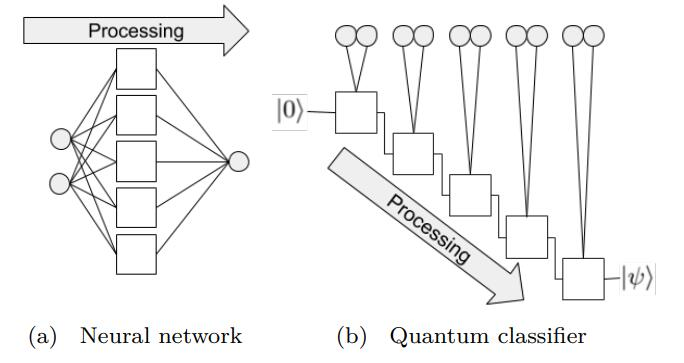

|

.. code-block::

    """
    Parameterized quantum circuit for Quantum Data Re-upLoading
    """

    import sys
    sys.path.insert(0, "../")
    import numpy as np
    from pyvqnet.nn.linear import Linear
    from pyvqnet.qnn.qdrl.vqnet_model import vmodel
    from pyvqnet.optim import sgd
    from pyvqnet.nn.loss import CategoricalCrossEntropy
    from pyvqnet.tensor.tensor import QTensor
    from pyvqnet.nn.module import Module
    import matplotlib.pyplot as plt
    import matplotlib
    from pyvqnet.data import data_generator as get_minibatch_data
    try:
        matplotlib.use("TkAgg")
    except:  
        print("Can not use matplot TkAgg")
        pass

    np.random.seed(42)

    num_layers = 3
    params = np.random.uniform(size=(num_layers, 3))

    class Model(Module):
        def __init__(self):

            super(Model, self).__init__()
            self.pqc = vmodel(params.shape)
            self.fc2 = Linear(2, 2)

        def forward(self, x):
            x = self.pqc(x)
            return x

    def circle(samples: int, reps=np.sqrt(1 / 2)):
        data_x, data_y = [], []
        for _ in range(samples):
            x = np.random.rand(2)
            y = [0, 1]
            if np.linalg.norm(x) < reps:
                y = [1, 0]
            data_x.append(x)
            data_y.append(y)
        return np.array(data_x), np.array(data_y)

    def plot_data(x, y, fig=None, ax=None):

        if fig is None:
            fig, ax = plt.subplots(1, 1, figsize=(5, 5))
        reds = y == 0
        blues = y == 1
        ax.scatter(x[reds, 0], x[reds, 1], c="red", s=20, edgecolor="k")
        ax.scatter(x[blues, 0], x[blues, 1], c="blue", s=20, edgecolor="k")
        ax.set_xlabel("$x_1$")
        ax.set_ylabel("$x_2$")

    def get_score(pred, label):
        pred, label = np.array(pred.data), np.array(label.data)
        score = np.sum(np.argmax(pred, axis=1) == np.argmax(label, 1))
        return score

    model = Model()
    optimizer = sgd.SGD(model.parameters(), lr=1)

    def train():
        """
        Main function for train qdrl model
        """
        batch_size = 5
        model.train()
        x_train, y_train = circle(500)
        x_train = np.hstack((x_train, np.ones((x_train.shape[0], 1))))  # 500*3

        epoch = 10
        print("start training...........")
        for i in range(epoch):
            accuracy = 0
            count = 0
            loss = 0
            for data, label in get_minibatch_data(x_train, y_train, batch_size):
                optimizer.zero_grad()

                data, label = QTensor(data), QTensor(label)

                output = model(data)

                loss_fun = CategoricalCrossEntropy()
                losss = loss_fun(label, output)

                losss.backward()

                optimizer._step()
                accuracy += get_score(output, label)

                loss += losss.item()
                # print(f"epoch:{i}, train_accuracy:{accuracy}")
                # print(f"epoch:{i}, train_loss:{losss}")
                count += batch_size

            print(f"epoch:{i}, train_accuracy_for_each_batch:{accuracy/count}")
            print(f"epoch:{i}, train_loss_for_each_batch:{loss/count}")

    def test():
        batch_size = 5
        model.eval()
        print("start eval...................")
        x_test, y_test = circle(500)
        test_accuracy = 0
        count = 0
        x_test = np.hstack((x_test, np.ones((x_test.shape[0], 1))))

        for test_data, test_label in get_minibatch_data(x_test, y_test,
                                                        batch_size):

            test_data, test_label = QTensor(test_data), QTensor(test_label)
            output = model(test_data)
            test_accuracy += get_score(output, test_label)
            count += batch_size
        print(f"test_accuracy:{test_accuracy/count}")

    if __name__ == "__main__":
        train()
        test()

QDRL在测试数据上准确率变化情况:

.. image:: ./images/qdrl_accuracy.png
   :width: 600 px
   :align: center

|

3. VSQL: Variational Shadow Quantum Learning for Classification模型
=======================================================================
使用可变量子线路构建2分类模型,在与相似参数精度的神经网络对比分类精度,两者精度相近。而量子线路的参数量远小于经典神经网络。
算法基于论文:`Variational Shadow Quantum Learning for Classification Model <https://arxiv.org/abs/2012.08288>`_  复现。

VSQL量子整体模型如下:

.. image:: ./images/vsql_model.PNG
   :width: 600 px
   :align: center

|

VSQL中各个量子比特上的局部量子线路图如下:

.. image:: ./images/vsql_4.png

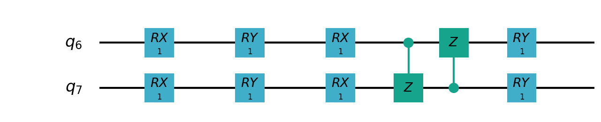

.. image:: ./images/vsql_8.png

|

.. code-block::

    """
    Parameterized quantum circuit for VSQL

    """

        import sys
        sys.path.insert(0, "../")
        import os
        import os.path
        import struct
        import gzip
        from pyvqnet.nn.module import Module
        from pyvqnet.nn.loss import CategoricalCrossEntropy
        from pyvqnet.optim.adam import Adam
        from pyvqnet.data.data import data_generator
        from pyvqnet.tensor import tensor
        from pyvqnet.qnn.measure import expval
        from pyvqnet.qnn.quantumlayer import QuantumLayer
        from pyvqnet.qnn.template import AmplitudeEmbeddingCircuit
        from pyvqnet.nn.linear import Linear
        import numpy as np
        import pyqpanda as pq
        import matplotlib.pyplot as plt
        import matplotlib
        try:
            matplotlib.use("TkAgg")
        except:  
            print("Can not use matplot TkAgg")
            pass

        try:
            import urllib.request
        except ImportError:
            raise ImportError("You should use Python 3.x")

        url_base = 'https://ossci-datasets.s3.amazonaws.com/mnist/'
        key_file = {
            "train_img": "train-images-idx3-ubyte.gz",
            "train_label": "train-labels-idx1-ubyte.gz",
            "test_img": "t10k-images-idx3-ubyte.gz",
            "test_label": "t10k-labels-idx1-ubyte.gz"
        }

        def _download(dataset_dir, file_name):
            """
            Download function for mnist dataset file
            """
            file_path = dataset_dir + "/" + file_name

            if os.path.exists(file_path):
                with gzip.GzipFile(file_path) as file:
                    file_path_ungz = file_path[:-3].replace("\\", "/")
                    if not os.path.exists(file_path_ungz):
                        open(file_path_ungz, "wb").write(file.read())
                return

            print("Downloading " + file_name + " ... ")
            urllib.request.urlretrieve(url_base + file_name, file_path)
            if os.path.exists(file_path):
                with gzip.GzipFile(file_path) as file:
                    file_path_ungz = file_path[:-3].replace("\\", "/")
                    file_path_ungz = file_path_ungz.replace("-idx", ".idx")
                    if not os.path.exists(file_path_ungz):
                        open(file_path_ungz, "wb").write(file.read())
            print("Done")

        def download_mnist(dataset_dir):
            for v in key_file.values():
                _download(dataset_dir, v)

        if not os.path.exists("./result"):
            os.makedirs("./result")
        else:
            pass

        def circuits_of_vsql(x, weights, qlist, clist, machine):  
            """
            VSQL model of quantum circuits
            """
            weights = weights.reshape([depth + 1, 3, n_qsc])

            def subcir(weights, qlist, depth, n_qsc, n_start):  
                cir = pq.QCircuit()

                for i in range(n_qsc):
                    cir.insert(pq.RX(qlist[n_start + i], weights[0][0][i]))
                    cir.insert(pq.RY(qlist[n_start + i], weights[0][1][i]))
                    cir.insert(pq.RX(qlist[n_start + i], weights[0][2][i]))
                for repeat in range(1, depth + 1):
                    for i in range(n_qsc - 1):
                        cir.insert(pq.CNOT(qlist[n_start + i], qlist[n_start + i + 1]))
                    cir.insert(pq.CNOT(qlist[n_start + n_qsc - 1], qlist[n_start]))
                    for i in range(n_qsc):
                        cir.insert(pq.RY(qlist[n_start + i], weights[repeat][1][i]))

                return cir

            def get_pauli_str(n_start, n_qsc):  
                pauli_str = ",".join("X" + str(i)
                                    for i in range(n_start, n_start + n_qsc))
                return {pauli_str: 1.0}

            f_i = []
            origin_in = AmplitudeEmbeddingCircuit(x, qlist)
            for st in range(n - n_qsc + 1):
                psd = get_pauli_str(st, n_qsc)
                cir = pq.QCircuit()
                cir.insert(origin_in)
                cir.insert(subcir(weights, qlist, depth, n_qsc, st))
                prog = pq.QProg()
                prog.insert(cir)

                f_ij = expval(machine, prog, psd, qlist)
                f_i.append(f_ij)
            f_i = np.array(f_i)
            return f_i

        #GLOBAL VAR
        n = 10
        n_qsc = 2
        depth = 1

        class QModel(Module):
            """
            Model of VSQL
            """
            def __init__(self):
                super().__init__()
                self.vq = QuantumLayer(circuits_of_vsql, (depth + 1) * 3 * n_qsc,
                                    "cpu", 10)
                self.fc = Linear(n - n_qsc + 1, 2)

            def forward(self, x):
                x = self.vq(x)
                x = self.fc(x)

                return x

        class Model(Module):
            def __init__(self):
                super().__init__()
                self.fc1 = Linear(input_channels=28 * 28, output_channels=2)

            def forward(self, x):

                x = tensor.flatten(x, 1)
                x = self.fc1(x)
                return x

        def load_mnist(dataset="training_data", digits=np.arange(2), path="./"):
            """
            load mnist data
            """
            from array import array as pyarray
            download_mnist(path)
            if dataset == "training_data":
                fname_image = os.path.join(path, "train-images.idx3-ubyte").replace(
                    "\\", "/")
                fname_label = os.path.join(path, "train-labels.idx1-ubyte").replace(
                    "\\", "/")
            elif dataset == "testing_data":
                fname_image = os.path.join(path, "t10k-images.idx3-ubyte").replace(
                    "\\", "/")
                fname_label = os.path.join(path, "t10k-labels.idx1-ubyte").replace(
                    "\\", "/")
            else:
                raise ValueError("dataset must be 'training_data' or 'testing_data'")

            flbl = open(fname_label, "rb")
            _, size = struct.unpack(">II", flbl.read(8))

            lbl = pyarray("b", flbl.read())
            flbl.close()

            fimg = open(fname_image, "rb")
            _, size, rows, cols = struct.unpack(">IIII", fimg.read(16))
            img = pyarray("B", fimg.read())
            fimg.close()

            ind = [k for k in range(size) if lbl[k] in digits]
            num = len(ind)
            images = np.zeros((num, rows, cols), dtype=np.float32)

            labels = np.zeros((num, 1), dtype=int)
            for i in range(len(ind)):
                images[i] = np.array(img[ind[i] * rows * cols:(ind[i] + 1) * rows *
                                        cols]).reshape((rows, cols))
                labels[i] = lbl[ind[i]]

            return images, labels

        def run_vsql():
            """
            VQSL MODEL
            """
            digits = [0, 1]
            x_train, y_train = load_mnist("training_data", digits)
            x_train = x_train / 255
            y_train = y_train.reshape(-1, 1)
            y_train = np.eye(len(digits))[y_train].reshape(-1, len(digits)).astype(
                np.int64)
            x_test, y_test = load_mnist("testing_data", digits)
            x_test = x_test / 255
            y_test = y_test.reshape(-1, 1)
            y_test = np.eye(len(digits))[y_test].reshape(-1,
                                                        len(digits)).astype(np.int64)

            x_train_list = []
            x_test_list = []
            for i in range(x_train.shape[0]):
                x_train_list.append(
                    np.pad(x_train[i, :, :].flatten(), (0, 240),
                        constant_values=(0, 0)))
            x_train = np.array(x_train_list)

            for i in range(x_test.shape[0]):
                x_test_list.append(
                    np.pad(x_test[i, :, :].flatten(), (0, 240),
                        constant_values=(0, 0)))

            x_test = np.array(x_test_list)

            x_train = x_train[:500]
            y_train = y_train[:500]

            x_test = x_test[:100]
            y_test = y_test[:100]
            print("model start")
            model = QModel()

            optimizer = Adam(model.parameters(), lr=0.1)

            model.train()
            result_file = open("./result/vqslrlt.txt", "w")
            for epoch in range(1, 3):

                model.train()
                full_loss = 0
                n_loss = 0
                n_eval = 0
                batch_size = 1
                correct = 0
                for x, y in data_generator(x_train,
                                        y_train,
                                        batch_size=batch_size,
                                        shuffle=True):
                    optimizer.zero_grad()
                    try:
                        x = x.reshape(batch_size, 1024)
                    except:  
                        x = x.reshape(-1, 1024)

                    output = model(x)
                    cceloss = CategoricalCrossEntropy()
                    loss = cceloss(y, output)
                    loss.backward()
                    optimizer._step()

                    full_loss += loss.item()
                    n_loss += batch_size
                    np_output = np.array(output.data, copy=False)
                    mask = np_output.argmax(1) == y.argmax(1)
                    correct += sum(mask)
                    print(f" n_loss {n_loss} Train Accuracy: {correct/n_loss} ")
                print(f"Train Accuracy: {correct/n_loss} ")
                print(f"Epoch: {epoch}, Loss: {full_loss / n_loss}")
                result_file.write(f"{epoch}\t{full_loss / n_loss}\t{correct/n_loss}\t")

                # Evaluation
                model.eval()
                print("eval")
                correct = 0
                full_loss = 0
                n_loss = 0
                n_eval = 0
                batch_size = 1
                for x, y in data_generator(x_test,
                                        y_test,
                                        batch_size=batch_size,
                                        shuffle=True):
                    x = x.reshape(1, 1024)
                    output = model(x)

                    cceloss = CategoricalCrossEntropy()
                    loss = cceloss(y, output)
                    full_loss += loss.item()

                    np_output = np.array(output.data, copy=False)
                    mask = np_output.argmax(1) == y.argmax(1)
                    correct += sum(mask)
                    n_eval += 1
                    n_loss += 1

                print(f"Eval Accuracy: {correct/n_eval}")
                result_file.write(f"{full_loss / n_loss}\t{correct/n_eval}\n")

            result_file.close()
            del model
            print("\ndone vqsl\n")

        if __name__ == "__main__":

            run_vsql()

VSQL在测试数据上准确率变化情况:

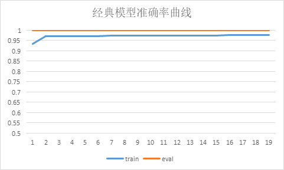

.. image:: ./images/vsql_closs.PNG
   :width: 600 px
   :align: center

.. image:: ./images/vsql_qacc.PNG
   :width: 600 px
   :align: center

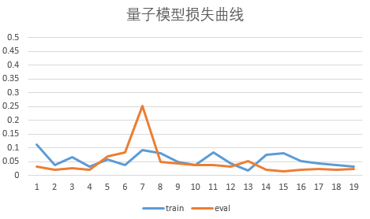

|

4.Quanvolution进行图像分类
===============================

在此示例中,我们实现了量子卷积神经网络,这是一种最初在论文 `Quanvolutional Neural Networks: Powering Image Recognition with Quantum Circuits <https://arxiv.org/abs/1904.04767>`_ 中介绍的方法。

类似经典卷积,Quanvolution有以下步骤:
输入图像的一小块区域,在我们的例子中是 2×2方形经典数据,嵌入到量子电路中。
在此示例中,这是通过将参数化旋转逻辑门应用于在基态中初始化的量子位来实现的。此处的卷积核由参考文献中提出的随机电路生成变分线路。
最后测量量子系统,获得经典期望值列表。 
类似于经典的卷积层,每个期望值都映射到单个输出像素的不同通道。
在不同区域重复相同的过程,可以扫描完整的输入图像,生成一个输出对象,该对象将被构造为多通道图像。
为了进行分类任务,本例在Quanvolution获取测量值后,使用经典全连接层 ``Linear`` 进行分类任务。
与经典卷积的主要区别在于,Quanvolution可以生成高度复杂的内核,其计算至少在原则上是经典难处理的。

.. image:: ./images/quanvo.png
   :width: 600 px
   :align: center

|

Mnist数据集定义

.. code-block::

    import os
    import os.path
    import struct
    import gzip
    import sys
    sys.path.insert(0, "../")
    from pyvqnet.nn.module import Module
    from pyvqnet.nn.loss import NLL_Loss
    from pyvqnet.optim.adam import Adam
    from pyvqnet.data.data import data_generator
    from pyvqnet.tensor import tensor
    from pyvqnet.qnn.measure import expval
    from pyvqnet.nn.linear import Linear
    import numpy as np
    from pyvqnet.qnn.qcnn import Quanvolution
    import matplotlib.pyplot as plt
    import matplotlib
    try:
        matplotlib.use("TkAgg")
    except:  
        print("Can not use matplot TkAgg")
        pass

    try:
        import urllib.request
    except ImportError:
        raise ImportError("You should use Python 3.x")

    url_base = 'https://ossci-datasets.s3.amazonaws.com/mnist/'
    key_file = {
        "train_img": "train-images-idx3-ubyte.gz",
        "train_label": "train-labels-idx1-ubyte.gz",
        "test_img": "t10k-images-idx3-ubyte.gz",
        "test_label": "t10k-labels-idx1-ubyte.gz"
    }

    def _download(dataset_dir, file_name):
        """
        Download function for mnist dataset file
        """
        file_path = dataset_dir + "/" + file_name

        if os.path.exists(file_path):
            with gzip.GzipFile(file_path) as file:
                file_path_ungz = file_path[:-3].replace("\\", "/")
                if not os.path.exists(file_path_ungz):
                    open(file_path_ungz, "wb").write(file.read())
            return

        print("Downloading " + file_name + " ... ")
        urllib.request.urlretrieve(url_base + file_name, file_path)
        if os.path.exists(file_path):
            with gzip.GzipFile(file_path) as file:
                file_path_ungz = file_path[:-3].replace("\\", "/")
                file_path_ungz = file_path_ungz.replace("-idx", ".idx")
                if not os.path.exists(file_path_ungz):
                    open(file_path_ungz, "wb").write(file.read())
        print("Done")

    def download_mnist(dataset_dir):
        for v in key_file.values():
            _download(dataset_dir, v)

    if not os.path.exists("./result"):
        os.makedirs("./result")
    else:
        pass

    def load_mnist(dataset="training_data", digits=np.arange(10), path="./"):
        """
        load mnist data
        """
        from array import array as pyarray
        download_mnist(path)
        if dataset == "training_data":
            fname_image = os.path.join(path, "train-images.idx3-ubyte").replace(
                "\\", "/")
            fname_label = os.path.join(path, "train-labels.idx1-ubyte").replace(
                "\\", "/")
        elif dataset == "testing_data":
            fname_image = os.path.join(path, "t10k-images.idx3-ubyte").replace(
                "\\", "/")
            fname_label = os.path.join(path, "t10k-labels.idx1-ubyte").replace(
                "\\", "/")
        else:
            raise ValueError("dataset must be 'training_data' or 'testing_data'")

        flbl = open(fname_label, "rb")
        _, size = struct.unpack(">II", flbl.read(8))

        lbl = pyarray("b", flbl.read())
        flbl.close()

        fimg = open(fname_image, "rb")
        _, size, rows, cols = struct.unpack(">IIII", fimg.read(16))
        img = pyarray("B", fimg.read())
        fimg.close()

        ind = [k for k in range(size) if lbl[k] in digits]
        num = len(ind)
        images = np.zeros((num, rows, cols))

        labels = np.zeros((num, 1), dtype=int)
        for i in range(len(ind)):
            images[i] = np.array(img[ind[i] * rows * cols:(ind[i] + 1) * rows *
                                    cols]).reshape((rows, cols))
            labels[i] = lbl[ind[i]]

        return images, labels

模型定义与运行函数定义

.. code-block::

    class QModel(Module):

        def __init__(self):
            super().__init__()
            self.vq = Quanvolution([4, 2], (2, 2))
            self.fc = Linear(4 * 14 * 14, 10)

        def forward(self, x):
            x = self.vq(x)
            x = tensor.flatten(x, 1)
            x = self.fc(x)
            x = tensor.log_softmax(x)
            return x

    def run_quanvolution():

        digit = 10
        x_train, y_train = load_mnist("training_data", digits=np.arange(digit))
        x_train = x_train / 255

        y_train = y_train.flatten()

        x_test, y_test = load_mnist("testing_data", digits=np.arange(digit))

        x_test = x_test / 255
        y_test = y_test.flatten()

        x_train = x_train[:500]
        y_train = y_train[:500]

        x_test = x_test[:100]
        y_test = y_test[:100]

        print("model start")
        model = QModel()

        optimizer = Adam(model.parameters(), lr=5e-3)

        model.train()
        result_file = open("quanvolution.txt", "w")

        cceloss = NLL_Loss()
        N_EPOCH = 15

        for epoch in range(1, N_EPOCH):

            model.train()
            full_loss = 0
            n_loss = 0
            n_eval = 0
            batch_size = 10
            correct = 0
            for x, y in data_generator(x_train,
                                    y_train,
                                    batch_size=batch_size,
                                    shuffle=True):
                optimizer.zero_grad()
                try:
                    x = x.reshape(batch_size, 1, 28, 28)
                except:  
                    x = x.reshape(-1, 1, 28, 28)

                output = model(x)

                loss = cceloss(y, output)
                print(f"loss {loss}")
                loss.backward()
                optimizer._step()

                full_loss += loss.item()
                n_loss += batch_size
                np_output = np.array(output.data, copy=False)
                mask = np_output.argmax(1) == y

                correct += sum(mask)
                print(f"correct {correct}")
            print(f"Train Accuracy: {correct/n_loss}%")
            print(f"Epoch: {epoch}, Loss: {full_loss / n_loss}")
            result_file.write(f"{epoch}\t{full_loss / n_loss}\t{correct/n_loss}\t")

            # Evaluation
            model.eval()
            print("eval")
            correct = 0
            full_loss = 0
            n_loss = 0
            n_eval = 0
            batch_size = 1
            for x, y in data_generator(x_test,
                                    y_test,
                                    batch_size=batch_size,
                                    shuffle=True):
                x = x.reshape(-1, 1, 28, 28)
                output = model(x)

                loss = cceloss(y, output)
                full_loss += loss.item()

                np_output = np.array(output.data, copy=False)
                mask = np_output.argmax(1) == y
                correct += sum(mask)
                n_eval += 1
                n_loss += 1

            print(f"Eval Accuracy: {correct/n_eval}")
            result_file.write(f"{full_loss / n_loss}\t{correct/n_eval}\n")

        result_file.close()
        del model
        print("\ndone\n")

    if __name__ == "__main__":

        run_quanvolution()

训练集、验证集损失,训练集、验证集分类准确率随Epoch 变换情况。

.. code-block::

    # epoch train_loss      train_accuracy eval_loss    eval_accuracy
    # 1	0.2488900272846222	0.232	1.7297331787645818	0.39
    # 2	0.12281704187393189	0.646	1.201728610806167	0.61
    # 3	0.08001763761043548	0.772	0.8947569639235735	0.73
    # 4	0.06211201059818268	0.83	0.777864265316166	0.74
    # 5	0.052190632969141004	0.858	0.7291000287979841	0.76
    # 6	0.04542196464538574	0.87	0.6764470228599384	0.8
    # 7	0.04029472427070141	0.896	0.6153804161818698	0.79
    # 8	0.03600500610470772	0.902	0.5644993982824963	0.81
    # 9	0.03230033944547176	0.916	0.528938240573043	0.81
    # 10	0.02912954458594322	0.93	0.5058713140769396	0.83
    # 11	0.026443827204406262	0.936	0.49064547760412097	0.83
    # 12	0.024144304402172564	0.942	0.4800815625616815	0.82
    # 13	0.022141477409750223	0.952	0.4724775951183983	0.83
    # 14	0.020372112181037665	0.956	0.46692863543197743	0.83

量子自编码器模型
******************************

1.量子自编码器
======================

经典的自动编码器是一种神经网络,可以在高维空间学习数据的高效低维表示。自动编码器的任务是,给定一个输入x,将x映射到一个低维点y,这样x就可以从y中恢复。
可以选择底层自动编码器网络的结构,以便在较小的维度上表示数据,从而有效地压缩输入。受这一想法的启发,量子自动编码器的模型来对量子数据执行类似的任务。
量子自动编码器被训练来压缩量子态的特定数据集,而经典的压缩算法无法使用。量子自动编码器的参数采用经典优化算法进行训练。
我们展示了一个简单的可编程线路的例子,它可以被训练成一个高效的自动编码器。我们在量子模拟的背景下应用我们的模型来压缩哈伯德模型和分子哈密顿量的基态。
该例子参考自 `Quantum autoencoders for efficient compression of quantum data <https://arxiv.org/pdf/1612.02806.pdf>`_ .

QAE量子线路:

.. image:: ./images/QAE_Quantum_Cir.png
   :width: 600 px
   :align: center

|

.. code-block::

    """
    Quantum AutoEncoder demo

    

    """

    import os
    import sys
    sys.path.insert(0,'../')
    import numpy as np
    from pyvqnet.nn.module import Module
    from pyvqnet.nn.loss import  fidelityLoss
    from pyvqnet.optim.adam import Adam
    from pyvqnet.data.data import data_generator
    from pyvqnet.qnn.qae.qae import QAElayer
    import matplotlib.pyplot as plt
    import matplotlib
    try:
        matplotlib.use('TkAgg')
    except:
        pass
    try:
        import urllib.request
    except ImportError:
        raise ImportError('You should use Python 3.x')
    import os.path
    import gzip

    url_base = 'https://ossci-datasets.s3.amazonaws.com/mnist/'
    key_file = {
        'train_img':'train-images-idx3-ubyte.gz',
        'train_label':'train-labels-idx1-ubyte.gz',
        'test_img':'t10k-images-idx3-ubyte.gz',
        'test_label':'t10k-labels-idx1-ubyte.gz'
    }

    def _download(dataset_dir,file_name):
        file_path = dataset_dir + "/" + file_name
        
        if os.path.exists(file_path):
            with gzip.GzipFile(file_path) as f:
                file_path_ungz = file_path[:-3].replace('\\', '/')
                if not os.path.exists(file_path_ungz):
                    open(file_path_ungz,"wb").write(f.read())
            return

        print("Downloading " + file_name + " ... ")
        urllib.request.urlretrieve(url_base + file_name, file_path)
        if os.path.exists(file_path):
                with gzip.GzipFile(file_path) as f:
                    file_path_ungz = file_path[:-3].replace('\\', '/')
                    file_path_ungz = file_path_ungz.replace('-idx', '.idx')
                    if not os.path.exists(file_path_ungz):
                        open(file_path_ungz,"wb").write(f.read())
        print("Done")
        
    def download_mnist(dataset_dir):
        for v in key_file.values():
            _download(dataset_dir,v)

    class Model(Module):

        def __init__(self, trash_num: int = 2, total_num: int = 7):
            super().__init__()
            self.pqc = QAElayer(trash_num, total_num)

        def forward(self, x):
            
            x = self.pqc(x)
            return x

    def load_mnist(dataset="training_data", digits=np.arange(2), path="./"):         # 下载数据
        import os, struct
        from array import array as pyarray
        download_mnist(path)
        if dataset == "training_data":
            fname_image = os.path.join(path, 'train-images.idx3-ubyte').replace('\\', '/')
            fname_label = os.path.join(path, 'train-labels.idx1-ubyte').replace('\\', '/')
        elif dataset == "testing_data":
            fname_image = os.path.join(path, 't10k-images.idx3-ubyte').replace('\\', '/')
            fname_label = os.path.join(path, 't10k-labels.idx1-ubyte').replace('\\', '/')
        else:
            raise ValueError("dataset must be 'training_data' or 'testing_data'")

        flbl = open(fname_label, 'rb')
        magic_nr, size = struct.unpack(">II", flbl.read(8))

        lbl = pyarray("b", flbl.read())
        flbl.close()

        fimg = open(fname_image, 'rb')
        magic_nr, size, rows, cols = struct.unpack(">IIII", fimg.read(16))
        img = pyarray("B", fimg.read())
        fimg.close()

        ind = [k for k in range(size) if lbl[k] in digits]
        N = len(ind)
        images = np.zeros((N, rows, cols))
        labels = np.zeros((N, 1), dtype=int)
        for i in range(len(ind)):
            images[i] = np.array(img[ind[i] * rows * cols: (ind[i] + 1) * rows * cols]).reshape((rows, cols))
            labels[i] = lbl[ind[i]]

        return images, labels

    def run2():
        ##load dataset

        x_train, y_train = load_mnist("training_data")                      # 下载训练数据
        x_train = x_train / 255                                             # 将数据进行归一化处理[0,1]

        x_test, y_test = load_mnist("testing_data")

        x_test = x_test / 255

        x_train = x_train.reshape([-1, 1, 28, 28])
        x_test = x_test.reshape([-1, 1, 28, 28])
        x_train = x_train[:100, :, :, :]
        x_train = np.resize(x_train, [x_train.shape[0], 1, 2, 2])

        x_test = x_test[:10, :, :, :]
        x_test = np.resize(x_test, [x_test.shape[0], 1, 2, 2])
        encode_qubits = 4
        latent_qubits = 2
        trash_qubits = encode_qubits - latent_qubits
        total_qubits = 1 + trash_qubits + encode_qubits
        print("model start")
        model = Model(trash_qubits, total_qubits)

        optimizer = Adam(model.parameters(), lr=0.005)                        
        model.train()
        F1 = open("rlt.txt", "w")
        loss_list = []
        loss_list_test = []
        fidelity_train = []
        fidelity_val = []

        for epoch in range(1, 10):
            running_fidelity_train = 0
            running_fidelity_val = 0
            print(f"epoch {epoch}")
            model.train()
            full_loss = 0
            n_loss = 0
            n_eval = 0
            batch_size = 1
            correct = 0
            iter = 0
            if epoch %5 ==1:
                optimizer.lr  = optimizer.lr *0.5
            for x, y in data_generator(x_train, y_train, batch_size=batch_size, shuffle=True): #shuffle batch rather than data

                x = x.reshape((-1, encode_qubits))
                x = np.concatenate((np.zeros([batch_size, 1 + trash_qubits]), x), 1)
                optimizer.zero_grad()
                output = model(x)
                iter += 1
                np_out = np.array(output.data)
                floss = fidelityLoss()
                loss = floss(output)
                loss_data = np.array(loss.data)
                loss.backward()

                running_fidelity_train += np_out[0]
                optimizer._step()
                full_loss += loss_data[0]
                n_loss += batch_size
                np_output = np.array(output.data, copy=False)
                mask = np_output.argmax(1) == y.argmax(1)

                correct += sum(mask)

            loss_output = full_loss / n_loss
            print(f"Epoch: {epoch}, Loss: {loss_output}")
            loss_list.append(loss_output)

            # Evaluation
            model.eval()
            correct = 0
            full_loss = 0
            n_loss = 0
            n_eval = 0
            batch_size = 1
            for x, y in data_generator(x_test, y_test, batch_size=batch_size, shuffle=True):
                x = x.reshape((-1, encode_qubits))
                x = np.concatenate((np.zeros([batch_size, 1 + trash_qubits]),x),1)
                output = model(x)

                floss = fidelityLoss()
                loss = floss(output)
                loss_data = np.array(loss.data)
                full_loss += loss_data[0]
                running_fidelity_val += np.array(output.data)[0]

                n_eval += 1
                n_loss += 1

            loss_output = full_loss / n_loss
            print(f"Epoch: {epoch}, Loss: {loss_output}")
            loss_list_test.append(loss_output)

            fidelity_train.append(running_fidelity_train / 64)
            fidelity_val.append(running_fidelity_val / 64)

        figure_path = os.path.join(os.getcwd(), 'QAE-rate1.png')
        plt.plot(loss_list, color="blue", label="train")
        plt.plot(loss_list_test, color="red", label="validation")
        plt.title('QAE')
        plt.xlabel("Epochs")
        plt.ylabel("Loss")
        plt.legend(loc="upper right")
        plt.savefig(figure_path)
        plt.show()

        F1.write(f"done\n")
        F1.close()
        del model

    if __name__ == '__main__':
        run2()

运行上述代码得到的QAE误差值,该loss为1/保真度,趋向于1表示保真度接近1。

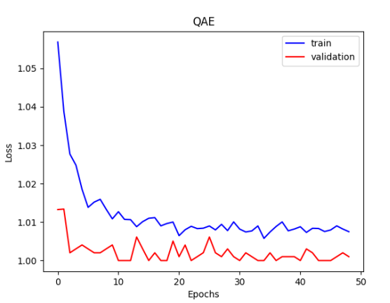

|

量子线路结构学习
******************************
1.量子线路结构学习
=====================
在量子线路结构中,最经常使用的带参数的量子门就是RZ、RY、RX门,但是在什么情况下使用什么门是一个十分值得研究的问题,一种方法就是随机选择,但是这种情况很有可能达不到最好的效果。
Quantum circuit structure learning任务的核心目标就是找到最优的带参量子门组合。
这里的做法是这一组最优的量子逻辑门要使得目标函数(loss function)取得最小值。

.. code-block::

    """
    Quantum Circuits Strcture Learning Demo

    """

    import sys
    sys.path.insert(0,"../")

    import copy
    import pyqpanda as pq
    from pyvqnet.tensor.tensor import QTensor
    from pyvqnet.qnn.measure import expval
    import numpy as np
    import matplotlib.pyplot as plt
    import matplotlib
    try:
        matplotlib.use("TkAgg")
    except:  
        print("Can not use matplot TkAgg")
        pass

    machine = pq.CPUQVM()
    machine.init_qvm()
    nqbits = machine.qAlloc_many(2)

    def gen(param, generators, qbits, circuit):
        if generators == "X":
            circuit.insert(pq.RX(qbits, param))
        elif generators == "Y":
            circuit.insert(pq.RY(qbits, param))
        else:
            circuit.insert(pq.RZ(qbits, param))

    def circuits(params, generators, circuit):
        gen(params[0], generators[0], nqbits[0], circuit)
        gen(params[1], generators[1], nqbits[1], circuit)
        circuit.insert(pq.CNOT(nqbits[0], nqbits[1]))
        prog = pq.QProg()
        prog.insert(circuit)
        return prog

    def ansatz1(params: QTensor, generators):
        circuit = pq.QCircuit()
        params = params.to_numpy()
        prog = circuits(params, generators, circuit)
        return expval(machine, prog, {"Z0": 1},
                    nqbits), expval(machine, prog, {"Y1": 1}, nqbits)

    def ansatz2(params: QTensor, generators):
        circuit = pq.QCircuit()
        params = params.to_numpy()
        prog = circuits(params, generators, circuit)
        return expval(machine, prog, {"X0": 1}, nqbits)

    def loss(params, generators):
        z, y = ansatz1(params, generators)
        x = ansatz2(params, generators)
        return 0.5 * y + 0.8 * z - 0.2 * x

    def rotosolve(d, params, generators, cost, M_0):
        """
        rotosolve algorithm implementation
        """
        params[d] = np.pi / 2.0
        m0_plus = cost(QTensor(params), generators)
        params[d] = -np.pi / 2.0
        m0_minus = cost(QTensor(params), generators)
        a = np.arctan2(2.0 * M_0 - m0_plus - m0_minus,
                    m0_plus - m0_minus)  # returns value in (-pi,pi]
        params[d] = -np.pi / 2.0 - a
        if params[d] <= -np.pi:
            params[d] += 2 * np.pi
        return cost(QTensor(params), generators)

    def optimal_theta_and_gen_helper(index, params, generators):
        """
        find optimal varaibles
        """
        params[index] = 0.
        m0 = loss(QTensor(params), generators)  #init value
        for kind in ["X", "Y", "Z"]:
            generators[index] = kind
            params_cost = rotosolve(index, params, generators, loss, m0)
            if kind == "X" or params_cost <= params_opt_cost:
                params_opt_d = params[index]
                params_opt_cost = params_cost
                generators_opt_d = kind
        return params_opt_d, generators_opt_d

    def rotoselect_cycle(params: np, generators):
        for index in range(params.shape[0]):
            params[index], generators[index] = optimal_theta_and_gen_helper(
                index, params, generators)
        return params, generators

    params = QTensor(np.array([0.3, 0.25]))
    params = params.to_numpy()
    generator = ["X", "Y"]
    generators = copy.deepcopy(generator)
    epoch = 20
    state_save = []
    for i in range(epoch):
        state_save.append(loss(QTensor(params), generators))
        params, generators = rotoselect_cycle(params, generators)

    print("Optimal generators are: {}".format(generators))
    print("Optimal params are: {}".format(params))
    steps = np.arange(0, epoch)

    plt.plot(steps, state_save, "o-")
    plt.title("rotoselect")
    plt.xlabel("cycles")
    plt.ylabel("cost")
    plt.yticks(np.arange(-1.25, 0.80, 0.25))
    plt.tight_layout()
    plt.show()

运行上述代码得到的量子线路结构。可见为一个 :math:`RX`,一个 :math:`RY`

.. image:: ./images/final_quantum_circuit.png
   :width: 600 px
   :align: center

以及逻辑门中的参数 :math:`\theta_1`, :math:`\theta_2` 不同参数下的损失函数

.. image:: ./images/loss3d.png
   :width: 600 px
   :align: center

|

量子经典神经网络混合模型
*******************************

1.混合量子经典神经网络模型
============================

机器学习 (ML) 已成为一个成功的跨学科领域,旨在从数据中以数学方式提取可概括的信息。量子机器学习寻求利用量子力学原理来增强机器学习,反之亦然。
无论您的目标是通过将困难的计算外包给量子计算机来增强经典 ML 算法,还是使用经典 ML 架构优化量子算法——两者都属于量子机器学习 (QML) 的范畴。
在本章中,我们将探讨如何部分量化经典神经网络以创建混合量子经典神经网络。量子线路由量子逻辑门构成,这些逻辑门实现的量子计算被论文 `Quantum Circuit Learning <https://arxiv.org/abs/1803.00745>`_ 证明是可微分。因此研究者尝试将量子线路与经典神经网络模块放到一起同时进行混合量子经典机器学习任务的训练。
我们将编写一个简单的示例,使用VQNet实现一个神经网络模型训练任务。此示例的目的是展示VQNet的简便性,并鼓励 ML 从业者探索量子计算的可能性。

数据准备
----------------

我们将使用 `MNIST datasets <http://yann.lecun.com/exdb/mnist/>`_ 这一神经网络最基础的手写数字数据库作为分类数据 。
我们首先加载MNIST并过滤包含0和1的数据样本。这些样本分为训练数据 training_data 和测试数据 testing_data,它们每条数据均为1*784的维度大小。

.. code-block::

    import time
    import os
    import struct
    import gzip
    from pyvqnet.nn.module import Module
    from pyvqnet.nn.linear import Linear
    from pyvqnet.nn.conv import Conv2D

    from pyvqnet.nn import activation as F
    from pyvqnet.nn.pooling import MaxPool2D
    from pyvqnet.nn.loss import CategoricalCrossEntropy
    from pyvqnet.optim.adam import Adam
    from pyvqnet.data.data import data_generator
    from pyvqnet.tensor import tensor
    from pyvqnet.tensor import QTensor
    import pyqpanda as pq

    import numpy as np
    import matplotlib.pyplot as plt
    import matplotlib
    try:
        matplotlib.use("TkAgg")
    except:  
        print("Can not use matplot TkAgg")
        pass

    try:
        import urllib.request
    except ImportError:
        raise ImportError("You should use Python 3.x")

    url_base = 'https://ossci-datasets.s3.amazonaws.com/mnist/'
    key_file = {
        'train_img':'train-images-idx3-ubyte.gz',
        'train_label':'train-labels-idx1-ubyte.gz',
        'test_img':'t10k-images-idx3-ubyte.gz',
        'test_label':'t10k-labels-idx1-ubyte.gz'
    }

    def _download(dataset_dir,file_name):
        file_path = dataset_dir + "/" + file_name
        
        if os.path.exists(file_path):
            with gzip.GzipFile(file_path) as f:
                file_path_ungz = file_path[:-3].replace('\\', '/')
                if not os.path.exists(file_path_ungz):
                    open(file_path_ungz,"wb").write(f.read())
            return

        print("Downloading " + file_name + " ... ")
        urllib.request.urlretrieve(url_base + file_name, file_path)
        if os.path.exists(file_path):
                with gzip.GzipFile(file_path) as f:
                    file_path_ungz = file_path[:-3].replace('\\', '/')
                    file_path_ungz = file_path_ungz.replace('-idx', '.idx')
                    if not os.path.exists(file_path_ungz):
                        open(file_path_ungz,"wb").write(f.read())
        print("Done")
        
    def download_mnist(dataset_dir):
        for v in key_file.values():
            _download(dataset_dir,v)
    
    def load_mnist(dataset="training_data", digits=np.arange(2), path="./"):         # 下载数据
        import os, struct
        from array import array as pyarray
        download_mnist(path)
        if dataset == "training_data":
            fname_image = os.path.join(path, 'train-images.idx3-ubyte').replace('\\', '/')
            fname_label = os.path.join(path, 'train-labels.idx1-ubyte').replace('\\', '/')
        elif dataset == "testing_data":
            fname_image = os.path.join(path, 't10k-images.idx3-ubyte').replace('\\', '/')
            fname_label = os.path.join(path, 't10k-labels.idx1-ubyte').replace('\\', '/')
        else:
            raise ValueError("dataset must be 'training_data' or 'testing_data'")

        flbl = open(fname_label, 'rb')
        magic_nr, size = struct.unpack(">II", flbl.read(8))
        lbl = pyarray("b", flbl.read())
        flbl.close()

        fimg = open(fname_image, 'rb')
        magic_nr, size, rows, cols = struct.unpack(">IIII", fimg.read(16))
        img = pyarray("B", fimg.read())
        fimg.close()

        ind = [k for k in range(size) if lbl[k] in digits]
        N = len(ind)
        images = np.zeros((N, rows, cols))
        labels = np.zeros((N, 1), dtype=int)
        for i in range(len(ind)):
            images[i] = np.array(img[ind[i] * rows * cols: (ind[i] + 1) * rows * cols]).reshape((rows, cols))
            labels[i] = lbl[ind[i]]

        return images, labels

    def data_select(train_num, test_num):
        x_train, y_train = load_mnist("training_data")  
        x_test, y_test = load_mnist("testing_data")
        # Train Leaving only labels 0 and 1
        idx_train = np.append(np.where(y_train == 0)[0][:train_num],
                        np.where(y_train == 1)[0][:train_num])
        x_train = x_train[idx_train]
        y_train = y_train[idx_train]
        x_train = x_train / 255
        y_train = np.eye(2)[y_train].reshape(-1, 2)
        # Test Leaving only labels 0 and 1
        idx_test = np.append(np.where(y_test == 0)[0][:test_num],
                        np.where(y_test == 1)[0][:test_num])
        x_test = x_test[idx_test]
        y_test = y_test[idx_test]
        x_test = x_test / 255
        y_test = np.eye(2)[y_test].reshape(-1, 2)
        return x_train, y_train, x_test, y_test

    n_samples_show = 6

    x_train, y_train, x_test, y_test = data_select(100, 50)
    fig, axes = plt.subplots(nrows=1, ncols=n_samples_show, figsize=(10, 3))

    for img ,targets in zip(x_test,y_test):
        if n_samples_show <= 3:
            break
        
        if targets[0] == 1:
            axes[n_samples_show - 1].set_title("Labeled: 0")
            axes[n_samples_show - 1].imshow(img.squeeze(), cmap='gray')
            axes[n_samples_show - 1].set_xticks([])
            axes[n_samples_show - 1].set_yticks([])
            n_samples_show -= 1

    for img ,targets in zip(x_test,y_test):
        if n_samples_show <= 0:
            break
        
        if targets[0] == 0:
            axes[n_samples_show - 1].set_title("Labeled: 1")
            axes[n_samples_show - 1].imshow(img.squeeze(), cmap='gray')
            axes[n_samples_show - 1].set_xticks([])
            axes[n_samples_show - 1].set_yticks([])
            n_samples_show -= 1    
        
    plt.show()

.. image:: ./images/mnsit_data_examples.png
   :width: 600 px
   :align: center

|

构建量子线路
-----------------

在本例中,我们使用本源量子的 `pyqpanda <https://pyqpanda-toturial.readthedocs.io/zh/latest/>`_ 
定义了一个1量子比特的简单量子线路,该线路将经典神经网络层的输出作为输入,通过 ``H``, ``RY`` 逻辑门进行量子数据编码,并计算z方向的哈密顿期望值作为输出。

.. code-block::

    from pyqpanda import *
    import pyqpanda as pq
    import numpy as np
    def circuit(weights):
        num_qubits = 1
        #pyqpanda 创建模拟器
        machine = pq.CPUQVM()
        machine.init_qvm()
        #pyqpanda 分配量子比特
        qubits = machine.qAlloc_many(num_qubits)
        #pyqpanda 分配经典比特辅助测量
        cbits = machine.cAlloc_many(num_qubits)
        #构建线路
        circuit = pq.QCircuit()
        circuit.insert(pq.H(qubits[0]))
        circuit.insert(pq.RY(qubits[0], weights[0]))

        prog = pq.QProg()
        prog.insert(circuit)
        prog << measure_all(qubits, cbits)

        #运行量子程序
        result = machine.run_with_configuration(prog, cbits, 100)
        
        counts = np.array(list(result.values()))
        states = np.array(list(result.keys())).astype(float)
        probabilities = counts / 100
        expectation = np.sum(states * probabilities)
        return expectation

.. image:: ./images/hqcnn_quantum_cir.png
   :width: 600 px
   :align: center

|

构建混合量子神经网络
-----------------------

由于量子线路可以和经典神经网络一起进行自动微分的计算,
因此我们可以使用VQNet的2维卷积层 ``Conv2D`` ,池化层 ``MaxPool2D`` ,全连接层 ``Linear`` 以及刚才构建的量子线路circuit构建模型。
通过以下代码中继承于VQNet自动微分模块 ``Module`` 的 Net 以及 Hybrid 类的定义,以及模型前传函数 ``forward()`` 中对数据前向计算的定义,我们构建了一个可以自动微分的模型
将本例中MNIST的数据进行卷积,降维,量子编码,测量,获取分类任务所需的最终特征。

.. code-block::

    from pyvqnet.native.backprop_utils import AutoGradNode
    #量子计算层的前传和梯度计算函数的定义,其需要继承于抽象类Module
    class Hybrid(Module):
        """ Hybrid quantum - Quantum layer definition """
        def __init__(self, shift):
            super(Hybrid, self).__init__()
            self.shift = shift
        def forward(self, input): 
            self.input = input
            expectation_z = circuit(np.array(input.data))
            result = [[expectation_z]]
            requires_grad = input.requires_grad
            def _backward(g, input):
                """ Backward pass computation """
                input_list = np.array(input.data)
                shift_right = input_list + np.ones(input_list.shape) * self.shift
                shift_left = input_list - np.ones(input_list.shape) * self.shift

                gradients = []
                for i in range(len(input_list)):
                    expectation_right = circuit(shift_right[i])
                    expectation_left = circuit(shift_left[i])

                    gradient = expectation_right - expectation_left
                    gradients.append(gradient)
                gradients = np.array([gradients]).T
                return gradients * np.array(g)

            nodes = []
            if input.requires_grad:
                nodes.append(QTensor.AutoGradNode(tensor=input, df=lambda g: _backward(g, input)))
            return QTensor(data=result, requires_grad=requires_grad, nodes=nodes)

    #模型定义
    class Net(Module):
        def __init__(self):
            super(Net, self).__init__()
            self.conv1 = Conv2D(input_channels=1, output_channels=6, kernel_size=(5, 5), stride=(1, 1), padding="valid")
            self.maxpool1 = MaxPool2D([2, 2], [2, 2], padding="valid")
            self.conv2 = Conv2D(input_channels=6, output_channels=16, kernel_size=(5, 5), stride=(1, 1), padding="valid")
            self.maxpool2 = MaxPool2D([2, 2], [2, 2], padding="valid")
            self.fc1 = Linear(input_channels=256, output_channels=64)
            self.fc2 = Linear(input_channels=64, output_channels=1)
            self.hybrid = Hybrid(np.pi / 2)
            self.fc3 = Linear(input_channels=1, output_channels=2)

        def forward(self, x):
            x = F.ReLu()(self.conv1(x))  # 1 6 24 24
            x = self.maxpool1(x)
            x = F.ReLu()(self.conv2(x))  # 1 16 8 8
            x = self.maxpool2(x)
            x = tensor.flatten(x, 1)   # 1 256
            x = F.ReLu()(self.fc1(x))  # 1 64
            x = self.fc2(x)    # 1 1
            x = self.hybrid(x)
            x = self.fc3(x)
            return x

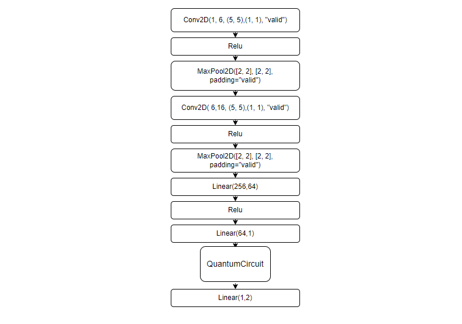

|

训练和测试
-----------------

通过上面代码示例,我们已经定义了模型。与经典神经网络模型训练类似, 我们还需要做的是实例化该模型,定义损失函数以及优化器以及定义整个训练测试流程。
对于形如下图的混合神经网络模型,我们通过循环输入数据前向计算损失值,并在反向计算中自动计算出各个待训练参数的梯度,并使用优化器进行参数优化,直到迭代次数满足预设值。

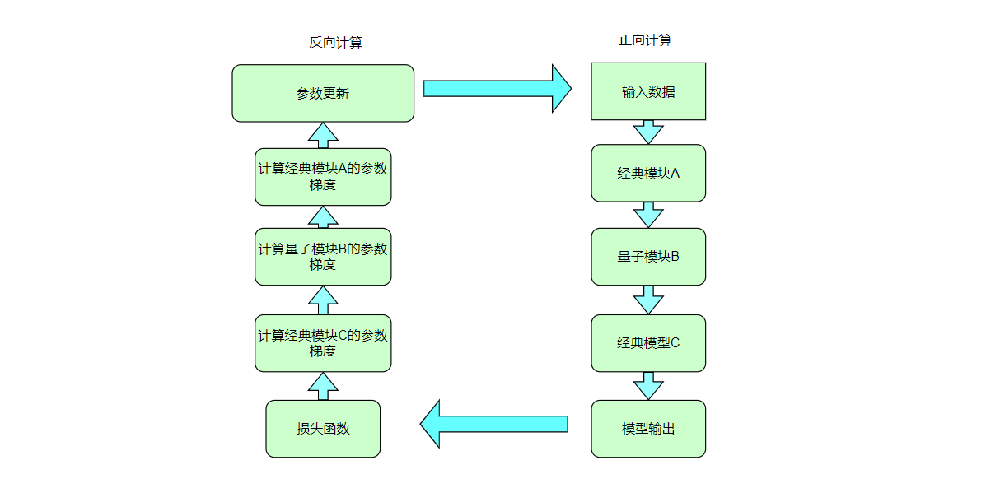

|

.. code-block::

    x_train, y_train, x_test, y_test = data_select(1000, 100)
    #实例化
    model = Net() 
    #使用Adam完成此任务就足够了,model.parameters()是模型需要计算的参数。
    optimizer = Adam(model.parameters(), lr=0.005)
    #分类任务使用交叉熵函数
    loss_func = CategoricalCrossEntropy()

    #训练次数    
    epochs = 10
    train_loss_list = []
    val_loss_list = []
    train_acc_list =[]
    val_acc_list = []

    for epoch in range(1, epochs):
        total_loss = []
        model.train()
        batch_size = 1
        correct = 0
        n_train = 0
        for x, y in data_generator(x_train, y_train, batch_size=1, shuffle=True):

            x = x.reshape(-1, 1, 28, 28)
            optimizer.zero_grad()
            output = model(x)       
            loss = loss_func(y, output)  
            loss_np = np.array(loss.data)
            np_output = np.array(output.data, copy=False)
            mask = (np_output.argmax(1) == y.argmax(1))
            correct += np.sum(np.array(mask))
            n_train += batch_size
            loss.backward()
            optimizer._step()
            total_loss.append(loss_np)

        train_loss_list.append(np.sum(total_loss) / len(total_loss))
        train_acc_list.append(np.sum(correct) / n_train)
        print("{:.0f} loss is : {:.10f}".format(epoch, train_loss_list[-1]))

        model.eval()
        correct = 0
        n_eval = 0

        for x, y in data_generator(x_test, y_test, batch_size=1, shuffle=True):
            x = x.reshape(-1, 1, 28, 28)
            output = model(x)
            loss = loss_func(y, output)
            loss_np = np.array(loss.data)
            np_output = np.array(output.data, copy=False)
            mask = (np_output.argmax(1) == y.argmax(1))
            correct += np.sum(np.array(mask))
            n_eval += 1
            
            total_loss.append(loss_np)
        print(f"Eval Accuracy: {correct / n_eval}")
        val_loss_list.append(np.sum(total_loss) / len(total_loss))
        val_acc_list.append(np.sum(correct) / n_eval)

数据可视化
----------------

训练和测试数据上的数据损失函数与准确率的可视化曲线。

.. code-block::

    import os
    plt.figure()
    xrange = range(1,len(train_loss_list)+1)
    figure_path = os.path.join(os.getcwd(), 'HQCNN LOSS.png')
    plt.plot(xrange,train_loss_list, color="blue", label="train")
    plt.plot(xrange,val_loss_list, color="red", label="validation")
    plt.title('HQCNN')
    plt.xlabel("Epochs")
    plt.ylabel("Loss")
    plt.xticks(np.arange(1, epochs +1,step = 2))
    plt.legend(loc="upper right")
    plt.savefig(figure_path)
    plt.show()

    plt.figure()
    figure_path = os.path.join(os.getcwd(), 'HQCNN Accuracy.png')
    plt.plot(xrange,train_acc_list, color="blue", label="train")
    plt.plot(xrange,val_acc_list, color="red", label="validation")
    plt.title('HQCNN')
    plt.xlabel("Epochs")
    plt.ylabel("Accuracy")
    plt.xticks(np.arange(1, epochs +1,step = 2))
    plt.legend(loc="lower right")
    plt.savefig(figure_path)
    plt.show()

.. image:: ./images/HQCNNLOSS.png
   :width: 600 px
   :align: center

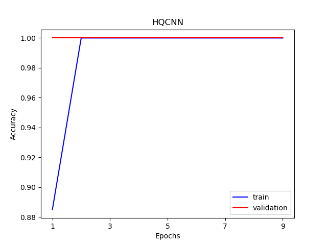

|

.. code-block::

    n_samples_show = 6
    count = 0
    fig, axes = plt.subplots(nrows=1, ncols=n_samples_show, figsize=(10, 3))
    model.eval()
    for x, y in data_generator(x_test, y_test, batch_size=1, shuffle=True):
        if count == n_samples_show:
            break
        x = x.reshape(-1, 1, 28, 28)
        output = model(x)
        pred = QTensor.argmax(output, [1],False)
        axes[count].imshow(x[0].squeeze(), cmap='gray')
        axes[count].set_xticks([])
        axes[count].set_yticks([])
        axes[count].set_title('Predicted {}'.format(np.array(pred.data)))
        count += 1
    plt.show()

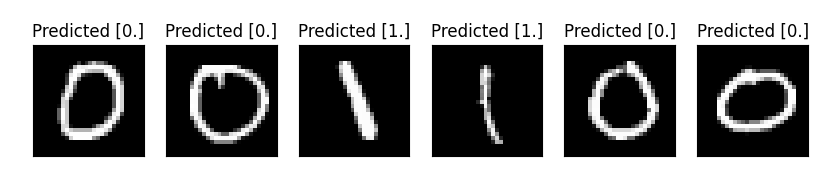

|

2.混合量子经典迁移学习模型
===============================

我们将一种称为迁移学习的机器学习方法应用于基于混合经典量子网络的图像分类器。我们将编写一个将pyqpanda2与VQNet集成的简单示例。
迁移学习是一种成熟的人工神经网络训练技术,它基于一般直觉,即如果预训练的网络擅长解决给定的问题,那么,只需一些额外的训练,它也可以用来解决一个不同但相关的问题。

                                                            .. centered:: 量子部分线路图

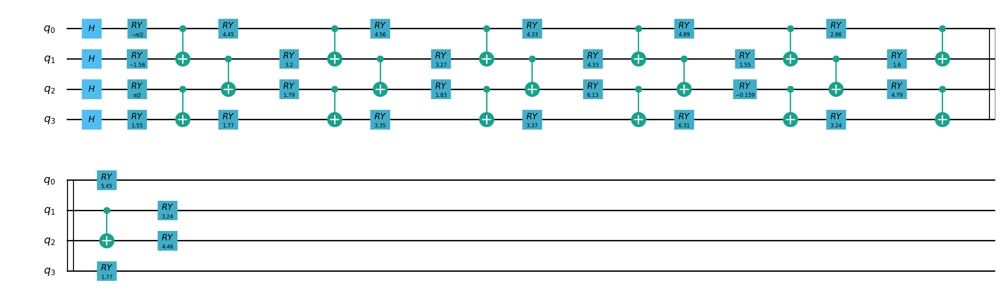

|

.. code-block::

    """
    Quantum Classic Nerual Network Transfer Learning demo

    
    """

    import os
    import os.path
    import gzip
    import struct
    import numpy as np
    import sys
    sys.path.insert(0,"../")
    from pyvqnet.nn.module import Module
    from pyvqnet.nn.linear import Linear
    from pyvqnet.nn.conv import Conv2D
    from pyvqnet.utils.storage import load_parameters, save_parameters
    from pyvqnet.nn import activation as F
    from pyvqnet.nn.pooling import MaxPool2D

    from pyvqnet.nn.loss import SoftmaxCrossEntropy
    from pyvqnet.optim.sgd import SGD
    from pyvqnet.optim.adam import Adam
    from pyvqnet.data.data import data_generator
    from pyvqnet.tensor import tensor
    from pyvqnet.tensor.tensor import QTensor
    from pyvqnet.qnn.quantumlayer import QuantumLayer
    import pyqpanda as pq
    import matplotlib.pyplot as plt
    import matplotlib
    try:
        matplotlib.use("TkAgg")
    except:  
        print("Can not use matplot TkAgg")
        pass

    try:
        import urllib.request
    except ImportError:
        raise ImportError("You should use Python 3.x")

    url_base = 'https://ossci-datasets.s3.amazonaws.com/mnist/'
    key_file = {
        "train_img": "train-images-idx3-ubyte.gz",
        "train_label": "train-labels-idx1-ubyte.gz",
        "test_img": "t10k-images-idx3-ubyte.gz",
        "test_label": "t10k-labels-idx1-ubyte.gz"
    }

    def _download(dataset_dir, file_name):
        """
        Download dataset
        """
        file_path = dataset_dir + "/" + file_name

        if os.path.exists(file_path):
            with gzip.GzipFile(file_path) as file:
                file_path_ungz = file_path[:-3].replace("\\", "/")
                if not os.path.exists(file_path_ungz):
                    open(file_path_ungz, "wb").write(file.read())
            return

        print("Downloading " + file_name + " ... ")
        urllib.request.urlretrieve(url_base + file_name, file_path)
        if os.path.exists(file_path):
            with gzip.GzipFile(file_path) as file:
                file_path_ungz = file_path[:-3].replace("\\", "/")
                file_path_ungz = file_path_ungz.replace("-idx", ".idx")
                if not os.path.exists(file_path_ungz):
                    open(file_path_ungz, "wb").write(file.read())
        print("Done")

    def download_mnist(dataset_dir):
        for v in key_file.values():
            _download(dataset_dir, v)

    if not os.path.exists("./result"):
        os.makedirs("./result")
    else:
        pass

    class CNN(Module):
        """
        Classical CNN
        """
        def __init__(self):
            super(CNN, self).__init__()

            self.conv1 = Conv2D(input_channels=1,
                                output_channels=16,
                                kernel_size=(3, 3),
                                stride=(1, 1),
                                padding="valid")
            self.relu1 = F.ReLu()

            self.conv2 = Conv2D(input_channels=16,
                                output_channels=32,
                                kernel_size=(3, 3),
                                stride=(1, 1),
                                padding="valid")
            self.relu2 = F.ReLu()
            self.maxpool2 = MaxPool2D([2, 2], [2, 2], padding="valid")

            self.conv3 = Conv2D(input_channels=32,
                                output_channels=64,
                                kernel_size=(3, 3),
                                stride=(1, 1),
                                padding="valid")
            self.relu3 = F.ReLu()

            self.conv4 = Conv2D(input_channels=64,
                                output_channels=128,
                                kernel_size=(3, 3),
                                stride=(1, 1),
                                padding="valid")

            self.relu4 = F.ReLu()
            self.maxpool4 = MaxPool2D([2, 2], [2, 2], padding="valid")

            self.fc1 = Linear(input_channels=128 * 4 * 4, output_channels=1024)
            self.fc2 = Linear(input_channels=1024, output_channels=128)
            self.fc3 = Linear(input_channels=128, output_channels=10)

        def forward(self, x):

            x = self.relu1(self.conv1(x))

            x = self.maxpool2(self.relu2(self.conv2(x)))

            x = self.relu3(self.conv3(x))

            x = self.maxpool4(self.relu4(self.conv4(x)))

            x = tensor.flatten(x, 1)
            x = F.ReLu()(self.fc1(x))

            x = F.ReLu()(self.fc2(x))

            x = self.fc3(x)

            return x

    def load_mnist(dataset="training_data",
                digits=np.arange(2),
                path="./"):
        """
        Load mnist data
        """
        from array import array as pyarray
        download_mnist(path)
        if dataset == "training_data":
            fname_image = os.path.join(path, "train-images.idx3-ubyte").replace(
                "\\", "/")
            fname_label = os.path.join(path, "train-labels.idx1-ubyte").replace(
                "\\", "/")
        elif dataset == "testing_data":
            fname_image = os.path.join(path, "t10k-images.idx3-ubyte").replace(
                "\\", "/")
            fname_label = os.path.join(path, "t10k-labels.idx1-ubyte").replace(
                "\\", "/")
        else:
            raise ValueError("dataset must be 'training_data' or 'testing_data'")

        flbl = open(fname_label, "rb")
        _, size = struct.unpack(">II", flbl.read(8))
        lbl = pyarray("b", flbl.read())
        flbl.close()

        fimg = open(fname_image, "rb")
        _, size, rows, cols = struct.unpack(">IIII", fimg.read(16))
        img = pyarray("B", fimg.read())
        fimg.close()

        ind = [k for k in range(size) if lbl[k] in digits]
        num = len(ind)
        images = np.zeros((num, rows, cols))
        labels = np.zeros((num, 1), dtype=int)
        for i in range(len(ind)):
            images[i] = np.array(img[ind[i] * rows * cols:(ind[i] + 1) * rows *
                                    cols]).reshape((rows, cols))
            labels[i] = lbl[ind[i]]

        return images, labels

    train_size = 50
    eval_size = 2
    EPOCHES = 10

    def classcal_cnn_model_training():
        """
        load train data
        """

        x_train, y_train = load_mnist("training_data", digits=np.arange(10))
        x_test, y_test = load_mnist("testing_data", digits=np.arange(10))

        x_train = x_train[:train_size]
        y_train = y_train[:train_size]
        x_test = x_test[:eval_size]
        y_test = y_test[:eval_size]

        x_train = x_train / 255
        x_test = x_test / 255
        y_train = np.eye(10)[y_train].reshape(-1, 10)
        y_test = np.eye(10)[y_test].reshape(-1, 10)

        model = CNN()

        optimizer = SGD(model.parameters(), lr=0.005)
        loss_func = SoftmaxCrossEntropy()

        epochs = EPOCHES
        loss_list = []
        model.train()

        save_flag = True
        temp_loss = 0
        for epoch in range(1, epochs):
            total_loss = []
            for x, y in data_generator(x_train,
                                    y_train,
                                    batch_size=4,
                                    shuffle=True):

                x = x.reshape(-1, 1, 28, 28)
                optimizer.zero_grad()
                # Forward pass
                output = model(x)

                # Calculating loss
                loss = loss_func(y, output)  # target output
                loss_np = np.array(loss.data)
                # Backward pass
                loss.backward()
                # Optimize the weights
                optimizer._step()

                total_loss.append(loss_np)

            loss_list.append(np.sum(total_loss) / len(total_loss))
            print("{:.0f} loss is : {:.10f}".format(epoch, loss_list[-1]))

            if save_flag:
                temp_loss = loss_list[-1]
                save_parameters(model.state_dict(), "./result/QCNN_TL_1.model")
                save_flag = False
            else:
                if temp_loss > loss_list[-1]:
                    temp_loss = loss_list[-1]
                    save_parameters(model.state_dict(), "./result/QCNN_TL_1.model")

        model.eval()
        correct = 0
        n_eval = 0

        for x, y in data_generator(x_test, y_test, batch_size=4, shuffle=True):
            x = x.reshape(-1, 1, 28, 28)
            output = model(x)
            loss = loss_func(y, output)
            np_output = np.array(output.data, copy=False)
            mask = (np_output.argmax(1) == y.argmax(1))
            correct += np.sum(np.array(mask))
            n_eval += 1
        print(f"Eval Accuracy: {correct / n_eval}")

        n_samples_show = 6
        count = 0
        _, axes = plt.subplots(nrows=1, ncols=n_samples_show, figsize=(10, 3))
        model.eval()
        for x, y in data_generator(x_test, y_test, batch_size=1, shuffle=True):
            if count == n_samples_show:
                break
            x = x.reshape(-1, 1, 28, 28)
            output = model(x)
            pred = QTensor.argmax(output, [1],False)
            axes[count].imshow(x[0].squeeze(), cmap="gray")
            axes[count].set_xticks([])
            axes[count].set_yticks([])
            axes[count].set_title("Predicted {}".format(np.array(pred.data)))
            count += 1
        plt.show()

    def classical_cnn_transferlearning_predict():
        """
        Use test data to eval classic NN model
        """
        x_test, y_test = load_mnist("testing_data", digits=np.arange(10))

        x_test = x_test[:eval_size]
        y_test = y_test[:eval_size]

        x_test = x_test / 255

        y_test = np.eye(10)[y_test].reshape(-1, 10)

        model = CNN()

        model_parameter = load_parameters("./result/QCNN_TL_1.model")
        model.load_state_dict(model_parameter)
        model.eval()
        correct = 0
        n_eval = 0

        for x, y in data_generator(x_test, y_test, batch_size=1, shuffle=True):
            x = x.reshape(-1, 1, 28, 28)
            output = model(x)

            np_output = np.array(output.data, copy=False)
            mask = (np_output.argmax(1) == y.argmax(1))
            correct += np.sum(np.array(mask))
            n_eval += 1

        print(f"Eval Accuracy: {correct / n_eval}")

        n_samples_show = 6
        count = 0
        _, axes = plt.subplots(nrows=1, ncols=n_samples_show, figsize=(10, 3))
        model.eval()
        for x, y in data_generator(x_test, y_test, batch_size=1, shuffle=True):
            if count == n_samples_show:
                break
            x = x.reshape(-1, 1, 28, 28)
            output = model(x)
            pred = QTensor.argmax(output, [1],False)
            axes[count].imshow(x[0].squeeze(), cmap="gray")
            axes[count].set_xticks([])
            axes[count].set_yticks([])
            axes[count].set_title("Predicted {}".format(np.array(pred.data)))
            count += 1
        plt.show()

    n_qubits = 4  # Number of qubits
    q_depth = 6  # Depth of the quantum circuit (number of variational layers)

    def Q_H_layer(qubits, nqubits):
        """Layer of single-qubit Hadamard gates.
        """
        circuit = pq.QCircuit()
        for idx in range(nqubits):
            circuit.insert(pq.H(qubits[idx]))
        return circuit

    def Q_RY_layer(qubits, w):
        """
        Layer of parametrized qubit rotations around the y axis.
        """
        circuit = pq.QCircuit()
        for idx, element in enumerate(w):
            circuit.insert(pq.RY(qubits[idx], element))
        return circuit

    def Q_entangling_layer(qubits, nqubits):
        """
        Layer of CNOTs followed by another shifted layer of CNOT.
        """
        # In other words it should apply something like :
        # CNOT  CNOT  CNOT  CNOT...  CNOT
        #   CNOT  CNOT  CNOT...  CNOT
        circuit = pq.QCircuit()
        for i in range(0, nqubits - 1,
                        2):  # Loop over even indices: i=0,2,...N-2
            circuit.insert(pq.CNOT(qubits[i], qubits[i + 1]))
        for i in range(1, nqubits - 1,
                        2):  # Loop over odd indices:  i=1,3,...N-3
            circuit.insert(pq.CNOT(qubits[i], qubits[i + 1]))
        return circuit

    def quantum_net(q_input_features, q_weights_flat, qubits, cubits,
                    machine):
        """
        The variational quantum circuit.
        """
        machine = pq.CPUQVM()
        machine.init_qvm()
        qubits = machine.qAlloc_many(n_qubits)
        circuit = pq.QCircuit()

        # Reshape weights
        q_weights = q_weights_flat.reshape([q_depth, n_qubits])

        # Start from state |+> , unbiased w.r.t. |0> and |1>
        circuit.insert(Q_H_layer(qubits, n_qubits))

        # Embed features in the quantum node
        circuit.insert(Q_RY_layer(qubits, q_input_features))

        # Sequence of trainable variational layers
        for k in range(q_depth):
            circuit.insert(Q_entangling_layer(qubits, n_qubits))
            circuit.insert(Q_RY_layer(qubits, q_weights[k]))

        # Expectation values in the Z basis
        prog = pq.QProg()
        prog.insert(circuit)

        exp_vals = []
        for position in range(n_qubits):
            pauli_str = "Z" + str(position)
            pauli_map = pq.PauliOperator(pauli_str, 1)
            hamiltion = pauli_map.toHamiltonian(True)
            exp = machine.get_expectation(prog, hamiltion, qubits)
            exp_vals.append(exp)

        return exp_vals
    def quantum_cnn_transferlearning():
        """
        The quantum cnn transferLearning model main function
        """

        class Q_DressedQuantumNet(Module):
            """
            module implementing the *dressed* quantum net.
            """
            def __init__(self):
                """
                Definition of the *dressed* layout.
                """

                super().__init__()
                self.pre_net = Linear(128, n_qubits)
                self.post_net = Linear(n_qubits, 10)
                self.qlayer = QuantumLayer(quantum_net, q_depth * n_qubits,
                                        "cpu", n_qubits, n_qubits)

            def forward(self, input_features):
                """
                Defining how tensors are supposed to move through the *dressed* quantum
                net.
                """

                # obtain the input features for the quantum circuit
                # by reducing the feature dimension from 512 to 4
                pre_out = self.pre_net(input_features)
                q_in = tensor.tanh(pre_out) * np.pi / 2.0
                q_out_elem = self.qlayer(q_in)

                result = q_out_elem
                # return the two-dimensional prediction from the postprocessing layer
                return self.post_net(result)

        x_train, y_train = load_mnist("training_data",
                                    digits=np.arange(10))  # 下载训练数据
        x_test, y_test = load_mnist("testing_data", digits=np.arange(10))
        x_train = x_train[:train_size]
        y_train = y_train[:train_size]
        x_test = x_test[:eval_size]
        y_test = y_test[:eval_size]

        x_train = x_train / 255
        x_test = x_test / 255
        y_train = np.eye(10)[y_train].reshape(-1, 10)
        y_test = np.eye(10)[y_test].reshape(-1, 10)

        model = CNN()
        model_param = load_parameters("./result/QCNN_TL_1.model")
        model.load_state_dict(model_param)

        loss_func = SoftmaxCrossEntropy()

        epochs = EPOCHES
        loss_list = []

        eval_losses = []

        model_hybrid = model
        print(model_hybrid)

        for param in model_hybrid.parameters():
            param.requires_grad = False

        model_hybrid.fc3 = Q_DressedQuantumNet()

        optimizer_hybrid = Adam(model_hybrid.fc3.parameters(), lr=0.001)
        model_hybrid.train()

        save_flag = True
        temp_loss = 0
        for epoch in range(1, epochs):
            total_loss = []
            for x, y in data_generator(x_train,
                                    y_train,
                                    batch_size=4,
                                    shuffle=True):
                x = x.reshape(-1, 1, 28, 28)
                optimizer_hybrid.zero_grad()
                # Forward pass
                output = model_hybrid(x)

                loss = loss_func(y, output)  # target output
                loss_np = np.array(loss.data)
                # Backward pass
                loss.backward()
                # Optimize the weights
                optimizer_hybrid._step()
                total_loss.append(loss_np)

            loss_list.append(np.sum(total_loss) / len(total_loss))
            print("{:.0f} loss is : {:.10f}".format(epoch, loss_list[-1]))
            if save_flag:
                temp_loss = loss_list[-1]
                save_parameters(model_hybrid.fc3.state_dict(),
                                "./result/QCNN_TL_FC3.model")
                save_parameters(model_hybrid.state_dict(),
                                "./result/QCNN_TL_ALL.model")
                save_flag = False
            else:
                if temp_loss > loss_list[-1]:
                    temp_loss = loss_list[-1]
                    save_parameters(model_hybrid.fc3.state_dict(),
                                    "./result/QCNN_TL_FC3.model")
                    save_parameters(model_hybrid.state_dict(),
                                    "./result/QCNN_TL_ALL.model")

            correct = 0
            n_eval = 0
            loss_temp = []
            for x1, y1 in data_generator(x_test,
                                        y_test,
                                        batch_size=4,
                                        shuffle=True):
                x1 = x1.reshape(-1, 1, 28, 28)
                output = model_hybrid(x1)
                loss = loss_func(y1, output)
                np_loss = np.array(loss.data)
                np_output = np.array(output.data, copy=False)
                mask = (np_output.argmax(1) == y1.argmax(1))
                correct += np.sum(np.array(mask))
                n_eval += 1
                loss_temp.append(np_loss)
            eval_losses.append(np.sum(loss_temp) / n_eval)
            print("{:.0f} eval loss is : {:.10f}".format(epoch, eval_losses[-1]))

        plt.title("model loss")
        plt.plot(loss_list, color="green", label="train_losses")
        plt.plot(eval_losses, color="red", label="eval_losses")
        plt.ylabel("loss")
        plt.legend(["train_losses", "eval_losses"])
        plt.savefig("qcnn_transfer_learning_classical")
        plt.show()
        plt.close()

        n_samples_show = 6
        count = 0
        _, axes = plt.subplots(nrows=1, ncols=n_samples_show, figsize=(10, 3))
        model_hybrid.eval()
        for x, y in data_generator(x_test, y_test, batch_size=1, shuffle=True):
            if count == n_samples_show:
                break
            x = x.reshape(-1, 1, 28, 28)
            output = model_hybrid(x)
            pred = QTensor.argmax(output, [1],False)
            axes[count].imshow(x[0].squeeze(), cmap="gray")
            axes[count].set_xticks([])
            axes[count].set_yticks([])
            axes[count].set_title("Predicted {}".format(np.array(pred.data)))
            count += 1
        plt.show()

    def quantum_cnn_transferlearning_predict():
        """
        Eval quantum cnn transferlearning model on test data
        """
        n_qubits = 4  # Number of qubits
        q_depth = 6  # Depth of the quantum circuit (number of variational layers)

        def Q_H_layer(qubits, nqubits):
            """Layer of single-qubit Hadamard gates.
            """
            circuit = pq.QCircuit()
            for idx in range(nqubits):
                circuit.insert(pq.H(qubits[idx]))
            return circuit

        def Q_RY_layer(qubits, w):
            """Layer of parametrized qubit rotations around the y axis.
            """
            circuit = pq.QCircuit()
            for idx, element in enumerate(w):
                circuit.insert(pq.RY(qubits[idx], element))
            return circuit

        def Q_entangling_layer(qubits, nqubits):
            """Layer of CNOTs followed by another shifted layer of CNOT.
            """
            # In other words it should apply something like :
            # CNOT  CNOT  CNOT  CNOT...  CNOT
            #   CNOT  CNOT  CNOT...  CNOT
            circuit = pq.QCircuit()
            for i in range(0, nqubits - 1,
                        2):  # Loop over even indices: i=0,2,...N-2
                circuit.insert(pq.CNOT(qubits[i], qubits[i + 1]))
            for i in range(1, nqubits - 1,
                        2):  # Loop over odd indices:  i=1,3,...N-3
                circuit.insert(pq.CNOT(qubits[i], qubits[i + 1]))
            return circuit

        def quantum_net(q_input_features, q_weights_flat, qubits, cubits,
                        machine):
            """
            The variational quantum circuit.
            """
            machine = pq.CPUQVM()
            machine.init_qvm()
            qubits = machine.qAlloc_many(n_qubits)
            circuit = pq.QCircuit()

            # Reshape weights
            q_weights = q_weights_flat.reshape([q_depth, n_qubits])

            # Start from state |+> , unbiased w.r.t. |0> and |1>
            circuit.insert(Q_H_layer(qubits, n_qubits))

            # Embed features in the quantum node
            circuit.insert(Q_RY_layer(qubits, q_input_features))

            # Sequence of trainable variational layers
            for k in range(q_depth):
                circuit.insert(Q_entangling_layer(qubits, n_qubits))
                circuit.insert(Q_RY_layer(qubits, q_weights[k]))

            # Expectation values in the Z basis
            prog = pq.QProg()
            prog.insert(circuit)
            exp_vals = []
            for position in range(n_qubits):
                pauli_str = "Z" + str(position)
                pauli_map = pq.PauliOperator(pauli_str, 1)
                hamiltion = pauli_map.toHamiltonian(True)
                exp = machine.get_expectation(prog, hamiltion, qubits)
                exp_vals.append(exp)

            return exp_vals

        class Q_DressedQuantumNet(Module):
            """
            module implementing the *dressed* quantum net.
            """
            def __init__(self):
                """
                Definition of the *dressed* layout.
                """

                super().__init__()
                self.pre_net = Linear(128, n_qubits)
                self.post_net = Linear(n_qubits, 10)
                self.qlayer = QuantumLayer(quantum_net, q_depth * n_qubits,
                                        "cpu", n_qubits, n_qubits)

            def forward(self, input_features):
                """
                Defining how tensors are supposed to move through the *dressed* quantum
                net.
                """

                # obtain the input features for the quantum circuit
                # by reducing the feature dimension from 512 to 4
                pre_out = self.pre_net(input_features)
                q_in = tensor.tanh(pre_out) * np.pi / 2.0
                q_out_elem = self.qlayer(q_in)

                result = q_out_elem
                # return the two-dimensional prediction from the postprocessing layer
                return self.post_net(result)

        x_train, y_train = load_mnist("training_data",
                                    digits=np.arange(10))
        x_test, y_test = load_mnist("testing_data", digits=np.arange(10))
        x_train = x_train[:2000]
        y_train = y_train[:2000]
        x_test = x_test[:500]
        y_test = y_test[:500]

        x_train = x_train / 255
        x_test = x_test / 255
        y_train = np.eye(10)[y_train].reshape(-1, 10)
        y_test = np.eye(10)[y_test].reshape(-1, 10)

        # The second method: unified storage and unified reading
        model = CNN()
        model_hybrid = model
        model_hybrid.fc3 = Q_DressedQuantumNet()
        for param in model_hybrid.parameters():
            param.requires_grad = False
        model_param_quantum = load_parameters("./result/QCNN_TL_ALL.model")

        model_hybrid.load_state_dict(model_param_quantum)
        model_hybrid.eval()

        loss_func = SoftmaxCrossEntropy()
        eval_losses = []

        correct = 0
        n_eval = 0
        loss_temp = []
        eval_batch_size = 4
        for x1, y1 in data_generator(x_test,
                                    y_test,
                                    batch_size=eval_batch_size,
                                    shuffle=True):
            x1 = x1.reshape(-1, 1, 28, 28)
            output = model_hybrid(x1)
            loss = loss_func(y1, output)
            np_loss = np.array(loss.data)
            np_output = np.array(output.data, copy=False)
            mask = (np_output.argmax(1) == y1.argmax(1))
            correct += np.sum(np.array(mask))

            n_eval += 1
            loss_temp.append(np_loss)

        eval_losses.append(np.sum(loss_temp) / n_eval)
        print(f"Eval Accuracy: {correct / (eval_batch_size*n_eval)}")

        n_samples_show = 6
        count = 0
        _, axes = plt.subplots(nrows=1, ncols=n_samples_show, figsize=(10, 3))
        model_hybrid.eval()
        for x, _ in data_generator(x_test, y_test, batch_size=1, shuffle=True):
            if count == n_samples_show:
                break
            x = x.reshape(-1, 1, 28, 28)
            output = model_hybrid(x)
            pred = QTensor.argmax(output, [1],False)
            axes[count].imshow(x[0].squeeze(), cmap="gray")
            axes[count].set_xticks([])
            axes[count].set_yticks([])
            axes[count].set_title("Predicted {}".format(np.array(pred.data)))
            count += 1
        plt.show()

    if __name__ == "__main__":

        if not os.path.exists("./result/QCNN_TL_1.model"):
            classcal_cnn_model_training()
            classical_cnn_transferlearning_predict()
        #train quantum circuits.

        quantum_cnn_transferlearning()
        #eval quantum circuits.
        quantum_cnn_transferlearning_predict()

训练集上Loss情况

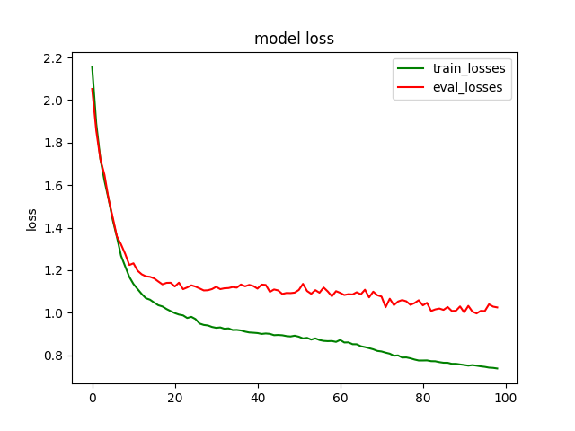

|

测试集上运行分类情况

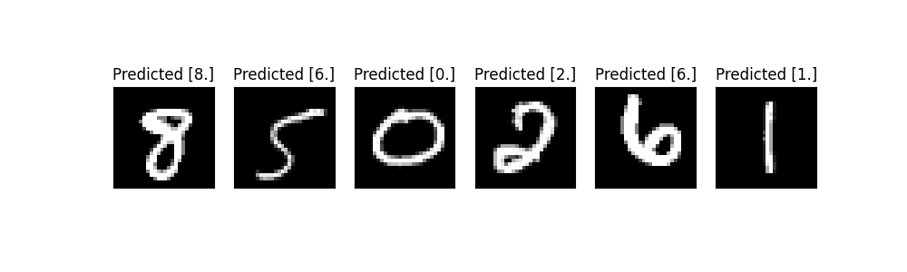

|

3.混合量子经典的QUnet网络模型
=======================================

图像分割（Image Segmeation）是计算机视觉研究中的一个经典难题,已经成为图像理解领域关注的一个热点,图像分割是图像分析的第一步,是计算机视觉的基础,
是图像理解的重要组成部分,同时也是图像处理中最困难的问题之一。所谓图像分割是指根据灰度、彩色、空间纹理、几何形状等特征把图像
划分成若干个互不相交的区域,使得这些特征在同一区域内表现出一致性或相似性,而在不同区域间表现出明显的不同。
简单而言就是给定一张图片,对图片上的每一个像素点分类。将不同分属不同物体的像素区域分开。 `Unet <https://arxiv.org/abs/1505.04597>`_ 是一种用于解决经典图像分割的算法。
在这里我们探索如何将经典神经网络部分量化,以创建适合量子数据的 `QUnet - Quantum Unet` 神经网络。我们将编写一个将 `pyqpanda <https://pyqpanda-toturial.readthedocs.io/zh/latest/>`_ 与 `VQNet` 集成的简单示例。
QUnet主要是用于解决图像分割的技术。

数据准备
-------------------
我们将使用VOCdevkit/VOC2012官方库的数据: `VOC2012 <http://host.robots.ox.ac.uk/pascal/VOC/voc2012/#devkit>`_ , 作为图像分割数据。
这些样本分为训练数据 training_data 和测试数据 testing_data,文件夹中包含images 和 labels。 

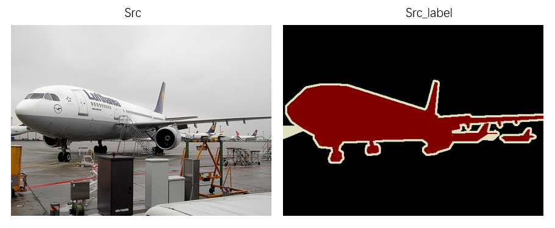

|

构建量子线路
---------------
在本例中,我们使用本源量子的 pyqpanda 定义了一个量子线路。将输入的3通道彩色图片数据压缩为单通道的灰度图片并进行存储,
再利用量子卷积操作对数据的特征进行提取降维操作。

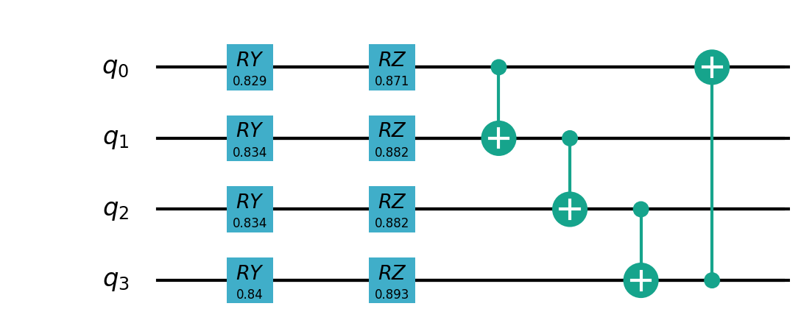

|

导入必须的库和函数

.. code-block::

    import os
    import numpy as np
    from pyvqnet.nn.module import Module
    from pyvqnet.nn.conv import Conv2D, ConvT2D
    from pyvqnet.nn import activation as F
    from pyvqnet.nn.batch_norm import BatchNorm2d
    from pyvqnet.nn.loss import BinaryCrossEntropy
    from pyvqnet.optim.adam import Adam
    from pyvqnet.dtype import *
    from pyvqnet.tensor import tensor
    from pyvqnet.tensor.tensor import QTensor
    import pyqpanda as pq
    from pyqpanda import *
    from pyvqnet.utils.storage import load_parameters, save_parameters

    import matplotlib
    try:
        matplotlib.use('TkAgg')
    except:
        pass
    import matplotlib.pyplot as plt

    import cv2

预处理数据

.. code-block::

    #预处理数据
    class PreprocessingData:
        def __init__(self, path):
            self.path = path
            self.x_data = []
            self.y_label = []

        def processing(self):
            list_path = os.listdir((self.path+"/images"))
            for i in range(len(list_path)):

                temp_data = cv2.imread(self.path+"/images" + '/' + list_path[i], cv2.IMREAD_COLOR)
                temp_data = cv2.resize(temp_data, (128, 128))
                grayimg = cv2.cvtColor(temp_data, cv2.COLOR_BGR2GRAY)
                temp_data = grayimg.reshape(temp_data.shape[0], temp_data.shape[0], 1).astype(np.float32)
                self.x_data.append(temp_data)

                label_data = cv2.imread(self.path+"/labels" + '/' +list_path[i].split(".")[0] + ".png", cv2.IMREAD_COLOR)
                label_data = cv2.resize(label_data, (128, 128))

                label_data = cv2.cvtColor(label_data, cv2.COLOR_BGR2GRAY)
                label_data = label_data.reshape(label_data.shape[0], label_data.shape[0], 1).astype(np.int64)
                self.y_label.append(label_data)

            return self.x_data, self.y_label

        def read(self):
            self.x_data, self.y_label = self.processing()
            x_data = np.array(self.x_data)
            y_label = np.array(self.y_label)

            return x_data, y_label

    #进行量子编码的线路
    class QCNN_:
        def __init__(self, image):
            self.image = image

        def encode_cir(self, qlist, pixels):
            cir = pq.QCircuit()
            for i, pix in enumerate(pixels):
                theta = np.arctan(pix)
                phi = np.arctan(pix**2)
                cir.insert(pq.RY(qlist[i], theta))
                cir.insert(pq.RZ(qlist[i], phi))
            return cir

        def entangle_cir(self, qlist):
            k_size = len(qlist)
            cir = pq.QCircuit()
            for i in range(k_size):
                ctr = i
                ctred = i+1
                if ctred == k_size:
                    ctred = 0
                cir.insert(pq.CNOT(qlist[ctr], qlist[ctred]))
            return cir

        def qcnn_circuit(self, pixels):
            k_size = len(pixels)
            machine = pq.MPSQVM()
            machine.init_qvm()
            qlist = machine.qAlloc_many(k_size)
            cir = pq.QProg()

            cir.insert(self.encode_cir(qlist, np.array(pixels) * np.pi / 2))
            cir.insert(self.entangle_cir(qlist))

            result0 = machine.prob_run_list(cir, [qlist[0]], -1)
            result1 = machine.prob_run_list(cir, [qlist[1]], -1)
            result2 = machine.prob_run_list(cir, [qlist[2]], -1)
            result3 = machine.prob_run_list(cir, [qlist[3]], -1)

            result = [result0[-1]+result1[-1]+result2[-1]+result3[-1]]
            machine.finalize()
            return result

    def quanconv_(image):
        """Convolves the input image with many applications of the same quantum circuit."""
        out = np.zeros((64, 64, 1))
        
        for j in range(0, 128, 2):
            for k in range(0, 128, 2):
                # Process a squared 2x2 region of the image with a quantum circuit
                q_results = QCNN_(image).qcnn_circuit(
                    [
                        image[j, k, 0],
                        image[j, k + 1, 0],
                        image[j + 1, k, 0],
                        image[j + 1, k + 1, 0]
                    ]
                )
                
                for c in range(1):
                    out[j // 2, k // 2, c] = q_results[c]
        return out

    def quantum_data_preprocessing(images):
        quantum_images = []
        for _, img in enumerate(images):
            quantum_images.append(quanconv_(img))
        quantum_images = np.asarray(quantum_images)
        return quantum_images

构建混合经典量子神经网络
----------------------------

我们按照Unet网络框架,使用 `VQNet` 框架搭建经典网络部分。下采样神经网络层用于降低维度,特征提取；
上采样神经网络层,用于恢复维度；上采样与下采样层之间通过concatenate进行连接,用于特征融合。

.. image:: ./images/Unet.png
   :width: 600 px
   :align: center

|

.. code-block::

    #下采样神经网络层的定义
    class DownsampleLayer(Module):
        def __init__(self, in_ch, out_ch):
            super(DownsampleLayer, self).__init__()
            self.conv1 = Conv2D(input_channels=in_ch, output_channels=out_ch, kernel_size=(3, 3), stride=(1, 1),
                                padding="same")
            self.BatchNorm2d1 = BatchNorm2d(out_ch)
            self.Relu1 = F.ReLu()
            self.conv2 = Conv2D(input_channels=out_ch, output_channels=out_ch, kernel_size=(3, 3), stride=(1, 1),
                                padding="same")
            self.BatchNorm2d2 = BatchNorm2d(out_ch)
            self.Relu2 = F.ReLu()
            self.conv3 = Conv2D(input_channels=out_ch, output_channels=out_ch, kernel_size=(3, 3), stride=(2, 2),
                                padding=(1,1))
            self.BatchNorm2d3 = BatchNorm2d(out_ch)
            self.Relu3 = F.ReLu()

        def forward(self, x):
            """
            :param x:
            :return: out(Output to deep),out_2(enter to next level),
            """
            x1 = self.conv1(x)
            x2 = self.BatchNorm2d1(x1)
            x3 = self.Relu1(x2)
            x4 = self.conv2(x3)
            x5 = self.BatchNorm2d2(x4)
            out = self.Relu2(x5)
            x6 = self.conv3(out)
            x7 = self.BatchNorm2d3(x6)
            out_2 = self.Relu3(x7)
            return out, out_2

    #上采样神经网络层的定义
    class UpSampleLayer(Module):
        def __init__(self, in_ch, out_ch):
            super(UpSampleLayer, self).__init__()

            self.conv1 = Conv2D(input_channels=in_ch, output_channels=out_ch * 2, kernel_size=(3, 3), stride=(1, 1),
                                padding="same")
            self.BatchNorm2d1 = BatchNorm2d(out_ch * 2)
            self.Relu1 = F.ReLu()
            self.conv2 = Conv2D(input_channels=out_ch * 2, output_channels=out_ch * 2, kernel_size=(3, 3), stride=(1, 1),
                                padding="same")
            self.BatchNorm2d2 = BatchNorm2d(out_ch * 2)
            self.Relu2 = F.ReLu()

            self.conv3 = ConvT2D(input_channels=out_ch * 2, output_channels=out_ch, kernel_size=(3, 3), stride=(2, 2),
                                 padding=(1,1))
            self.BatchNorm2d3 = BatchNorm2d(out_ch)
            self.Relu3 = F.ReLu()

        def forward(self, x):
            '''
            :param x: input conv layer
            :param out: connect with UpsampleLayer
            :return:
            '''
            x = self.conv1(x)
            x = self.BatchNorm2d1(x)
            x = self.Relu1(x)
            x = self.conv2(x)
            x = self.BatchNorm2d2(x)
            x = self.Relu2(x)
            x = self.conv3(x)
            x = self.BatchNorm2d3(x)
            x_out = self.Relu3(x)
            return x_out

    #Unet整体网络架构
    class UNet(Module):
        def __init__(self):
            super(UNet, self).__init__()
            out_channels = [2 ** (i + 4) for i in range(5)]

            # DownSampleLayer
            self.d1 = DownsampleLayer(1, out_channels[0])  # 3-64
            self.d2 = DownsampleLayer(out_channels[0], out_channels[1])  # 64-128
            self.d3 = DownsampleLayer(out_channels[1], out_channels[2])  # 128-256
            self.d4 = DownsampleLayer(out_channels[2], out_channels[3])  # 256-512
            # UpSampleLayer
            self.u1 = UpSampleLayer(out_channels[3], out_channels[3])  # 512-1024-512
            self.u2 = UpSampleLayer(out_channels[4], out_channels[2])  # 1024-512-256
            self.u3 = UpSampleLayer(out_channels[3], out_channels[1])  # 512-256-128
            self.u4 = UpSampleLayer(out_channels[2], out_channels[0])  # 256-128-64
            # output
            self.conv1 = Conv2D(input_channels=out_channels[1], output_channels=out_channels[0], kernel_size=(3, 3),
                                stride=(1, 1), padding="same")
            self.BatchNorm2d1 = BatchNorm2d(out_channels[0])
            self.Relu1 = F.ReLu()
            self.conv2 = Conv2D(input_channels=out_channels[0], output_channels=out_channels[0], kernel_size=(3, 3),
                                stride=(1, 1), padding="same")
            self.BatchNorm2d2 = BatchNorm2d(out_channels[0])
            self.Relu2 = F.ReLu()
            self.conv3 = Conv2D(input_channels=out_channels[0], output_channels=1, kernel_size=(3, 3),
                                stride=(1, 1), padding="same")
            self.Sigmoid = F.Sigmoid()

        def forward(self, x):
            out_1, out1 = self.d1(x)
            out_2, out2 = self.d2(out1)
            out_3, out3 = self.d3(out2)
            out_4, out4 = self.d4(out3)

            out5 = self.u1(out4)
            out5_pad_out4 = tensor.pad2d(out5, (1, 0, 1, 0), 0)
            cat_out5 = tensor.concatenate([out5_pad_out4, out_4], axis=1)

            out6 = self.u2(cat_out5)
            out6_pad_out_3 = tensor.pad2d(out6, (1, 0, 1, 0), 0)
            cat_out6 = tensor.concatenate([out6_pad_out_3, out_3], axis=1)

            out7 = self.u3(cat_out6)
            out7_pad_out_2 = tensor.pad2d(out7, (1, 0, 1, 0), 0)
            cat_out7 = tensor.concatenate([out7_pad_out_2, out_2], axis=1)

            out8 = self.u4(cat_out7)
            out8_pad_out_1 = tensor.pad2d(out8, (1, 0, 1, 0), 0)
            cat_out8 = tensor.concatenate([out8_pad_out_1, out_1], axis=1)

            out = self.conv1(cat_out8)
            out = self.BatchNorm2d1(out)
            out = self.Relu1(out)
            out = self.conv2(out)
            out = self.BatchNorm2d2(out)
            out = self.Relu2(out)
            out = self.conv3(out)
            out = self.Sigmoid(out)
            return out

训练和模型保存
--------------------

通过上面代码示例,我们已经定义了模型。与经典神经网络模型训练类似, 我们还需要做的是实例化该模型,
定义损失函数以及优化器以及定义整个训练测试流程。 对于形如下图的混合神经网络模型,我们通过循环输入数据前向计算损失值,
并在反向计算中自动计算出各个待训练参数的梯度,并使用优化器进行参数优化,直到迭代次数满足预设值。
我们这里使用前面下载的VOC2012数据中选取100张作为训练集,10张作为测试集。训练集目录指定为 `path0`,测试集目录指定为 `path1`。
其中,图像以及其对应的标签图像都经过了量子卷积模块 ``quantum_data_preprocessing`` 进行预处理,我们Unet的训练目标是使得同时经过量子线路预处理的图像和标签尽可能贴近。
如果已经进行了量子化数据预处理,可以设置 ``PREPROCESS`` 为False。

.. code-block::

    PREPROCESS = True

    class MyDataset():
        def __init__(self, x_data, x_label):
            self.x_set = x_data
            self.label = x_label

        def __getitem__(self, item):
            img, target = self.x_set[item], self.label[item]
            img_np = np.uint8(img).transpose(2, 0, 1)
            target_np = np.uint8(target).transpose(2, 0, 1)

            img = img_np
            target = target_np
            return img, target

        def __len__(self):
            return len(self.x_set)

    if not os.path.exists("./result"):
        os.makedirs("./result")
    else:
        pass
    if not os.path.exists("./Intermediate_results"):
        os.makedirs("./Intermediate_results")
    else:
        pass

    # prepare train/test data and label
    path0 = 'training_data'
    path1 = 'testing_data'
    train_images, train_labels = PreprocessingData(path0).read()
    test_images, test_labels = PreprocessingData(path1).read()

    print('train: ', train_images.shape, '\ntest: ', test_images.shape)
    print('train: ', train_labels.shape, '\ntest: ', test_labels.shape)
    train_images = train_images / 255
    test_images = test_images / 255

    # use quantum encoder to preprocess data

    
    
    if PREPROCESS == True:
        print("Quantum pre-processing of train images:")
        q_train_images = quantum_data_preprocessing(train_images)
        q_test_images = quantum_data_preprocessing(test_images)
        q_train_label = quantum_data_preprocessing(train_labels)
        q_test_label = quantum_data_preprocessing(test_labels)

        # Save pre-processed images
        print('Quantum Data Saving...')
        np.save("./result/q_train.npy", q_train_images)
        np.save("./result/q_test.npy", q_test_images)
        np.save("./result/q_train_label.npy", q_train_label)
        np.save("./result/q_test_label.npy", q_test_label)
        print('Quantum Data Saving Over!')

    # loading quantum data
    SAVE_PATH = "./result/"
    train_x = np.load(SAVE_PATH + "q_train.npy")
    train_labels = np.load(SAVE_PATH + "q_train_label.npy")
    test_x = np.load(SAVE_PATH + "q_test.npy")
    test_labels = np.load(SAVE_PATH + "q_test_label.npy")

    train_x = train_x.astype(np.uint8)
    test_x = test_x.astype(np.uint8)
    train_labels = train_labels.astype(np.uint8)
    test_labels = test_labels.astype(np.uint8)
    train_y = train_labels
    test_y = test_labels

    trainset = MyDataset(train_x, train_y)
    testset = MyDataset(test_x, test_y)
    x_train = []
    y_label = []
    model = UNet()
    optimizer = Adam(model.parameters(), lr=0.01)
    loss_func = BinaryCrossEntropy()
    epochs = 200

    loss_list = []
    SAVE_FLAG = True
    temp_loss = 0
    file = open("./result/result.txt", 'w').close()
    for epoch in range(1, epochs):
        total_loss = []
        model.train()
        for i, (x, y) in enumerate(trainset):
            x_img = QTensor(x, dtype=kfloat32)
            x_img_Qtensor = tensor.unsqueeze(x_img, 0)
            y_img = QTensor(y, dtype=kfloat32)
            y_img_Qtensor = tensor.unsqueeze(y_img, 0)
            optimizer.zero_grad()
            img_out = model(x_img_Qtensor)

            print(f"=========={epoch}==================")
            loss = loss_func(y_img_Qtensor, img_out)  # target output
            if i == 1:
                plt.figure()
                plt.subplot(1, 2, 1)
                plt.title("predict")
                img_out_tensor = tensor.squeeze(img_out, 0)

                if matplotlib.__version__ >= '3.4.2':
                    plt.imshow(np.array(img_out_tensor.data).transpose([1, 2, 0]))
                else:
                    plt.imshow(np.array(img_out_tensor.data).transpose([1, 2, 0]).squeeze(2))
                plt.subplot(1, 2, 2)
                plt.title("label")
                y_img_tensor = tensor.squeeze(y_img_Qtensor, 0)
                if matplotlib.__version__ >= '3.4.2':
                    plt.imshow(np.array(y_img_tensor.data).transpose([1, 2, 0]))
                else:
                    plt.imshow(np.array(y_img_tensor.data).transpose([1, 2, 0]).squeeze(2))

                plt.savefig("./Intermediate_results/" + str(epoch) + "_" + str(i) + ".jpg")

            loss_data = np.array(loss.data)
            print("{} - {} loss_data: {}".format(epoch, i, loss_data))
            loss.backward()
            optimizer._step()
            total_loss.append(loss_data)

        loss_list.append(np.sum(total_loss) / len(total_loss))
        out_read = open("./result/result.txt", 'a')
        out_read.write(str(loss_list[-1]))
        out_read.write(str("\n"))
        out_read.close()
        print("{:.0f} loss is : {:.10f}".format(epoch, loss_list[-1]))
        if SAVE_FLAG:
            temp_loss = loss_list[-1]
            save_parameters(model.state_dict(), "./result/Q-Unet_End.model")
            SAVE_FLAG = False
        else:
            if temp_loss > loss_list[-1]:
                temp_loss = loss_list[-1]
                save_parameters(model.state_dict(), "./result/Q-Unet_End.model")

数据可视化
---------------

训练数据的损失函数曲线显示保存,以及测试数据结果保存。

.. code-block::

    out_read = open("./result/result.txt", 'r')
    plt.figure()
    lines_read = out_read.readlines()
    data_read = []
    for line in lines_read:
        float_line = float(line)
        data_read.append(float_line)
    out_read.close()
    plt.plot(data_read)
    plt.title('Unet Training')
    plt.xlabel('Training Iterations')
    plt.ylabel('Loss')
    plt.savefig("./result/traing_loss.jpg")

    modela = load_parameters("./result/Q-Unet_End.model")
    print("----------------PREDICT-------------")
    model.load_state_dict(modela)
    model.eval()

    for i, (x1, y1) in enumerate(testset):
        x_img = QTensor(x1, dtype=kfloat32)
        x_img_Qtensor = tensor.unsqueeze(x_img, 0)
        y_img = QTensor(y1, dtype=kfloat32)
        y_img_Qtensor = tensor.unsqueeze(y_img, 0)
        img_out = model(x_img_Qtensor)
        loss = loss_func(y_img_Qtensor, img_out)
        loss_data = np.array(loss.data)
        print("{} loss_eval: {}".format(i, loss_data))
        plt.figure()
        plt.subplot(1, 2, 1)
        plt.title("predict")
        img_out_tensor = tensor.squeeze(img_out, 0)
        if matplotlib.__version__ >= '3.4.2':
            plt.imshow(np.array(img_out_tensor.data).transpose([1, 2, 0]))
        else:
            plt.imshow(np.array(img_out_tensor.data).transpose([1, 2, 0]).squeeze(2))
        plt.subplot(1, 2, 2)
        plt.title("label")
        y_img_tensor = tensor.squeeze(y_img_Qtensor, 0)
        if matplotlib.__version__ >= '3.4.2':
            plt.imshow(np.array(y_img_tensor.data).transpose([1, 2, 0]))
        else:
            plt.imshow(np.array(y_img_tensor.data).transpose([1, 2, 0]).squeeze(2))
        plt.savefig("./result/eval_" + str(i) + "_1" + ".jpg")
    print("end!")

训练集上Loss情况

.. image:: ./images/qunet_train_loss.png
   :width: 600 px
   :align: center

|

可视化运行情况

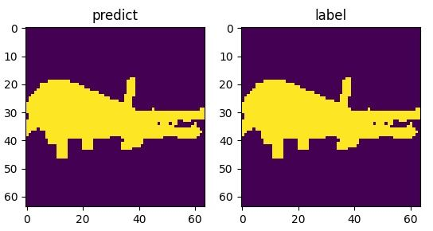

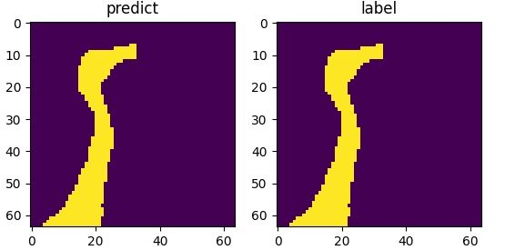

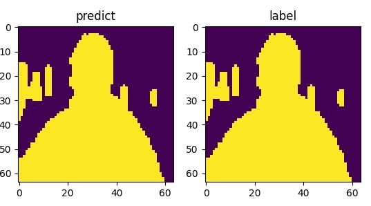

|

4.混合量子经典的QMLP网络模型
==================================

我们介绍并分析了提出了一种量子多层感知器 (QMLP) 架构,其特点是具有容错输入嵌入、丰富的非线性和带有参数化双量子比特纠缠门的增强变分电路模拟。`QMLP: An Error-Tolerant Nonlinear Quantum MLP Architecture using Parameterized Two-Qubit Gates <https://arxiv.org/pdf/2206.01345.pdf>`_ 。
我们将编写一个将 `pyqpanda <https://pyqpanda-toturial.readthedocs.io/zh/latest/>`_ 与 `VQNet` 集成的简单示例。

构建混合经典量子神经网络
-----------------------------

.. code-block::

    import os
    import gzip
    import struct
    import numpy as np
    import pyqpanda as pq
    from pyvqnet.nn.module import Module
    from pyvqnet.nn.loss import MeanSquaredError, CrossEntropyLoss
    from pyvqnet.optim.adam import Adam
    from pyvqnet.tensor.tensor import QTensor
    from pyvqnet.qnn.measure import expval
    from pyvqnet.qnn.quantumlayer import QuantumLayer, QuantumLayerMultiProcess
    from pyvqnet.nn.pooling import AvgPool2D
    from pyvqnet.nn.linear import Linear
    from pyvqnet.data.data import data_generator
    from pyvqnet.tensor import tensor
    import matplotlib
    from matplotlib import pyplot as plt
    try:
        matplotlib.use("TkAgg")
    except:  
        print("Can not use matplot TkAgg")

    try:
        import urllib.request
    except ImportError:
        raise ImportError("You should use Python 3.x")

    url_base = 'https://ossci-datasets.s3.amazonaws.com/mnist/'
    key_file = {
        "train_img": "train-images-idx3-ubyte.gz",
        "train_label": "train-labels-idx1-ubyte.gz",
        "test_img": "t10k-images-idx3-ubyte.gz",
        "test_label": "t10k-labels-idx1-ubyte.gz"
    }

    def _download(dataset_dir, file_name):
        """
        Download mnist data if needed.
        """
        file_path = dataset_dir + "/" + file_name

        if os.path.exists(file_path):
            with gzip.GzipFile(file_path) as file:
                file_path_ungz = file_path[:-3].replace("\\", "/")
                if not os.path.exists(file_path_ungz):
                    open(file_path_ungz, "wb").write(file.read())
            return

        print("Downloading " + file_name + " ... ")
        urllib.request.urlretrieve(url_base + file_name, file_path)
        if os.path.exists(file_path):
            with gzip.GzipFile(file_path) as file:
                file_path_ungz = file_path[:-3].replace("\\", "/")
                file_path_ungz = file_path_ungz.replace("-idx", ".idx")
                if not os.path.exists(file_path_ungz):
                    open(file_path_ungz, "wb").write(file.read())
        print("Done")

    def download_mnist(dataset_dir):
        for v in key_file.values():
            _download(dataset_dir, v)

    def load_mnist(dataset="training_data", digits=np.arange(2), path="./"):
        """
        load mnist data
        """
        from array import array as pyarray
        download_mnist(path)
        if dataset == "training_data":
            fname_image = os.path.join(path, "train-images.idx3-ubyte").replace(
                "\\", "/")
            fname_label = os.path.join(path, "train-labels.idx1-ubyte").replace(
                "\\", "/")
        elif dataset == "testing_data":
            fname_image = os.path.join(path, "t10k-images.idx3-ubyte").replace(
                "\\", "/")
            fname_label = os.path.join(path, "t10k-labels.idx1-ubyte").replace(
                "\\", "/")
        else:
            raise ValueError("dataset must be 'training_data' or 'testing_data'")

        flbl = open(fname_label, "rb")
        _, size = struct.unpack(">II", flbl.read(8))
        lbl = pyarray("b", flbl.read())
        flbl.close()

        fimg = open(fname_image, "rb")
        _, size, rows, cols = struct.unpack(">IIII", fimg.read(16))
        img = pyarray("B", fimg.read())
        fimg.close()

        ind = [k for k in range(size) if lbl[k] in digits]
        num = len(ind)
        images = np.zeros((num, rows, cols))
        labels = np.zeros((num, 1), dtype=int)
        for i in range(len(ind)):
            images[i] = np.array(img[ind[i] * rows * cols:(ind[i] + 1) * rows *
                                     cols]).reshape((rows, cols))
            labels[i] = lbl[ind[i]]

        return images, labels

    def data_select(train_num, test_num):
        """
        Select data from mnist dataset.
        """
        x_train, y_train = load_mnist("training_data")  
        x_test, y_test = load_mnist("testing_data")  
        idx_train = np.append(
            np.where(y_train == 0)[0][:train_num],
            np.where(y_train == 1)[0][:train_num])

        x_train = x_train[idx_train]
        y_train = y_train[idx_train]

        x_train = x_train / 255
        y_train = np.eye(2)[y_train].reshape(-1, 2)

        # Test Leaving only labels 0 and 1
        idx_test = np.append(
            np.where(y_test == 0)[0][:test_num],
            np.where(y_test == 1)[0][:test_num])

        x_test = x_test[idx_test]
        y_test = y_test[idx_test]
        x_test = x_test / 255
        y_test = np.eye(2)[y_test].reshape(-1, 2)

        return x_train, y_train, x_test, y_test

    def RotCircuit(para, qlist):
        r"""

        Arbitrary single qubit rotation.Number of qlist should be 1,and number of parameters should
        be 3

        .. math::

            R(\phi,\theta,\omega) = RZ(\omega)RY(\theta)RZ(\phi)= \begin{bmatrix}
            e^{-i(\phi+\omega)/2}\cos(\theta/2) & -e^{i(\phi-\omega)/2}\sin(\theta/2) \\
            e^{-i(\phi-\omega)/2}\sin(\theta/2) & e^{i(\phi+\omega)/2}\cos(\theta/2)
            \end{bmatrix}.

        :param para: numpy array which represents paramters [\phi, \theta, \omega]
        :param qlist: qubits allocated by pyQpanda.qAlloc_many()
        :return: quantum circuits

        Example::

            m_machine = pq.init_quantum_machine(pq.QMachineType.CPU)
            m_clist = m_machine.cAlloc_many(2)
            m_prog = pq.QProg()
            m_qlist = m_machine.qAlloc_many(1)
            param = np.array([3,4,5])
            c = RotCircuit(param,m_qlist)
            print(c)
            pq.destroy_quantum_machine(m_machine)

        """
        if isinstance(para, QTensor):
            para = QTensor._to_numpy(para)
        if para.ndim > 1:
            raise ValueError(" dim of paramters in Rot should be 1")
        if para.shape[0] != 3:
            raise ValueError(" numbers of paramters in Rot should be 3")

        cir = pq.QCircuit()
        cir.insert(pq.RZ(qlist, para[2]))
        cir.insert(pq.RY(qlist, para[1]))
        cir.insert(pq.RZ(qlist, para[0]))

        return cir

    def build_RotCircuit(qubits, weights):
        cir = pq.QCircuit()
        cir.insert(RotCircuit(weights[0:3], qubits[0]))
        cir.insert(RotCircuit(weights[3:6], qubits[1]))
        cir.insert(RotCircuit(weights[6:9], qubits[2]))
        cir.insert(RotCircuit(weights[9:12], qubits[3]))
        cir.insert(RotCircuit(weights[12:15], qubits[4]))
        cir.insert(RotCircuit(weights[15:18], qubits[5]))
        cir.insert(RotCircuit(weights[18:21], qubits[6]))
        cir.insert(RotCircuit(weights[21:24], qubits[7]))
        cir.insert(RotCircuit(weights[24:27], qubits[8]))
        cir.insert(RotCircuit(weights[27:30], qubits[9]))
        cir.insert(RotCircuit(weights[30:33], qubits[10]))
        cir.insert(RotCircuit(weights[33:36], qubits[11]))
        cir.insert(RotCircuit(weights[36:39], qubits[12]))
        cir.insert(RotCircuit(weights[39:42], qubits[13]))
        cir.insert(RotCircuit(weights[42:45], qubits[14]))
        cir.insert(RotCircuit(weights[45:48], qubits[15]))

        return cir

    def CRXCircuit(para, control_qlists, rot_qlists):
        cir = pq.QCircuit()
        cir.insert(pq.RX(rot_qlists, para))
        cir.set_control(control_qlists)
        return cir

    def build_CRotCircuit(qubits, weights):
        cir = pq.QCircuit()
        cir.insert(CRXCircuit(weights[0], qubits[0], qubits[1]))
        cir.insert(CRXCircuit(weights[1], qubits[1], qubits[2]))
        cir.insert(CRXCircuit(weights[2], qubits[2], qubits[3]))
        cir.insert(CRXCircuit(weights[3], qubits[3], qubits[4]))
        cir.insert(CRXCircuit(weights[4], qubits[4], qubits[5]))
        cir.insert(CRXCircuit(weights[5], qubits[5], qubits[6]))
        cir.insert(CRXCircuit(weights[6], qubits[6], qubits[7]))
        cir.insert(CRXCircuit(weights[7], qubits[7], qubits[8]))
        cir.insert(CRXCircuit(weights[8], qubits[8], qubits[9]))
        cir.insert(CRXCircuit(weights[9], qubits[9], qubits[10]))
        cir.insert(CRXCircuit(weights[10], qubits[10], qubits[11]))
        cir.insert(CRXCircuit(weights[11], qubits[11], qubits[12]))
        cir.insert(CRXCircuit(weights[12], qubits[12], qubits[13]))
        cir.insert(CRXCircuit(weights[13], qubits[13], qubits[14]))
        cir.insert(CRXCircuit(weights[14], qubits[14], qubits[15]))
        cir.insert(CRXCircuit(weights[15], qubits[15], qubits[0]))

        return cir

    def build_qmlp_circuit(x, weights, qubits, clist, machine):
        cir = pq.QCircuit()
        num_qubits = len(qubits)
        for i in range(num_qubits):
            cir.insert(pq.RX(qubits[i], x[i]))

        cir.insert(build_RotCircuit(qubits, weights[0:48]))
        cir.insert(build_CRotCircuit(qubits, weights[48:64]))

        for i in range(num_qubits):
            cir.insert(pq.RX(qubits[i], x[i]))

        cir.insert(build_RotCircuit(qubits, weights[64:112]))
        cir.insert(build_CRotCircuit(qubits, weights[112:128]))

        prog = pq.QProg()
        prog.insert(cir)
        # print(prog)
        # exit()

        exp_vals = []
        for position in range(num_qubits):
            pauli_str = {"Z" + str(position): 1.0}
            exp2 = expval(machine, prog, pauli_str, qubits)
            exp_vals.append(exp2)

        return exp_vals

    def build_multiprocess_qmlp_circuit(x, weights, num_qubits, num_clist):
        machine = pq.CPUQVM()
        machine.init_qvm()
        qubits = machine.qAlloc_many(num_qubits)
        cir = pq.QCircuit()
        for i in range(num_qubits):
            cir.insert(pq.RX(qubits[i], x[i]))

        cir.insert(build_RotCircuit(qubits, weights[0:48]))
        cir.insert(build_CRotCircuit(qubits, weights[48:64]))

        for i in range(num_qubits):
            cir.insert(pq.RX(qubits[i], x[i]))

        cir.insert(build_RotCircuit(qubits, weights[64:112]))
        cir.insert(build_CRotCircuit(qubits, weights[112:128]))

        prog = pq.QProg()
        prog.insert(cir)
        # print(prog)
        # exit()

        exp_vals = []
        for position in range(num_qubits):
            pauli_str = {"Z" + str(position): 1.0}
            exp2 = expval(machine, prog, pauli_str, qubits)
            exp_vals.append(exp2)

        return exp_vals

    class QMLPModel(Module):
        def __init__(self):
            super(QMLPModel, self).__init__()
            self.ave_pool2d = AvgPool2D([7, 7], [7, 7], "valid")
            # self.quantum_circuit = QuantumLayer(build_qmlp_circuit, 128, "CPU", 16, diff_method="finite_diff")
            self.quantum_circuit = QuantumLayerMultiProcess(build_multiprocess_qmlp_circuit, 128, 
                                                            16, 1, diff_method="finite_diff")
            self.linear = Linear(16, 10)

        def forward(self, x):
            bsz = x.shape[0]
            x = self.ave_pool2d(x)
            input_data = x.reshape([bsz, 16])
            quanutum_result = self.quantum_circuit(input_data)
            result = self.linear(quanutum_result)
            return result

    def vqnet_test_QMLPModel():
        # train num=1000, test_num=100
        # x_train, y_train, x_test, y_test = data_select(1000, 100)

        train_size = 1000
        eval_size = 100
        x_train, y_train = load_mnist("training_data", digits=np.arange(10))
        x_test, y_test = load_mnist("testing_data", digits=np.arange(10))

        x_train = x_train[:train_size]
        y_train = y_train[:train_size]
        x_test = x_test[:eval_size]
        y_test = y_test[:eval_size]

        x_train = x_train / 255
        x_test = x_test / 255
        y_train = np.eye(10)[y_train].reshape(-1, 10)
        y_test = np.eye(10)[y_test].reshape(-1, 10)

        model = QMLPModel()
        optimizer = Adam(model.parameters(), lr=0.005)
        loss_func = CrossEntropyLoss()
        loss_list = []
        epochs = 30
        for epoch in range(1, epochs):
            total_loss = []

            correct = 0
            n_train = 0
            for x, y in data_generator(x_train,
                                       y_train,
                                       batch_size=16,
                                       shuffle=True):

                x = x.reshape(-1, 1, 28, 28)
                optimizer.zero_grad()
                # Forward pass
                output = model(x)
                # Calculating loss
                loss = loss_func(y, output)
                loss_np = np.array(loss.data)
                print("loss: ", loss_np)
                np_output = np.array(output.data, copy=False)

                temp_out = np_output.argmax(axis=1)
                temp_output = np.zeros((temp_out.size, 10))
                temp_output[np.arange(temp_out.size), temp_out] = 1
                temp_maks = (temp_output == y)

                correct += np.sum(np.array(temp_maks))
                n_train += 160

                # Backward pass
                loss.backward()
                # Optimize the weights
                optimizer._step()
                total_loss.append(loss_np)
            print("##########################")
            print(f"Train Accuracy: {correct / n_train}")
            loss_list.append(np.sum(total_loss) / len(total_loss))
            # train_acc_list.append(correct / n_train)
            print("epoch: ", epoch)
            # print(100. * (epoch + 1) / epochs)
            print("{:.0f} loss is : {:.10f}".format(epoch, loss_list[-1]))

    if __name__ == "__main__":

        vqnet_test_QMLPModel()

数据结果
-----------------------

训练数据的损失函数曲线显示保存,以及测试数据结果保存。
训练集上Loss情况

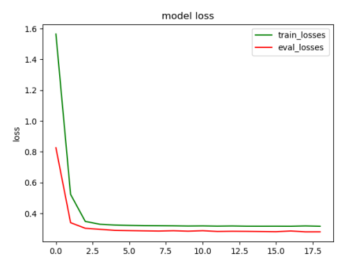

|

.. _QDRL_DEMO:

5.混合量子经典的QDRL网络模型
====================================

我们介绍并分析了提出了一种量子强化学习网络 (QDRL) ,其特点将经典的深度强化学习算法（如经验回放和目标网络）重塑为变分量子电路的表示。
此外,与经典神经网络相比,我们使用量子信息编码方案来减少模型参数的数量。 `QDRL: Variational Quantum Circuits for Deep Reinforcement Learning <https://arxiv.org/pdf/1907.00397.pdf>`_ 。
我们将编写一个将 `pyqpanda <https://pyqpanda-toturial.readthedocs.io/zh/latest/>`_ 与 `VQNet` 集成的简单示例。

构建混合经典量子神经网络
---------------------------

需要安装 ``gym`` == 0.23.0 , ``pygame`` == 2.1.2 。

.. code-block::

    import numpy as np
    import random
    import gym
    import time
    from matplotlib import animation
    import pyqpanda as pq
    from pyvqnet.nn.module import Module
    from pyvqnet.nn.loss import MeanSquaredError
    from pyvqnet.optim.adam import Adam
    from pyvqnet.tensor.tensor import QTensor
    from pyvqnet import kfloat32
    from pyvqnet.qnn.quantumlayer import QuantumLayerMultiProcess
    from pyvqnet.tensor import tensor
    from pyvqnet.qnn.measure import expval
    from pyvqnet._core import Tensor as CoreTensor
    import matplotlib
    from matplotlib import pyplot as plt
    try:
        matplotlib.use("TkAgg")
    except:  
        print("Can not use matplot TkAgg")
    def display_frames_as_gif(frames, c_index):
        patch = plt.imshow(frames[0])
        plt.axis('off')
        def animate(i):
            patch.set_data(frames[i])
        anim = animation.FuncAnimation(plt.gcf(), animate, frames=len(frames), interval=5)
        name_result = "./result_"+str(c_index)+".gif"
        anim.save(name_result, writer='pillow', fps=10)
    CIRCUIT_SIZE = 4
    MAX_ITERATIONS = 50
    MAX_STEPS = 250
    BATCHSIZE = 5
    TARGET_MAX = 20
    GAMMA = 0.99
    STATE_T = 0
    ACTION = 1
    REWARD = 2
    STATE_NT = 3
    DONE = 4
    def RotCircuit(para, qlist):
        r"""
        Arbitrary single qubit rotation.Number of qlist should be 1,and number of parameters should
        be 3
        .. math::
            R(\phi,\theta,\omega) = RZ(\omega)RY(\theta)RZ(\phi)= \begin{bmatrix}
            e^{-i(\phi+\omega)/2}\cos(\theta/2) & -e^{i(\phi-\omega)/2}\sin(\theta/2) \\
            e^{-i(\phi-\omega)/2}\sin(\theta/2) & e^{i(\phi+\omega)/2}\cos(\theta/2)
            \end{bmatrix}.
        :param para: numpy array which represents paramters [\phi, \theta, \omega]
        :param qlist: qubits allocated by pyQpanda.qAlloc_many()
        :return: quantum circuits
        Example::
            m_machine = pq.init_quantum_machine(pq.QMachineType.CPU)
            m_clist = m_machine.cAlloc_many(2)
            m_prog = pq.QProg()
            m_qlist = m_machine.qAlloc_many(1)
            param = np.array([3,4,5])
            c = RotCircuit(param,m_qlist)
            print(c)
            pq.destroy_quantum_machine(m_machine)
        """
        if isinstance(para, QTensor):
            para = QTensor._to_numpy(para)
        if para.ndim > 1:
            raise ValueError(" dim of paramters in Rot should be 1")
        if para.shape[0] != 3:
            raise ValueError(" numbers of paramters in Rot should be 3")
        cir = pq.QCircuit()
        cir.insert(pq.RZ(qlist, para[2]))
        cir.insert(pq.RY(qlist, para[1]))
        cir.insert(pq.RZ(qlist, para[0]))
        return cir
    def layer_circuit(qubits, weights):
        cir = pq.QCircuit()
        # Entanglement block
        cir.insert(pq.CNOT(qubits[0], qubits[1]))
        cir.insert(pq.CNOT(qubits[1], qubits[2]))
        cir.insert(pq.CNOT(qubits[2], qubits[3]))
        # u3 gate
        cir.insert(RotCircuit(weights[0], qubits[0]))  # weights shape = [4, 3]
        cir.insert(RotCircuit(weights[1], qubits[1]))
        cir.insert(RotCircuit(weights[2], qubits[2]))
        cir.insert(RotCircuit(weights[3], qubits[3]))
        return cir
    def encoder(encodings):
        encodings = int(encodings[0])
        return [i for i, b in enumerate(f'{encodings:0{CIRCUIT_SIZE}b}') if b == '1']
    def build_qc(x, weights, num_qubits, num_clist):
        machine = pq.CPUQVM()
        machine.init_qvm()
        qubits = machine.qAlloc_many(num_qubits)
        cir = pq.QCircuit()
        if x:
            wires = encoder(x)
            for wire in wires:
                cir.insert(pq.RX(qubits[wire], np.pi))
                cir.insert(pq.RZ(qubits[wire], np.pi))
        # parameter number = 24
        weights = weights.reshape([2, 4, 3])
        # layer wise
        for w in weights:
            cir.insert(layer_circuit(qubits, w))
        prog = pq.QProg()
        prog.insert(cir)
        exp_vals = []
        for position in range(num_qubits):
            pauli_str = {"Z" + str(position): 1.0}
            exp2 = expval(machine, prog, pauli_str, qubits)
            exp_vals.append(exp2)
        return exp_vals
    class DRLModel(Module):
        def __init__(self):
            super(DRLModel, self).__init__()
            self.quantum_circuit = QuantumLayerMultiProcess(build_qc, 24,  
                                                            4, 1, diff_method="finite_diff")
        def forward(self, x):
            quanutum_result = self.quantum_circuit(x)
            return quanutum_result
    env = gym.make("FrozenLake-v1", is_slippery = False, map_name = '4x4')
    state = env.reset()
    n_layers = 2
    n_qubits = 4
    targ_counter = 0
    sampled_vs = []
    memory = {}
    param = QTensor(0.01 * np.random.randn(n_layers, n_qubits, 3))
    bias = QTensor([[0.0, 0.0, 0.0, 0.0]])
    param_targ = param.copy().reshape([1, -1]).pdata[0]
    bias_targ = bias.copy()
    loss_func = MeanSquaredError()
    model = DRLModel()
    opt = Adam(model.parameters(), lr=5)
    for i in range(MAX_ITERATIONS):
        start = time.time()
        state_t = env.reset()
        a_init = env.action_space.sample()
        total_reward = 0
        done = False
        frames = []
        for t in range(MAX_STEPS):
            frames.append(env.render(mode='rgb_array'))
            time.sleep(0.1)
            input_x = QTensor([[state_t]],dtype=kfloat32)
            acts = model(input_x) + bias
            # print(f'type of acts: {type(acts)}')
            act_t = tensor.QTensor.argmax(acts)
            # print(f'act_t: {act_t} type of act_t: {type(act_t)}')
            act_t_np = int(act_t.pdata[0])
            print(f'Episode: {i}, Steps: {t}, act: {act_t_np}')
            state_nt, reward, done, info = env.step(action=act_t_np)
            targ_counter += 1
            input_state_nt = QTensor([[state_nt]],dtype=kfloat32)
            act_nt = QTensor.argmax(model(input_state_nt)+bias)
            act_nt_np = int(act_nt.pdata[0])
            memory[i, t] = (state_t, act_t, reward, state_nt, done)
            if len(memory) >= BATCHSIZE:
                # print('Optimizing...')
                sampled_vs = [memory[k] for k in random.sample(list(memory), BATCHSIZE)]
                target_temp = []
                for s in sampled_vs:
                    if s[DONE]:
                        target_temp.append(QTensor(s[REWARD]).reshape([1, -1]))
                    else:
                        input_s = QTensor([[s[STATE_NT]]],dtype=kfloat32)
                        out_temp = s[REWARD] + GAMMA * tensor.max(model(input_s) + bias_targ)
                        out_temp = out_temp.reshape([1, -1])
                        target_temp.append(out_temp)
                target_out = []
                for b in sampled_vs:
                    input_b = QTensor([[b[STATE_T]]], requires_grad=True,dtype=kfloat32)
                    out_result = model(input_b) + bias
                    index = int(b[ACTION].pdata[0])
                    out_result_temp = out_result[0][index].reshape([1, -1])
                    target_out.append(out_result_temp)
                opt.zero_grad()
                target_label = tensor.concatenate(target_temp, 1)
                output = tensor.concatenate(target_out, 1)
                loss = loss_func(target_label, output)
                loss.backward()
                opt.step()
            # update parameters in target circuit
            if targ_counter == TARGET_MAX:
                param_targ = param.copy().reshape([1, -1]).pdata[0]
                bias_targ = bias.copy()
                targ_counter = 0
            state_t, act_t_np = state_nt, act_nt_np
            if done:
                print("reward", reward)
                if reward == 1.0:
                    frames.append(env.render(mode='rgb_array'))
                    display_frames_as_gif(frames, i)
                    exit()
                break
        end = time.time()

数据结果
---------------------------------

训练结果如下图所示,可以看出经过一定步骤之后达到最终位置。

|

无监督学习
****************************

1.Quantum Kmeans
==========================

1.1介绍
-------------------

聚类算法是一种典型的无监督学习算法,主要用于将相似的样本自动归为一类。聚类算法中,根据样本之间的相似性,将样本划分为不同的类别。对于不同的相似度计算方法,会得到不同的聚类结果。常用的相似度计算方法是欧氏距离法。我们要展示的是量子 K-Means 算法。 K-Means算法是一种基于距离的聚类算法,它以距离作为相似度的评价指标,即两个对象之间的距离越近,相似度越大。该算法认为簇是由相距很近的对象组成的,因此紧凑且独立的簇是最终目标。

在VQNet中同样可以进行Quantum Kmeans量子机器学习模型的开发。下面给出了Quantum Kmeans聚类任务的一个示例。通过量子线路,我们可以构建一个测量值与经典机器学习的变量的欧几里得距离正相关,达到进行查找最近邻的目标。

1.2算法原理介绍
-------------------------

量子K-Means算法的实现主要使用swap test来比较输入数据点之间的距离。从N个数据点中随机选择K个点作为质心,测量每个点到每个质心的距离,并将其分配到最近的质心类,重新计算已经得到的每个类的质心,迭代2到3步,直到新的质心等于或小于指定的阈值,算法结束。 在我们的示例中,我们选择了100个数据点、2个质心,并使用CSWAP电路来计算距离。 最后,我们获得了两个数据点集群。 :math:`|0\rangle` 是辅助比特, 通过H逻辑门量子比特位将变为 :math:`\frac{1}{\sqrt{2}}(|0\rangle + |1\rangle)`. 在量比特 :math:`|1\rangle` 的控制下, 量子线路将会翻转 :math:`|x\rangle` 和 :math:`|y\rangle​` . 最终得到结果:

.. math::

    |0_{anc}\rangle |x\rangle |y\rangle \rightarrow \frac{1}{2}|0_{anc}\rangle(|xy\rangle + |yx\rangle) + \frac{1}{2}|1_{anc}\rangle(|xy\rangle - |yx\rangle)

如果我们单独测量辅助量子比特,那么基态最终状态的概率 :math:`|1\rangle` 是:

.. math::

    P(|1_{anc}\rangle) = \frac{1}{2} - \frac{1}{2}|\langle x | y \rangle|^2

两个量子态之间的欧几里得距离如下: 

.. math::

    Euclidean \ distance = \sqrt{(2 - 2|\langle x | y \rangle|)}

可见测量量子比特位 :math:`|1\rangle` ​与欧几里得距离有正相关. 本算法的量子线路如下所述: 

.. image:: ./images/Kmeans.jpg
   :width: 600 px
   :align: center

|

1.3 VQNet实现
-----------------

1.3.1 环境准备
^^^^^^^^^^^^^^^^^^^^^^^

环境采用python3.8,建议使用conda进行环境配置,自带numpy,scipy,matplotlib,sklearn等工具包,方便使用,如果采用的是python环境,需要安装相关的包
还需要准备如下环境pyvqnet

1.3.2 数据准备
^^^^^^^^^^^^^^^^^^^^^^^

数据采用scipy下的make_blobs来随机产生,并定义函数用于生成高斯分布数据。

.. code-block::

    import sys
    sys.path.insert(0, "../")
    import math
    import numpy as np
    from pyvqnet.tensor.tensor import QTensor, zeros
    import pyvqnet.tensor.tensor as tensor
    import pyqpanda as pq
    from sklearn.datasets import make_blobs
    import matplotlib.pyplot as plt
    import matplotlib
    try:
        matplotlib.use("TkAgg")
    except:  
        print("Can not use matplot TkAgg")
        pass
    # 根据数据的数据量n,聚类中心k和数据标准差std返回对应数据点和聚类中心点
    def get_data(n, k, std):
        data = make_blobs(n_samples=n,
                        n_features=2,
                        centers=k,
                        cluster_std=std,
                        random_state=100)
        points = data[0]
        centers = data[1]
        return points, centers

1.3.3 量子线路
^^^^^^^^^^^^^^^^^^^^^^^

使用VQNet构建量子线路

.. code-block::

    # 根据输入的坐标点d(x,y)来计算输入的量子门旋转角度
    def get_theta(d):
        x = d[0]
        y = d[1]
        theta = 2 * math.acos((x.item() + y.item()) / 2.0)
        return theta

    # 根据输入的量子数据点构建量子线路
    def qkmeans_circuits(x, y):
        """
        Quantum Circuit for kmeans
        """
        theta_1 = get_theta(x)
        theta_2 = get_theta(y)

        num_qubits = 3
        machine = pq.CPUQVM()
        machine.init_qvm()
        qubits = machine.qAlloc_many(num_qubits)
        cbits = machine.cAlloc_many(num_qubits)
        circuit = pq.QCircuit()

        circuit.insert(pq.H(qubits[0]))
        circuit.insert(pq.H(qubits[1]))
        circuit.insert(pq.H(qubits[2]))

        circuit.insert(pq.U3(qubits[1], theta_1, np.pi, np.pi))
        circuit.insert(pq.U3(qubits[2], theta_2, np.pi, np.pi))

        circuit.insert(pq.SWAP(qubits[1], qubits[2]).control([qubits[0]]))

        circuit.insert(pq.H(qubits[0]))

        prog = pq.QProg()
        prog.insert(circuit)
        prog << pq.Measure(qubits[0], cbits[0])
        prog.insert(pq.Reset(qubits[0]))
        prog.insert(pq.Reset(qubits[1]))
        prog.insert(pq.Reset(qubits[2]))

        result = machine.run_with_configuration(prog, cbits, 1024)

        data = result

        if len(data) == 1:
            return 0.0
        else:
            return data["001"] / 1024.0

1.3.4 数据可视化
^^^^^^^^^^^^^^^^^^^^^^^

对相关聚类数据进行可视化计算

.. code-block::

    # 对散点和聚类中心进行可视化
    def draw_plot(points, centers, label=True):
        points = np.array(points)
        centers = np.array(centers)
        if label is False:
            plt.scatter(points[:, 0], points[:, 1])
        else:
            plt.scatter(points[:, 0], points[:, 1], c=centers, cmap="viridis")
        plt.xlim(0, 1)
        plt.ylim(0, 1)
        plt.show()

1.3.5 聚类计算
^^^^^^^^^^^^^^^^^^^^^^^

对相关聚类数据进行聚类中心计算

.. code-block::

    # 随机生成聚类中心点
    def initialize_centers(points,k):
        return points[np.random.randint(points.shape[0],size=k),:]

    def find_nearest_neighbour(points, centroids):
        """
        Find nearest neighbour
        """
        n = points.shape[0]
        k = centroids.shape[0]

        centers = zeros([n], dtype=points.dtype)

        for i in range(n):
            min_dis = 10000
            ind = 0
            for j in range(k):

                temp_dis = qkmeans_circuits(points[i, :], centroids[j, :])
                if temp_dis < min_dis:
                    min_dis = temp_dis
                    ind = j
            centers[i] = ind

        return centers

    def find_centroids(points, centers):
        """
        find centroids
        """
        k = int(tensor.max(centers).item()) + 1
        centroids = tensor.zeros([k, 2], dtype=points.dtype)

        for i in range(k):

            cur_i = centers == i
            x = points[:, 0]
            x = x[cur_i]
            y = points[:, 1]
            y = y[cur_i]
            centroids[i, 0] = tensor.mean(x)
            centroids[i, 1] = tensor.mean(y)

        return centroids

    def preprocess(points):
        n = len(points)
        x = 30.0 * np.sqrt(2)
        for i in range(n):
            points[i, :] += 15
            points[i, :] /= x

        return points

    def qkmeans_run():
        """
        Main function for run qkmeans algorithm
        """
        n = 100  # number of data points
        k = 3  # Number of centers
        std = 2  # std of datapoints

        points, o_centers = get_data(n, k, std)  # dataset

        points = preprocess(points)  # Normalize dataset

        centroids = initialize_centers(points, k)  # Intialize centroids

        epoch = 5
        points = QTensor(points)
        centroids = QTensor(centroids)
        plt.figure()
        plt.title("origin")
        draw_plot(points.data, o_centers, label=False)

        # run k-means algorithm
        for i in range(epoch):
            print(f"iteration {i}")
            centers = find_nearest_neighbour(points,
                                            centroids)  # find nearest centers
            centroids = find_centroids(points, centers)  # find centroids

        plt.figure()
        plt.title(f"result after iteration {epoch}")
        draw_plot(points.data, centers.data)

    # 运行程序入口
    if __name__ == "__main__":
        qkmeans_run()

1.3.6 聚类前数据分布
^^^^^^^^^^^^^^^^^^^^^^^

.. image:: ./images/ep_1.png
   :width: 600 px
   :align: center

1.3.7聚类后数据分布
^^^^^^^^^^^^^^^^^^^^^^^

.. image:: ./images/ep_9.png
   :width: 600 px
   :align: center

|

量子机器学习研究
****************************

量子模型拟合fourier series算法
===================================

通过参数化的量子线路将数据输入映射到预测的模型,量子计算机可用于监督学习。虽然已经做了大量工作来研究这种方法的实际意义,
但这些模型的许多重要理论特性仍然未知。在这里,我们研究了将数据编码到模型中的策略如何影响参数化量子电路作为函数逼近器的表达能力。

本例参照 `The effect of data encoding on the expressive power of variational quantum machine learning models <https://arxiv.org/pdf/2008.08605.pdf>`_ 论文将量子计算机设计的常见量子机器学习模型与傅里叶级数联系起来。

1.1用串行Pauli旋转编码拟合傅里叶级数
----------------------------------------

首先我们展示使用Pauli旋转作为数据编码门的量子模型如何只能在一定程度上拟合傅里叶级数。为简单起见,我们将只看单量子比特电路: 

.. image:: ./images/single_qubit_model.png
   :width: 600 px
   :align: center

|

制作输入数据,定义并行量子模型,不进行模型训练结果。

.. code-block::

    """
    Quantum Fourier Series
    """
    import numpy as np
    import pyqpanda as pq
    from pyvqnet.qnn.measure import expval
    import matplotlib.pyplot as plt
    import matplotlib
    try:
        matplotlib.use("TkAgg")
    except:  
        print("Can not use matplot TkAgg")
        pass

    np.random.seed(42)

    degree = 1  # degree of the target function
    scaling = 1  # scaling of the data
    coeffs = [0.15 + 0.15j]*degree  # coefficients of non-zero frequencies
    coeff0 = 0.1  # coefficient of zero frequency

    def target_function(x):
        """Generate a truncated Fourier series, where the data gets re-scaled."""
        res = coeff0
        for idx, coeff in enumerate(coeffs):
            exponent = np.complex128(scaling * (idx+1) * x * 1j)
            conj_coeff = np.conjugate(coeff)
            res += coeff * np.exp(exponent) + conj_coeff * np.exp(-exponent)
        return np.real(res)

    x = np.linspace(-6, 6, 70)
    target_y = np.array([target_function(x_) for x_ in x])

    plt.plot(x, target_y, c='black')
    plt.scatter(x, target_y, facecolor='white', edgecolor='black')
    plt.ylim(-1, 1)
    plt.show()

    def S(scaling, x, qubits):
        cir = pq.QCircuit()
        cir.insert(pq.RX(qubits[0], scaling * x))
        return cir

    def W(theta, qubits):
        cir = pq.QCircuit()
        cir.insert(pq.RZ(qubits[0], theta[0]))
        cir.insert(pq.RY(qubits[0], theta[1]))
        cir.insert(pq.RZ(qubits[0], theta[2]))
        return cir

    def serial_quantum_model(weights, x, num_qubits, scaling):
        cir = pq.QCircuit()
        machine = pq.CPUQVM()  
        machine.init_qvm()  
        qubits = machine.qAlloc_many(num_qubits)

        for theta in weights[:-1]:
            cir.insert(W(theta, qubits))
            cir.insert(S(scaling, x, qubits))

        # (L+1)'th unitary
        cir.insert(W(weights[-1], qubits))
        prog = pq.QProg()
        prog.insert(cir)

        exp_vals = []
        for position in range(num_qubits):
            pauli_str = {"Z" + str(position): 1.0}
            exp2 = expval(machine, prog, pauli_str, qubits)
            exp_vals.append(exp2)

        return exp_vals

    r = 1
    weights = 2 * np.pi * np.random.random(size=(r+1, 3))  # some random initial weights

    x = np.linspace(-6, 6, 70)
    random_quantum_model_y = [serial_quantum_model(weights, x_, 1, 1) for x_ in x]

    plt.plot(x, target_y, c='black', label="true")
    plt.scatter(x, target_y, facecolor='white', edgecolor='black')
    plt.plot(x, random_quantum_model_y, c='blue', label="predict")
    plt.ylim(-1, 1)
    plt.legend(loc="upper right")
    plt.show()

不训练的量子线路运行结果为: 

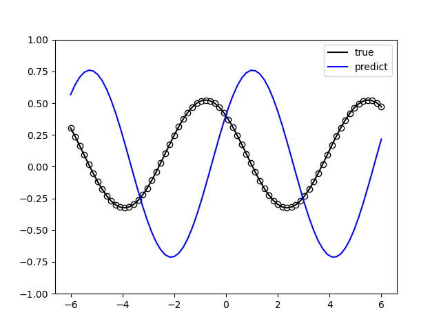

|

制作输入数据,定义串行量子模型,并结合VQNet框架的QuantumLayer层构建训练模型。

.. code-block::

    """
    Quantum Fourier Series Serial
    """
    import numpy as np
    from pyvqnet.nn.module import Module
    from pyvqnet.nn.loss import MeanSquaredError
    from pyvqnet.optim.adam import Adam
    from pyvqnet.tensor.tensor import QTensor
    import pyqpanda as pq
    from pyvqnet.qnn.measure import expval
    from pyvqnet.qnn.quantumlayer import QuantumLayer
    import matplotlib.pyplot as plt
    import matplotlib
    try:
        matplotlib.use("TkAgg")
    except:  
        print("Can not use matplot TkAgg")
        pass

    np.random.seed(42)

    degree = 1  # degree of the target function
    scaling = 1  # scaling of the data
    coeffs = [0.15 + 0.15j]*degree  # coefficients of non-zero frequencies
    coeff0 = 0.1  # coefficient of zero frequency

    def target_function(x):
        """Generate a truncated Fourier series, where the data gets re-scaled."""
        res = coeff0
        for idx, coeff in enumerate(coeffs):
            exponent = np.complex128(scaling * (idx+1) * x * 1j)
            conj_coeff = np.conjugate(coeff)
            res += coeff * np.exp(exponent) + conj_coeff * np.exp(-exponent)
        return np.real(res)

    x = np.linspace(-6, 6, 70)
    target_y = np.array([target_function(xx) for xx in x])

    plt.plot(x, target_y, c='black')
    plt.scatter(x, target_y, facecolor='white', edgecolor='black')
    plt.ylim(-1, 1)
    plt.show()

    def S(x, qubits):
        cir = pq.QCircuit()
        cir.insert(pq.RX(qubits[0], x))
        return cir

    def W(theta, qubits):
        cir = pq.QCircuit()
        cir.insert(pq.RZ(qubits[0], theta[0]))
        cir.insert(pq.RY(qubits[0], theta[1]))
        cir.insert(pq.RZ(qubits[0], theta[2]))
        return cir

    r = 1
    weights = 2 * np.pi * np.random.random(size=(r+1, 3))  # some random initial weights

    x = np.linspace(-6, 6, 70)

    def q_circuits_loop(x, weights, qubits, clist, machine):

        result = []
        for xx in x:
            cir = pq.QCircuit()
            weights = weights.reshape([2, 3])

            for theta in weights[:-1]:
                cir.insert(W(theta, qubits))
                cir.insert(S(xx, qubits))

            cir.insert(W(weights[-1], qubits))
            prog = pq.QProg()
            prog.insert(cir)

            exp_vals = []
            for position in range(1):
                pauli_str = {"Z" + str(position): 1.0}
                exp2 = expval(machine, prog, pauli_str, qubits)
                exp_vals.append(exp2)
                result.append(exp2)
        return result

    class Model(Module):
        def __init__(self):
            super(Model, self).__init__()
            self.q_fourier_series = QuantumLayer(q_circuits_loop, 6, "CPU", 1)

        def forward(self, x):
            return self.q_fourier_series(x)

    def run():
        model = Model()

        optimizer = Adam(model.parameters(), lr=0.5)
        batch_size = 2
        epoch = 5
        loss = MeanSquaredError()
        print("start training..............")
        model.train()
        max_steps = 50
        for i in range(epoch):
            sum_loss = 0
            count = 0
            for step in range(max_steps):
                optimizer.zero_grad()
                # Select batch of data
                batch_index = np.random.randint(0, len(x), (batch_size,))
                x_batch = x[batch_index]
                y_batch = target_y[batch_index]
                data, label = QTensor([x_batch]), QTensor([y_batch])
                result = model(data)
                loss_b = loss(label, result)
                loss_b.backward()
                optimizer._step()
                sum_loss += loss_b.item()
                count += batch_size
            print(f"epoch:{i}, #### loss:{sum_loss/count} ")

            model.eval()
            predictions = []
            for xx in x:
                data = QTensor([[xx]])
                result = model(data)
                predictions.append(result.pdata[0])

            plt.plot(x, target_y, c='black', label="true")
            plt.scatter(x, target_y, facecolor='white', edgecolor='black')
            plt.plot(x, predictions, c='blue', label="predict")
            plt.ylim(-1, 1)
            plt.legend(loc="upper right")
            plt.show()

    if __name__ == "__main__":
        run()

其中量子模型为: 

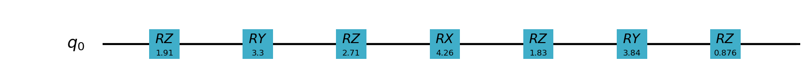

|

网络训练结果为: 

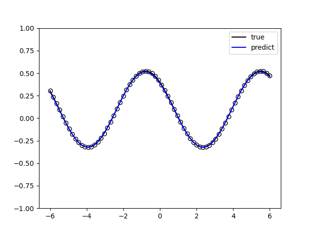

|

网络训练损失为: 

.. code-block::

    start training..............
    epoch:0, #### loss:0.04852807720773853
    epoch:1, #### loss:0.012945819365559146
    epoch:2, #### loss:0.0009359727291666786
    epoch:3, #### loss:0.00015995280153333625
    epoch:4, #### loss:3.988249877352246e-05

1.2用并行Pauli旋转编码拟合傅里叶级数
------------------------------------

根据论文所示,我们期望与串行模型相似的结果: 只有在量子模型中编码门至少有r个重复时,才能拟合r阶的傅立叶级数。量子比特电路: 

.. image:: ./images/parallel_model.png
   :width: 600 px
   :align: center

|

制作输入数据,定义并行量子模型,不进行模型训练结果。

.. code-block::

    """
    Quantum Fourier Series
    """
    import numpy as np
    import pyqpanda as pq
    from pyvqnet.qnn.measure import expval
    import matplotlib.pyplot as plt
    import matplotlib
    try:
        matplotlib.use("TkAgg")
    except:  
        print("Can not use matplot TkAgg")
        pass

    np.random.seed(42)

    degree = 1  # degree of the target function
    scaling = 1  # scaling of the data
    coeffs = [0.15 + 0.15j] * degree  # coefficients of non-zero frequencies
    coeff0 = 0.1  # coefficient of zero frequency

    def target_function(x):
        """Generate a truncated Fourier series, where the data gets re-scaled."""
        res = coeff0
        for idx, coeff in enumerate(coeffs):
            exponent = np.complex128(scaling * (idx + 1) * x * 1j)
            conj_coeff = np.conjugate(coeff)
            res += coeff * np.exp(exponent) + conj_coeff * np.exp(-exponent)
        return np.real(res)

    x = np.linspace(-6, 6, 70)
    target_y = np.array([target_function(xx) for xx in x])

    def S1(x, qubits):
        cir = pq.QCircuit()
        for q in qubits:
            cir.insert(pq.RX(q, x))
        return cir

    def W1(theta, qubits):
        cir = pq.QCircuit()
        for i in range(len(qubits)):
            cir.insert(pq.RZ(qubits[i], theta[0][i][0]))
            cir.insert(pq.RY(qubits[i], theta[0][i][1]))
            cir.insert(pq.RZ(qubits[i], theta[0][i][2]))

        for i in range(len(qubits) - 1):
            cir.insert(pq.CNOT(qubits[i], qubits[i + 1]))
        cir.insert(pq.CNOT(qubits[len(qubits) - 1], qubits[0]))

        for i in range(len(qubits)):
            cir.insert(pq.RZ(qubits[i], theta[1][i][0]))
            cir.insert(pq.RY(qubits[i], theta[1][i][1]))
            cir.insert(pq.RZ(qubits[i], theta[1][i][2]))

        cir.insert(pq.CNOT(qubits[0], qubits[len(qubits) - 1]))
        for i in range(len(qubits) - 1):
            cir.insert(pq.CNOT(qubits[i + 1], qubits[i]))

        for i in range(len(qubits)):
            cir.insert(pq.RZ(qubits[i], theta[2][i][0]))
            cir.insert(pq.RY(qubits[i], theta[2][i][1]))
            cir.insert(pq.RZ(qubits[i], theta[2][i][2]))

        for i in range(len(qubits) - 1):
            cir.insert(pq.CNOT(qubits[i], qubits[i + 1]))
        cir.insert(pq.CNOT(qubits[len(qubits) - 1], qubits[0]))

        return cir

    def parallel_quantum_model(weights, x, num_qubits):
        cir = pq.QCircuit()
        machine = pq.CPUQVM()  
        machine.init_qvm()  
        qubits = machine.qAlloc_many(num_qubits)

        cir.insert(W1(weights[0], qubits))
        cir.insert(S1(x, qubits))

        cir.insert(W1(weights[1], qubits))
        prog = pq.QProg()
        prog.insert(cir)

        exp_vals = []
        for position in range(1):
            pauli_str = {"Z" + str(position): 1.0}
            exp2 = expval(machine, prog, pauli_str, qubits)
            exp_vals.append(exp2)

        return exp_vals

    r = 3

    trainable_block_layers = 3
    weights = 2 * np.pi * np.random.random(size=(2, trainable_block_layers, r, 3))
    # print(weights)
    x = np.linspace(-6, 6, 70)
    random_quantum_model_y = [parallel_quantum_model(weights, xx, r) for xx in x]

    plt.plot(x, target_y, c='black', label="true")
    plt.scatter(x, target_y, facecolor='white', edgecolor='black')
    plt.plot(x, random_quantum_model_y, c='blue', label="predict")
    plt.ylim(-1, 1)
    plt.legend(loc="upper right")
    plt.show()

不训练的量子线路运行结果为: 

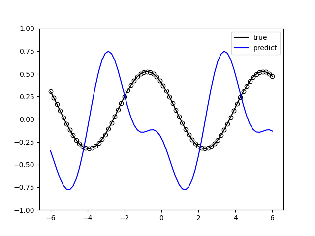

|

制作输入数据,定义并行量子模型,并结合VQNet框架的QuantumLayer层构建训练模型。

.. code-block::

    """
    Quantum Fourier Series
    """
    import numpy as np

    from pyvqnet.nn.module import Module
    from pyvqnet.nn.loss import MeanSquaredError
    from pyvqnet.optim.adam import Adam
    from pyvqnet.tensor.tensor import QTensor
    import pyqpanda as pq
    from pyvqnet.qnn.measure import expval
    from pyvqnet.qnn.quantumlayer import QuantumLayer, QuantumLayerMultiProcess
    import matplotlib.pyplot as plt
    import matplotlib
    try:
        matplotlib.use("TkAgg")
    except:  
        print("Can not use matplot TkAgg")
        pass

    np.random.seed(42)

    degree = 1  # degree of the target function
    scaling = 1  # scaling of the data
    coeffs = [0.15 + 0.15j] * degree  # coefficients of non-zero frequencies
    coeff0 = 0.1  # coefficient of zero frequency

    def target_function(x):
        """Generate a truncated Fourier series, where the data gets re-scaled."""
        res = coeff0
        for idx, coeff in enumerate(coeffs):
            exponent = np.complex128(scaling * (idx + 1) * x * 1j)
            conj_coeff = np.conjugate(coeff)
            res += coeff * np.exp(exponent) + conj_coeff * np.exp(-exponent)
        return np.real(res)

    x = np.linspace(-6, 6, 70)
    target_y = np.array([target_function(xx) for xx in x])

    plt.plot(x, target_y, c='black')
    plt.scatter(x, target_y, facecolor='white', edgecolor='black')
    plt.ylim(-1, 1)
    plt.show()

    def S1(x, qubits):
        cir = pq.QCircuit()
        for q in qubits:
            cir.insert(pq.RX(q, x))
        return cir

    def W1(theta, qubits):
        cir = pq.QCircuit()
        for i in range(len(qubits)):
            cir.insert(pq.RZ(qubits[i], theta[0][i][0]))
            cir.insert(pq.RY(qubits[i], theta[0][i][1]))
            cir.insert(pq.RZ(qubits[i], theta[0][i][2]))

        for i in range(len(qubits) - 1):
            cir.insert(pq.CNOT(qubits[i], qubits[i + 1]))
        cir.insert(pq.CNOT(qubits[len(qubits) - 1], qubits[0]))

        for i in range(len(qubits)):
            cir.insert(pq.RZ(qubits[i], theta[1][i][0]))
            cir.insert(pq.RY(qubits[i], theta[1][i][1]))
            cir.insert(pq.RZ(qubits[i], theta[1][i][2]))

        cir.insert(pq.CNOT(qubits[0], qubits[len(qubits) - 1]))
        for i in range(len(qubits) - 1):
            cir.insert(pq.CNOT(qubits[i + 1], qubits[i]))

        for i in range(len(qubits)):
            cir.insert(pq.RZ(qubits[i], theta[2][i][0]))
            cir.insert(pq.RY(qubits[i], theta[2][i][1]))
            cir.insert(pq.RZ(qubits[i], theta[2][i][2]))

        for i in range(len(qubits) - 1):
            cir.insert(pq.CNOT(qubits[i], qubits[i + 1]))
        cir.insert(pq.CNOT(qubits[len(qubits) - 1], qubits[0]))

        return cir

    def q_circuits_loop(x, weights, qubits, clist, machine):

        result = []
        for xx in x:
            cir = pq.QCircuit()
            weights = weights.reshape([2, 3, 3, 3])

            cir.insert(W1(weights[0], qubits))
            cir.insert(S1(xx, qubits))

            cir.insert(W1(weights[1], qubits))
            prog = pq.QProg()
            prog.insert(cir)

            exp_vals = []
            for position in range(1):
                pauli_str = {"Z" + str(position): 1.0}
                exp2 = expval(machine, prog, pauli_str, qubits)
                exp_vals.append(exp2)
                result.append(exp2)
        return result

    class Model(Module):
        def __init__(self):
            super(Model, self).__init__()

            self.q_fourier_series = QuantumLayer(q_circuits_loop, 2 * 3 * 3 * 3, "CPU", 3)

        def forward(self, x):
            return self.q_fourier_series(x)

    def run():
        model = Model()

        optimizer = Adam(model.parameters(), lr=0.01)
        batch_size = 2
        epoch = 5
        loss = MeanSquaredError()
        print("start training..............")
        model.train()
        max_steps = 50
        for i in range(epoch):
            sum_loss = 0
            count = 0
            for step in range(max_steps):
                optimizer.zero_grad()
                # Select batch of data
                batch_index = np.random.randint(0, len(x), (batch_size,))
                x_batch = x[batch_index]
                y_batch = target_y[batch_index]
                data, label = QTensor([x_batch]), QTensor([y_batch])
                result = model(data)
                loss_b = loss(label, result)
                loss_b.backward()
                optimizer._step()
                sum_loss += loss_b.item()
                count += batch_size

            loss_cout = sum_loss / count
            print(f"epoch:{i}, #### loss:{loss_cout} ")

            if loss_cout < 0.002:
                model.eval()
                predictions = []
                for xx in x:
                    data = QTensor([[xx]])
                    result = model(data)
                    predictions.append(result.pdata[0])

                plt.plot(x, target_y, c='black', label="true")
                plt.scatter(x, target_y, facecolor='white', edgecolor='black')
                plt.plot(x, predictions, c='blue', label="predict")
                plt.ylim(-1, 1)
                plt.legend(loc="upper right")
                plt.show()

    if __name__ == "__main__":
        run()

其中量子模型为: 

.. image:: ./images/parallel_model_circuit.png
   :width: 600 px
   :align: center

|

网络训练结果为: 

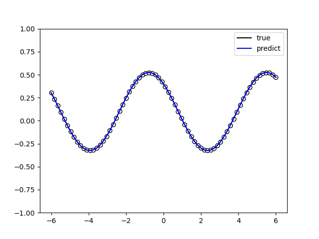

|

网络训练损失为: 

.. code-block::

    start training..............
    epoch:0, #### loss:0.0037272341538482578
    epoch:1, #### loss:5.271130586635309e-05
    epoch:2, #### loss:4.714951917250687e-07
    epoch:3, #### loss:1.0968826371082763e-08
    epoch:4, #### loss:2.1258629738507562e-10

量子线路表达能力
===================================

在论文 `Expressibility and entangling capability of parameterized quantum circuits for hybrid quantum-classical algorithms <https://arxiv.org/abs/1905.10876>`_ 中,
作者提出了基于神经网络输出态之间的保真度概率分布的表达能力量化方法。
对任意量子神经网络 :math:`U(\vec{\theta})` ,采样两次神经网络参数(设为 :math:`\vec{\phi}` 和 :math:`\vec{\psi}` ),
则两个量子电路输出态之间的保真度 :math:`F=|\langle0|U(\vec{\phi})^\dagger U(\vec{\psi})|0\rangle|^2` 服从某个概率分布: 

.. math::

    F\sim{P}(f)

文献指出,量子神经网络 :math:`U` 能够均匀地分布在所有酉矩阵上时(此时称 :math:`U` 服从哈尔分布),保真度的概率分布 :math:`P_\text{Haar}(f)` 满足

.. math::

    P_\text{Haar}(f)=(2^{n}-1)(1-f)^{2^n-2}

统计数学中的 K-L 散度(也称相对熵)可以衡量两个概率分布之间的差异。两个离散概率分布 :math:`P,Q` 之间的 K-L 散度定义为

.. math::

    D_{KL}(P||Q)=\sum_jP(j)\ln\frac{P(j)}{Q(j)}

如果将量子神经网络输出的保真度分布记为 :math:`P_\text{QNN}(f)` ,则量子神经网络的表达能力定义为 :math:`P_\text{QNN}(f)` 和 :math:`P_\text{Haar}(f)` 之间的 K-L 散度 : 

.. math::

    \text{Expr}_\text{QNN}=D_{KL}(P_\text{QNN}(f)||P_\text{Haar}(f))

因此,当 :math:`P_\text{QNN}(f)` 越接近 :math:`P_\text{Haar}(f)` 时, :math:`\text{Expr}` 将越小(越趋近于 0),
量子神经网络的表达能力也就越强；反之, :math:`\text{Expr}` 越大,量子神经网络的表达能力也就越弱。

我们可以根据该定义直接计算单比特量子神经网络 :math:`R_Y(\theta)` , :math:`R_Y(\theta_1)R_Z(\theta_2)` 和 :math:`R_Y(\theta_1)R_Z(\theta_2)R_Y(\theta_3)` 的表达能力: 

以下用VQNet展示了 `HardwareEfficientAnsatz <https://arxiv.org/abs/1704.05018>`_ 在不同深度下(1,2,3)的量子线路表达能力。

.. code-block::

    import numpy as np
    import matplotlib.pyplot as plt
    from matplotlib.ticker import FuncFormatter
    from scipy import integrate
    from scipy.linalg import sqrtm
    from scipy.stats import entropy

    import pyqpanda as pq
    import numpy as np
    from pyvqnet.qnn.ansatz import HardwareEfficientAnsatz
    from pyvqnet.tensor import tensor
    from pyvqnet.qnn.quantum_expressibility.quantum_express import fidelity_of_cir, fidelity_harr_sample
    num_qubit = 1  # the number of qubit
    num_sample = 2000  # the number of sample
    outputs_y = list()  # save QNN outputs

    # plot histgram
    def plot_hist(data, num_bin, title_str):
        def to_percent(y, position):
            return str(np.around(y * 100, decimals=2)) + '%'

        plt.hist(data,
                weights=[1. / len(data)] * len(data),
                bins=np.linspace(0, 1, num=num_bin),
                facecolor="blue",
                edgecolor="black",
                alpha=0.7)
        plt.xlabel("Fidelity")
        plt.ylabel("frequency")
        plt.title(title_str)
        formatter = FuncFormatter(to_percent)
        plt.gca().yaxis.set_major_formatter(formatter)
        plt.show()

    def cir(num_qubits, depth):

        machine = pq.CPUQVM()
        machine.init_qvm()
        qlist = machine.qAlloc_many(num_qubits)
        az = HardwareEfficientAnsatz(num_qubits, ["rx", "RY", "rz"],
                                    qlist,
                                    entangle_gate="cnot",
                                    entangle_rules="linear",
                                    depth=depth)
        w = tensor.QTensor(
            np.random.uniform(size=[az.get_para_num()], low=0, high=2 * np.pi))

        cir1 = az.create_ansatz(w)
        return cir1, machine, qlist

哈尔采样输出的保真度服从分布: 

.. image:: ./images/haar-fidelity.png
   :width: 600 px
   :align: center

|

.. code-block::

    # 设置电路宽度和最大深度
    num_qubit = 4
    max_depth = 3
    # 计算哈尔采样对应的保真度分布

    flist, p_haar, theory_haar = fidelity_harr_sample(num_qubit, num_sample)
    title_str = "haar, %d qubit(s)" % num_qubit
    plot_hist(flist, 50, title_str)

    Expr_cel = list()
    # 计算不同深度的神经网络的表达能力
    for DEPTH in range(1, max_depth + 1):

        f_list, p_cel = fidelity_of_cir(HardwareEfficientAnsatz, num_qubit, DEPTH,
                                        num_sample)
        title_str = f"HardwareEfficientAnsatz, {num_qubit} qubit(s) {DEPTH} layer(s)"
        plot_hist(f_list, 50, title_str)
        expr = entropy(p_cel, theory_haar)
        Expr_cel.append(expr)
    # 比较不同深度的神经网络的表达能力
    print(
        f"深度为 1,2,3 的神经网络的表达能力分别为 { np.around(Expr_cel, decimals=4)} 越小越好。", )
    plt.plot(range(1, max_depth + 1), Expr_cel, marker='>')
    plt.xlabel("depth")
    plt.yscale('log')
    plt.ylabel("Expr.")
    plt.xticks(range(1, max_depth + 1))
    plt.title("Expressibility vs Circuit Depth")
    plt.show()

采样深度为 1 的电路的保真度分布

.. image:: ./images/f1.png
   :width: 600 px
   :align: center

|

采样深度为 2 的电路的保真度分布

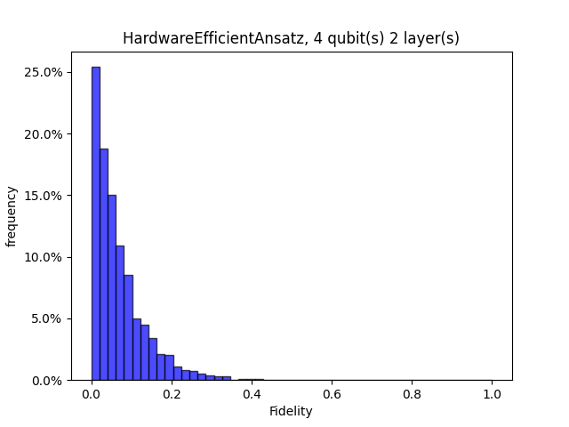

|

采样深度为 3 的电路的保真度分布

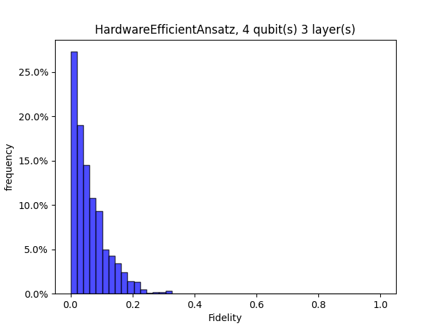

|

可见,随着量子线路深度提升,保真度KL散度越小,表达力越强。

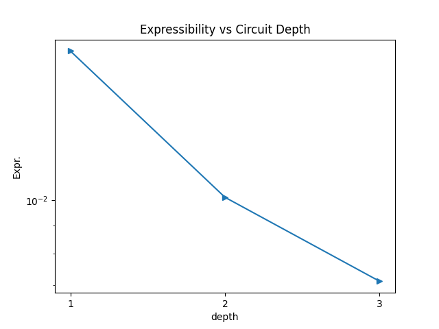

|

贫瘠高原现象
===================================

在经典神经网络的训练中,基于梯度的优化方法不仅会遇到局部极小值的问题,
而且还会遇到梯度接近于零的鞍点等几何结构。
相应的,量子神经网络中也存在 "贫瘠高原效应" 。
这一奇特现象最早由McClean等人在2018年发现 `Barren plateaus in quantum neural network training landscapes <https://arxiv.org/abs/1803.11173>`_。
简单地说,当你选择的随机电路结构满足一定程度的复杂性时,优化曲面会变得非常平坦,
这使得基于梯度下降的优化方法很难找到全局最小值
。对于大多数变分量子算法(VQE等)来说,这种现象意味着当量子位的数量增加时,
具有随机结构的电路可能无法很好地工作。
这将使精心设计的损失函数对应的优化曲面变成一个巨大的平台,
使量子神经网络的训练更加困难。
模型随机找到的初值很难逃离这个平台,梯度下降的收敛速度会非常慢。

本案例主要使用VQNet展示贫瘠高原现象,使用梯度分析函数对用户自定义量子神经网络中的参数梯度进行分析。

以下代码按照原论文中提及的类似方法搭建如下随机电路: 

首先作用在所有量子比特上绕布洛赫球的 Y-轴旋转 :math:`\pi/4` 。

其余的结构加起来构成一个模块(Block), 每个模块共分为两层: 

- 第一层搭建随机的旋转门, 其中 :math:`R \in \{R_x, R_y, R_z\}` 。
- 第二层由 CZ 门组成,作用在每两个相邻的量子比特上。

线路代码如rand_circuit_pq函数所示。

当我们确定了电路的结构之后,我们还需要定义一个损失函数(loss function)来确定优化曲面。
按照原论文中提及的,我们采用 VQE算法中常用的损失函数: 

.. math::

    \mathcal{L}(\boldsymbol{\theta})= \langle0| U^{\dagger}(\boldsymbol{\theta})H U(\boldsymbol{\theta}) |0\rangle

其中的酉矩阵  :math:`U(\boldsymbol{\theta})` 就是我们上一部分搭建的带有随机结构的量子神经网络。
哈密顿量 :math:`H = |00\cdots 0\rangle\langle00\cdots 0|` 。
本案例使用在不同量子比特数上构建如上VQE算法,并生成200组随机网络结构和不同的随机初始参数.
含参线路中参数的梯度按照paramter-shift算法进行计算。
然后统计得到的其中变分参数的200个梯度的平均值和方差。

以下例子对变分量子参数的最后一个进行分析,读者也可自行修改为其他合理的值。
通过运行,读者不难发现,随着量子比特数增加,量子参数的梯度的方差越来越小,均值越来越接近0。

.. code-block::

        """
        贫瘠高原
        """
        import pyqpanda as pq
        import numpy as np
        import matplotlib.pyplot as plt

        from pyvqnet.qnn import Hermitian_expval, grad

        param_idx = -1
        gate_set = [pq.RX, pq.RY, pq.RZ]

        def rand_circuit_pq(params, num_qubits):
            cir = pq.QCircuit()
            machine = pq.CPUQVM()
            machine.init_qvm()
            qlist = machine.qAlloc_many(num_qubits)

            for i in range(num_qubits):
                cir << pq.RY(
                    qlist[i],
                    np.pi / 4,
                )

            random_gate_sequence = {
                i: np.random.choice(gate_set)
                for i in range(num_qubits)
            }
            for i in range(num_qubits):
                cir << random_gate_sequence[i](qlist[i], params[i])

            for i in range(num_qubits - 1):
                cir << pq.CZ(qlist[i], qlist[i + 1])

            prog = pq.QProg()
            prog.insert(cir)
            machine.directly_run(prog)
            result = machine.get_qstate()

            H = np.zeros((2**num_qubits, 2**num_qubits))
            H[0, 0] = 1
            expval = Hermitian_expval(H, result, [i for i in range(num_qubits)],
                                    num_qubits)

            return expval

        qubits = [2, 3, 4, 5, 6]
        variances = []
        num_samples = 200
        means = []
        for num_qubits in qubits:
            grad_vals = []
            for i in range(num_samples):
                params = np.random.uniform(0, np.pi, size=num_qubits)
                g = grad(rand_circuit_pq, params, num_qubits)

                grad_vals.append(g[-1])
            variances.append(np.var(grad_vals))
            means.append(np.mean(grad_vals))
        variances = np.array(variances)
        means = np.array(means)
        qubits = np.array(qubits)

        plt.figure()

        plt.plot(qubits, variances, "v-")

        plt.xlabel(r"N Qubits")
        plt.ylabel(r"variance")
        plt.show()

        plt.figure()

        plt.plot(qubits, means, "v-")

        plt.xlabel(r"N Qubits")
        plt.ylabel(r"means")

        plt.show()

下图显示了参数梯度的均值随着量子比特数变化的情况,随着量子比特数增加,参数梯度趋近0。

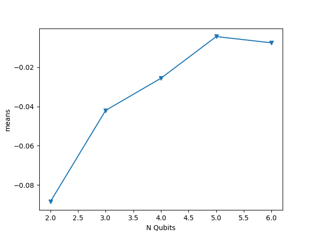

|

下图显示了参数梯度的方差随着量子比特数变化的情况,随着量子比特数增加,参数梯度几乎不变化。
可以预见,任意含参逻辑门搭建的量子线路随着量子比特提升,在任意参数初始化情况下,参数训练容易陷入难以更新的情况。

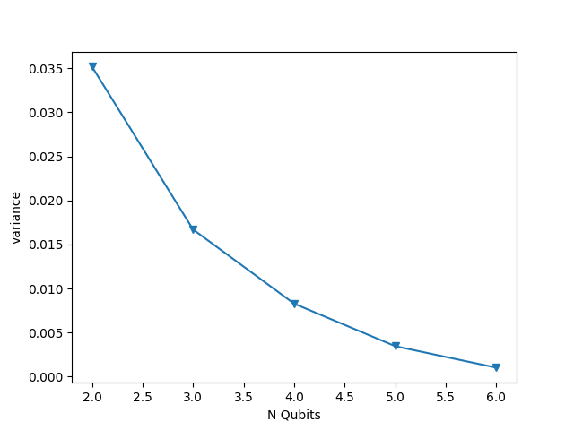

|

量子感知机
===================================

人工神经网络是机器学习算法和人工智能的一种经典方法。从历史上看,人工神经元的最简单实现可以追溯到经典Rosenblatt 的“感知器”,但其长期实际应用可能会受到计算复杂度快速扩展的阻碍,尤其是与多层感知器的训练相关网络。这里我们参照论文 `An Artificial Neuron Implemented on an Actual Quantum Processor <https://arxiv.org/abs/1811.02266>`__ 一种基于量子信息的算法实现量子计算机版本的感知器,在编码资源方面显示出相比经典模型指数优势。

对于该量子感知机,处理的数据是 0 1 二进制比特字符串。其目标是想识别形如下图 :math:`w` 十字形状的模式。

.. image:: ./images/QP-data.png
   :width: 600 px
   :align: center

|

使用二进制比特字符串对其进行编码,其中黑为0,白为1,可知 :math:`w` 编码为(1,1,1,1,1,1,0,1,1,0,0,0,1,1,0,1)。共16位的字符串正好可以编码进4bit的量子态的振幅的符号上,符号为负数编码为0,符号为正数编码为1。通过以上编码方式,我们算法输入input转化为16位的二进制串。这样的不重复的二进制串可以分别对应特定的输入线路 :math:`U_i` 。
 
该论文提出的量子感知机线路结构如下: 

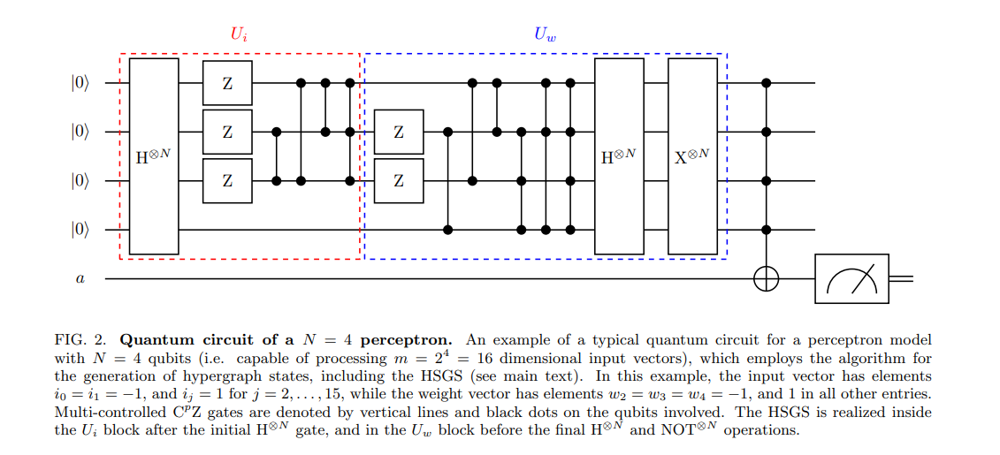

|

在比特0~3上构建编码线路 :math:`U_i` ,包含多受控的 :math:`CZ` 门, :math:`CNOT` 门, :math:`H` 门；在 :math:`U_i` 后面紧接着构建权重变换线路 :math:`U_w` ,同样由受控门以及 :math:`H` 门构成。使用 :math:`U_i` 可以进行酉矩阵变化,将数据编码到量子态上: 

.. math::
    U_i|0\rangle^{\otimes N}=\left|\psi_i\right\rangle

使用酉矩阵变换 :math:`U_w` 来计算输入和权重之间的内积: 

.. math::
    U_w\left|\psi_i\right\rangle=\sum_{j=0}^{m-1} c_j|j\rangle \equiv\left|\phi_{i, w}\right\rangle

使用一个目标比特在辅助比特上的多受控 :math:`NOT` 门,并使用一些后续的 :math:`H` 门, :math:`X` 门,:math:`CX` 门作为激活函数可以获取 :math:`U_i` 和 :math:`U_w` 的归一化激活概率值: 

.. math::
    \left|\phi_{i, w}\right\rangle|0\rangle_a \rightarrow \sum_{j=0}^{m-2} c_j|j\rangle|0\rangle_a+c_{m-1}|m-1\rangle|1\rangle_a

当输入 :math:`i` 的2进制串和 :math:`w` 完全一致时,该归一化概率值应为最大。

VQNet提供了 ``QuantumNeuron`` 模块实现该算法。首先初始化一个量子感知机 ``QuantumNeuron``。

.. code-block::

    perceptron = QuantumNeuron()

使用 ``gen_4bitstring_data`` 接口生成论文中的各种数据以及其类别标签。

.. code-block::

    training_label, test_label = perceptron.gen_4bitstring_data()

使用 ``train`` 接口遍历所有数据,可以获取最后训练好的量子感知器线路Uw。

.. code-block::

    trained_para = perceptron.train(training_label, test_label)

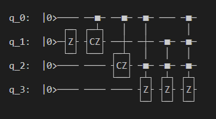

|

在测试数据上,可以获取测试数据上的准确率结果

.. image:: ./images/QP-acc.png
   :width: 600 px
   :align: center

|

随机参数偏移算法
===================================

在量子变分线路中,使用参数偏移法 `parameter-shift` 计算量子参数的梯度是一种常用的方法。
参数偏移法并不普遍适用所有的量子含参逻辑门。
在它不成立(或不知道成立)的情况下,我们要么必须将门分解为兼容的门,要么使用梯度的替代估计器,例如有限差分近似。
但是,由于增加了电路复杂性或梯度值中的潜在误差,这两种替代方案都可能存在缺陷。
Banchi 和 Crooks 1 发现一种可以适用在任一酉矩阵量子逻辑门上的 `随机参数偏移算法(Stochastic Parameter-Shift Rule) <https://arxiv.org/abs/2005.10299>`_ 。

下面展示适用VQNet对一个量子变分线路使用随机参数偏移法计算梯度的示例。其中, **pyqpanda建议版本为3.7.12** 。示例线路定义如下: 

.. code-block::

    import pyqpanda as pq
    import numpy as np
    from pyvqnet.qnn.measure import expval
    from scipy.linalg import expm
    import matplotlib
    try:
        matplotlib.use('TkAgg')
    except:
        pass
    import matplotlib.pyplot as plt

    machine = pq.init_quantum_machine(pq.QMachineType.CPU)
    q = machine.qAlloc_many(2)
    c = machine.cAlloc_many(2)

    # some basic Pauli matrices
    I = np.eye(2)
    X = np.array([[0, 1], [1, 0]])
    Z = np.array([[1, 0], [0, -1]])

    def Generator(theta1, theta2, theta3):
        G = theta1.item() * np.kron(X, I) - \
            theta2 * np.kron(Z, X) + \
            theta3 * np.kron(I, X)
        return G

    def pq_demo_circuit(gate_pars):
        G = Generator(*gate_pars)
        G = expm(-1j * G)
        x = G.flatten().tolist()

        cir = pq.matrix_decompose(q, x)
        m_prog = pq.QProg()
        m_prog.insert(cir)
        pauli_dict = {'Z0': 1}
        exp2 = expval(machine, m_prog, pauli_dict, q)
        return exp2

随机参数偏移法首先随机从[0,1]的均匀分布中采样一个变量s,接着对线路分别进行如下的酉矩阵变换: 

     a) :math:`e^{i(1-s)(\hat{H} + \theta\hat{V})}`
     b) :math:`e^{+i\tfrac{\pi}{4}\hat{V}}`
     c) :math:`e^{is(\hat{H} + \theta\hat{V})}`

其中 :math:`\hat{V}` 是一个泡利算符的张量积, :math:`\hat{H}` 是任意泡利算符张量积的线性组合。
此时获取的观测量的期望值我们定义为 :math:`\langle r_+ \rangle` 。

.. code-block::

    def pq_SPSRgates(gate_pars, s, sign):
        G = Generator(*gate_pars)
        # step a)
        G1 = expm(1j * (1 - s) * G)
        x = G1.flatten().tolist()

        cir = pq.matrix_decompose(q, x)
        m_prog = pq.QProg()
        m_prog.insert(cir)

        # step b)
        G2 = expm(1j * sign * np.pi / 4 * X)
        x = G2.flatten().tolist()
        cir = pq.matrix_decompose(q[0], x)
        m_prog.insert(cir)

        # step c)
        G3 = expm(1j * s * G)
        x = G3.flatten().tolist()
        cir = pq.matrix_decompose(q, x)
        m_prog.insert(cir)
        pauli_dict = {'Z0': 1}
        exp2 = expval(machine, m_prog, pauli_dict, q)
        return exp2

将上一步骤中 :math:`\tfrac{\pi}{4}` 变成  :math:`-\tfrac{\pi}{4}`,
重复进行 a, b, c 操作,获取观测量的期望 :math:`\langle r_- \rangle` 。

随机参数偏移算法计算的梯度公式如下: 

 .. math::

     \mathbb{E}_{s\in\mathcal{U}[0,1]}[\langle r_+ \rangle - \langle r_-\rangle]

我们画出使用随机参数偏移法计算的参数 :math:`\theta_1` 梯度与观测量期望的之间的关系。
通过观察可见,观测量期望符合 :math:`\cos(2\theta_1)` 的函数形式；而使用随机参数偏移法计算梯度
符合 :math:`-2\sin(2\theta_1)` , 正好是 :math:`\cos(2\theta_1)` 的微分。

.. code-block::

    theta2, theta3 = -0.15, 1.6
    angles = np.linspace(0, 2 * np.pi, 50)
    pos_vals = np.array([[
        pq_SPSRgates([theta1, theta2, theta3], s=s, sign=+1)
        for s in np.random.uniform(size=10)
    ] for theta1 in angles])
    neg_vals = np.array([[
        pq_SPSRgates([theta1, theta2, theta3], s=s, sign=-1)
        for s in np.random.uniform(size=10)
    ] for theta1 in angles])

    # Plot the results
    evals = [pq_demo_circuit([theta1, theta2, theta3]) for theta1 in angles]
    spsr_vals = (pos_vals - neg_vals).mean(axis=1)
    plt.plot(angles, evals, 'b', label="Expectation Value")
    plt.plot(angles, spsr_vals, 'r', label="Stochastic parameter-shift rule")
    plt.xlabel("theta1")
    plt.legend()
    plt.title("VQNet")
    plt.show()

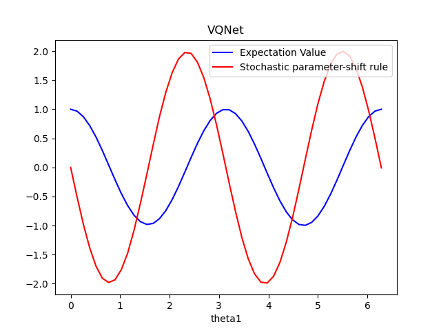

|

双随机梯度下降
===================================

在变分量子算法中,参数化量子电路通过经典梯度下降法进行优化,以最小化期望函数值。
虽然可以在经典模拟中分析计算期望值,在量子硬件上,程序仅限于从期望值中采样；随着样本数量以及shots次数的增加,这种方式获得的期望值会收敛于理论期望值,但可能永远得到准确值。
Sweke 等人 在 `论文 <https://arxiv.org/abs/1910.01155>`_ 中发现了一种双随机梯度下降法。
在本文中,他们证明了使用有限数量的测量样本(或shots)来估计梯度的量子梯度下降是随机梯度下降的一种形式。
此外,如果优化涉及期望值的线性组合(例如 VQE),从该线性组合中的项中抽样可以进一步减少所需的时间复杂度。

VQNet实现了该算法的一个示例: 使用VQE 求解目标Hamiltonian的基态能量。注意此处我们设置量子线路观测的次数shots仅为1次。

.. math::

    H = \begin{bmatrix}
          8 & 4 & 0 & -6\\
          4 & 0 & 4 & 0\\
          0 & 4 & 8 & 0\\
          -6 & 0 & 0 & 0
        \end{bmatrix}.

.. code-block::

    import numpy as np
    import pyqpanda as pq
    from pyvqnet.qnn.template import StronglyEntanglingTemplate
    from pyvqnet.qnn.measure import Hermitian_expval
    from pyvqnet.qnn import QpandaQCircuitVQCLayerLite
    from pyvqnet.optim import SGD
    import pyvqnet._core as _core
    from pyvqnet.tensor import QTensor
    from matplotlib import pyplot as plt

    num_layers = 2
    num_wires = 2
    eta = 0.01
    steps = 200
    n = 1
    param_shape = [2, 2, 3]
    shots = 1

    H = np.array([[8, 4, 0, -6], [4, 0, 4, 0], [0, 4, 8, 0], [-6, 0, 0, 0]])

    # some basic Pauli matrices
    I = np.eye(2)
    X = np.array([[0, 1], [1, 0]])
    Y = np.array([[0, -1j], [1j, 0]])
    Z = np.array([[1, 0], [0, -1]])

    init_params = np.random.uniform(low=0,
                                    high=2 * np.pi,
                                    size=param_shape).astype(np.float32)

    def pq_circuit(params):
        params = params.reshape(param_shape)
        num_qubits = 2

        machine = pq.CPUQVM()
        machine.init_qvm()
        qubits = machine.qAlloc_many(num_qubits)
        circuit = StronglyEntanglingTemplate(params, num_qubits=num_qubits)
        qcir = circuit.create_circuit(qubits)
        prog = pq.QProg()
        prog.insert(qcir)
        machine.directly_run(prog)
        result = machine.get_qstate()
        return result

该示例中的哈密顿量是厄密特矩阵,我们总是可以将其表示为泡利矩阵的总和。

.. math::

    H = \sum_{i,j=0,1,2,3} a_{i,j} (\sigma_i\otimes \sigma_j),

其中

.. math::

    a_{i,j} = \frac{1}{4}\text{tr}[(\sigma_i\otimes \sigma_j )H], ~~ \sigma = \{I, X, Y, Z\}.

代入以上公式,可见

.. math::

    H = 4  + 2I\otimes X + 4I \otimes Z - X\otimes X + 5 Y\otimes Y + 2Z\otimes X.

为了执行“双随机”梯度下降,我们简单地应用随机梯度下降方法,但另外也均匀采样每个优化步骤的哈密顿期望项的子集。
vqe_func_analytic()函数是使用参数偏移计算理论梯度,vqe_func_shots()则是使用随机采样值以及随机采样哈密顿期望子集的“双随机”梯度计算。

.. code-block::

    terms = np.array([
        2 * np.kron(I, X),
        4 * np.kron(I, Z),
        -np.kron(X, X),
        5 * np.kron(Y, Y),
        2 * np.kron(Z, X),
    ])

    def vqe_func_analytic(input, init_params):
        qstate = pq_circuit(init_params)
        expval = Hermitian_expval(H, qstate, [0, 1], 2)
        return  expval

    def vqe_func_shots(input, init_params):
        qstate = pq_circuit(init_params)
        idx = np.random.choice(np.arange(5), size=n, replace=False)
        A = np.sum(terms[idx], axis=0)
        expval = Hermitian_expval(A, qstate, [0, 1], 2, shots)
        return 4 + (5 / 1) * expval

使用VQNet进行参数优化,对比损失函数的曲线,由于双随机梯度下降法每次仅计算H的部分泡利算符和,
故使用其平均值才能代表最终观测量的期望结果,这里使用滑动平均moving_average()进行计算。

.. code-block::

    ##############################################################################
    # Optimizing the circuit using gradient descent via the parameter-shift rule:
    qlayer_ana = QpandaQCircuitVQCLayerLite(vqe_func_analytic, 2*2*3 )
    qlayer_shots = QpandaQCircuitVQCLayerLite(vqe_func_shots, 2*2*3 )
    cost_sgd = []
    cost_dsgd = []
    temp = _core.Tensor(init_params)
    _core.vqnet.copyTensor(temp, qlayer_ana.m_para.data)
    opti_ana = SGD(qlayer_ana.parameters())

    _core.vqnet.copyTensor(temp, qlayer_shots.m_para.data)
    opti_shots = SGD(qlayer_shots.parameters())

    for i in range(steps):
        opti_ana.zero_grad()
        loss = qlayer_ana(QTensor([[1.0]]))

        loss.backward()
        cost_sgd.append(loss.item())
        opti_ana._step()

    for i in range(steps+50):
        opti_shots.zero_grad()
        loss = qlayer_shots(QTensor([[1.0]]))

        loss.backward()
        cost_dsgd.append(loss.item())
        opti_shots._step()

    def moving_average(data, n=3):
        ret = np.cumsum(data, dtype=np.float64)
        ret[n:] = ret[n:] - ret[:-n]
        return ret[n - 1:] / n
    ta = moving_average(np.array(cost_dsgd), n=50)
    ta = ta[:-26]
    average = np.vstack([np.arange(25, 200),ta ])
    final_param = qlayer_shots.parameters()[0].to_numpy()
    print("Doubly stochastic gradient descent min energy = ", vqe_func_analytic(QTensor([1]),final_param))
    final_param  = qlayer_ana.parameters()[0].to_numpy()
    print("stochastic gradient descent min energy = ", vqe_func_analytic(QTensor([1]),final_param))

    plt.plot(cost_sgd, label="Vanilla gradient descent")
    plt.plot(cost_dsgd, ".", label="Doubly QSGD")
    plt.plot(average[0], average[1], "--", label="Doubly QSGD (moving average)")

    plt.ylabel("Cost function value")
    plt.xlabel("Optimization steps")
    plt.xlim(-2, 200)
    plt.legend()
    plt.show()

    #Doubly stochastic gradient descent min energy =  -4.337801834749975
    #stochastic gradient descent min energy =  -4.531484333030544

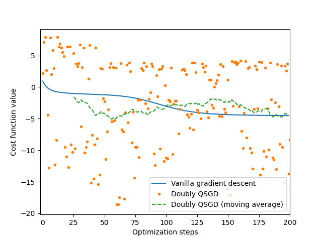

|

基于梯度的剪枝
===================================

下面的例子实现了论文 `Towards Efficient On-Chip Training of Quantum Neural Networks <https://openreview.net/forum?id=vKefw-zKOft>`_ 中的算法。
通过仔细研究量子变分线路中参数的过程,作者观察到小梯度在量子噪声下往往具有较大的相对变化甚至错误的方向。
此外,并非所有梯度计算对于训练过程都是必需的,尤其是对于小幅度梯度。
受此启发,作者提出了一种概率梯度修剪方法来预测并仅计算高可靠性的梯度。
该方法可以减少噪声影响,还可以节省在真实量子机器上运行所需的电路数量。

在gradient based pruning算法中,对于参数的优化过程,划分了积累窗口和修剪窗口两个阶段,所有训练时期分成一个重复的累积窗口,然后是一个修剪窗口。 概率梯度修剪方法中有三个重要的超参数: 

    * 累积窗口宽度 :math:`\omega_a` ,
    * 修剪比例 :math:`r` ,
    * 修剪窗口宽度 :math:`\omega_p` .

在累积窗口中,算法收集每个训练步骤中的梯度信息。 在修剪窗口的每一步中,算法根据从累积窗口和修剪比率收集的信息,
概率地免除一些梯度的计算。

.. image:: ./images/gbp_arch.png
   :width: 600 px
   :align: center

|

剪枝比例 :math:`r` ,累积窗口宽度 :math:`\omega_a` 和剪枝窗口宽度 :math:`\omega_p` 分别决定了梯度趋势评估的可靠性。
因此,我们的概率梯度修剪方法节省的时间百分比是 :math:`r\tfrac{\omega_p}{\omega_a +\omega_p}\times 100\%`。
以下是运用梯度剪枝方法在QVC分类任务的示例。

.. code-block::

    import random
    import numpy as np
    import pyqpanda as pq
    
    from pyvqnet.data import data_generator as dataloader
    from pyvqnet.nn.module import Module
    from pyvqnet.optim import sgd
    from pyvqnet.qnn.quantumlayer import QuantumLayer
    from pyvqnet.nn.loss import CategoricalCrossEntropy
    from pyvqnet.tensor.tensor import QTensor
    from pyvqnet.qnn import Gradient_Prune_Instance
    random.seed(1234)

    qvc_train_data = [
        0, 1, 0, 0, 1, 0, 1, 0, 1, 0, 0, 1, 1, 0, 0, 0, 1, 1, 1, 1, 1, 0, 0, 0, 1,
        1, 0, 0, 1, 0, 1, 0, 1, 0, 0, 1, 0, 1, 1, 1, 1, 1, 0, 0, 0, 1, 1, 0, 1, 1,
        1, 1, 1, 0, 1, 1, 1, 1, 1, 0
    ]
    qvc_test_data = [0, 0, 0, 0, 0, 0, 0, 0, 1, 1, 0, 0, 1, 0, 1, 0, 0, 1, 1, 0]

    def qvc_circuits(x, weights, qlist, clist, machine):
        """
        Quantum circuits run function
        """
        def get_cnot(nqubits):
            cir = pq.QCircuit()
            for i in range(len(nqubits) - 1):
                cir.insert(pq.CNOT(nqubits[i], nqubits[i + 1]))
            cir.insert(pq.CNOT(nqubits[len(nqubits) - 1], nqubits[0]))
            return cir

        def build_circult(weights, xx, nqubits):
            def Rot(weights_j, qubits):
                circult = pq.QCircuit()
                circult.insert(pq.RZ(qubits, weights_j[0]))
                circult.insert(pq.RY(qubits, weights_j[1]))
                circult.insert(pq.RZ(qubits, weights_j[2]))
                return circult

            def basisstate():
                circult = pq.QCircuit()
                for i in range(len(nqubits)):
                    if xx[i] == 1:
                        circult.insert(pq.X(nqubits[i]))
                return circult

            circult = pq.QCircuit()
            circult.insert(basisstate())

            for i in range(weights.shape[0]):

                weights_i = weights[i, :, :]
                for j in range(len(nqubits)):
                    weights_j = weights_i[j]
                    circult.insert(Rot(weights_j, nqubits[j]))
                cnots = get_cnot(nqubits)
                circult.insert(cnots)

            circult.insert(pq.Z(nqubits[0]))

            prog = pq.QProg()

            prog.insert(circult)
            return prog

        weights = weights.reshape([2, 4, 3])
        prog = build_circult(weights, x, qlist)
        prob = machine.prob_run_dict(prog, qlist[0], -1)
        prob = list(prob.values())

        return prob

    def qvc_circuits2(x, weights, qlist, clist, machine):
        """
        Quantum circuits run function
        """
        prog = pq.QProg()
        circult = pq.QCircuit()
        circult.insert(pq.RZ(qlist[0], x[0]))
        circult.insert(pq.RZ(qlist[1], x[1]))
        circult.insert(pq.CNOT(qlist[0], qlist[1]))
        circult.insert(pq.CNOT(qlist[1], qlist[2]))
        circult.insert(pq.CNOT(qlist[2], qlist[3]))
        circult.insert(pq.RY(qlist[0], weights[0]))
        circult.insert(pq.RY(qlist[1], weights[1]))
        circult.insert(pq.RY(qlist[2], weights[2]))

        circult.insert(pq.CNOT(qlist[0], qlist[1]))
        circult.insert(pq.CNOT(qlist[1], qlist[2]))
        circult.insert(pq.CNOT(qlist[2], qlist[3]))
        prog.insert(circult)
        prob = machine.prob_run_dict(prog, qlist[0], -1)
        prob = list(prob.values())

        return prob

    class Model(Module):
        def __init__(self):
            super(Model, self).__init__()
            self.qvc = QuantumLayer(qvc_circuits, 24, "cpu", 4)

        def forward(self, x):
            y = self.qvc(x)
            #y = self.qvc2(y)
            return y

    def get_data(dataset_str):
        """
        Tranform data to valid form
        """
        if dataset_str == "train":
            datasets = np.array(qvc_train_data)

        else:
            datasets = np.array(qvc_test_data)

        datasets = datasets.reshape([-1, 5])
        data = datasets[:, :-1]
        label = datasets[:, -1].astype(int)
        label = np.eye(2)[label].reshape(-1, 2)
        return data, label

    def get_accuary(result, label):
        result, label = np.array(result.data), np.array(label.data)
        score = np.sum(np.argmax(result, axis=1) == np.argmax(label, 1))
        return score

我们使用 ``Gradient_Prune_Instance`` 类,
输入24为当前模型的参数个数。裁剪比例 `prune_ratio` 输入为0.5,
累计窗口大小 `accumulation_window_size` 为4,
剪枝窗口 `pruning_window_size` 为2。
当每次运行反向传播部分代码,在优化器 ``step`` 之前,
运行 ``Gradient_Prune_Instance`` 的 ``step`` 函数。

.. code-block::

    def run():
        """
        Main run function
        """
        model = Model()

        optimizer = sgd.SGD(model.parameters(), lr=0.5)
        batch_size = 3
        epoch = 10
        loss = CategoricalCrossEntropy()
        print("start training..............")
        model.train()

        datas, labels = get_data("train")
        print(datas)
        print(labels)
        print(datas.shape)

        GBP_HELPER = Gradient_Prune_Instance(param_num = 24,prune_ratio=0.5,accumulation_window_size=4,pruning_window_size=2)
        for i in range(epoch):
            count = 0
            sum_loss = 0
            accuary = 0
            t = 0
            for data, label in dataloader(datas, labels, batch_size, False):
                optimizer.zero_grad()
                data, label = QTensor(data), QTensor(label)

                result = model(data)

                loss_b = loss(label, result)

                loss_b.backward()
                
                GBP_HELPER.step(model.parameters())
                optimizer._step()
                sum_loss += loss_b.item()
                count += batch_size
                accuary += get_accuary(result, label)
                t = t + 1

            print(
                f"epoch:{i}, #### loss:{sum_loss/count} #####accuray:{accuary/count}"
            )
        print("start testing..............")
        model.eval()
        count = 0

        test_data, test_label = get_data("test")
        test_batch_size = 1
        accuary = 0
        sum_loss = 0
        for testd, testl in dataloader(test_data, test_label, test_batch_size):
            testd = QTensor(testd)
            test_result = model(testd)
            test_loss = loss(testl, test_result)
            sum_loss += test_loss
            count += test_batch_size
            accuary += get_accuary(test_result, testl)
        print(
            f"test:--------------->loss:{sum_loss/count} #####accuray:{accuary/count}"
        )

    if __name__ == "__main__":

        run()

    # epoch:0, #### loss:0.2255942871173223 #####accuray:0.5833333333333334
    # epoch:1, #### loss:0.1989427705605825 #####accuray:1.0
    # epoch:2, #### loss:0.16489211718241373 #####accuray:1.0
    # epoch:3, #### loss:0.13245886812607446 #####accuray:1.0
    # epoch:4, #### loss:0.11463981121778488 #####accuray:1.0
    # epoch:5, #### loss:0.1078591321905454 #####accuray:1.0
    # epoch:6, #### loss:0.10561319688955943 #####accuray:1.0
    # epoch:7, #### loss:0.10483601937691371 #####accuray:1.0
    # epoch:8, #### loss:0.10457512239615123 #####accuray:1.0
    # epoch:9, #### loss:0.10448987782001495 #####accuray:1.0
    # start testing..............
    # test:--------------->loss:[0.3134713] #####accuray:1.0

在VQNet使用量子计算层进行模型训练
***************************************

以下是使用 ``QuantumLayer``, ``NoiseQuantumLayer``,  等VQNet接口实现量子机器学习的例子。

在VQNet中使用QuantumLayer进行模型训练
=========================================

.. code-block::

    from pyvqnet.nn.module import Module
    from pyvqnet.optim import sgd
    import numpy as np
    import os
    from pyvqnet.data import data_generator as dataloader
    from pyvqnet.nn.loss import CategoricalCrossEntropy

    from pyvqnet.tensor.tensor import QTensor
    import random
    import pyqpanda as pq
    from pyvqnet.qnn.quantumlayer import QuantumLayer
    from pyqpanda import *
    random.seed(1234)

    qvc_train_data = [0,1,0,0,1,
    0, 1, 0, 1, 0,
    0, 1, 1, 0, 0,
    0, 1, 1, 1, 1,
    1, 0, 0, 0, 1,
    1, 0, 0, 1, 0,
    1, 0, 1, 0, 0,
    1, 0, 1, 1, 1,
    1, 1, 0, 0, 0,
    1, 1, 0, 1, 1,
    1, 1, 1, 0, 1,
    1, 1, 1, 1, 0]
    qvc_test_data= [0, 0, 0, 0, 0,
    0, 0, 0, 1, 1,
    0, 0, 1, 0, 1,
    0, 0, 1, 1, 0]

    def qvc_circuits(input,weights,qlist,clist,machine):

        def get_cnot(nqubits):
            cir = pq.QCircuit()
            for i in range(len(nqubits)-1):
                cir.insert(pq.CNOT(nqubits[i],nqubits[i+1]))
            cir.insert(pq.CNOT(nqubits[len(nqubits)-1],nqubits[0]))
            return cir

        def build_circult(weights, xx, nqubits):
            
            def Rot(weights_j, qubits):
                circult = pq.QCircuit()
                circult.insert(pq.RZ(qubits, weights_j[0]))
                circult.insert(pq.RY(qubits, weights_j[1]))
                circult.insert(pq.RZ(qubits, weights_j[2]))
                return circult
            def basisstate():
                circult = pq.QCircuit()
                for i in range(len(nqubits)):
                    if xx[i]==1:
                        circult.insert(pq.X(nqubits[i]))
                return circult

            circult = pq.QCircuit()
            circult.insert(basisstate())

            for i in range(weights.shape[0]):
                
                weights_i = weights[i,:,:]
                for j in range(len(nqubits)):
                    weights_j = weights_i[j]
                    circult.insert(Rot(weights_j,nqubits[j]))
                cnots = get_cnot(nqubits)  
                circult.insert(cnots) 

            circult.insert(pq.Z(nqubits[0]))
            
            prog = pq.QProg() 
            
            prog.insert(circult)
            return prog

        weights = weights.reshape([2,4,3])
        prog = build_circult(weights,input,qlist)  
        prob = machine.prob_run_dict(prog, qlist[0], -1)
        prob = list(prob.values())

        return prob

    class Model(Module):
        def __init__(self):
            super(Model, self).__init__()
            self.qvc = QuantumLayer(qvc_circuits,24,"cpu",4)

        def forward(self, x):
            return self.qvc(x)

    def get_data(dataset_str):
        if dataset_str == "train":
            datasets = np.array(qvc_train_data)

        else:
            datasets = np.array(qvc_test_data)

        datasets = datasets.reshape([-1,5])
        data = datasets[:,:-1]
        label = datasets[:,-1].astype(int)
        label = np.eye(2)[label].reshape(-1,2)
        return data, label

    def get_accuary(result,label):
        result,label = np.array(result.data), np.array(label.data)
        score = np.sum(np.argmax(result,axis=1)==np.argmax(label,1))
        return score

    def Run():

        model = Model()

        optimizer = sgd.SGD(model.parameters(),lr =0.5)
        batch_size = 3
        epoch = 10
        loss = CategoricalCrossEntropy()
        print("start training..............")
        model.train()

        datas,labels = get_data("train")
        print(datas)
        print(labels)
        print(datas.shape)
        for i in range(epoch):
            count=0
            sum_loss = 0
            accuary = 0
            t = 0
            for data,label in dataloader(datas,labels,batch_size,False):
                optimizer.zero_grad()
                data,label = QTensor(data), QTensor(label)

                result = model(data)

                loss_b = loss(label,result)
                loss_b.backward()
                optimizer._step()
                sum_loss += loss_b.item()
                count+=batch_size
                accuary += get_accuary(result,label)
                t = t + 1

            print(f"epoch:{i}, #### loss:{sum_loss/count} #####accuray:{accuary/count}")
        print("start testing..............")
        model.eval()
        count = 0
        test_data, test_label = get_data("test")
        test_batch_size = 1
        accuary = 0
        sum_loss = 0
        for testd,testl in dataloader(test_data,test_label,test_batch_size):
            testd = QTensor(testd)
            test_result = model(testd)
            test_loss = loss(testl,test_result)
            sum_loss += test_loss
            count+=test_batch_size
            accuary += get_accuary(test_result,testl)
        print(f"test:--------------->loss:{sum_loss/count} #####accuray:{accuary/count}")

    if __name__=="__main__":

        Run()

运行的loss以及accuracy结果: 

.. code-block::
	
	start training..............
	epoch:0, #### loss:[0.20585182] #####accuray:0.6
	epoch:1, #### loss:[0.17479989] #####accuray:1.0
	epoch:2, #### loss:[0.12679021] #####accuray:1.0
	epoch:3, #### loss:[0.11088503] #####accuray:1.0
	epoch:4, #### loss:[0.10598478] #####accuray:1.0
	epoch:5, #### loss:[0.10482856] #####accuray:1.0
	epoch:6, #### loss:[0.10453037] #####accuray:1.0
	epoch:7, #### loss:[0.10445572] #####accuray:1.0
	epoch:8, #### loss:[0.10442699] #####accuray:1.0
	epoch:9, #### loss:[0.10442187] #####accuray:1.0
	epoch:10, #### loss:[0.10442089] #####accuray:1.0
	epoch:11, #### loss:[0.10442062] #####accuray:1.0
	epoch:12, #### loss:[0.10442055] #####accuray:1.0
	epoch:13, #### loss:[0.10442055] #####accuray:1.0
	epoch:14, #### loss:[0.10442055] #####accuray:1.0
	epoch:15, #### loss:[0.10442055] #####accuray:1.0
	epoch:16, #### loss:[0.10442055] #####accuray:1.0

	start testing..............
	[0.3132616580]
	test:--------------->loss:QTensor(0.3132616580, requires_grad=True) #####accuray:1.0

在VQNet中使用NoiseQuantumLayer进行模型训练
=============================================

使用 ``NoiseQuantumLayer`` 可以使用QPanda的噪声虚拟机构建含噪量子线路,并进行训练。

一个完整的含噪模型量子机器学习模型的例子如下: 

.. code-block::

    import os
    import numpy as np

    from pyvqnet.nn.module import Module
    from pyvqnet.nn.linear import Linear
    from pyvqnet.nn.conv import Conv2D

    from pyvqnet.nn import activation as F
    from pyvqnet.nn.pooling import MaxPool2D
    from pyvqnet.nn.loss import CategoricalCrossEntropy
    from pyvqnet.optim.adam import Adam
    from pyvqnet.data.data import data_generator
    from pyvqnet.tensor import tensor

    import pyqpanda as pq
    from pyqpanda import *
    from pyvqnet.qnn.quantumlayer import NoiseQuantumLayer
    import matplotlib
    try:
        matplotlib.use('TkAgg')
    except:
        pass
    import time
    try:
        matplotlib.use('TkAgg')
    except:
        pass

    try:
        import urllib.request
    except ImportError:
        raise ImportError('You should use Python 3.x')
    import os.path
    import gzip

    url_base = 'https://ossci-datasets.s3.amazonaws.com/mnist/'
    key_file = {
        'train_img':'train-images-idx3-ubyte.gz',
        'train_label':'train-labels-idx1-ubyte.gz',
        'test_img':'t10k-images-idx3-ubyte.gz',
        'test_label':'t10k-labels-idx1-ubyte.gz'
    }

    def _download(dataset_dir,file_name):
        file_path = dataset_dir + "/" + file_name
        
        if os.path.exists(file_path):
            with gzip.GzipFile(file_path) as f:
                file_path_ungz = file_path[:-3].replace('\\', '/')
                if not os.path.exists(file_path_ungz):
                    open(file_path_ungz,"wb").write(f.read())
            return

        print("Downloading " + file_name + " ... ")
        urllib.request.urlretrieve(url_base + file_name, file_path)
        if os.path.exists(file_path):
                with gzip.GzipFile(file_path) as f:
                    file_path_ungz = file_path[:-3].replace('\\', '/')
                    file_path_ungz = file_path_ungz.replace('-idx', '.idx')
                    if not os.path.exists(file_path_ungz):
                        open(file_path_ungz,"wb").write(f.read())
        print("Done")
        
    def download_mnist(dataset_dir):
        for v in key_file.values():
            _download(dataset_dir,v)

    #use qpanda to create quantum circuits
    def circuit(weights,param,qubits,cbits,machine):

        circuit = pq.QCircuit()
        circuit.insert(pq.H(qubits[0]))
        circuit.insert(pq.RY(qubits[0], weights[0]))
        prog = pq.QProg()
        prog.insert(circuit)
        prog << measure_all(qubits, cbits)
        result = machine.run_with_configuration(prog, cbits, 100)
        counts = np.array(list(result.values()))
        states = np.array(list(result.keys())).astype(float)
        # Compute probabilities for each state
        probabilities = counts / 100
        # Get state expectation
        expectation = np.sum(states * probabilities)
        return expectation

    class Net(Module):
        def __init__(self):
            super(Net, self).__init__()
            self.conv1 = Conv2D(input_channels=1, output_channels=6, kernel_size=(5, 5), stride=(1, 1), padding="valid")
            self.maxpool1 = MaxPool2D([2, 2], [2, 2], padding="valid")
            self.conv2 = Conv2D(input_channels=6, output_channels=16, kernel_size=(5, 5), stride=(1, 1), padding="valid")
            self.maxpool2 = MaxPool2D([2, 2], [2, 2], padding="valid")
            self.fc1 = Linear(input_channels=256, output_channels=64)
            self.fc2 = Linear(input_channels=64, output_channels=1)
            
            self.hybrid = NoiseQuantumLayer(circuit,1,"noise",1)
            self.fc3 = Linear(input_channels=1, output_channels=2)

        def forward(self, x):
            x = F.ReLu()(self.conv1(x))  
            x = self.maxpool1(x)
            x = F.ReLu()(self.conv2(x))  
            x = self.maxpool2(x)
            x = tensor.flatten(x, 1)  
            x = F.ReLu()(self.fc1(x))  
            x = self.fc2(x)    
            x = self.hybrid(x)
            x = self.fc3(x)

            return x

该模型为混合量子线路以及经典网络的模型,其中量子线路部分使用 ``NoiseQuantumLayer`` 对量子线路加噪声模型进行模拟。使用该模型对mnist数据库中中的0,1手写数字进行分类。

.. code-block::

    def load_mnist(dataset="training_data", digits=np.arange(2), path="./"):         # 下载数据
        import os, struct
        from array import array as pyarray
        download_mnist(path)
        if dataset == "training_data":
            fname_image = os.path.join(path, 'train-images.idx3-ubyte').replace('\\', '/')
            fname_label = os.path.join(path, 'train-labels.idx1-ubyte').replace('\\', '/')
        elif dataset == "testing_data":
            fname_image = os.path.join(path, 't10k-images.idx3-ubyte').replace('\\', '/')
            fname_label = os.path.join(path, 't10k-labels.idx1-ubyte').replace('\\', '/')
        else:
            raise ValueError("dataset must be 'training_data' or 'testing_data'")

        flbl = open(fname_label, 'rb')
        _, size = struct.unpack(">II", flbl.read(8))
        lbl = pyarray("b", flbl.read())
        flbl.close()

        fimg = open(fname_image, 'rb')
        _, size, rows, cols = struct.unpack(">IIII", fimg.read(16))
        img = pyarray("B", fimg.read())
        fimg.close()

        ind = [k for k in range(size) if lbl[k] in digits]
        N = len(ind)
        images = np.zeros((N, rows, cols))
        labels = np.zeros((N, 1), dtype=int)
        for i in range(len(ind)):
            images[i] = np.array(img[ind[i] * rows * cols: (ind[i] + 1) * rows * cols]).reshape((rows, cols))
            labels[i] = lbl[ind[i]]

        return images, labels

    def data_select(train_num, test_num):
        x_train, y_train = load_mnist("training_data")  
        x_test, y_test = load_mnist("testing_data")
        idx_train = np.append(np.where(y_train == 0)[0][:train_num],
                        np.where(y_train == 1)[0][:train_num])

        x_train = x_train[idx_train]
        y_train = y_train[idx_train]
        
        x_train = x_train / 255
        y_train = np.eye(2)[y_train].reshape(-1, 2)

        # Test Leaving only labels 0 and 1
        idx_test = np.append(np.where(y_test == 0)[0][:test_num],
                        np.where(y_test == 1)[0][:test_num])

        x_test = x_test[idx_test]
        y_test = y_test[idx_test]
        x_test = x_test / 255
        y_test = np.eye(2)[y_test].reshape(-1, 2)
        
        return x_train, y_train, x_test, y_test

    if __name__=="__main__":
        x_train, y_train, x_test, y_test = data_select(100, 50)
        
        model = Net()
        optimizer = Adam(model.parameters(), lr=0.005)
        loss_func = CategoricalCrossEntropy()

        epochs = 10
        loss_list = []
        eval_loss_list = []
        train_acc_list = []
        eval_acc_list = []
        model.train()
        if not os.path.exists("./result"):
            os.makedirs("./result")
        else:
            pass
        eval_time = []
        F1 = open("./result/hqcnn_train_rlt.txt","w")
        F2 = open("./result/hqcnn_eval_rlt.txt","w")
        for epoch in range(1, epochs):
            total_loss = []
            iter  = 0
            correct = 0
            n_train = 0
            for x, y in data_generator(x_train, y_train, batch_size=1, shuffle=True):
                iter +=1
                start_time = time.time()
                x = x.reshape(-1, 1, 28, 28)
                optimizer.zero_grad()
                # Forward pass
                output = model(x)
                # Calculating loss
                loss = loss_func(y, output) 
                loss_np = np.array(loss.data)
                np_output = np.array(output.data, copy=False)
                mask = (np_output.argmax(1) == y.argmax(1))
                correct += np.sum(np.array(mask))
                n_train += 1
                
                # Backward pass
                loss.backward()
                # Optimize the weights
                optimizer._step()
                total_loss.append(loss_np)
            print("##########################")
            print(f"Train Accuracy: {correct / n_train}")
            loss_list.append(np.sum(total_loss) / len(total_loss))
            train_acc_list.append(correct/n_train)
            print("epoch: ", epoch)
            print(100. * (epoch + 1) / epochs)
            print("{:.0f} loss is : {:.10f}".format(epoch, loss_list[-1]))
            F1.writelines(f"{epoch},{loss_list[-1]},{correct/n_train}\n")

            model.eval()
            correct = 0
            total_eval_loss = []
            n_eval = 0
            
            for x, y in data_generator(x_test, y_test, batch_size=1, shuffle=True):
                start_time1 = time.time()
                x = x.reshape(-1, 1, 28, 28)
                output = model(x)
                loss = loss_func(y, output)

                np_output = np.array(output.data, copy=False)
                mask = (np_output.argmax(1) == y.argmax(1))
                correct += np.sum(np.array(mask))
                n_eval += 1
                
                loss_np = np.array(loss.data)
                total_eval_loss.append(loss_np)
                eval_acc_list.append(correct/n_eval)
            print(f"Eval Accuracy: {correct / n_eval}")
            F2.writelines(f"{epoch},{np.sum(total_eval_loss) / len(total_eval_loss)},{correct/n_eval}\n")
        F1.close()
        F2.close()
		
对比含噪量子线路与理想量子线路的机器学习模型分类结果,其loss变化情况以及accuary变化情况如下: 

.. code-block::

    Train Accuracy: 0.715
    epoch:  1
    1 loss is : 0.6519572449
    Eval Accuracy: 0.99
    ##########################
    Train Accuracy: 1.0
    epoch:  2
    2 loss is : 0.4458528900
    Eval Accuracy: 1.0
    ##########################
    Train Accuracy: 1.0     
    epoch:  3
    3 loss is : 0.3142367172
    Eval Accuracy: 1.0
    ##########################
    Train Accuracy: 1.0     
    epoch:  4
    4 loss is : 0.2259583092
    Eval Accuracy: 1.0
    ##########################
    Train Accuracy: 1.0     
    epoch:  5
    5 loss is : 0.1661866951
    Eval Accuracy: 1.0
    ##########################
    Train Accuracy: 1.0     
    epoch:  6
    6 loss is : 0.1306252861
    Eval Accuracy: 1.0
    ##########################
    Train Accuracy: 1.0
    epoch:  7
    7 loss is : 0.0996847820
    Eval Accuracy: 1.0
    ##########################
    Train Accuracy: 1.0
    epoch:  8
    8 loss is : 0.0801456261
    Eval Accuracy: 1.0
    ##########################
    Train Accuracy: 1.0
    epoch:  9
    9 loss is : 0.0649107647
    Eval Accuracy: 1.0

|

