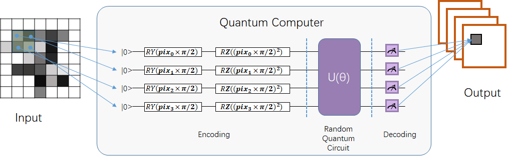
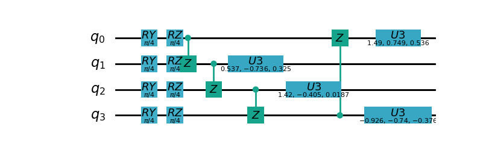
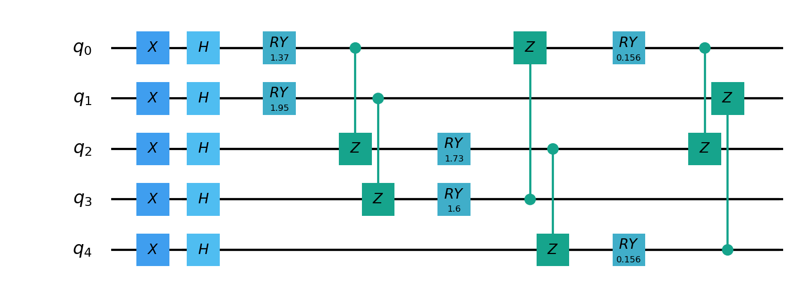
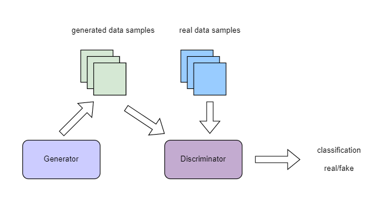
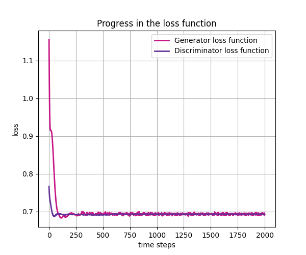
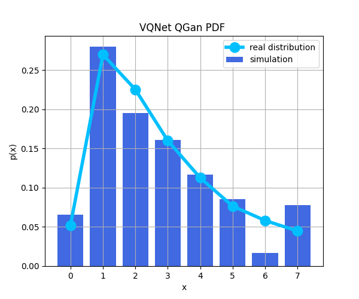
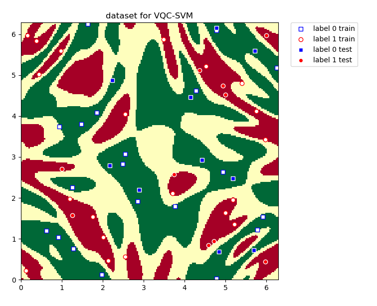
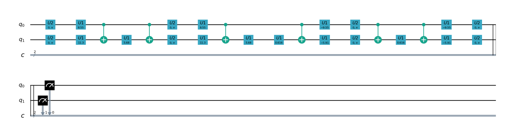

量子机器学习模块
#################################

量子计算层
***********************************

.. _QuantumLayer:

QuantumLayer
============================

QuantumLayer是一个支持量子含参线路作为参数的自动求导模块的封装类。用户定义一个函数作为参数 ``qprog_with_measure`` ，该函数需要包含pyQPanda定义的量子线路:一般包含量子线路的编码线路，演化线路和测量操作。
该类可以嵌入量子经典混合机器学习模型，通过经典的梯度下降法，使得量子经典混合模型的目标函数或损失函数最小。
用户可通过参数 ``diff_method`` 指定 ``QuantumLayer`` 层中量子线路参数的梯度计算方式，``QuantumLayer`` 当前支持有限差分法 ``finite_diff`` 以及 ``parameter-shift`` 方法。

有限差分法是估算函数梯度最传统和最常用的数值方法之一。主要思想是用差分代替偏导数:

.. math::

    f^{\prime}(x)=\lim _{h \rightarrow 0} \frac{f(x+h)-f(x)}{h}

若使用 ``parameter-shift`` 方法，我们使用如下目标函数:

.. math:: O(\theta)=\left\langle 0\left|U^{\dagger}(\theta) H U(\theta)\right| 0\right\rangle

理论上可以通过 ``parameter-shift`` 这一更精确的方法计算量子线路中参数对哈密顿量的梯度:

.. math::

    \nabla O(\theta)=
    \frac{1}{2}\left[O\left(\theta+\frac{\pi}{2}\right)-O\left(\theta-\frac{\pi}{2}\right)\right]

.. py:class:: pyvqnet.qnn.quantumlayer.QuantumLayer(qprog_with_measure,para_num,machine_type_or_cloud_token,num_of_qubits:int,num_of_cbits:int = 1,diff_method:str = "parameter_shift",delta:float = 0.01,dtype=None,name="")

    变分量子层的抽象计算模块。对一个参数化的量子线路进行仿真，得到测量结果。该变分量子层继承了VQNet框架的梯度计算模块，可以计算线路参数的梯度，训练变分量子线路模型或将变分量子线路嵌入混合量子和经典模型。

    :param qprog_with_measure: 用pyQPanda构建的量子线路运行和测量函数。
    :param para_num: `int` - 参数个数。
    :param machine_type_or_cloud_token: qpanda量子虚拟机类型或pyQPanda 量子云令牌 : https://pyqpanda-toturial.readthedocs.io/zh/latest/Realchip.html。
    :param num_of_qubits: 量子比特数。
    :param num_of_cbits: 经典比特数，默认为1。
    :param diff_method: 求解量子线路参数梯度的方法，“参数位移”或“有限差分”，默认参数偏移。
    :param delta: 有限差分计算梯度时的 \delta。
    :param dtype: 参数的数据类型，defaults:None，使用默认数据类型:kfloat32,代表32位浮点数。
    :param name: 这个模块的名字， 默认为""。

    :return: 一个可以计算量子线路的模块。

    .. note::
        qprog_with_measure是pyQPanda中定义的量子线路函数 :https://pyqpanda-toturial.readthedocs.io/zh/latest/QCircuit.html。
        
        此函数必须包含以下参数作为函数入参（即使某个参数未实际使用），否则无法在QuantumLayer中正常运行。

        qprog_with_measure (input,param,qubits,cbits,machine)
        
            `input`: 输入一维经典数据。如果没有输入可以输入 None。
            
            `param`: 输入一维的变分量子线路的待训练参数。
            
            `qubits`: 该QuantumLayer分配的量子比特,类型为pyQpanda.Qubits。
            
            `cbits`: 由QuantumLayer分配的经典比特，用来辅助测量函数，类型为 pyQpanda.ClassicalCondition。如果线路不使用cbits，也应保留此参数。
            
            `machine`: 由QuantumLayer创建的模拟器，例如CPUQVM,GPUQVM,QCloud等。

        使用QuantumLayer的 `m_para` 属性获取变分量子线路的训练参数。该参数为QTensor类，可使用to_numpy()接口转化为numpy数组。

    .. note::

        该类具有别名 `QpandaQCircuitVQCLayer` 。

    Example::

        import pyqpanda as pq
        from pyvqnet.qnn.measure import ProbsMeasure
        from pyvqnet.qnn.quantumlayer import QuantumLayer
        import numpy as np 
        from pyvqnet.tensor import QTensor
        def pqctest (input,param,qubits,cbits,machine):
            circuit = pq.QCircuit()
            circuit.insert(pq.H(qubits[0]))
            circuit.insert(pq.H(qubits[1])) 
            circuit.insert(pq.H(qubits[2]))
            circuit.insert(pq.H(qubits[3]))    

            circuit.insert(pq.RZ(qubits[0],input[0]))  
            circuit.insert(pq.RZ(qubits[1],input[1])) 
            circuit.insert(pq.RZ(qubits[2],input[2]))
            circuit.insert(pq.RZ(qubits[3],input[3]))

            circuit.insert(pq.CNOT(qubits[0],qubits[1]))
            circuit.insert(pq.RZ(qubits[1],param[0]))  
            circuit.insert(pq.CNOT(qubits[0],qubits[1]))

            circuit.insert(pq.CNOT(qubits[1],qubits[2]))
            circuit.insert(pq.RZ(qubits[2],param[1]))  
            circuit.insert(pq.CNOT(qubits[1],qubits[2]))

            circuit.insert(pq.CNOT(qubits[2],qubits[3]))
            circuit.insert(pq.RZ(qubits[3],param[2]))  
            circuit.insert(pq.CNOT(qubits[2],qubits[3]))
            #print(circuit)

            prog = pq.QProg()    
            prog.insert(circuit)    
            # pauli_dict  = {'Z0 X1':10,'Y2':-0.543}
            rlt_prob = ProbsMeasure([0,2],prog,machine,qubits)
            return rlt_prob

        pqc = QuantumLayer(pqctest,3,"CPU",4,1)
        #classic data as input       
        input = QTensor([[1,2,3,4],[40,22,2,3],[33,3,25,2.0]] )
        #forward circuits
        rlt = pqc(input)
        grad =  QTensor(np.ones(rlt.data.shape)*1000)
        #backward circuits
        rlt.backward(grad)
        print(rlt)
        # [
        # [0.2500000, 0.2500000, 0.2500000, 0.2500000],
        # [0.2500000, 0.2500000, 0.2500000, 0.2500000],
        # [0.2500000, 0.2500000, 0.2500000, 0.2500000]
        # ]

    如果使用GPU，参考下面的例子:

    Example::

        import pyqpanda as pq
        from pyvqnet.qnn.measure import ProbsMeasure
        from pyvqnet.qnn.quantumlayer import QuantumLayer
        import numpy as np
        from pyvqnet.tensor import QTensor,DEV_GPU_0
        def pqctest (input,param,qubits,cbits,machine):
            circuit = pq.QCircuit()
            circuit.insert(pq.H(qubits[0]))
            circuit.insert(pq.H(qubits[1]))
            circuit.insert(pq.H(qubits[2]))
            circuit.insert(pq.H(qubits[3]))

            circuit.insert(pq.RZ(qubits[0],input[0]))
            circuit.insert(pq.RZ(qubits[1],input[1]))
            circuit.insert(pq.RZ(qubits[2],input[2]))
            circuit.insert(pq.RZ(qubits[3],input[3]))

            circuit.insert(pq.CNOT(qubits[0],qubits[1]))
            circuit.insert(pq.RZ(qubits[1],param[0]))
            circuit.insert(pq.CNOT(qubits[0],qubits[1]))

            circuit.insert(pq.CNOT(qubits[1],qubits[2]))
            circuit.insert(pq.RZ(qubits[2],param[1]))
            circuit.insert(pq.CNOT(qubits[1],qubits[2]))

            circuit.insert(pq.CNOT(qubits[2],qubits[3]))
            circuit.insert(pq.RZ(qubits[3],param[2]))
            circuit.insert(pq.CNOT(qubits[2],qubits[3]))
            #print(circuit)

            prog = pq.QProg()
            prog.insert(circuit)
            # pauli_dict  = {'Z0 X1':10,'Y2':-0.543}
            rlt_prob = ProbsMeasure([0,2],prog,machine,qubits)
            return rlt_prob

        #这里的"CPU" 指的是qpanda量子计算模拟器使用CPU,跟pyvqnet是否使用GPU无关。
        pqc = QuantumLayer(pqctest,3,"CPU",4,1)
        #这里使用toGPU将QuantumLayer 移动到GPU上
        pqc.toGPU()
        #classic data as input
        input = QTensor([[1,2,3,4],[40,22,2,3],[33,3,25,2.0]] )
        input.toGPU()
        #forward circuits
        rlt = pqc(input)
        grad =  QTensor(np.ones(rlt.data.shape)*1000,device=DEV_GPU_0)
        #backward circuits
        rlt.backward(grad)
        print(rlt)

QuantumLayerV2
============================

如您更加熟悉pyQPanda语法，可以使用该接口QuantumLayerV2，自定义量子比特 ``qubits`` ,经典比特 ``cbits`` ,后端模拟器 ``machine`` 加入QuantumLayerV2的参数 ``qprog_with_measure`` 函数中。

.. py:class:: pyvqnet.qnn.quantumlayer.QuantumLayerV2(qprog_with_measure,para_num,diff_method:str = "parameter_shift",delta:float = 0.01,dtype=None,name="")

	变分量子层的抽象计算模块。对一个参数化的量子线路进行仿真，得到测量结果。该变分量子层继承了VQNet框架的梯度计算模块，可以计算线路参数的梯度，训练变分量子线路模型或将变分量子线路嵌入混合量子和经典模型。
    
    :param qprog_with_measure: 用pyQPand构建的量子线路运行和测量函数。
    :param para_num: `int` - 参数个数。
    :param diff_method: 求解量子线路参数梯度的方法，“参数位移”或“有限差分”，默认参数偏移。
    :param delta: 有限差分计算梯度时的 \delta。
    :param dtype: 参数的数据类型，defaults:None，使用默认数据类型:kfloat32,代表32位浮点数。
    :param name: 这个模块的名字， 默认为""。

    :return: 一个可以计算量子线路的模块。

    .. note::
        qprog_with_measure是pyQPanda中定义的量子线路函数 :https://pyqpanda-toturial.readthedocs.io/zh/latest/QCircuit.html。
        
        此函数必须包含以下参数作为函数入参（即使某个参数未实际使用），否则无法在QuantumLayerV2中正常运行。

        与QuantumLayer相比。该接口传入的变分线路运行函数中，用户应该手动创建量子比特和模拟器: https://pyqpanda-toturial.readthedocs.io/zh/latest/QuantumMachine.html,

        如果qprog_with_measure需要quantum measure，用户还需要手动创建需要分配cbits: https://pyqpanda-toturial.readthedocs.io/zh/latest/Measure.html
        
        量子线路函数 qprog_with_measure (input,param,nqubits,ncubits)的使用可参考下面的例子。
        
        `input`: 输入一维经典数据。如果没有，输入 None。
        
        `param`: 输入一维的变分量子线路的待训练参数。

    .. note::

        该类具有别名 `QpandaQCircuitVQCLayerLite` 。

    Example::

        import pyqpanda as pq
        from pyvqnet.qnn.measure import ProbsMeasure
        from pyvqnet.qnn.quantumlayer import QuantumLayerV2
        import numpy as np
        from pyvqnet.tensor import QTensor
        def pqctest (input,param):
            num_of_qubits = 4

            machine = pq.CPUQVM()
            machine.init_qvm()
            qubits = machine.qAlloc_many(num_of_qubits)

            circuit = pq.QCircuit()
            circuit.insert(pq.H(qubits[0]))
            circuit.insert(pq.H(qubits[1])) 
            circuit.insert(pq.H(qubits[2]))
            circuit.insert(pq.H(qubits[3]))    

            circuit.insert(pq.RZ(qubits[0],input[0]))  
            circuit.insert(pq.RZ(qubits[1],input[1])) 
            circuit.insert(pq.RZ(qubits[2],input[2]))
            circuit.insert(pq.RZ(qubits[3],input[3]))

            circuit.insert(pq.CNOT(qubits[0],qubits[1]))
            circuit.insert(pq.RZ(qubits[1],param[0]))  
            circuit.insert(pq.CNOT(qubits[0],qubits[1]))

            circuit.insert(pq.CNOT(qubits[1],qubits[2]))
            circuit.insert(pq.RZ(qubits[2],param[1]))  
            circuit.insert(pq.CNOT(qubits[1],qubits[2]))

            circuit.insert(pq.CNOT(qubits[2],qubits[3]))
            circuit.insert(pq.RZ(qubits[3],param[2]))  
            circuit.insert(pq.CNOT(qubits[2],qubits[3]))
            #print(circuit)

            prog = pq.QProg()    
            prog.insert(circuit)    
            rlt_prob = ProbsMeasure([0,2],prog,machine,qubits)
            return rlt_prob

        pqc = QuantumLayerV2(pqctest,3)

        #classic data as input       
        input = QTensor([[1.0,2,3,4],[4,2,2,3],[3,3,2,2]] )

        #forward circuits
        rlt = pqc(input)

        grad =  QTensor(np.ones(rlt.data.shape)*1000)
        #backward circuits
        rlt.backward(grad)
        print(rlt)

        # [
        # [0.2500000, 0.2500000, 0.2500000, 0.2500000],
        # [0.2500000, 0.2500000, 0.2500000, 0.2500000],
        # [0.2500000, 0.2500000, 0.2500000, 0.2500000]
        # ]
        
    如果使用GPU，参考下面的例子:

    Example::

        import pyqpanda as pq
        from pyvqnet.qnn.measure import ProbsMeasure
        from pyvqnet.qnn.quantumlayer import QuantumLayerV2
        import numpy as np
        from pyvqnet.tensor import QTensor,DEV_GPU_0
        def pqctest (input,param):
            num_of_qubits = 4

            machine = pq.CPUQVM()
            machine.init_qvm()
            qubits = machine.qAlloc_many(num_of_qubits)

            circuit = pq.QCircuit()
            circuit.insert(pq.H(qubits[0]))
            circuit.insert(pq.H(qubits[1])) 
            circuit.insert(pq.H(qubits[2]))
            circuit.insert(pq.H(qubits[3]))    

            circuit.insert(pq.RZ(qubits[0],input[0]))  
            circuit.insert(pq.RZ(qubits[1],input[1])) 
            circuit.insert(pq.RZ(qubits[2],input[2]))
            circuit.insert(pq.RZ(qubits[3],input[3]))

            circuit.insert(pq.CNOT(qubits[0],qubits[1]))
            circuit.insert(pq.RZ(qubits[1],param[0]))  
            circuit.insert(pq.CNOT(qubits[0],qubits[1]))

            circuit.insert(pq.CNOT(qubits[1],qubits[2]))
            circuit.insert(pq.RZ(qubits[2],param[1]))  
            circuit.insert(pq.CNOT(qubits[1],qubits[2]))

            circuit.insert(pq.CNOT(qubits[2],qubits[3]))
            circuit.insert(pq.RZ(qubits[3],param[2]))  
            circuit.insert(pq.CNOT(qubits[2],qubits[3]))
            #print(circuit)

            prog = pq.QProg()    
            prog.insert(circuit)    
            rlt_prob = ProbsMeasure([0,2],prog,machine,qubits)
            return rlt_prob

        pqc = QuantumLayerV2(pqctest,3)
        #layer move to gpu
        pqc.toGPU()
        #classic data as input       
        input = QTensor([[1.0,2,3,4],[4,2,2,3],[3,3,2,2]] )
        #data move to gpu
        input.toGPU(DEV_GPU_0)
        #forward circuits
        rlt = pqc(input)

        grad =  QTensor(np.ones(rlt.data.shape)*1000,device= DEV_GPU_0)
        #backward circuits
        rlt.backward(grad)
        print(rlt)

QuantumLayerV3
============================

.. py:class:: pyvqnet.qnn.quantumlayer.QuantumLayerV3(origin_qprog_func,para_num,num_qubits, num_cubits, pauli_str_dict=None, shots=1000, initializer=None,dtype=None,name="")

    它将参数化的量子电路提交给 本地QPanda全振幅模拟器中计算,并训练线路中的参数。
    它支持批量数据并使用参数移位规则来估计参数的梯度。
    对于 CRX、CRY、CRZ，此层使用 https://iopscience.iop.org/article/10.1088/1367-2630/ac2cb3 中的公式，其余逻辑门采用默认的参数漂移法计算梯度。

    :param origin_qprog_func: 由 QPanda 构建的可调用量子电路函数。
    :param para_num: `int` - 参数数量；参数是一维的。
    :param num_qubits: `int` - 量子电路中的量子比特数。
    :param num_cubits: `int` - 量子电路中用于测量的经典比特数。
    :param pauli_str_dict: `dict|list` - 表示量子电路中的泡利算子的字典或字典列表。默认值为 None。
    :param shots: `int` - 测量镜头数。默认值为 1000。
    :param initializer: 参数值的初始化器。默认值为 None。
    :param dtype: 参数的数据类型。默认值为 None，即使用默认数据类型。
    :param name: 模块名称。默认值为空字符串。

    :return: 返回一个QuantumLayerV3类

    .. note::

        origin_qprog_func 是用户使用 pyQPanda 定义的量子电路函数:
        https://pyqpanda-toturial.readthedocs.io/zh/latest/QCircuit.html。

        该函数应包含以下输入参数，并返回 pyQPanda.QProg 或 originIR。

        origin_qprog_func (input,param,m_machine,qubits,cubits)

        `input`:用户定义的数组类输入 1 维经典数据。

        `param`:array_like 输入用户定义的 1 维量子电路参数。

        `m_machine`:QuantumLayerV3 创建的模拟器。

        `qubits`:QuantumLayerV3 分配的量子比特

        `cubits`:QuantumLayerV3 分配的经典比特。如果您的电路不使用经典比特，您也应该保留此参数作为函数输入。

    .. note::

        该类具有别名 `QpandaQProgVQCLayer` 。

    Example::

        import numpy as np
        import pyqpanda as pq
        import pyvqnet
        from pyvqnet.qnn import QuantumLayerV3

        def qfun(input, param, m_machine, m_qlist, cubits):
            measure_qubits = [0,1, 2]
            m_prog = pq.QProg()
            cir = pq.QCircuit()

            cir.insert(pq.RZ(m_qlist[0], input[0]))
            cir.insert(pq.RX(m_qlist[2], input[2]))
            
            qcir = pq.RX(m_qlist[1], param[1])
            qcir.set_control(m_qlist[0])
            cir.insert(qcir)

            qcir = pq.RY(m_qlist[0], param[2])
            qcir.set_control(m_qlist[1])
            cir.insert(qcir)

            cir.insert(pq.RY(m_qlist[0], input[1]))

            qcir = pq.RZ(m_qlist[0], param[3])
            qcir.set_control(m_qlist[1])
            cir.insert(qcir)
            m_prog.insert(cir)

            for idx, ele in enumerate(measure_qubits):
                m_prog << pq.Measure(m_qlist[ele], cubits[idx])  # pylint: disable=expression-not-assigned
            return m_prog
        from pyvqnet.utils.initializer import ones
        l = QuantumLayerV3(qfun,
                        4,
                        3,
                        3,
                        pauli_str_dict=None,
                        shots=1000,
                        initializer=ones,
                        name="")
        x = pyvqnet.tensor.QTensor(
            [[2.56, 1.2,-3]],
            requires_grad=True)
        y = l(x)

        y.backward()
        print(l.m_para.grad.to_numpy())
        print(x.grad.to_numpy())

QuantumBatchAsyncQcloudLayer
=================================

当您安装最新版本pyqpanda,可以使用本接口定义一个变分线路，并提交到originqc的真实芯片上运行。

.. py:class:: pyvqnet.qnn.quantumlayer.QuantumBatchAsyncQcloudLayer(origin_qprog_func, qcloud_token, para_num, num_qubits, num_cubits, pauli_str_dict=None, shots = 1000, initializer=None, dtype=None, name="", diff_method="parameter_shift", submit_kwargs={}, query_kwargs={})

    使用 pyqpanda QCLOUD 从版本 3.8.2.2 开始的 originqc 真实芯片的抽象计算模块。 它提交参数化量子电路到真实芯片并获得测量结果。

    .. note::

        qcloud_token 为您到 https://qcloud.originqc.com.cn/ 中申请的api token。
        origin_qprog_func 需要返回pypqanda.QProg类型的数据，如果没有设置pauli_str_dict，需要保证该QProg中已经插入了measure。
        origin_qprog_func 的形式必须按照如下:

        origin_qprog_func(input,param,qubits,cbits,machine)
        
            `input`: 输入1~2维经典数据，二维的情况下，第一个维度为批处理大小。
            
            `param`: 输入一维的变分量子线路的待训练参数。

            `machine`: 由QuantumBatchAsyncQcloudLayer创建的模拟器QCloud，无需用户额外在函数中定义。
            
            `qubits`: 由QuantumBatchAsyncQcloudLayer创建的模拟器QCloud创建的量子比特,数量为  `num_qubits`, 类型为pyQpanda.Qubits，无需用户额外在函数中定义。
            
            `cbits`: 由QuantumBatchAsyncQcloudLayer分配的经典比特, 数量为  `num_cubits`, 类型为 pyQpanda.ClassicalCondition，无需用户额外在函数中定义。。
            

    :param origin_qprog_func: QPanda 构建的变分量子电路函数，必须返回QProg。
    :param qcloud_token: `str` - 量子机的类型或用于执行的云令牌。
    :param para_num: `int` - 参数数量，参数是大小为[para_num]的QTensor。
    :param num_qubits: `int` - 量子电路中的量子比特数量。
    :param num_cubits: `int` - 量子电路中用于测量的经典比特数量。
    :param pauli_str_dict: `dict|list` - 表示量子电路中泡利运算符的字典或字典列表。 默认为“无”，则进行测量操作，如果输入泡利算符的字典，则会计算单个期望或者多个期望。
    :param shot: `int` - 测量次数。 默认值为 1000。
    :param initializer: 参数值的初始化器。 默认为“无”，使用0~2*pi正态分布。
    :param dtype: 参数的数据类型。 默认值为 None，即使用默认数据类型pyvqnet.kfloat32。
    :param name: 模块的名称。 默认为空字符串。
    :param diff_method: 梯度计算的微分方法。 默认为“parameter_shift”,当前不支持其他微分方法。
    :param submit_kwargs: 用于提交量子电路的附加关键字参数，默认:{"chip_id":pyqpanda.real_chip_type.origin_72,"is_amend":True,"is_mapping":True,"is_optimization":True,"compile_level":3,"default_task_group_size":200,"test_qcloud_fake":False},当设置test_qcloud_fake为True则本地CPUQVM模拟。
    :param query_kwargs: 用于查询量子结果的附加关键字参数，默认:{"timeout":2,"print_query_info":True,"sub_circuits_split_size":1}。
    :return: 一个可以计算量子电路的模块。
    
    Example::

        import numpy as np
        import pyqpanda as pq
        import pyvqnet
        from pyvqnet.qnn import QuantumLayer,QuantumBatchAsyncQcloudLayer
        from pyvqnet.qnn import expval_qcloud

        def qfun(input,param, m_machine, m_qlist,cubits):
            measure_qubits = [0,2]
            m_prog = pq.QProg()
            cir = pq.QCircuit()
            cir.insert(pq.RZ(m_qlist[0],input[0]))
            cir.insert(pq.CNOT(m_qlist[0],m_qlist[1]))
            cir.insert(pq.RY(m_qlist[1],param[0]))
            cir.insert(pq.CNOT(m_qlist[0],m_qlist[2]))
            cir.insert(pq.RZ(m_qlist[1],input[1]))
            cir.insert(pq.RY(m_qlist[2],param[1]))
            cir.insert(pq.H(m_qlist[2]))
            m_prog.insert(cir)

            for idx, ele in enumerate(measure_qubits):
                m_prog << pq.Measure(m_qlist[ele], cubits[idx])  # pylint: disable=expression-not-assigned
            return m_prog

        l = QuantumBatchAsyncQcloudLayer(qfun,
                        "3047DE8A59764BEDAC9C3282093B16AF1",
                        2,
                        6,
                        6,
                        pauli_str_dict=None,
                        shots = 1000,
                        initializer=None,
                        dtype=None,
                        name="",
                        diff_method="parameter_shift",
                        submit_kwargs={},
                        query_kwargs={})
        x = pyvqnet.tensor.QTensor([[0.56,1.2],[0.56,1.2],[0.56,1.2],[0.56,1.2],[0.56,1.2]],requires_grad= True)
        y = l(x)
        print(y)
        y.backward()
        print(l.m_para.grad)
        print(x.grad)

        def qfun2(input,param, m_machine, m_qlist,cubits):
            measure_qubits = [0,2]
            m_prog = pq.QProg()
            cir = pq.QCircuit()
            cir.insert(pq.RZ(m_qlist[0],input[0]))
            cir.insert(pq.CNOT(m_qlist[0],m_qlist[1]))
            cir.insert(pq.RY(m_qlist[1],param[0]))
            cir.insert(pq.CNOT(m_qlist[0],m_qlist[2]))
            cir.insert(pq.RZ(m_qlist[1],input[1]))
            cir.insert(pq.RY(m_qlist[2],param[1]))
            cir.insert(pq.H(m_qlist[2]))
            m_prog.insert(cir)

            return m_prog
        l = QuantumBatchAsyncQcloudLayer(qfun2,
                    "3047DE8A59764BEDAC9C3282093B16AF",
                    2,
                    6,
                    6,
                    pauli_str_dict={'Z0 X1':10,'':-0.5,'Y2':-0.543},
                    shots = 1000,
                    initializer=None,
                    dtype=None,
                    name="",
                    diff_method="parameter_shift",
                    submit_kwargs={},
                    query_kwargs={})
        x = pyvqnet.tensor.QTensor([[0.56,1.2],[0.56,1.2],[0.56,1.2],[0.56,1.2]],requires_grad= True)
        y = l(x)
        print(y)
        y.backward()
        print(l.m_para.grad)
        print(x.grad)

QuantumBatchAsyncQcloudLayerES
=================================

当您安装最新版本pyqpanda,可以使用本接口定义一个变分线路，并提交到originqc的真实芯片上运行。

.. py:class:: pyvqnet.qnn.quantumlayer.QuantumBatchAsyncQcloudLayerES(origin_qprog_func, qcloud_token, para_num, num_qubits, num_cubits, pauli_str_dict=None, shots = 1000, initializer=None, dtype=None, name="", diff_method="ES", submit_kwargs={}, query_kwargs={}, sigma = np.pi / 24)

    使用 pyqpanda QCLOUD 从版本 3.8.2.2 开始的 originqc 真实芯片的抽象计算模块。 它提交参数化量子电路到真实芯片并获得测量结果。

    .. note::

        qcloud_token 为您到 https://qcloud.originqc.com.cn/ 中申请的api token。
        origin_qprog_func 需要返回pypqanda.QProg类型的数据，如果没有设置pauli_str_dict，需要保证该QProg中已经插入了measure。
        origin_qprog_func 的形式必须按照如下:

        origin_qprog_func(input,param,qubits,cbits,machine)
        
            `input`: 输入1~2维经典数据，二维的情况下，第一个维度为批处理大小。
            
            `param`: 输入一维的变分量子线路的待训练参数。

            `machine`: 由QuantumBatchAsyncQcloudLayerES创建的模拟器QCloud，无需用户额外在函数中定义。
            
            `qubits`: 由QuantumBatchAsyncQcloudLayerES创建的模拟器QCloud创建的量子比特,数量为  `num_qubits`, 类型为pyQpanda.Qubits，无需用户额外在函数中定义。
            
            `cbits`: 由QuantumBatchAsyncQcloudLayerES分配的经典比特, 数量为  `num_cubits`, 类型为 pyQpanda.ClassicalCondition，无需用户额外在函数中定义。。
            

    :param origin_qprog_func: QPanda 构建的变分量子电路函数，必须返回QProg。
    :param qcloud_token: `str` - 量子机的类型或用于执行的云令牌。
    :param para_num: `int` - 参数数量，参数是大小为[para_num]的QTensor。
    :param num_qubits: `int` - 量子电路中的量子比特数量。
    :param num_cubits: `int` - 量子电路中用于测量的经典比特数量。
    :param pauli_str_dict: `dict|list` - 表示量子电路中泡利运算符的字典或字典列表。 默认为“无”，则进行测量操作，如果输入泡利算符的字典，则会计算单个期望或者多个期望。
    :param shot: `int` - 测量次数。 默认值为 1000。
    :param initializer: 参数值的初始化器。 默认为“无”，使用0~2*pi正态分布。
    :param dtype: 参数的数据类型。 默认值为 None，即使用默认数据类型pyvqnet.kfloat32。
    :param name: 模块的名称。 默认为空字符串。
    :param diff_method: 梯度计算的微分方法。 默认为“ES”, 源自论文"Learning to learn with an evolutionary strategy Learning to learn with an evolutionary strategy", 当前不支持其他微分方法。
    :param submit_kwargs: 用于提交量子电路的附加关键字参数，默认:{"chip_id":pyqpanda.real_chip_type.origin_72,"is_amend":True,"is_mapping":True,"is_optimization":True,"compile_level":3,"default_task_group_size":200,"test_qcloud_fake":False},当设置test_qcloud_fake为True则本地CPUQVM模拟。
    :param query_kwargs: 用于查询量子结果的附加关键字参数，默认:{"timeout":2,"print_query_info":True,"sub_circuits_split_size":1}。
    :param sigma:  多元非三维分布的采样方差, 一般取pi/6, pi/12, pi/24, 默认为pi/24。
    :return: 一个可以计算量子电路的模块。
    
    Example::

        import numpy as np
        import pyqpanda as pq
        import pyvqnet
        from pyvqnet.qnn import QuantumLayer,QuantumBatchAsyncQcloudLayerES
        from pyvqnet.qnn import expval_qcloud

        def qfun(input,param, m_machine, m_qlist,cubits):
            measure_qubits = [0,2]
            m_prog = pq.QProg()
            cir = pq.QCircuit()
            cir.insert(pq.RZ(m_qlist[0],input[0]))
            cir.insert(pq.CNOT(m_qlist[0],m_qlist[1]))
            cir.insert(pq.RY(m_qlist[1],param[0]))
            cir.insert(pq.CNOT(m_qlist[0],m_qlist[2]))
            cir.insert(pq.RZ(m_qlist[1],input[1]))
            cir.insert(pq.RY(m_qlist[2],param[1]))
            cir.insert(pq.H(m_qlist[2]))
            m_prog.insert(cir)

            for idx, ele in enumerate(measure_qubits):
                m_prog << pq.Measure(m_qlist[ele], cubits[idx])  # pylint: disable=expression-not-assigned
            return m_prog

        l = QuantumBatchAsyncQcloudLayerES(qfun,
                        "3047DE8A59764BEDAC9C3282093B16AF1",
                        2,
                        6,
                        6,
                        pauli_str_dict=None,
                        shots = 1000,
                        initializer=None,
                        dtype=None,
                        name="",
                        diff_method="ES",
                        submit_kwargs={},
                        query_kwargs={},
                        sigma=np.pi/24)
        x = pyvqnet.tensor.QTensor([[0.56,1.2],[0.56,1.2],[0.56,1.2],[0.56,1.2],[0.56,1.2]],requires_grad= True)
        y = l(x)
        print(f"y {y}")
        y.backward()
        print(f"l.m_para.grad {l.m_para.grad}")
        print(f"x.grad {x.grad}")

        def qfun2(input,param, m_machine, m_qlist,cubits):
            measure_qubits = [0,2]
            m_prog = pq.QProg()
            cir = pq.QCircuit()
            cir.insert(pq.RZ(m_qlist[0],input[0]))
            cir.insert(pq.CNOT(m_qlist[0],m_qlist[1]))
            cir.insert(pq.RY(m_qlist[1],param[0]))
            cir.insert(pq.CNOT(m_qlist[0],m_qlist[2]))
            cir.insert(pq.RZ(m_qlist[1],input[1]))
            cir.insert(pq.RY(m_qlist[2],param[1]))
            cir.insert(pq.H(m_qlist[2]))
            m_prog.insert(cir)

            return m_prog
        l = QuantumBatchAsyncQcloudLayerES(qfun2,
                    "3047DE8A59764BEDAC9C3282093B16AF",
                    2,
                    6,
                    6,
                    pauli_str_dict={'Z0 X1':10,'':-0.5,'Y2':-0.543},
                    shots = 1000,
                    initializer=None,
                    dtype=None,
                    name="",
                    diff_method="ES",
                    submit_kwargs={},
                    query_kwargs={})
        x = pyvqnet.tensor.QTensor([[0.56,1.2],[0.56,1.2],[0.56,1.2],[0.56,1.2]],requires_grad= True)
        y = l(x)
        print(f"y {y}")
        y.backward()
        print(f"l.m_para.grad {l.m_para.grad}")
        print(f"x.grad {x.grad}")

QuantumLayerMultiProcess
============================

如您更加熟悉pyQPanda语法，可以使用QuantumLayerMultiProcess，自定义量子比特 ``qubits`` ,经典比特 ``cbits`` ,后端模拟器 ``machine`` 加入QuantumLayerMultiProcess的参数 ``qprog_with_measure`` 函数中。

.. py:class:: pyvqnet.qnn.quantumlayer.QuantumLayerMultiProcess(qprog_with_measure,para_num,num_of_qubits: int,num_of_cbits: int = 1,diff_method:str = "parameter_shift",delta:float = 0.01, dtype=None,name="")

    变分量子层的抽象计算模块。使用多进程技术对一个批次数据计算梯度时候的量子线路进行加速。对于线路深度较少的线路，该层的多线程加速效果并不明显。
    
    该层对一个参数化的量子线路进行仿真，得到测量结果。该变分量子层继承了VQNet框架的梯度计算模块，可以计算线路参数的梯度，训练变分量子线路模型或将变分量子线路嵌入混合量子和经典模型。

    :param qprog_with_measure: 用pyQPanda构建的量子线路运行和测量函数。
    :param para_num: `int` - 参数个数。
    :param num_of_qubits: 量子比特数。
    :param num_of_cbits: 经典比特数，默认为1。
    :param diff_method: 求解量子线路参数梯度的方法，“参数位移”或“有限差分”，默认参数偏移。
    :param delta: 有限差分计算梯度时的 \delta。
    :param dtype: 参数的数据类型，defaults:None，使用默认数据类型:kfloat32,代表32位浮点数。
    :param name: 这个模块的名字， 默认为""。

    :return: 一个可以计算量子线路的模块。

    .. note::
        qprog_with_measure是pyQPanda中定义的量子线路函数 :https://pyqpanda-toturial.readthedocs.io/zh/latest/QCircuit.html。

        此函数应包含以下参数，否则无法在QuantumLayerMultiProcess中正常运行。

        与QuantumLayerV2类似,该接口传入的变分线路运行函数中，用户应该手动创建量子比特和模拟器: https://pyqpanda-toturial.readthedocs.io/zh/latest/QuantumMachine.html,

        如果qprog_with_measure需要quantum measure，用户应该手动创建cbits: https://pyqpanda-toturial.readthedocs.io/zh/latest/Measure.html

        量子线路函数 qprog_with_measure (input,param,nqubits,ncubits)的使用可参考下面的例子。对于线路深度较少的线路，该层的多线程加速效果并不明显。

        `input`: 输入一维经典数据。

        `param`: 输入一维量子线路的参数。

        `nqubits`: 预先设定的量子比特数量。如果没有，输入 0。

        `ncubits`: 预先设定的经典比特数量。如果没有，输入 0。

    Example::

        import pyqpanda as pq
        from pyvqnet.qnn.measure import ProbsMeasure
        from pyvqnet.qnn.quantumlayer import QuantumLayerMultiProcess
        import numpy as np
        from pyvqnet.tensor import QTensor

        def pqctest (input,param,nqubits,ncubits):
            machine = pq.CPUQVM()
            machine.init_qvm()
            qubits = machine.qAlloc_many(nqubits)
            circuit = pq.QCircuit()
            circuit.insert(pq.H(qubits[0]))
            circuit.insert(pq.H(qubits[1]))
            circuit.insert(pq.H(qubits[2]))
            circuit.insert(pq.H(qubits[3]))

            circuit.insert(pq.RZ(qubits[0],input[0]))
            circuit.insert(pq.RZ(qubits[1],input[1]))
            circuit.insert(pq.RZ(qubits[2],input[2]))
            circuit.insert(pq.RZ(qubits[3],input[3]))

            circuit.insert(pq.CNOT(qubits[0],qubits[1]))
            circuit.insert(pq.RZ(qubits[1],param[0]))
            circuit.insert(pq.CNOT(qubits[0],qubits[1]))

            circuit.insert(pq.CNOT(qubits[1],qubits[2]))
            circuit.insert(pq.RZ(qubits[2],param[1]))
            circuit.insert(pq.CNOT(qubits[1],qubits[2]))

            circuit.insert(pq.CNOT(qubits[2],qubits[3]))
            circuit.insert(pq.RZ(qubits[3],param[2]))
            circuit.insert(pq.CNOT(qubits[2],qubits[3]))
            #print(circuit)

            prog = pq.QProg()
            prog.insert(circuit)

            rlt_prob = ProbsMeasure([0,2],prog,machine,qubits)
            return rlt_prob

        pqc = QuantumLayerMultiProcess(pqctest,3,4,1)
        #classic data as input
        input = QTensor([[1.0,2,3,4],[4,2,2,3],[3,3,2,2]] )
        #forward circuits
        rlt = pqc(input)
        grad = QTensor(np.ones(rlt.data.shape)*1000)
        #backward circuits
        rlt.backward(grad)
        print(rlt)

        # [
        # [0.2500000, 0.2500000, 0.2500000, 0.2500000],
        # [0.2500000, 0.2500000, 0.2500000, 0.2500000],
        # [0.2500000, 0.2500000, 0.2500000, 0.2500000]
        # ]

NoiseQuantumLayer
=========================

在真实的量子计算机中，受制于量子比特自身的物理特性，常常存在不可避免的计算误差。为了能在量子虚拟机中更好的模拟这种误差，VQNet同样支持含噪声量子虚拟机。含噪声量子虚拟机的模拟更贴近真实的量子计算机，我们可以自定义支持的逻辑门类型，自定义逻辑门支持的噪声模型。
现有可支持的量子噪声模型依据QPanda中定义，具体参考链接 `QPANDA2 <https://pyqpanda-toturial.readthedocs.io/zh/latest/NoiseQVM.html>`_ 中的介绍。

使用 NoiseQuantumLayer 定义一个量子线路自动微分类，该类支持QPanda噪声虚拟机。用户定义一个函数作为参数 ``qprog_with_measure`` ，该函数需要包含pyQPanda定义的量子线路，同样需要传入一个参数 ``noise_set_config``，使用pyQPanda接口，设置噪声模型。

.. py:class:: pyvqnet.qnn.quantumlayer.NoiseQuantumLayer(qprog_with_measure,para_num,machine_type,num_of_qubits:int,num_of_cbits:int=1,diff_method:str= "parameter_shift",delta:float=0.01,noise_set_config = None, dtype=None,name="")

	变分量子层的抽象计算模块。对一个参数化的量子线路进行仿真，得到测量结果。该变分量子层继承了VQNet框架的梯度计算模块，可以计算线路参数的梯度，训练变分量子线路模型或将变分量子线路嵌入混合量子和经典模型。

    这一层可以在量子线路中使用噪声模型。

    :param qprog_with_measure: 用pyQPanda构建的量子线路运行和测量函数。
    :param para_num: `int` - 参数个数。
    :param machine_type: qpanda机器类型。
    :param num_of_qubits: 量子比特数。
    :param num_of_cbits: 经典比特数，默认为1。
    :param diff_method: 求解量子线路参数梯度的方法，“参数位移”或“有限差分”，默认参数偏移。
    :param delta: 有限差分计算梯度时的 \delta。
    :param noise_set_config: 噪声设置函数。
    :param dtype: 参数的数据类型，defaults:None，使用默认数据类型:kfloat32,代表32位浮点数。
    :param name: 这个模块的名字， 默认为""。

    :return: 一个可以计算含噪声量子线路的模块。

    .. note::
        qprog_with_measure是pyQPanda中定义的量子线路函数 :https://pyqpanda-toturial.readthedocs.io/zh/latest/QCircuit.html。
        
        此函数必须包含以下参数作为函数入参（即使某个参数未实际使用），否则无法在NoiseQuantumLayer中正常运行。
        
        qprog_with_measure (input,param,qubits,cbits,machine)
        
            `input`: 输入一维经典数据。如果没有输入可以输入 None。
            
            `param`: 输入一维的变分量子线路的待训练参数。
            
            `qubits`: 该NoiseQuantumLayer分配的量子比特,类型为pyQpanda.Qubits。
            
            `cbits`: cbits由NoiseQuantumLayer分配的经典比特，用来辅助测量函数，类型为 pyQpanda.ClassicalCondition。如果线路不使用cbits，也应保留此参数。
            
            `machine`: 由NoiseQuantumLayer创建的模拟器。

    Example::

        import pyqpanda as pq
        from pyvqnet.qnn.measure import ProbsMeasure
        from pyvqnet.qnn.quantumlayer import NoiseQuantumLayer
        import numpy as np
        from pyqpanda import * 
        from pyvqnet.tensor import QTensor
        def circuit(weights,param,qubits,cbits,machine):

            circuit = pq.QCircuit()

            circuit.insert(pq.H(qubits[0]))
            circuit.insert(pq.RY(qubits[0], weights[0]))
            circuit.insert(pq.RY(qubits[0], param[0]))
            prog = pq.QProg()
            prog.insert(circuit)
            prog << measure_all(qubits, cbits)

            result = machine.run_with_configuration(prog, cbits, 100)

            counts = np.array(list(result.values()))
            states = np.array(list(result.keys())).astype(float)
            # Compute probabilities for each state
            probabilities = counts / 100
            # Get state expectation
            expectation = np.sum(states * probabilities)
            return expectation

        def default_noise_config(qvm,q):

            p = 0.01
            qvm.set_noise_model(NoiseModel.BITFLIP_KRAUS_OPERATOR, GateType.PAULI_X_GATE, p)
            qvm.set_noise_model(NoiseModel.BITFLIP_KRAUS_OPERATOR, GateType.PAULI_Y_GATE, p)
            qvm.set_noise_model(NoiseModel.BITFLIP_KRAUS_OPERATOR, GateType.PAULI_Z_GATE, p)
            qvm.set_noise_model(NoiseModel.BITFLIP_KRAUS_OPERATOR, GateType.RX_GATE, p)
            qvm.set_noise_model(NoiseModel.BITFLIP_KRAUS_OPERATOR, GateType.RY_GATE, p)
            qvm.set_noise_model(NoiseModel.BITFLIP_KRAUS_OPERATOR, GateType.RZ_GATE, p)
            qvm.set_noise_model(NoiseModel.BITFLIP_KRAUS_OPERATOR, GateType.RY_GATE, p)
            qvm.set_noise_model(NoiseModel.BITFLIP_KRAUS_OPERATOR, GateType.HADAMARD_GATE, p)
            qves =[]
            for i in range(len(q)-1):
                qves.append([q[i],q[i+1]])#
            qves.append([q[len(q)-1],q[0]])
            qvm.set_noise_model(NoiseModel.DAMPING_KRAUS_OPERATOR, GateType.CNOT_GATE, p, qves)

            return qvm

        qvc = NoiseQuantumLayer(circuit,24,"noise",1,1,diff_method= "parameter_shift", delta=0.01,noise_set_config = default_noise_config)
        input = QTensor([
            [0., 1., 1., 1.],

            [0., 0., 1., 1.],

            [1., 0., 1., 1.]
            ] )
        rlt = qvc(input)
        grad =  QTensor(np.ones(rlt.data.shape)*1000)

        rlt.backward(grad)
        print(qvc.m_para.grad)

        #[1195., 105., 70., 0., 
        # 45., -45., 50., 15., 
        # -80., 50., 10., -30., 
        # 10., 60., 75., -110., 
        # 55., 45., 25., 5., 
        # 5., 50., -25., -15.]

下面给出一个 ``noise_set_config`` 的例子，这里使得 ``RX`` , ``RY`` , ``RZ`` , ``X`` , ``Y`` , ``Z`` , ``H`` 等逻辑门加入了 p = 0.01 的 BITFLIP_KRAUS_OPERATOR噪声模型。

.. code-block::

	def noise_set_config(qvm,q):

		p = 0.01
		qvm.set_noise_model(NoiseModel.BITFLIP_KRAUS_OPERATOR, GateType.PAULI_X_GATE, p)
		qvm.set_noise_model(NoiseModel.BITFLIP_KRAUS_OPERATOR, GateType.PAULI_Y_GATE, p)
		qvm.set_noise_model(NoiseModel.BITFLIP_KRAUS_OPERATOR, GateType.PAULI_Z_GATE, p)
		qvm.set_noise_model(NoiseModel.BITFLIP_KRAUS_OPERATOR, GateType.RX_GATE, p)
		qvm.set_noise_model(NoiseModel.BITFLIP_KRAUS_OPERATOR, GateType.RY_GATE, p)
		qvm.set_noise_model(NoiseModel.BITFLIP_KRAUS_OPERATOR, GateType.RZ_GATE, p)
		qvm.set_noise_model(NoiseModel.BITFLIP_KRAUS_OPERATOR, GateType.RY_GATE, p)
		qvm.set_noise_model(NoiseModel.BITFLIP_KRAUS_OPERATOR, GateType.HADAMARD_GATE, p)
		qves =[]
		for i in range(len(q)-1):
			qves.append([q[i],q[i+1]])#
		qves.append([q[len(q)-1],q[0]])
		qvm.set_noise_model(NoiseModel.DAMPING_KRAUS_OPERATOR, GateType.CNOT_GATE, p, qves)

		return qvm
		
VQCLayer
=========================

基于pyQPanda的可变量子线路VariationalQuantumCircuit，VQNet提供了抽象量子计算层 ``VQCLayer`` 。用户只需要定义一个类 ``VQC_wrapper`` ，
其中定义相应的量子线路逻辑门和测量函数即可基于pyQPanda的 ``VariationalQuantumCircuit`` ，进行机器学习模型的构建。

在 ``VQC_wrapper`` 中，用户使用普通逻辑门函数 ``build_common_circuits`` 构建模型中线路结构变化的子线路，使用VQG在 ``build_vqc_circuits`` 构建结构不变，参数变化的子线路。使用
``run`` 函数定义线路运行方式以及测量。

.. py:class:: pyvqnet.qnn.quantumlayer.VQC_wrapper

    ``VQC_wrapper`` 是一个抽象类，用于在VQNet上运行VariationalQuantumCircuit。

    ``build_common_circuits`` 线路根据输入的不同而变化。

    ``build_vqc_circuits`` 构建带有可训练重量的VQC线路。

    ``run`` VQC的运行函数。
    
    Example::

        import pyqpanda as pq
        from pyqpanda import *
        from pyvqnet.qnn.quantumlayer import VQCLayer,VQC_wrapper
        class QVC_demo(VQC_wrapper):
            
            def __init__(self):
                super(QVC_demo, self).__init__()

            def build_common_circuits(self,input,qlists,):
                qc = pq.QCircuit()
                for i in range(len(qlists)):
                    if input[i]==1:
                        qc.insert(pq.X(qlists[i]))
                return qc
                
            def build_vqc_circuits(self,input,weights,machine,qlists,clists):

                def get_cnot(qubits):
                    vqc = VariationalQuantumCircuit()
                    for i in range(len(qubits)-1):
                        vqc.insert(pq.VariationalQuantumGate_CNOT(qubits[i],qubits[i+1]))
                    vqc.insert(pq.VariationalQuantumGate_CNOT(qubits[len(qubits)-1],qubits[0]))
                    return vqc

                def build_circult(weights, xx, qubits,vqc):
                    
                    def Rot(weights_j, qubits):
                        vqc = VariationalQuantumCircuit()
                        
                        vqc.insert(pq.VariationalQuantumGate_RZ(qubits, weights_j[0]))
                        vqc.insert(pq.VariationalQuantumGate_RY(qubits, weights_j[1]))
                        vqc.insert(pq.VariationalQuantumGate_RZ(qubits, weights_j[2]))
                        return vqc

                    #2,4,3
                    for i in range(2):
                        
                        weights_i = weights[i,:,:]
                        for j in range(len(qubits)):
                            weights_j = weights_i[j]
                            vqc.insert(Rot(weights_j,qubits[j]))
                        cnots = get_cnot(qubits)  
                        vqc.insert(cnots) 

                    vqc.insert(pq.VariationalQuantumGate_Z(qubits[0]))#pauli z(0)

                    return vqc
                
                weights = weights.reshape([2,4,3])
                vqc = VariationalQuantumCircuit()
                return build_circult(weights, input,qlists,vqc)

将该实例化对象 ``VQC_wrapper`` 作为参数传入 ``VQCLayer``

.. py:class:: pyvqnet.qnn.quantumlayer.VQCLayer(vqc_wrapper,para_num,machine_type_or_cloud_token,num_of_qubits:int,num_of_cbits:int = 1,diff_method:str = "parameter_shift",delta:float = 0.01, dtype=None,name="")

    pyQPanda中变分量子线路的抽象计算模块。详情请访问: https://pyqpanda-toturial.readthedocs.io/zh/latest/VQG.html。
    
    :param vqc_wrapper: VQC_wrapper类。
    :param para_num: `int` - 参数个数。
    :param machine_type: qpanda机器类型。
    :param num_of_qubits: 量子比特数。
    :param num_of_cbits: 经典比特数，默认为1。
    :param diff_method: 求解量子线路参数梯度的方法，“参数位移”或“有限差分”，默认参数偏移。
    :param delta: 有限差分计算梯度时的 \delta。
    :param dtype: 参数的数据类型，defaults:None，使用默认数据类型:kfloat32,代表32位浮点数。
    :param name: 这个模块的名字， 默认为""。

    :return: 一个可以计算量子VQC线路的模块。

    Example::

        import pyqpanda as pq
        from pyqpanda import *
        from pyvqnet.qnn.quantumlayer import VQCLayer,VQC_wrapper

        class QVC_demo(VQC_wrapper):
            
            def __init__(self):
                super(QVC_demo, self).__init__()

            def build_common_circuits(self,input,qlists,):
                qc = pq.QCircuit()
                for i in range(len(qlists)):
                    if input[i]==1:
                        qc.insert(pq.X(qlists[i]))
                return qc
                
            def build_vqc_circuits(self,input,weights,machine,qlists,clists):

                def get_cnot(qubits):
                    vqc = VariationalQuantumCircuit()
                    for i in range(len(qubits)-1):
                        vqc.insert(pq.VariationalQuantumGate_CNOT(qubits[i],qubits[i+1]))
                    vqc.insert(pq.VariationalQuantumGate_CNOT(qubits[len(qubits)-1],qubits[0]))
                    return vqc

                def build_circult(weights, xx, qubits,vqc):
                    
                    def Rot(weights_j, qubits):
                        vqc = VariationalQuantumCircuit()
                        
                        vqc.insert(pq.VariationalQuantumGate_RZ(qubits, weights_j[0]))
                        vqc.insert(pq.VariationalQuantumGate_RY(qubits, weights_j[1]))
                        vqc.insert(pq.VariationalQuantumGate_RZ(qubits, weights_j[2]))
                        return vqc

                    #2,4,3
                    for i in range(2):
                        
                        weights_i = weights[i,:,:]
                        for j in range(len(qubits)):
                            weights_j = weights_i[j]
                            vqc.insert(Rot(weights_j,qubits[j]))
                        cnots = get_cnot(qubits)  
                        vqc.insert(cnots) 

                    vqc.insert(pq.VariationalQuantumGate_Z(qubits[0]))#pauli z(0)

                    return vqc
                
                weights = weights.reshape([2,4,3])
                vqc = VariationalQuantumCircuit()
                return build_circult(weights, input,qlists,vqc)
            
            def run(self,vqc,input,machine,qlists,clists):

                prog = QProg()
                vqc_all = VariationalQuantumCircuit()
                # add encode circuits
                vqc_all.insert(self.build_common_circuits(input,qlists))
                vqc_all.insert(vqc)
                qcir = vqc_all.feed()
                prog.insert(qcir)
                #print(pq.convert_qprog_to_originir(prog, machine))
                prob = machine.prob_run_dict(prog, qlists[0], -1)
                prob = list(prob.values())
            
                return prob

        qvc_vqc = QVC_demo()
        VQCLayer(qvc_vqc,24,"CPU",4)

Qconv
=========================

Qconv是一种量子卷积算法接口。
量子卷积操作采用量子线路对经典数据进行卷积操作，其无需计算乘法和加法操作，只需将数据编码到量子态，然后通过量子线路进行演化操作和测量得到最终的卷积结果。
根据卷积核的范围中的输入数据数量申请相同数量的量子比特，然后构建量子线路进行计算。

其量子线路由每个qubit上首先插入 :math:`RY` , :math:`RZ` 门进行编码，接着在任意两个qubit上使用 :math:`Z` 以及 :math:`U3` 进行信息纠缠和交换。下图为4qubits的例子

.. py:class:: pyvqnet.qnn.qcnn.qconv.QConv(input_channels,output_channels,quantum_number,stride=(1, 1),padding=(0, 0),kernel_initializer=normal,machine:str = "CPU", dtype=None, name ="")

	量子卷积模块。用量子线路取代Conv2D内核，conv模块的输入为形状（批次大小、输入通道、高度、宽度） `Samuel et al. (2020) <https://arxiv.org/abs/2012.12177>`_ 。

    :param input_channels: `int` - 输入通道数。
    :param output_channels: `int` - 输出通道数。
    :param quantum_number: `int` - 单个内核的大小。
    :param stride: `tuple` - 步长，默认为（1,1）。
    :param padding: `tuple` - 填充，默认为（0，0）。
    :param kernel_initializer: `callable` - 默认为正态分布。
    :param machine: `str` - 使用的虚拟机，默认使用CPU模拟。
    :param dtype: 参数的数据类型，defaults:None，使用默认数据类型:kfloat32,代表32位浮点数。
    :param name: 这个模块的名字， 默认为""。

    :return: 量子卷积层。
    
    Example::

        from pyvqnet.tensor import tensor
        from pyvqnet.qnn.qcnn.qconv import QConv
        x = tensor.ones([1,3,4,4])
        layer = QConv(input_channels=3, output_channels=2, quantum_number=4, stride=(2, 2))
        y = layer(x)
        print(y)

        # [
        # [[[-0.0889078, -0.0889078],
        #  [-0.0889078, -0.0889078]],
        # [[0.7992646, 0.7992646],
        #  [0.7992646, 0.7992646]]]
        # ]

QLinear
==============

QLinear 实现了一种量子全连接算法。首先将数据编码到量子态，然后通过量子线路进行演化操作和测量得到最终的全连接结果。

.. py:class:: pyvqnet.qnn.qlinear.QLinear(input_channels,output_channels,machine: str = "CPU"))

    量子全连接模块。全连接模块的输入为形状（输入通道、输出通道）。请注意，该层不带变分量子参数。

    :param input_channels: `int` - 输入通道数。
    :param output_channels: `int` - 输出通道数。
    :param machine: `str` - 使用的虚拟机，默认使用CPU模拟。
    :return: 量子全连接层。

    Exmaple::

        from pyvqnet.tensor import QTensor
        from pyvqnet.qnn.qlinear import QLinear
        params = [[0.37454012, 0.95071431, 0.73199394, 0.59865848, 0.15601864, 0.15599452], 
        [1.37454012, 0.95071431, 0.73199394, 0.59865848, 0.15601864, 0.15599452],
        [1.37454012, 1.95071431, 0.73199394, 0.59865848, 0.15601864, 0.15599452],
        [1.37454012, 1.95071431, 1.73199394, 1.59865848, 0.15601864, 0.15599452]]
        m = QLinear(6, 2)
        input = QTensor(params, requires_grad=True)
        output = m(input)
        output.backward()
        print(output)

        #[
        #[0.0568473, 0.1264389],
        #[0.1524036, 0.1264389],
        #[0.1524036, 0.1442845],
        #[0.1524036, 0.1442845]
        #]

grad
==============
.. py:function:: pyvqnet.qnn.quantumlayer.grad(quantum_prog_func, input_params, *args)

    grad 函数提供了一种对用户设计的含参量子线路参数的梯度进行计算的接口。
    用户可按照如下例子，使用pyqpanda设计线路运行函数 ``quantum_prog_func`` ，并作为参数送入grad函数。
    grad函数的第二个参数则是想要计算量子逻辑门参数梯度的坐标。
    返回值的形状为  [num of parameters,num of output]。

    :param quantum_prog_func: pyqpanda设计的量子线路运行函数。
    :param input_params: 待求梯度的参数。
    :param \*args: 其他输入到quantum_prog_func函数的参数。
    :return:
            参数的梯度

    Examples::

        from pyvqnet.qnn import grad, ProbsMeasure
        import pyqpanda as pq

        def pqctest(param):
            machine = pq.CPUQVM()
            machine.init_qvm()
            qubits = machine.qAlloc_many(2)
            circuit = pq.QCircuit()

            circuit.insert(pq.RX(qubits[0], param[0]))

            circuit.insert(pq.RY(qubits[1], param[1]))
            circuit.insert(pq.CNOT(qubits[0], qubits[1]))

            circuit.insert(pq.RX(qubits[1], param[2]))

            prog = pq.QProg()
            prog.insert(circuit)

            EXP = ProbsMeasure([1],prog,machine,qubits)
            return EXP

        g = grad(pqctest, [0.1,0.2, 0.3])
        print(g)
        # [[-0.04673668  0.04673668]
        # [-0.09442394  0.09442394]
        # [-0.14409127  0.14409127]]

量子逻辑门
***********************************

处理量子比特的方式就是量子逻辑门。 使用量子逻辑门，我们有意识的使量子态发生演化。量子逻辑门是构成量子算法的基础。

基本量子逻辑门
============================

在VQNet中，我们使用本源量子自研的 `pyQPanda <https://pyqpanda-toturial.readthedocs.io/zh/latest/>`_ 的各个逻辑门搭建量子线路，进行量子模拟。
当前pyQPanda支持的逻辑门可参考pyQPanda `量子逻辑门 <https://pyqpanda-toturial.readthedocs.io/zh/latest/>`_ 部分的定义。
此外VQNet还封装了部分在量子机器学习中常用的量子逻辑门组合:

BasicEmbeddingCircuit
============================

.. py:function:: pyvqnet.qnn.template.BasicEmbeddingCircuit(input_feat,qlist)

    将n个二进制特征编码为n个量子比特的基态。

    例如, 对于 ``features=([0, 1, 1])``, 在量子系统下其基态为 :math:`|011 \rangle`。

    :param input_feat:  ``(n)`` 大小的二进制输入。
    :param qlist: 构建该模板线路量子比特。
    :return: 量子线路。

    Example::
        
        import numpy as np
        import pyqpanda as pq
        from pyvqnet.qnn.template import BasicEmbeddingCircuit
        input_feat = np.array([0,1,1]).reshape([3])
        machine = pq.init_quantum_machine(pq.QMachineType.CPU)

        qlist = machine.qAlloc_many(3)
        circuit = BasicEmbeddingCircuit(input_feat,qlist)
        print(circuit)

        #           ┌─┐
        # q_0:  |0>─┤X├
        #           ├─┤
        # q_1:  |0>─┤X├
        #           └─┘

AngleEmbeddingCircuit
============================

.. py:function:: pyvqnet.qnn.template.AngleEmbeddingCircuit(input_feat,qubits,rotation:str='X')

    将 :math:`N` 特征编码到 :math:`n` 量子比特的旋转角度中, 其中 :math:`N \leq n`。

    旋转可以选择为 : 'X' , 'Y' , 'Z', 如 ``rotation`` 的参数定义为:

    * ``rotation='X'`` 将特征用作RX旋转的角度。

    * ``rotation='Y'`` 将特征用作RY旋转的角度。

    * ``rotation='Z'`` 将特征用作RZ旋转的角度。

     ``features`` 的长度必须小于或等于量子比特的数量。如果 ``features`` 中的长度少于量子比特，则线路不应用剩余的旋转门。

    :param input_feat: 表示参数的numpy数组。
    :param qubits: pyQPanda分配的量子比特。
    :param rotation: 使用什么旋转，默认为“X”。
    :return: 量子线路。

    Example::

        import numpy as np
        import pyqpanda as pq
        from pyvqnet.qnn.template import AngleEmbeddingCircuit
        machine = pq.init_quantum_machine(pq.QMachineType.CPU)
        m_qlist = machine.qAlloc_many(2)
        m_clist = machine.cAlloc_many(2)
        m_prog = pq.QProg()

        input_feat = np.array([2.2, 1])
        C = AngleEmbeddingCircuit(input_feat,m_qlist,'X')
        print(C)
        C = AngleEmbeddingCircuit(input_feat,m_qlist,'Y')
        print(C)
        C = AngleEmbeddingCircuit(input_feat,m_qlist,'Z')
        print(C)
        pq.destroy_quantum_machine(machine)

        #           ┌────────────┐
        # q_0:  |0>─┤RX(2.200000)├
        #           ├────────────┤
        # q_1:  |0>─┤RX(1.000000)├
        #           └────────────┘

        #           ┌────────────┐
        # q_0:  |0>─┤RY(2.200000)├
        #           ├────────────┤
        # q_1:  |0>─┤RY(1.000000)├
        #           └────────────┘

        #           ┌────────────┐
        # q_0:  |0>─┤RZ(2.200000)├
        #           ├────────────┤
        # q_1:  |0>─┤RZ(1.000000)├
        #           └────────────┘

AmplitudeEmbeddingCircuit
============================

.. py:function:: pyvqnet.qnn.template.AmplitudeEmbeddingCircuit(input_feat,qubits)

    将 :math:`2^n` 特征编码为 :math:`n` 量子比特的振幅向量。为了表示一个有效的量子态向量， ``features`` 的L2范数必须是1。

    :param input_feat: 表示参数的numpy数组。
    :param qubits: pyQPanda分配的量子比特列表。
    :return: 量子线路。

    Example::

        import numpy as np
        import pyqpanda as pq
        from pyvqnet.qnn.template import AmplitudeEmbeddingCircuit
        input_feat = np.array([2.2, 1, 4.5, 3.7])
        machine = pq.init_quantum_machine(pq.QMachineType.CPU)
        m_qlist = machine.qAlloc_many(2)
        m_clist = machine.cAlloc_many(2)
        m_prog = pq.QProg()
        cir = AmplitudeEmbeddingCircuit(input_feat,m_qlist)
        print(cir)
        pq.destroy_quantum_machine(machine)

        #                              ┌────────────┐     ┌────────────┐
        # q_0:  |0>─────────────── ─── ┤RY(0.853255)├ ─── ┤RY(1.376290)├
        #           ┌────────────┐ ┌─┐ └──────┬─────┘ ┌─┐ └──────┬─────┘
        # q_1:  |0>─┤RY(2.355174)├ ┤X├ ───────■────── ┤X├ ───────■──────
        #           └────────────┘ └─┘                └─┘

IQPEmbeddingCircuits
============================

.. py:function:: pyvqnet.qnn.template.IQPEmbeddingCircuits(input_feat,qubits,rep:int = 1)

    使用IQP线路的对角门将 :math:`n` 特征编码为 :math:`n` 量子比特。

    编码是由 `Havlicek et al. (2018) <https://arxiv.org/pdf/1804.11326.pdf>`_ 提出。

    通过指定 ``n_repeats`` ，可以重复基本IQP线路。

    :param input_feat: 表示参数的numpy数组。
    :param qubits: pyQPanda分配的量子比特列表。
    :param rep: 重复量子线路块,默认次数1。
    :return: 量子线路。

    Example::

        import numpy as np
        import pyqpanda as pq
        from pyvqnet.qnn.template import IQPEmbeddingCircuits
        machine = pq.init_quantum_machine(pq.QMachineType.CPU)
        input_feat = np.arange(1,100)
        qlist = machine.qAlloc_many(3)
        circuit = IQPEmbeddingCircuits(input_feat,qlist,rep = 1)
        print(circuit)

        #           ┌─┐ ┌────────────┐
        # q_0:  |0>─┤H├ ┤RZ(1.000000)├ ───■── ────────────── ───■── ───■── ────────────── ───■── ────── ────────────── ──────
        #           ├─┤ ├────────────┤ ┌──┴─┐ ┌────────────┐ ┌──┴─┐    │                     │
        # q_1:  |0>─┤H├ ┤RZ(2.000000)├ ┤CNOT├ ┤RZ(2.000000)├ ┤CNOT├ ───┼── ────────────── ───┼── ───■── ────────────── ───■──
        #           ├─┤ ├────────────┤ └────┘ └────────────┘ └────┘ ┌──┴─┐ ┌────────────┐ ┌──┴─┐ ┌──┴─┐ ┌────────────┐ ┌──┴─┐
        # q_2:  |0>─┤H├ ┤RZ(3.000000)├ ────── ────────────── ────── ┤CNOT├ ┤RZ(3.000000)├ ┤CNOT├ ┤CNOT├ ┤RZ(3.000000)├ ┤CNOT├
        #           └─┘ └────────────┘                              └────┘ └────────────┘ └────┘ └────┘ └────────────┘ └────┘

RotCircuit
============================

.. py:function:: pyvqnet.qnn.template.RotCircuit(para,qubits)

    任意单量子比特旋转。qlist的数量应该是1，参数的数量应该是3。

    .. math::

        R(\phi,\theta,\omega) = RZ(\omega)RY(\theta)RZ(\phi)= \begin{bmatrix}
        e^{-i(\phi+\omega)/2}\cos(\theta/2) & -e^{i(\phi-\omega)/2}\sin(\theta/2) \\
        e^{-i(\phi-\omega)/2}\sin(\theta/2) & e^{i(\phi+\omega)/2}\cos(\theta/2)
        \end{bmatrix}.

    :param para: 表示参数  :math:`[\phi, \theta, \omega]` 的numpy数组。
    :param qubits: pyQPanda分配的量子比特，只接受单个量子比特。
    :return: 量子线路。

    Example::

        import numpy as np
        import pyqpanda as pq
        from pyvqnet.tensor import QTensor
        from pyvqnet.qnn.template import RotCircuit
        machine = pq.init_quantum_machine(pq.QMachineType.CPU)
        m_clist = machine.cAlloc_many(2)
        m_prog = pq.QProg()
        m_qlist = machine.qAlloc_many(1)
        param = np.array([3,4,5])
        c = RotCircuit(QTensor(param),m_qlist)
        print(c)
        pq.destroy_quantum_machine(machine)

        #           ┌────────────┐ ┌────────────┐ ┌────────────┐
        # q_0:  |0>─┤RZ(5.000000)├ ┤RY(4.000000)├ ┤RZ(3.000000)├
        #           └────────────┘ └────────────┘ └────────────┘

CRotCircuit
============================

.. py:function:: pyvqnet.qnn.template.CRotCircuit(para,control_qubits,rot_qubits)

	受控Rot操作符。

    .. math:: CR(\phi, \theta, \omega) = \begin{bmatrix}
            1 & 0 & 0 & 0 \\
            0 & 1 & 0 & 0\\
            0 & 0 & e^{-i(\phi+\omega)/2}\cos(\theta/2) & -e^{i(\phi-\omega)/2}\sin(\theta/2)\\
            0 & 0 & e^{-i(\phi-\omega)/2}\sin(\theta/2) & e^{i(\phi+\omega)/2}\cos(\theta/2)
        \end{bmatrix}.
    
    :param para: 表示参数  :math:`[\phi, \theta, \omega]` 的numpy数组。
    :param control_qubits: pyQPanda分配的控制量子比特，量子比特的数量应为1。
    :param rot_qubits: 由pyQPanda分配的Rot量子比特，量子比特的数量应为1。
    :return: 量子线路。

    Example::

        import numpy as np
        import pyqpanda as pq
        from pyvqnet.tensor import QTensor
        from pyvqnet.qnn.template import CRotCircuit
        machine = pq.init_quantum_machine(pq.QMachineType.CPU)
        m_clist = machine.cAlloc_many(2)
        m_prog = pq.QProg()
        m_qlist = machine.qAlloc_many(1)
        param = np.array([3,4,5])
        control_qlist = machine.qAlloc_many(1)
        c = CRotCircuit(QTensor(param),control_qlist,m_qlist)
        print(c)
        pq.destroy_quantum_machine(machine)

        #           ┌────────────┐ ┌────────────┐ ┌────────────┐
        # q_0:  |0>─┤RZ(5.000000)├ ┤RY(4.000000)├ ┤RZ(3.000000)├
        #           └──────┬─────┘ └──────┬─────┘ └──────┬─────┘
        # q_1:  |0>────────■────── ───────■────── ───────■──────

CSWAPcircuit
============================

.. py:function:: pyvqnet.qnn.template.CSWAPcircuit(qubits)

    受控SWAP线路。

    .. math:: CSWAP = \begin{bmatrix}
            1 & 0 & 0 & 0 & 0 & 0 & 0 & 0 \\
            0 & 1 & 0 & 0 & 0 & 0 & 0 & 0 \\
            0 & 0 & 1 & 0 & 0 & 0 & 0 & 0 \\
            0 & 0 & 0 & 1 & 0 & 0 & 0 & 0 \\
            0 & 0 & 0 & 0 & 1 & 0 & 0 & 0 \\
            0 & 0 & 0 & 0 & 0 & 0 & 1 & 0 \\
            0 & 0 & 0 & 0 & 0 & 1 & 0 & 0 \\
            0 & 0 & 0 & 0 & 0 & 0 & 0 & 1
        \end{bmatrix}.

    .. note:: 提供的第一个量子比特对应于 **control qubit** 。

    :param qubits: pyQPanda分配的量子比特列表第一个量子比特是控制量子比特。qlist的长度必须为3。
    :return: 量子线路。

    Example::

        from pyvqnet.qnn.template import CSWAPcircuit
        import pyqpanda as pq
        machine = pq.init_quantum_machine(pq.QMachineType.CPU)

        m_qlist = machine.qAlloc_many(3)

        c = CSWAPcircuit([m_qlist[1],m_qlist[2],m_qlist[0]])
        print(c)
        pq.destroy_quantum_machine(machine)

        # q_0:  |0>─X─
        #           │
        # q_1:  |0>─■─
        #           │
        # q_2:  |0>─X─

Controlled_Hadamard
=======================

.. py:function:: pyvqnet.qnn.template.Controlled_Hadamard(qubits)

    受控Hadamard逻辑门

    .. math:: CH = \begin{bmatrix}
            1 & 0 & 0 & 0 \\
            0 & 1 & 0 & 0 \\
            0 & 0 & \frac{1}{\sqrt{2}} & \frac{1}{\sqrt{2}} \\
            0 & 0 & \frac{1}{\sqrt{2}} & -\frac{1}{\sqrt{2}}
        \end{bmatrix}.

    :param qubits: 使用pyqpanda申请的量子比特。

    Examples::

        import pyqpanda as pq

        machine = pq.CPUQVM()
        machine.init_qvm()
        qubits = machine.qAlloc_many(2)
        from pyvqnet.qnn import Controlled_Hadamard

        cir = Controlled_Hadamard(qubits)
        print(cir)
        # q_0:  |0>──────────────── ──■─ ──────────────
        #           ┌─────────────┐ ┌─┴┐ ┌────────────┐
        # q_1:  |0>─┤RY(-0.785398)├ ┤CZ├ ┤RY(0.785398)├
        #           └─────────────┘ └──┘ └────────────┘

CCZ
==============

.. py:function:: pyvqnet.qnn.template.CCZ(qubits)

    受控-受控-Z (controlled-controlled-Z) 逻辑门。

    .. math::

        CCZ =
        \begin{pmatrix}
        1 & 0 & 0 & 0 & 0 & 0 & 0 & 0\\
        0 & 1 & 0 & 0 & 0 & 0 & 0 & 0\\
        0 & 0 & 1 & 0 & 0 & 0 & 0 & 0\\
        0 & 0 & 0 & 1 & 0 & 0 & 0 & 0\\
        0 & 0 & 0 & 0 & 1 & 0 & 0 & 0\\
        0 & 0 & 0 & 0 & 0 & 1 & 0 & 0\\
        0 & 0 & 0 & 0 & 0 & 0 & 1 & 0\\
        0 & 0 & 0 & 0 & 0 & 0 & 0 & -1
        \end{pmatrix}
    
    :param qubits: 使用pyqpanda申请的量子比特。

    :return:
            pyqpanda QCircuit 

    Example::

        import pyqpanda as pq

        machine = pq.CPUQVM()
        machine.init_qvm()
        qubits = machine.qAlloc_many(3)
        from pyvqnet.qnn import CCZ

        cir = CCZ(qubits)
        print(cir)
        # q_0:  |0>─────── ─────── ───■── ─── ────── ─────── ───■── ───■── ┤T├──── ───■──
        #                             │              ┌─┐        │   ┌──┴─┐ ├─┴───┐ ┌──┴─┐
        # q_1:  |0>────■── ─────── ───┼── ─── ───■── ┤T├──── ───┼── ┤CNOT├ ┤T.dag├ ┤CNOT├
        #           ┌──┴─┐ ┌─────┐ ┌──┴─┐ ┌─┐ ┌──┴─┐ ├─┴───┐ ┌──┴─┐ ├─┬──┘ ├─┬───┘ ├─┬──┘
        # q_2:  |0>─┤CNOT├ ┤T.dag├ ┤CNOT├ ┤T├ ┤CNOT├ ┤T.dag├ ┤CNOT├ ┤T├─── ┤H├──── ┤H├───
        #           └────┘ └─────┘ └────┘ └─┘ └────┘ └─────┘ └────┘ └─┘    └─┘     └─┘

BlockEncode
=======================

.. py:function:: pyvqnet.qnn.template.BlockEncode(A,qlists)

    构建一个单一的 pyqpanda 电路 :math:`U(A)` 使得任意矩阵 :math:`A` 被编码在左上角的块中。

    :param A: 在电路中编码的输入矩阵。
    :param qlists: 要编码的量子位列表。
    :return: 一个 pyqpanda QCircuit。

    .. math::

        \begin{align}
             U(A) &=
             \begin{bmatrix}
                A & \sqrt{I-AA^\dagger} \\
                \sqrt{I-A^\dagger A} & -A^\dagger
            \end{bmatrix}.
        \end{align}

    Example::

        from pyvqnet.tensor import QTensor
        import pyvqnet
        import pyqpanda as pq
        from pyvqnet.qnn import BlockEncode
        A = QTensor([[0.1, 0.2], [0.3, 0.4]], dtype=pyvqnet.kfloat32)
        machine = pq.CPUQVM()
        machine.init_qvm()
        qlist = machine.qAlloc_many(2)
        cbits = machine.cAlloc_many(2)

        cir = BlockEncode(A, qlist)

        prog = pq.QProg()
        prog.insert(cir)
        result = machine.directly_run(prog)
        print(cir)

        #           ┌───────────┐ 
        # q_0:  |0>─┤0          ├ 
        #           │  Unitary  │ 
        # q_1:  |0>─┤1          ├ 
        #           └───────────┘ 

Random_Init_Quantum_State
=============================

.. py:function:: pyvqnet.qnn.template.Random_Init_Quantum_State(qlists)

    使用振幅编码产生任意的量子初态编码到线路上。注意线路的深度由于振幅编码会产生很大的变化。

    :param qlists: pyqpanda 申请的量子比特。

    :return: pyqpanda QCircuit。

    Example::

        import pyqpanda as pq
        from pyvqnet.qnn.template import Random_Init_Quantum_State
        cir = pq.QCircuit()

        m_machine = pq.init_quantum_machine(pq.QMachineType.CPU)

        m_qlist = m_machine.qAlloc_many(3)
        c = Random_Init_Quantum_State(m_qlist)
        print(c)

        # q_0:  |0>─────────────── ─── ────────────── ─── ┤RY(0.583047)├ ─── ┤RY(0.176308)├ ─── ────────────── >     
        #                              ┌────────────┐ ┌─┐ └──────┬─────┘ ┌─┐ └──────┬─────┘     ┌────────────┐ >     
        # q_1:  |0>─────────────── ─── ┤RY(1.062034)├ ┤X├ ───────■────── ┤X├ ───────■────── ─── ┤RY(1.724022)├ >     
        #           ┌────────────┐ ┌─┐ └──────┬─────┘ └┬┘        │       └┬┘        │       ┌─┐ └──────┬─────┘ >     
        # q_2:  |0>─┤RY(1.951150)├ ┤X├ ───────■────── ─■─ ───────■────── ─■─ ───────■────── ┤X├ ───────■────── >     
        #           └────────────┘ └─┘                                                      └─┘                >     

        #              ┌────────────┐     ┌────────────┐
        # q_0:  |0>─── ┤RY(1.251911)├ ─── ┤RY(1.389063)├
        #          ┌─┐ └──────┬─────┘ ┌─┐ └──────┬─────┘
        # q_1:  |0>┤X├ ───────■────── ┤X├ ───────■──────
        #          └┬┘        │       └┬┘        │
        # q_2:  |0>─■─ ───────■────── ─■─ ───────■──────

FermionicSingleExcitation
============================

.. py:function:: pyvqnet.qnn.template.FermionicSingleExcitation(weight, wires, qubits)

    对泡利矩阵的张量积求幂的耦合簇单激励算子。矩阵形式下式给出:

    .. math::

        \hat{U}_{pr}(\theta) = \mathrm{exp} \{ \theta_{pr} (\hat{c}_p^\dagger \hat{c}_r
        -\mathrm{H.c.}) \},

    :param weight:  量子比特 p 上的变参.
    :param wires: 表示区间[r, p]中的量子比特索引子集。最小长度必须为2。第一索引值被解释为r，最后一个索引值被解释为p。
                中间的索引被CNOT门作用，以计算量子位集的奇偶校验。
    :param qubits: pyqpanda申请的量子比特。

    :return:
            pyqpanda QCircuit

    Examples::

        from pyvqnet.qnn import FermionicSingleExcitation, expval

        weight = 0.5
        import pyqpanda as pq
        machine = pq.CPUQVM()
        machine.init_qvm()
        qlists = machine.qAlloc_many(3)

        cir = FermionicSingleExcitation(weight, [1, 0, 2], qlists)

        prog = pq.QProg()
        prog.insert(cir)
        pauli_dict = {'Z0': 1}
        exp2 = expval(machine, prog, pauli_dict, qlists)
        print(f"vqnet {exp2}")
        #vqnet 1.13

FermionicDoubleExcitation
============================

.. py:function:: pyvqnet.qnn.template.FermionicDoubleExcitation(weight,  wires1, wires2, qubits)

    对泡利矩阵的张量积求幂的耦合聚类双激励算子,矩阵形式由下式给出:

    .. math::

        \hat{U}_{pqrs}(\theta) = \mathrm{exp} \{ \theta (\hat{c}_p^\dagger \hat{c}_q^\dagger
        \hat{c}_r \hat{c}_s - \mathrm{H.c.}) \},

    其中 :math:`\hat{c}` 和 :math:`\hat{c}^\dagger` 是费米子湮灭和
    创建运算符和索引 :math:`r, s` 和 :math:`p, q` 在占用的和
    分别为空分子轨道。 使用 `Jordan-Wigner 变换
    <https://arxiv.org/abs/1208.5986>`_ 上面定义的费米子算子可以写成
    根据 Pauli 矩阵（有关更多详细信息，请参见
    `arXiv:1805.04340 <https://arxiv.org/abs/1805.04340>`_)

    .. math::

        \hat{U}_{pqrs}(\theta) = \mathrm{exp} \Big\{
        \frac{i\theta}{8} \bigotimes_{b=s+1}^{r-1} \hat{Z}_b \bigotimes_{a=q+1}^{p-1}
        \hat{Z}_a (\hat{X}_s \hat{X}_r \hat{Y}_q \hat{X}_p +
        \hat{Y}_s \hat{X}_r \hat{Y}_q \hat{Y}_p +\\ \hat{X}_s \hat{Y}_r \hat{Y}_q \hat{Y}_p +
        \hat{X}_s \hat{X}_r \hat{X}_q \hat{Y}_p - \mathrm{H.c.}  ) \Big\}

    :param weight: 可变参数
    :param wires1: 代表的量子比特的索引列表区间 [s, r] 中占据量子比特的子集。第一个索引被解释为 s，最后一索引被解释为 r。 CNOT 门对中间的索引进行操作，以计算一组量子位的奇偶性。
    :param wires2: 代表的量子比特的索引列表区间 [q, p] 中占据量子比特的子集。第一根索引被解释为 q，最后一索引被解释为 p。 CNOT 门对中间的索引进行操作，以计算一组量子位的奇偶性。
    :param qubits:  pyqpanda申请的量子比特。

    :return:
        pyqpanda QCircuit

    Examples::

        import pyqpanda as pq
        from pyvqnet.qnn import FermionicDoubleExcitation, expval
        machine = pq.CPUQVM()
        machine.init_qvm()
        qlists = machine.qAlloc_many(5)
        weight = 1.5
        cir = FermionicDoubleExcitation(weight,
                                        wires1=[0, 1],
                                        wires2=[2, 3, 4],
                                        qubits=qlists)

        prog = pq.QProg()
        prog.insert(cir)
        pauli_dict = {'Z0': 1}
        exp2 = expval(machine, prog, pauli_dict, qlists)
        print(f"vqnet {exp2}")
        #vqnet 1.58

UCCSD
==================

.. py:function:: pyvqnet.qnn.template.UCCSD(weights, wires, s_wires, d_wires, init_state, qubits)

    实现酉耦合簇单激发和双激发拟设（UCCSD）。UCCSD 是 VQE 拟设，通常用于运行量子化学模拟。

    在一阶 Trotter 近似内，UCCSD 酉函数由下式给出:

    .. math::

        \hat{U}(\vec{\theta}) =
        \prod_{p > r} \mathrm{exp} \Big\{\theta_{pr}
        (\hat{c}_p^\dagger \hat{c}_r-\mathrm{H.c.}) \Big\}
        \prod_{p > q > r > s} \mathrm{exp} \Big\{\theta_{pqrs}
        (\hat{c}_p^\dagger \hat{c}_q^\dagger \hat{c}_r \hat{c}_s-\mathrm{H.c.}) \Big\}

    其中 :math:`\hat{c}` 和 :math:`\hat{c}^\dagger` 是费米子湮灭和
    创建运算符和索引 :math:`r, s` 和 :math:`p, q` 在占用的和
    分别为空分子轨道。（更多细节见
    `arXiv:1805.04340 <https://arxiv.org/abs/1805.04340>`_):

    :param weights: 包含参数的大小 ``(len(s_wires)+ len(d_wires))`` 张量
        :math:`\theta_{pr}` 和 :math:`\theta_{pqrs}` 输入 Z 旋转
        ``FermionicSingleExcitation`` 和 ``FermionicDoubleExcitation`` 。
    :param wires: 模板作用的量子比特索引
    :param s_wires: 包含量子比特索引的列表序列 ``[r,...,p]``
        由单一激发产生
        :math:`\vert r, p \rangle = \hat{c}_p^\dagger \hat{c}_r \vert \mathrm{HF} \rangle`,
        其中 :math:`\vert \mathrm{HF} \rangle` 表示 Hartee-Fock 参考态。
    :param d_wires: 列表序列，每个列表包含两个列表
        指定索引 ``[s, ...,r]`` 和 ``[q,..., p]`` 
        定义双激励 :math:`\vert s, r, q, p \rangle = \hat{c}_p^\dagger \hat{c}_q^\dagger \hat{c}_r\hat{c}_s \vert \mathrm{HF} \rangle` 。
    :param init_state: 长度 ``len(wires)`` occupation-number vector 表示
        高频状态。 ``init_state`` 在量子比特初始化状态。
    :param qubits: pyqpanda分配的量子位。

    Examples::

        import pyqpanda as pq
        from pyvqnet.tensor import tensor
        from pyvqnet.qnn import UCCSD, expval
        machine = pq.CPUQVM()
        machine.init_qvm()
        qlists = machine.qAlloc_many(6)
        weight = tensor.zeros([8])
        cir = UCCSD(weight,wires = [0,1,2,3,4,5,6],
                                        s_wires=[[0, 1, 2], [0, 1, 2, 3, 4], [1, 2, 3], [1, 2, 3, 4, 5]],
                                        d_wires=[[[0, 1], [2, 3]], [[0, 1], [2, 3, 4, 5]], [[0, 1], [3, 4]], [[0, 1], [4, 5]]],
                                        init_state=[1, 1, 0, 0, 0, 0],
                                        qubits=qlists)

        prog = pq.QProg()
        prog.insert(cir)
        pauli_dict = {'Z0': 1}
        exp2 = expval(machine, prog, pauli_dict, qlists)
        print(f"vqnet {exp2}")
        #vqnet -1.04

QuantumPoolingCircuit
============================

.. py:function:: pyvqnet.qnn.template.QuantumPoolingCircuit(sources_wires, sinks_wires, params,qubits)

    对数据进行降采样的量子电路。

    为了减少电路中的量子位数量，首先在系统中创建成对的量子位。在最初配对所有量子位之后，将广义2量子位酉元应用于每一对量子位上。并在应用这两个量子位酉元之后，在神经网络的其余部分忽略每对量子位中的一个量子位。

    :param sources_wires: 将被忽略的源量子位索引。
    :param sinks_wires: 将保留的目标量子位索引。
    :param params: 输入参数。
    :param qubits: 由 pyqpanda 分配的 qubits 列表。

    :return:
        pyqpanda QCircuit

    Examples:: 

        from pyvqnet.qnn import QuantumPoolingCircuit
        import pyqpanda as pq
        from pyvqnet import tensor
        machine = pq.CPUQVM()
        machine.init_qvm()
        qlists = machine.qAlloc_many(4)
        p = tensor.full([6], 0.35)
        cir = QuantumPoolingCircuit([0, 1], [2, 3], p, qlists)
        print(cir)

        #                           ┌────┐ ┌────────────┐                           !
        # >
        # q_0:  |0>──────────────── ┤CNOT├ ┤RZ(0.350000)├ ───■── ────────────── ────! ─────────────── ────── ────────────── 
        # >
        #                           └──┬─┘ └────────────┘    │                      !                 ┌────┐ ┌────────────┐ 
        # >
        # q_1:  |0>──────────────── ───┼── ────────────── ───┼── ────────────── ────! ─────────────── ┤CNOT├ ┤RZ(0.350000)├ 
        # >
        #           ┌─────────────┐    │   ┌────────────┐ ┌──┴─┐ ┌────────────┐     !                 └──┬─┘ └────────────┘ 
        # >
        # q_2:  |0>─┤RZ(-1.570796)├ ───■── ┤RY(0.350000)├ ┤CNOT├ ┤RY(0.350000)├ ────! ─────────────── ───┼── ────────────── 
        # >
        #           └─────────────┘        └────────────┘ └────┘ └────────────┘     ! ┌─────────────┐    │   ┌────────────┐ 
        # >
        # q_3:  |0>──────────────── ────── ────────────── ────── ────────────── ────! ┤RZ(-1.570796)├ ───■── ┤RY(0.350000)├ 
        # >
        #                                                                           ! └─────────────┘        └────────────┘ 
        # >

        #                                    !
        # q_0:  |0>────── ────────────── ────!
        #                                    !
        # q_1:  |0>───■── ────────────── ────!
        #             │                      !
        # q_2:  |0>───┼── ────────────── ────!
        #          ┌──┴─┐ ┌────────────┐     !
        # q_3:  |0>┤CNOT├ ┤RY(0.350000)├ ────!

常用量子线路组合
***********************************
VQNet提供了量子机器学习研究中常用的一些量子线路

HardwareEfficientAnsatz
============================

.. py:class:: pyvqnet.qnn.ansatz.HardwareEfficientAnsatz(n_qubits,single_rot_gate_list,qubits,entangle_gate="CNOT",entangle_rules='linear',depth=1)

    论文介绍的Hardware Efficient Ansatz的实现: `Hardware-efficient Variational Quantum Eigensolver for Small Molecules <https://arxiv.org/pdf/1704.05018.pdf>`__ 。

    :param n_qubits: 量子比特数。
    :param single_rot_gate_list: 单个量子位旋转门列表由一个或多个作用于每个量子位的旋转门构成。目前支持 Rx、Ry、Rz。
    :param qubits: 由 pyqpanda 分配的量子位。
    :param entangle_gate: 非参数化纠缠门。支持CNOT、CZ。默认: CNOT。
    :param entangle_rules: 电路中如何使用纠缠门。 ``linear`` 意味着纠缠门将作用于每个相邻的量子位。 ``all`` 意味着纠缠门将作用于任何两个 qbuits。 默认值:``linear``。
    :param depth: ansatz 的深度，默认:1。

    Example::

        import pyqpanda as pq
        from pyvqnet.tensor import QTensor,tensor
        from pyvqnet.qnn.ansatz import HardwareEfficientAnsatz
        machine = pq.CPUQVM()
        machine.init_qvm()
        qlist = machine.qAlloc_many(4)
        c = HardwareEfficientAnsatz(4, ["rx", "RY", "rz"],
                                    qlist,
                                    entangle_gate="cnot",
                                    entangle_rules="linear",
                                    depth=1)
        w = tensor.ones([c.get_para_num()])

        cir = c.create_ansatz(w)
        print(cir)
        #           ┌────────────┐ ┌────────────┐ ┌────────────┐        ┌────────────┐ ┌────────────┐ ┌────────────┐
        # q_0:  |0>─┤RX(1.000000)├ ┤RY(1.000000)├ ┤RZ(1.000000)├ ───■── ┤RX(1.000000)├ ┤RY(1.000000)├ ┤RZ(1.000000)├ ────────────── ────────────── 
        #           ├────────────┤ ├────────────┤ ├────────────┤ ┌──┴─┐ └────────────┘ ├────────────┤ ├────────────┤ ┌────────────┐
        # q_1:  |0>─┤RX(1.000000)├ ┤RY(1.000000)├ ┤RZ(1.000000)├ ┤CNOT├ ───■────────── ┤RX(1.000000)├ ┤RY(1.000000)├ ┤RZ(1.000000)├ ──────────────     
        #           ├────────────┤ ├────────────┤ ├────────────┤ └────┘ ┌──┴─┐         └────────────┘ ├────────────┤ ├────────────┤ ┌────────────┐     
        # q_2:  |0>─┤RX(1.000000)├ ┤RY(1.000000)├ ┤RZ(1.000000)├ ────── ┤CNOT├──────── ───■────────── ┤RX(1.000000)├ ┤RY(1.000000)├ ┤RZ(1.000000)├     
        #           ├────────────┤ ├────────────┤ ├────────────┤        └────┘         ┌──┴─┐         ├────────────┤ ├────────────┤ ├────────────┤     
        # q_3:  |0>─┤RX(1.000000)├ ┤RY(1.000000)├ ┤RZ(1.000000)├ ────── ────────────── ┤CNOT├──────── ┤RX(1.000000)├ ┤RY(1.000000)├ ┤RZ(1.000000)├     
        #           └────────────┘ └────────────┘ └────────────┘                       └────┘         └────────────┘ └────────────┘ └────────────┘     

BasicEntanglerTemplate
============================

.. py:class:: pyvqnet.qnn.template.BasicEntanglerTemplate(weights=None, num_qubits=1, rotation=pyqpanda.RX)

    由每个量子位上的单参数单量子位旋转组成的层，后跟一个闭合链或环组合的多个CNOT 门。

    CNOT 门环将每个量子位与其邻居连接起来，最后一个量子位被认为是第一个量子位的邻居。

    层数 :math:`L` 由参数 ``weights`` 的第一个维度决定。

    :param weights: 形状的权重张量 `(L, len(qubits))`。 每个权重都用作量子含参门中的参数。默认值为: ``None`` ，则使用 `(1,1)` 正态分布随机数作为权重。
    :param num_qubits: 量子比特数,默认为1。
    :param rotation: 使用单参数单量子比特门，``pyqpanda.RX`` 被用作默认值。

    Example::

        import pyqpanda as pq
        import numpy as np
        from pyvqnet.qnn.template import BasicEntanglerTemplate
        np.random.seed(42)
        num_qubits = 5
        shape = [1, num_qubits]
        weights = np.random.random(size=shape)

        machine = pq.CPUQVM()
        machine.init_qvm()
        qubits = machine.qAlloc_many(num_qubits)

        circuit = BasicEntanglerTemplate(weights=weights, num_qubits=num_qubits, rotation=pq.RZ)
        result = circuit.create_circuit(qubits)
        circuit.print_circuit(qubits)

        prob = machine.prob_run_dict(result, qubits[0], -1)
        prob = list(prob.values())
        print(prob)
        #           ┌────────────┐                             ┌────┐
        # q_0:  |0>─┤RZ(0.374540)├ ───■── ────── ────── ────── ┤CNOT├
        #           ├────────────┤ ┌──┴─┐                      └──┬─┘
        # q_1:  |0>─┤RZ(0.950714)├ ┤CNOT├ ───■── ────── ────── ───┼──
        #           ├────────────┤ └────┘ ┌──┴─┐                  │
        # q_2:  |0>─┤RZ(0.731994)├ ────── ┤CNOT├ ───■── ────── ───┼──
        #           ├────────────┤        └────┘ ┌──┴─┐           │
        # q_3:  |0>─┤RZ(0.598658)├ ────── ────── ┤CNOT├ ───■── ───┼──
        #           ├────────────┤               └────┘ ┌──┴─┐    │
        # q_4:  |0>─┤RZ(0.156019)├ ────── ────── ────── ┤CNOT├ ───■──
        #           └────────────┘                      └────┘

        # [1.0, 0.0]

StronglyEntanglingTemplate
============================

.. py:class:: pyvqnet.qnn.template.StronglyEntanglingTemplate(weights=None, num_qubits=1, ranges=None)

    由单个量子比特旋转和纠缠器组成的层,参考 `circuit-centric classifier design <https://arxiv.org/abs/1804.00633>`__ .

    参数 ``weights`` 包含每一层的权重。 因此得出层数 :math:`L` 等于 ``weights`` 的第一个维度。

    其包含2-qubit CNOT 门，作用于 :math:`M` 个量子比特上，:math:`i = 1,...,M`。 每个门的第二个量子位标号由公式 :math:`(i+r)\mod M` 给出，其中 :math:`r` 是一个称为 ``range``  的超参数，并且 :math:`0 < r < M`。

    :param weights: 形状为 ``(L, M, 3)`` 的权重张量，默认值:None，使用形状为 ``(1,1,3)`` 的随机张量。
    :param num_qubits: 量子比特数，默认值:1。
    :param ranges: 确定每个后续层的范围超参数的序列； 默认值:None，使用 :math:`r=l \ mod M` 作为ranges 的值。

    Example::

        import pyqpanda as pq
        import numpy as np
        from pyvqnet.qnn.template import StronglyEntanglingTemplate
        np.random.seed(42)
        num_qubits = 3
        shape = [2, num_qubits, 3]
        weights = np.random.random(size=shape)

        machine = pq.CPUQVM()  
        machine.init_qvm()  
        qubits = machine.qAlloc_many(num_qubits)

        circuit = StronglyEntanglingTemplate(weights, num_qubits=num_qubits)
        result = circuit.create_circuit(qubits)
        circuit.print_circuit(qubits)

        prob = machine.prob_run_dict(result, qubits[0], -1)
        prob = list(prob.values())
        print(prob)
        #           ┌────────────┐ ┌────────────┐ ┌────────────┐               ┌────┐             ┌────────────┐ >
        # q_0:  |0>─┤RZ(0.374540)├ ┤RY(0.950714)├ ┤RZ(0.731994)├ ───■── ────── ┤CNOT├──────────── ┤RZ(0.708073)├ >
        #           ├────────────┤ ├────────────┤ ├────────────┤ ┌──┴─┐        └──┬┬┴───────────┐ ├────────────┤ >
        # q_1:  |0>─┤RZ(0.598658)├ ┤RY(0.156019)├ ┤RZ(0.155995)├ ┤CNOT├ ───■── ───┼┤RZ(0.832443)├ ┤RY(0.212339)├ >
        #           ├────────────┤ ├────────────┤ ├────────────┤ └────┘ ┌──┴─┐    │└────────────┘ ├────────────┤ >
        # q_2:  |0>─┤RZ(0.058084)├ ┤RY(0.866176)├ ┤RZ(0.601115)├ ────── ┤CNOT├ ───■────────────── ┤RZ(0.183405)├ >
        #           └────────────┘ └────────────┘ └────────────┘        └────┘                    └────────────┘ >
        #
        #          ┌────────────┐ ┌────────────┐        ┌────┐
        # q_0:  |0>┤RY(0.020584)├ ┤RZ(0.969910)├ ───■── ┤CNOT├ ──────
        #          ├────────────┤ └────────────┘    │   └──┬─┘ ┌────┐
        # q_1:  |0>┤RZ(0.181825)├ ────────────── ───┼── ───■── ┤CNOT├
        #          ├────────────┤ ┌────────────┐ ┌──┴─┐        └──┬─┘
        # q_2:  |0>┤RY(0.304242)├ ┤RZ(0.524756)├ ┤CNOT├ ────── ───■──
        #          └────────────┘ └────────────┘ └────┘
        #[0.6881335561525671, 0.31186644384743273]

ComplexEntangelingTemplate
============================

.. py:class:: pyvqnet.qnn.ComplexEntangelingTemplate(weights,num_qubits,depth)

    由 U3 门和 CNOT 门组成的强纠缠层。
    此线路模板来自以下论文:https://arxiv.org/abs/1804.00633。

    :param weights: 参数，[depth,num_qubits,3]的形状
    :param num_qubits: 量子比特数。
    :param depth: 子电路的深度。

    Example::

        from pyvqnet.qnn import ComplexEntangelingTemplate
        import pyqpanda as pq
        from pyvqnet.tensor import *
        depth =3
        num_qubits = 8
        shape = [depth, num_qubits, 3]
        weights = tensor.randn(shape)

        machine = pq.CPUQVM()
        machine.init_qvm()
        qubits = machine.qAlloc_many(num_qubits)

        circuit = ComplexEntangelingTemplate(weights, num_qubits=num_qubits,depth=depth)
        result = circuit.create_circuit(qubits)
        circuit.print_circuit(qubits)

        # q_0:  |0>─┤U3(1.115555,-0.025096,1.326895)├── ───■── ────── ───────────────────────────────── ────────────────────────────────── >
        #           ├───────────────────────────────┴─┐ ┌──┴─┐        ┌───────────────────────────────┐                                    >
        # q_1:  |0>─┤U3(-0.884622,-0.239700,-0.701955)├ ┤CNOT├ ───■── ┤U3(0.811768,0.537290,-0.433107)├ ────────────────────────────────── >
        #           ├────────────────────────────────┬┘ └────┘ ┌──┴─┐ └───────────────────────────────┘ ┌────────────────────────────────┐ >
        # q_2:  |0>─┤U3(-0.387148,-0.322480,0.238582)├─ ────── ┤CNOT├ ───■───────────────────────────── ┤U3(-0.188015,-1.828407,0.070222)├ >
        #           ├────────────────────────────────┤         └────┘ ┌──┴─┐                            └────────────────────────────────┘ >
        # q_3:  |0>─┤U3(-0.679633,1.638090,-1.341497)├─ ────── ────── ┤CNOT├─────────────────────────── ───■────────────────────────────── >
        #           ├──────────────────────────────┬─┘                └────┘                            ┌──┴─┐                             >
        # q_4:  |0>─┤U3(2.073888,1.251795,0.238305)├─── ────── ────── ───────────────────────────────── ┤CNOT├──────────────────────────── >
        #           ├──────────────────────────────┤                                                    └────┘                             >
        # q_5:  |0>─┤U3(0.247473,2.772012,1.864166)├─── ────── ────── ───────────────────────────────── ────────────────────────────────── >
        #           ├──────────────────────────────┴─┐                                                                                     >
        # q_6:  |0>─┤U3(-1.421337,-0.866551,0.739282)├─ ────── ────── ───────────────────────────────── ────────────────────────────────── >
        #           ├────────────────────────────────┤                                                                                     >
        # q_7:  |0>─┤U3(-3.707045,0.690364,-0.979904)├─ ────── ────── ───────────────────────────────── ────────────────────────────────── >
        #           └────────────────────────────────┘                                                                                     >

        #                                                                                                                 >
        # q_0:  |0>────────────────────────────────── ────────────────────────────────── ──────────────────────────────── >
        #                                                                                                                 >
        # q_1:  |0>────────────────────────────────── ────────────────────────────────── ──────────────────────────────── >
        #                                                                                                                 >
        # q_2:  |0>────────────────────────────────── ────────────────────────────────── ──────────────────────────────── >
        #          ┌────────────────────────────────┐                                                                     >
        # q_3:  |0>┤U3(0.516395,-0.823623,-0.804430)├ ────────────────────────────────── ──────────────────────────────── >
        #          └────────────────────────────────┘ ┌────────────────────────────────┐                                  >
        # q_4:  |0>───■────────────────────────────── ┤U3(-1.420068,1.063462,-0.107385)├ ──────────────────────────────── >
        #          ┌──┴─┐                             └────────────────────────────────┘ ┌──────────────────────────────┐ >
        # q_5:  |0>┤CNOT├──────────────────────────── ───■────────────────────────────── ┤U3(0.377809,0.204278,0.386830)├ >
        #          └────┘                             ┌──┴─┐                             └──────────────────────────────┘ >
        # q_6:  |0>────────────────────────────────── ┤CNOT├──────────────────────────── ───■──────────────────────────── >
        #                                             └────┘                             ┌──┴─┐                           >
        # q_7:  |0>────────────────────────────────── ────────────────────────────────── ┤CNOT├────────────────────────── >
        #                                                                                └────┘                           >

        #          ┌────┐                                 ┌────────────────────────────────┐                                                  >
        # q_0:  |0>┤CNOT├──────────────────────────────── ┤U3(-0.460444,-1.150054,0.318044)├ ───■── ────── ────────────────────────────────── >
        #          └──┬─┘                                 └────────────────────────────────┘ ┌──┴─┐        ┌────────────────────────────────┐ >
        # q_1:  |0>───┼────────────────────────────────── ────────────────────────────────── ┤CNOT├ ───■── ┤U3(-1.255487,0.589956,-0.378491)├ >
        #             │                                                                      └────┘ ┌──┴─┐ └────────────────────────────────┘ >
        # q_2:  |0>───┼────────────────────────────────── ────────────────────────────────── ────── ┤CNOT├ ───■────────────────────────────── >
        #             │                                                                             └────┘ ┌──┴─┐                             >
        # q_3:  |0>───┼────────────────────────────────── ────────────────────────────────── ────── ────── ┤CNOT├──────────────────────────── >
        #             │                                                                                    └────┘                             >
        # q_4:  |0>───┼────────────────────────────────── ────────────────────────────────── ────── ────── ────────────────────────────────── >
        #             │                                                                                                                       >
        # q_5:  |0>───┼────────────────────────────────── ────────────────────────────────── ────── ────── ────────────────────────────────── >
        #             │┌────────────────────────────────┐                                                                                     >
        # q_6:  |0>───┼┤U3(-0.760777,-0.867848,0.016680)├ ────────────────────────────────── ────── ────── ────────────────────────────────── >
        #             │└────────────────────────────────┘ ┌────────────────────────────────┐                                                  >
        # q_7:  |0>───■────────────────────────────────── ┤U3(-1.462434,-0.173843,1.211081)├ ────── ────── ────────────────────────────────── >
        #                                                 └────────────────────────────────┘                                                  >

        #                                                                                                               >
        # q_0:  |0>───────────────────────────────── ───────────────────────────────── ──────────────────────────────── >
        #                                                                                                               >
        # q_1:  |0>───────────────────────────────── ───────────────────────────────── ──────────────────────────────── >
        #          ┌───────────────────────────────┐                                                                    >
        # q_2:  |0>┤U3(0.558638,0.218889,-0.241834)├ ───────────────────────────────── ──────────────────────────────── >
        #          └───────────────────────────────┘ ┌───────────────────────────────┐                                  >
        # q_3:  |0>───■───────────────────────────── ┤U3(0.740361,-0.336978,0.171089)├ ──────────────────────────────── >
        #          ┌──┴─┐                            └───────────────────────────────┘ ┌──────────────────────────────┐ >
        # q_4:  |0>┤CNOT├─────────────────────────── ───■───────────────────────────── ┤U3(0.585393,0.204842,0.682543)├ >
        #          └────┘                            ┌──┴─┐                            └──────────────────────────────┘ >
        # q_5:  |0>───────────────────────────────── ┤CNOT├─────────────────────────── ───■──────────────────────────── >
        #                                            └────┘                            ┌──┴─┐                           >
        # q_6:  |0>───────────────────────────────── ───────────────────────────────── ┤CNOT├────────────────────────── >
        #                                                                              └────┘                           >
        # q_7:  |0>───────────────────────────────── ───────────────────────────────── ──────────────────────────────── >
        #                                                                                                               >

        #                                              ┌────┐                               ┌───────────────────────────────┐ >
        # q_0:  |0>─────────────────────────────────── ┤CNOT├────────────────────────────── ┤U3(0.657827,1.434924,-0.328996)├ >
        #                                              └──┬─┘                               └───────────────────────────────┘ >
        # q_1:  |0>─────────────────────────────────── ───┼──────────────────────────────── ───────────────────────────────── >
        #                                                 │                                                                   >
        # q_2:  |0>─────────────────────────────────── ───┼──────────────────────────────── ───────────────────────────────── >
        #                                                 │                                                                   >
        # q_3:  |0>─────────────────────────────────── ───┼──────────────────────────────── ───────────────────────────────── >
        #                                                 │                                                                   >
        # q_4:  |0>─────────────────────────────────── ───┼──────────────────────────────── ───────────────────────────────── >
        #          ┌─────────────────────────────────┐    │                                                                   >
        # q_5:  |0>┤U3(-2.134247,-0.783461,-0.200094)├ ───┼──────────────────────────────── ───────────────────────────────── >
        #          └─────────────────────────────────┘    │┌──────────────────────────────┐                                   >
        # q_6:  |0>───■─────────────────────────────── ───┼┤U3(1.816030,0.572931,1.683584)├ ───────────────────────────────── >
        #          ┌──┴─┐                                 │└──────────────────────────────┘ ┌───────────────────────────────┐ >
        # q_7:  |0>┤CNOT├───────────────────────────── ───■──────────────────────────────── ┤U3(0.661537,0.214565,-0.325014)├ >
        #          └────┘                                                                   └───────────────────────────────┘ >

        #                                                           ┌────┐
        # q_0:  |0>───■── ────── ────── ────── ────── ────── ────── ┤CNOT├
        #          ┌──┴─┐                                           └──┬─┘
        # q_1:  |0>┤CNOT├ ───■── ────── ────── ────── ────── ────── ───┼──
        #          └────┘ ┌──┴─┐                                       │
        # q_2:  |0>────── ┤CNOT├ ───■── ────── ────── ────── ────── ───┼──
        #                 └────┘ ┌──┴─┐                                │
        # q_3:  |0>────── ────── ┤CNOT├ ───■── ────── ────── ────── ───┼──
        #                        └────┘ ┌──┴─┐                         │
        # q_4:  |0>────── ────── ────── ┤CNOT├ ───■── ────── ────── ───┼──
        #                               └────┘ ┌──┴─┐                  │
        # q_5:  |0>────── ────── ────── ────── ┤CNOT├ ───■── ────── ───┼──
        #                                      └────┘ ┌──┴─┐           │
        # q_6:  |0>────── ────── ────── ────── ────── ┤CNOT├ ───■── ───┼──
        #                                             └────┘ ┌──┴─┐    │
        # q_7:  |0>────── ────── ────── ────── ────── ────── ┤CNOT├ ───■──

Quantum_Embedding
============================

.. py:class:: pyvqnet.qnn.Quantum_Embedding(qubits, machine, num_repetitions_input, depth_input, num_unitary_layers, num_repetitions)

    使用 RZ,RY,RZ 创建变分量子电路，将经典数据编码为量子态。
    参考 `Quantum embeddings for machine learning <https://arxiv.org/abs/2001.03622>`_。
    在初始化该类后，其成员函数 ``compute_circuit`` 为运行函数，可作为参数输入 ``QuantumLayerV2`` 类构成量子机器学习模型的一层。

    :param qubits: 使用pyqpanda 申请的量子比特。
    :param machine: 使用pyqpanda 申请的量子虚拟机。
    :param num_repetitions_input: 在子模块中对输入进行编码的重复次数。
    :param depth_input: 输入数据的特征维度。
    :param num_unitary_layers: 每个子模块中变分量子门的重复次数。
    :param num_repetitions: 子模块的重复次数。

    Example::

        from pyvqnet.qnn import QuantumLayerV2,Quantum_Embedding
        from pyvqnet.tensor import tensor
        import pyqpanda as pq
        depth_input = 2
        num_repetitions = 2
        num_repetitions_input = 2
        num_unitary_layers = 2

        loacl_machine = pq.CPUQVM()
        loacl_machine.init_qvm()
        nq = depth_input * num_repetitions_input
        qubits = loacl_machine.qAlloc_many(nq)
        cubits = loacl_machine.cAlloc_many(nq)

        data_in = tensor.ones([12, depth_input])

        qe = Quantum_Embedding(qubits, loacl_machine, num_repetitions_input,
                            depth_input, num_unitary_layers, num_repetitions)
        qlayer = QuantumLayerV2(qe.compute_circuit,
                                qe.param_num)

        data_in.requires_grad = True
        y = qlayer.forward(data_in)
        print(y)
        # [
        # [0.2302894],
        #  [0.2302894],
        #  [0.2302894],
        #  [0.2302894],
        #  [0.2302894],
        #  [0.2302894],
        #  [0.2302894],
        #  [0.2302894],
        #  [0.2302894],
        #  [0.2302894],
        #  [0.2302894],
        #  [0.2302894]
        # ]

对量子线路进行测量
***********************************

expval_qcloud
===================================

.. py:function:: pyvqnet.qnn.measure.expval_qcloud(machine, prog, pauli_str_dict, qlists,clists,shots=1000,qtype = pq.real_chip_type.origin_72)

    提供的 QCloud 哈密顿可观测量值的期望值。

    如果可观测量是 :math:`0.7Z\otimes X\otimes I+0.2I\otimes Z\otimes I` 。
    那么 ``Hamiltonian`` ``dict`` 将是 ``{{'Z0, X1':0.7} ,{'Z1':0.2}}`` 。

    :param machine: qpanda 创建的机器
    :param prog: qpanda 创建的量子程序
    :param pauli_str_dict: 哈密顿可观测量
    :param qlists: pyQPanda 分配的量子位
    :param clists: pyQPanda 分配的 cbit
    :param shots: 测量次数，默认:1000。
    :param qtype: 设置qmachine测量的类型，默认为""表示非qcloud。 为真实芯片设置`pq.real_chip_type.origin_72`。
    :return: 期望值.

    Example::

        from pyqpanda import *
        input = [0.56, 0.1]

        m_machine = QCloud()

        m_machine.init_qvm("xxxxxxxxxxxxxxxxxxxxxxxxxxxxxxxxxxxxx")

        m_prog = pq.QProg()
        m_qlist = m_machine.qAlloc_many(4)
        m_clist = m_machine.cAlloc_many(4)
        cir = pq.QCircuit()
        cir.insert(pq.RZ(m_qlist[0],input[0]))
        cir.insert(pq.CNOT(m_qlist[0],m_qlist[1]))
        cir.insert(pq.CNOT(m_qlist[0],m_qlist[3]))
        cir.insert(pq.RY(m_qlist[1],input[1]))
        cir.insert(pq.CNOT(m_qlist[0],m_qlist[2]))
        m_prog.insert(cir)
        pauli_dict  = {'Z0 X1':10,'Y2':-0.543}

        from pyvqnet.qnn import expval_qcloud
        exp2 = expval_qcloud(m_machine,m_prog,pauli_dict,m_qlist,m_clist,shots=100)
        print(exp2)

expval
============================

.. py:function:: pyvqnet.qnn.measure.expval(machine,prog,pauli_str_dict,qubits)

	提供的哈密顿量观测值的期望值。
    
    如果观测值是 :math:`0.7Z\otimes X\otimes I+0.2I\otimes Z\otimes I`,
    那么 Hamiltonian dict 将是 ``{{'Z0, X1':0.7} ,{'Z1':0.2}}`` 。

    expval api现在只支持pyQPanda ``CPUQVM`` 。更多详情请访问  https://pyqpanda-toturial.readthedocs.io/zh/latest/index.html。
    
    :param machine: 由pyQPanda创建的量子虚拟机。
    :param prog: pyQPanda创建的量子工程。
    :param pauli_str_dict: 哈密顿量观测值。
    :param qubits: pyQPanda分配的量子比特。
    :return: 期望值。
               

    Example::

        import pyqpanda as pq
        from pyvqnet.qnn.measure import expval
        input = [0.56, 0.1]
        machine = pq.init_quantum_machine(pq.QMachineType.CPU)
        m_prog = pq.QProg()
        m_qlist = machine.qAlloc_many(3)
        cir = pq.QCircuit()
        cir.insert(pq.RZ(m_qlist[0],input[0]))
        cir.insert(pq.CNOT(m_qlist[0],m_qlist[1]))
        cir.insert(pq.RY(m_qlist[1],input[1]))
        cir.insert(pq.CNOT(m_qlist[0],m_qlist[2]))
        m_prog.insert(cir)    
        pauli_dict  = {'Z0 X1':10,'Y2':-0.543}
        exp2 = expval(machine,m_prog,pauli_dict,m_qlist)
        print(exp2)
        pq.destroy_quantum_machine(machine)
        #0.9983341664682731

QuantumMeasure
============================

.. py:function:: pyvqnet.qnn.measure.QuantumMeasure(measure_qubits:list,prog,machine,qubits,shots:int = 1000, qtype="")

    计算量子线路测量。返回通过蒙特卡罗方法获得的测量结果。

    更多详情请访问  https://pyqpanda-toturial.readthedocs.io/zh/latest/Measure.html?highlight=measure_all 。
    
    QuantumMeasure api现在只支持QPanda ``CPUQVM`` 或 ``QCloud`` 。

    :param measure_qubits: 列表包含测量比特索引。
    :param prog: pyQPanda创建的量子工程。
    :param machine: pyQPanda分配的量子虚拟机。
    :param qubits: pyQPanda分配的量子比特。
    :param shots: 测量次数，默认值为1000次。
    :param qtype: 设置 qmachine 测量的类型，默认为 "" 表示非 qcloud。 为真实芯片设置`pq.real_chip_type.origin_72`。
    :return: 返回通过蒙特卡罗方法获得的测量结果。

    Example::

        from pyvqnet.qnn.measure import QuantumMeasure
        import pyqpanda as pq
        input = [0.56,0.1]
        measure_qubits = [0,2]
        machine = pq.init_quantum_machine(pq.QMachineType.CPU)
        m_prog = pq.QProg()
        m_qlist = machine.qAlloc_many(3)

        cir = pq.QCircuit()
        cir.insert(pq.RZ(m_qlist[0],input[0]))
        cir.insert(pq.CNOT(m_qlist[0],m_qlist[1]))
        cir.insert(pq.RY(m_qlist[1],input[1]))
        cir.insert(pq.CNOT(m_qlist[0],m_qlist[2]))
        cir.insert(pq.H(m_qlist[0]))
        cir.insert(pq.H(m_qlist[1]))
        cir.insert(pq.H(m_qlist[2]))

        m_prog.insert(cir)    
        rlt_quant = QuantumMeasure(measure_qubits,m_prog,machine,m_qlist)
        print(rlt_quant)
        #[240, 246, 246, 268]

ProbsMeasure
============================

.. py:function:: pyvqnet.qnn.measure.ProbsMeasure(measure_qubits:list,prog,machine,qubits)

	计算线路概率测量。
    
    更多详情请访问 https://pyqpanda-toturial.readthedocs.io/zh/latest/PMeasure.html。

    ProbsMeasure api现在只支持pyQPanda ``CPUQVM`` 或 ``QCloud`` 。

    :param measure_qubits: 列表包含测量比特索引
    :param prog: qpanda创建的量子工程。
    :param machine: pyQPanda分配的量子虚拟机。
    :param qubits: pyQPanda分配的量子比特。
    :return: 按字典顺序测量量子比特。

    Example::

        from pyvqnet.qnn.measure import ProbsMeasure
        import pyqpanda as pq

        input = [0.56,0.1]
        measure_qubits = [0,2]
        machine = pq.init_quantum_machine(pq.QMachineType.CPU)
        m_prog = pq.QProg()
        m_qlist = machine.qAlloc_many(3)

        cir = pq.QCircuit()
        cir.insert(pq.RZ(m_qlist[0],input[0]))
        cir.insert(pq.CNOT(m_qlist[0],m_qlist[1]))
        cir.insert(pq.RY(m_qlist[1],input[1]))
        cir.insert(pq.CNOT(m_qlist[0],m_qlist[2]))
        cir.insert(pq.H(m_qlist[0]))
        cir.insert(pq.H(m_qlist[1]))
        cir.insert(pq.H(m_qlist[2]))

        m_prog.insert(cir)    

        rlt_prob = ProbsMeasure([0,2],m_prog,machine,m_qlist)
        print(rlt_prob)
        #[0.2499999999999947, 0.2499999999999947, 0.2499999999999947, 0.2499999999999947]

DensityMatrixFromQstate
==========================
.. py:function:: pyvqnet.qnn.measure.DensityMatrixFromQstate(state, indices)

    计算量子态在一组特定量子比特上的密度矩阵。

    :param state: 一维列表状态向量。 这个列表的大小应该是 ``(2**N,)`` 对于量子比特个数 ``N`` ,qstate 应该从 000 ->111 开始。
    :param indices: 所考虑子系统中的量子比特索引列表。
    :return: 大小为“(2**len(indices), 2**len(indices))”的密度矩阵。

    Example::
        
        from pyvqnet.qnn.measure import DensityMatrixFromQstate
        qstate = [(0.9306699299765968+0j), (0.18865613455240968+0j), (0.1886561345524097+0j), (0.03824249173404786+0j), -0.048171819846746615j, -0.00976491131165138j, -0.23763904794287155j, -0.048171819846746615j]
        print(DensityMatrixFromQstate(qstate,[0,1]))
        # [[0.86846704+0.j 0.1870241 +0.j 0.17604699+0.j 0.03791166+0.j]
        #  [0.1870241 +0.j 0.09206345+0.j 0.03791166+0.j 0.01866219+0.j]
        #  [0.17604699+0.j 0.03791166+0.j 0.03568649+0.j 0.00768507+0.j]
        #  [0.03791166+0.j 0.01866219+0.j 0.00768507+0.j 0.00378301+0.j]]

VN_Entropy
==============
.. py:function:: pyvqnet.qnn.measure.VN_Entropy(state, indices, base=None)

    根据给定 qubits 列表上的状态向量计算Von Neumann熵 。

    .. math::
        S( \rho ) = -\text{Tr}( \rho \log ( \rho ))

    :param state: 一维列表状态向量。 这个列表的大小应该是 ``(2**N,)`` 对于量子比特个数 ``N`` ,qstate 应该从 000 ->111 开始。
    :param indices: 所考虑子系统中的量子比特索引列表。
    :param base: 对数的底。 如果没有，则使用自然对数。

    :return: 冯诺依曼熵的浮点值.

    Example::

        from pyvqnet.qnn.measure import VN_Entropy
        qstate = [(0.9022961387408862 + 0j), -0.06676534788028633j,
                (0.18290448232350312 + 0j), -0.3293638014158896j,
                (0.03707657410649268 + 0j), -0.06676534788028635j,
                (0.18290448232350312 + 0j), -0.013534006039561714j]
        print(VN_Entropy(qstate, [0, 1]))
        #0.14592917648464448

Mutal_Info
==============
.. py:function:: pyvqnet.qnn.measure.Mutal_Info(state, indices0, indices1, base=None)

    根据给定两个子 qubits 列表上的状态向量计算互信息 。

    .. math::

        I(A, B) = S(\rho^A) + S(\rho^B) - S(\rho^{AB})

    其中 :math:`S` 是冯诺依曼熵。

    互信息是衡量两个子系统之间相关性的指标。更具体地说，它量化了一个系统通过测量另一个系统获得的信息量。

    每个状态都可以作为计算基础中的状态向量给出。

    :param state: 一维列表状态向量。 这个列表的大小应该是 ``(2**N,)`` 对于量子比特个数 ``N`` , qstate 应该从 000 ->111 开始。
    :param indices0: 第一个子系统中的量子比特索引列表。
    :param indices1: 第二个子系统中的量子比特索引列表。
    :param base: 对数的底。 如果为None，则使用自然对数，默认为None。

    :return: 子系统之间的相互信息

    Example::

        from pyvqnet.qnn.measure import Mutal_Info
        qstate = [(0.9022961387408862 + 0j), -0.06676534788028633j,
                (0.18290448232350312 + 0j), -0.3293638014158896j,
                (0.03707657410649268 + 0j), -0.06676534788028635j,
                (0.18290448232350312 + 0j), -0.013534006039561714j]
        print(Mutal_Info(qstate, [0], [2], 2))
        #0.13763425302805887

MeasurePauliSum
=========================
.. py:function:: pyvqnet.qnn.measure.MeasurePauliSum(machine, prog, obs_list, qlists)

    根据提供的哈密顿观量的期望值。

    :param machine: pyQPanda分配的量子虚拟机。
    :param prog: qpanda创建的量子工程。
    :param pauli_str_dict: 需要观测的哈密顿量。
    :param qlists: pyQPanda分配的量子比特。

    :return: 期望值

    Example::

        from pyvqnet.qnn.measure import MeasurePauliSum
        import pyqpanda as pq
        x = [0.56, 0.1]
        obs_list = [{'wires': [0, 2, 3], 'observables': ['X', 'Y', 'Z'], 'coefficient': [1, 0.5, 0.4]},
                    {'wires': [0, 1, 2], 'observables': ['X', 'Y', 'Z'], 'coefficient': [1, 0.5, 0.4]}]

        m_machine = pq.CPUQVM()
        m_machine.init_qvm()

        m_prog = pq.QProg()
        m_qlist = m_machine.qAlloc_many(4)

        cir = pq.QCircuit()
        cir.insert(pq.RZ(m_qlist[0], x[0]))
        cir.insert(pq.RZ(m_qlist[1], x[0]))
        cir.insert(pq.CNOT(m_qlist[0], m_qlist[1]))
        cir.insert(pq.RY(m_qlist[2], x[1]))
        cir.insert(pq.CNOT(m_qlist[0], m_qlist[2]))
        cir.insert(pq.RZ(m_qlist[3], x[1]))

        m_prog.insert(cir)
        result = MeasurePauliSum(m_machine, m_prog, obs_list, m_qlist)
        print(result)
        m_machine.finalize()
        # [0.413, 0.3980016661112104]

VarMeasure
=========================

.. py:function:: pyvqnet.qnn.measure.VarMeasure(machine, prog, actual_qlist)

    提供的可观察量的方差。

    :param machine: pyQPanda分配的量子虚拟机。
    :param prog: qpanda创建的量子工程。
    :param actual_qlist: 由 pyQpanda.qAlloc_many() 分配的量子位。

    :return: 方差值

    Example::

        import pyqpanda as pq
        from pyvqnet.qnn.measure import VarMeasure
        cir = pq.QCircuit()
        machine = pq.CPUQVM()  # outside
        machine.init_qvm()  # outside
        qubits = machine.qAlloc_many(2)

        cir.insert(pq.RX(qubits[0], 0.5))
        cir.insert(pq.H(qubits[1]))
        cir.insert(pq.CNOT(qubits[0], qubits[1]))

        prog1 = pq.QProg()
        prog1.insert(cir)
        var_result = VarMeasure(machine, prog1, qubits[0])
        print(var_result)
        # 0.2298488470659339

Purity
=========================

.. py:function:: pyvqnet.qnn.measure.Purity(state, qubits_idx)

    从态矢中计算特定量子比特上的纯度。

    .. math::
        \gamma = \text{Tr}(\rho^2)

    式中 :math:`\rho` 为密度矩阵。标准化量子态的纯度满足 :math:`\frac{1}{d} \leq \gamma \leq 1` ，
    其中 :math:`d` 是希尔伯特空间的维数。
    纯态的纯度是1。

    :param state: 从pyqpanda get_qstate()获取的量子态
    :param qubits_idx: 要计算纯度的量子比特位索引

    :return:
            纯度

    Examples::

        from pyvqnet.qnn import Purity
        qstate = [(0.9306699299765968 + 0j), (0.18865613455240968 + 0j),
                (0.1886561345524097 + 0j), (0.03824249173404786 + 0j),
                -0.048171819846746615j, -0.00976491131165138j, -0.23763904794287155j,
                -0.048171819846746615j]
        pp = Purity(qstate, [1])
        print(pp)
        #0.902503479761881

量子机器学习算法接口
***********************************

QGAN制备任意分布初态
=======================

基于2019年 Christa Zoufal 的论文 `Quantum Generative Adversarial Networks for learning and loading random distributions <https://www.nature.com/articles/s41534-019-0223-2>`_ , VQNet提供了一个QGAN制备任意分布初态的例子。该算法使用纯量子变分线路制备特定随机分布的生成量子态，可以减少原先生成特定量子态所需的逻辑门，降低量子线路复杂度。
QGAN使用经典的GAN模型结构，分为Generator生成器与Discriminator鉴别器两个子模型，Generator为量子线路产生特定分布，而Generator生成的分布generated data samples 以及真实的随机分布training data samples 输入Discriminator模型进行鉴别真伪。

|

构建VQNet的量子生成对抗网络接口 ``QGANAPI`` 类，我们可以对真实分布的数据 real_data 使用量子生成器进行初态制备。这里使用量子比特数为3，量子生成器内部含参线路模块重复次数为1。
使用的评价指标为KL散度。

.. code-block::

    import pickle
    import os
    import pyqpanda as pq
    from pyvqnet.qnn.qgan.qgan_utils import QGANAPI
    import numpy as np

    ##################################
    num_of_qubits = 3  # paper config
    rep = 1

    number_of_data = 10000
    # Load data samples from different distributions
    mu = 1
    sigma = 1
    real_data = np.random.lognormal(mean=mu, sigma=sigma, size=number_of_data)

    # intial
    save_dir = None
    qgan_model = QGANAPI(
        real_data,
        # numpy generated data distribution, 1 - dim.
        num_of_qubits,
        batch_size=2000,
        num_epochs=2000,
        q_g_cir=None,
        bounds = [0.0,2**num_of_qubits -1],
        reps=rep,
        metric="kl",
        tol_rel_ent=0.01,
        if_save_param_dir=save_dir  
    )

接下来使用其训练接口 ``train`` 训练。

.. code-block::

    # train
    qgan_model.train()  # train qgan

``eval`` 画出其与真实分布之间的概率分布函数对比:

.. code-block::

    # show probability distribution function of generated distribution and real distribution
    qgan_model.eval(real_data)  #draw pdf

``get_trained_quantum_parameters`` 获取训练参数并输出为一个numpy数组形式。如果 ``save_dir`` 不为空，则该类将保存参数到文件中。可以通过 ``load_param_and_eval`` 函数载入参数，并可以通过
``get_circuits_with_trained_param`` 获取训练完参数的量子生成器pyQPanda线路。

.. code-block::

    # get trained quantum parameters
    param = qgan_model.get_trained_quantum_parameters()
    print(f" trained param {param}")

    #load saved parameters files 
    if save_dir is not None:
        path = os.path.join(
            save_dir, qgan_model._start_time + "trained_qgan_param.pickle")
        with open(path, "rb") as file:
            t3 = pickle.load(file)
        param = t3["quantum_parameters"]
        print(f" trained param {param}")

    #show probability distribution function of generated distribution and real distribution
    qgan_model.load_param_and_eval(param)

    #calculate metric
    print(qgan_model.eval_metric(param, "kl"))

    #get generator quantum circuit
    machine = pq.CPUQVM()
    machine.init_qvm()
    qubits = machine.qAlloc_many(num_of_qubits)
    qpanda_cir = qgan_model.get_circuits_with_trained_param(qubits)
    print(qpanda_cir)

生成lognormal分布的损失函数以及概率分布函数图，一般来说需要使用不同的随机种子多次训练该模型可得到较好结果:

|

|

量子核SVM算法
=========================

在机器学习任务中，数据通常不能被原始空间中的超平面分隔。寻找此类超平面的一种常见技术是对数据应用非线性变换函数。
此函数称为特征映射，通过特征映射，我们可以在这个新的特征空间中计算数据点之间的距离有多近，从而进行机器学习的分类任务。

本例参照 `Supervised learning with quantum enhanced feature spaces <https://arxiv.org/pdf/1804.11326.pdf>`_ 论文的第一个方法构建变分线路进行数据分类任务。
``gen_vqc_qsvm_data`` 为生成该例子所需的数据。 ``vqc_qsvm`` 为变分量子线路类，用来对输入数据进行分类。
``vqc_qsvm.plot()`` 函数可视化了数据的分布情况。

|

    .. code-block::

        from pyvqnet.qnn.svm import vqc_qsvm, gen_vqc_qsvm_data
        import matplotlib.pyplot as plt
        import numpy as np

        batch_size = 40
        maxiter = 40
        training_size = 20
        test_size = 10
        gap = 0.3
        #线路模块重复次数
        rep = 3

        #定义接口类
        VQC_QSVM = vqc_qsvm(batch_size, maxiter, rep)
        #随机生成数据
        train_features, test_features, train_labels, test_labels, samples = \
            gen_vqc_qsvm_data(training_size=training_size, test_size=test_size, gap=gap)
        VQC_QSVM.plot(train_features, test_features, train_labels, test_labels, samples)
        #训练
        VQC_QSVM.train(train_features, train_labels)
        #测试数据测试
        rlt, acc_1 = VQC_QSVM.predict(test_features, test_labels)
        print(f"testing_accuracy {acc_1}")

除了上述直接用变分量子线路将经典数据特征映射到量子特征空间，在论文 `Supervised learning with quantum enhanced feature spaces <https://arxiv.org/pdf/1804.11326.pdf>`_
中还介绍了使用量子线路直接估计核函数，并使用经典支持向量机进行分类的方法。类比经典SVM中的各种核函数 :math:`K(i,j)` , 使用量子核函数定义经典数据在量子特征空间 :math:`\phi(\mathbf{x}_i)` 的内积 :

.. math:: 
    |\langle \phi(\mathbf{x}_j) | \phi(\mathbf{x}_i) \rangle |^2 =  |\langle 0 | U^\dagger(\mathbf{x}_j) U(\mathbf{x}_i) | 0 \rangle |^2

使用VQNet和pyQPanda,我们定义一个 ``QuantumKernel_VQNet`` 产生量子核函数，并使用 ``sklearn`` 的 ``SVC`` 进行分类:

|

.. code-block::

    import numpy as np
    import pyqpanda as pq
    from sklearn.svm import SVC
    from pyqpanda import *
    from pyqpanda.Visualization.circuit_draw import *
    from pyvqnet.qnn.svm import QuantumKernel_VQNet, gen_vqc_qsvm_data
    import matplotlib
    try:
        matplotlib.use('TkAgg')
    except:
        pass

    train_features, test_features,train_labels, test_labels, samples = gen_vqc_qsvm_data(20,5,0.3)
    quantum_kernel = QuantumKernel_VQNet(n_qbits=2)
    quantum_svc = SVC(kernel=quantum_kernel.evaluate)
    quantum_svc.fit(train_features, train_labels)
    score = quantum_svc.score(test_features, test_labels)
    print(f"quantum kernel classification test score: {score}")

同时扰动随机近似优化器
============================

.. py:class:: pyvqnet.qnn.SPSA(maxiter: int = 1000, last_avg: int = 1, c0: float = _C0, c1: float = 0.2, c2: float = 0.602, c3: float = 0.101, c4: float = 0, init_para=None, model=None, calibrate_flag=False)
    
    同时扰动随机近似 (SPSA) 优化器。

    SPSA 提供了一种用于逼近多元可微成本函数梯度的随机方法。
    为实现这一点，使用扰动参数向量对成本函数进行两次评估:原始参数向量的每个分量同时随随机生成的值移动。
    `SPSA 网站 <http://www.jhuapl.edu/SPSA>`__ 上提供了进一步的介绍。

    :param maxiter: 要执行的最大迭代次数。默认值:1000。
    :param last_avg: last_avg 迭代的平均参数。
        如果 last_avg = 1，则只考虑最后一次迭代。默认值:1。
    :param c0: 初始a。更新参数的步长。默认值:0.2*pi
    :param c1: 初始的c。用于近似梯度的步长。默认值:0.1。
    :param c2: 论文中的alpha，用于在每次迭代时调整a(c0)。默认值:0.602。
    :param c3: 论文中的gamma，每次迭代时用来调整c(c1)。默认值:0.101。
    :param c4: 同样用来控制a的参数。默认值:0。
    :param init_para: 初始化参数。默认值:无。
    :param model: 参数模型:模型。默认值:无。
    :param calibrate_flag: 是否校准超参数 a 和 c，默认值:False。

    :return: 一个SPSA优化器实例

    .. warning::

        SPSA只支持一维的输入参数。

    Example::

        from pyvqnet.qnn import AngleEmbeddingCircuit, expval, QuantumLayerV2, SPSA
        from pyvqnet.qnn.template import BasicEntanglerTemplate
        import pyqpanda as pq
        from pyvqnet.nn.module import Module
        #定义一个量子变分线路模型
        class Model_spsa(Module):
            def __init__(self):
                super(Model_spsa, self).__init__()
                self.qvc = QuantumLayerV2(layer_fn_spsa_pq, 3)

            def forward(self, x):
                y = self.qvc(x)
                return y

        #本例线路是最小化该VQC的期望值
        def layer_fn_spsa_pq(input, weights):
            num_of_qubits = 1

            machine = pq.CPUQVM()
            machine.init_qvm()
            qubits = machine.qAlloc_many(num_of_qubits)
            c1 = AngleEmbeddingCircuit(input, qubits)
            weights =weights.reshape([4,1])
            bc_class = BasicEntanglerTemplate(weights, 1)
            c2 = bc_class.create_circuit(qubits)
            m_prog = pq.QProg()
            m_prog.insert(c1)
            m_prog.insert(c2)
            pauli_dict = {'Z0': 1}
            exp2 = expval(machine, m_prog, pauli_dict, qubits)

            return exp2

        model = Model_spsa()
        #定义一个SPSA优化器
        optimizer = SPSA(maxiter=20,
            init_para=model.parameters(),
            model=model,
        )

.. py:method:: pyvqnet.qnn.SPSA._step(input_data)

    优化 sapa 优化器

    :param input_data: 输入训练数据QTensor
    :return:

        train_para:最终参数。

        theta_best:最后 `last_avg` 次优化后的平均参数。

    Example::

        import numpy as np
        import pyqpanda as pq

        import sys
        sys.path.insert(0, "../")
        import pyvqnet

        from pyvqnet.nn.module import Module
        from pyvqnet.qnn import SPSA
        from pyvqnet.tensor.tensor import QTensor
        from pyvqnet.qnn import AngleEmbeddingCircuit, expval, QuantumLayerV2, expval
        from pyvqnet.qnn.template import BasicEntanglerTemplate

        #定义一个量子变分线路模型
        class Model_spsa(Module):
            def __init__(self):
                super(Model_spsa, self).__init__()
                self.qvc = QuantumLayerV2(layer_fn_spsa_pq, 3)

            def forward(self, x):
                y = self.qvc(x)
                return y

        #本例线路是最小化该VQC的期望值
        def layer_fn_spsa_pq(input, weights):
            num_of_qubits = 1

            machine = pq.CPUQVM()
            machine.init_qvm()
            qubits = machine.qAlloc_many(num_of_qubits)
            c1 = AngleEmbeddingCircuit(input, qubits)
            weights =weights.reshape([4,1])
            bc_class = BasicEntanglerTemplate(weights, 1)
            c2 = bc_class.create_circuit(qubits)
            m_prog = pq.QProg()
            m_prog.insert(c1)
            m_prog.insert(c2)
            pauli_dict = {'Z0': 1}
            exp2 = expval(machine, m_prog, pauli_dict, qubits)

            return exp2

        model = Model_spsa()
        #定义一个SPSA优化器
        optimizer = SPSA(maxiter=20,
            init_para=model.parameters(),
            model=model,
        )
        #初始化参数
        data = QTensor(np.array([[0.27507603]]))
        p = model.parameters()
        p[0].data = pyvqnet._core.Tensor( np.array([3.97507603, 3.12950603, 1.00854038,
                        1.25907603]))
        #调用SPSA进行迭代优化
        optimizer._step(input_data=data)

        #计算优化后的VQC期望值
        y = model(data)
        print(y)

量子fisher信息计算矩阵
============================

.. py:class:: pyvqnet.qnn.opt.quantum_fisher(py_qpanda_config, params, target_gate_type_lists,target_gate_bits_lists, qcir_lists, wires)
    
    返回一个量子线路的量子fisher信息矩阵.

    .. math::

        \mathrm{QFIM}_{i, j}=4 \operatorname{Re}\left[\left\langle\partial_i \psi(\boldsymbol{\theta}) \mid \partial_j \psi(\boldsymbol{\theta})\right\rangle-\left\langle\partial_i \psi(\boldsymbol{\theta}) \mid \psi(\boldsymbol{\theta})\right\rangle\left\langle\psi(\boldsymbol{\theta}) \mid \partial_j \psi(\boldsymbol{\theta})\right\rangle\right]

    简短表示为 :math:`\left|\partial_j \psi(\boldsymbol{\theta})\right\rangle:=\frac{\partial}{\partial \theta_j}|\psi(\boldsymbol{\theta})\rangle`.

    .. note:: 

        目前仅支持 RX,RY,RZ.

    :param params: 电路中的可变参数.
    :param target_gate_type_lists: 支持 "RX"、"RY"、"RZ" 或列表.
    :param target_gate_bits_lists:  参数化门作用于哪个或哪些量子比特.
    :param qcir_lists: 目标参数化门之前的量子圈列表，以计算度量张量，请参见下面的示例.
    :param wires: 量子电路的总量子比特指数.

    Example::
    
        import pyqpanda as pq

        from pyvqnet import *
        from pyvqnet.qnn.opt import pyqpanda_config_wrapper, insert_pauli_for_mt, quantum_fisher
        from pyvqnet.qnn import ProbsMeasure
        import numpy as np
        import pennylane as qml
        import pennylane.numpy as pnp

        n_wires = 4
        def layer_subcircuit_new(config: pyqpanda_config_wrapper, params):
            qcir = pq.QCircuit()
            qcir.insert(pq.RX(config._qubits[0], params[0]))
            qcir.insert(pq.RY(config._qubits[1], params[1]))
            
            qcir.insert(pq.CNOT(config._qubits[0], config._qubits[1]))
            
            qcir.insert(pq.RZ(config._qubits[2], params[2]))
            qcir.insert(pq.RZ(config._qubits[3], params[3]))
            return qcir

        def get_p1_diagonal_new(config, params, target_gate_type, target_gate_bits,
                            wires):
            qcir = layer_subcircuit_new(config, params)
            qcir2 = insert_pauli_for_mt(config._qubits, target_gate_type,
                                        target_gate_bits)
            qcir3 = pq.QCircuit()
            qcir3.insert(qcir)
            qcir3.insert(qcir2)
            
            m_prog = pq.QProg()
            m_prog.insert(qcir3)
            return ProbsMeasure(wires, m_prog, config._machine, config._qubits)

        config = pyqpanda_config_wrapper(n_wires)
        qcir = []
        
        qcir.append(get_p1_diagonal_new)

        params2 = QTensor([0.5, 0.5, 0.5, 0.25], requires_grad=True)

        mt = quantum_fisher(config, params2, [['RX', 'RY', 'RZ', 'RZ']],
                                [[0, 1, 2, 3]], qcir, [0, 1, 2, 3])

        # The above example shows that there are no identical gates in the same layer, 
        # but in the same layer you need to modify the logic gates according to the following example.
        
        n_wires = 3
        def layer_subcircuit_01(config: pyqpanda_config_wrapper, params):
            qcir = pq.QCircuit()
            qcir.insert(pq.RX(config._qubits[0], params[0]))
            qcir.insert(pq.RY(config._qubits[1], params[1]))
            qcir.insert(pq.CNOT(config._qubits[0], config._qubits[1]))
            
            return qcir

        def layer_subcircuit_02(config: pyqpanda_config_wrapper, params):
            qcir = pq.QCircuit()
            qcir.insert(pq.RX(config._qubits[0], params[0]))
            qcir.insert(pq.RY(config._qubits[1], params[1]))
            qcir.insert(pq.CNOT(config._qubits[0], config._qubits[1]))
            qcir.insert(pq.RZ(config._qubits[1], params[2]))
            return qcir

        def layer_subcircuit_03(config: pyqpanda_config_wrapper, params):
            qcir = pq.QCircuit()
            qcir.insert(pq.RX(config._qubits[0], params[0]))
            qcir.insert(pq.RY(config._qubits[1], params[1]))
            qcir.insert(pq.CNOT(config._qubits[0], config._qubits[1])) #  01 part
            
            qcir.insert(pq.RZ(config._qubits[1], params[2]))  #  02 part
            
            qcir.insert(pq.RZ(config._qubits[1], params[3]))
            return qcir

        def get_p1_diagonal_01(config, params, target_gate_type, target_gate_bits,
                            wires):
            qcir = layer_subcircuit_01(config, params)
            qcir2 = insert_pauli_for_mt(config._qubits, target_gate_type,
                                        target_gate_bits)
            qcir3 = pq.QCircuit()
            qcir3.insert(qcir)
            qcir3.insert(qcir2)
            
            m_prog = pq.QProg()
            m_prog.insert(qcir3)
            return ProbsMeasure(wires, m_prog, config._machine, config._qubits)
        
        def get_p1_diagonal_02(config, params, target_gate_type, target_gate_bits,
                            wires):
            qcir = layer_subcircuit_02(config, params)
            qcir2 = insert_pauli_for_mt(config._qubits, target_gate_type,
                                        target_gate_bits)
            qcir3 = pq.QCircuit()
            qcir3.insert(qcir)
            qcir3.insert(qcir2)
            
            m_prog = pq.QProg()
            m_prog.insert(qcir3)
            return ProbsMeasure(wires, m_prog, config._machine, config._qubits)
        
        def get_p1_diagonal_03(config, params, target_gate_type, target_gate_bits,
                            wires):
            qcir = layer_subcircuit_03(config, params)
            qcir2 = insert_pauli_for_mt(config._qubits, target_gate_type,
                                        target_gate_bits)
            qcir3 = pq.QCircuit()
            qcir3.insert(qcir)
            qcir3.insert(qcir2)
            
            m_prog = pq.QProg()
            m_prog.insert(qcir3)
            return ProbsMeasure(wires, m_prog, config._machine, config._qubits)
        
        config = pyqpanda_config_wrapper(n_wires)
        qcir = []
        
        qcir.append(get_p1_diagonal_01)
        qcir.append(get_p1_diagonal_02)
        qcir.append(get_p1_diagonal_03)
        
        params2 = QTensor([0.5, 0.5, 0.5, 0.25], requires_grad=True)

        mt = quantum_fisher(config, params2, [['RX', 'RY'], ['RZ'], ['RZ']], # rx,ry counts as layer one, first rz as layer two, second rz as layer three.
                                [[0, 1], [1], [1]], qcir, [0, 1])

