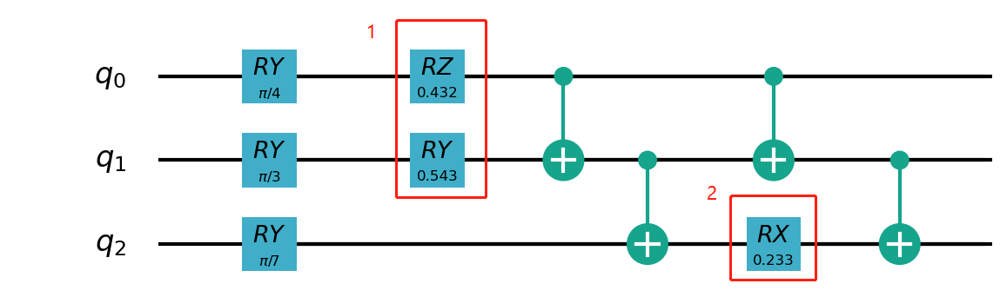
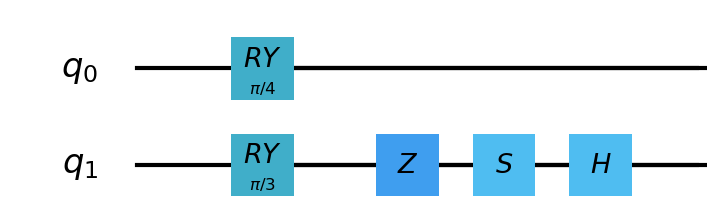
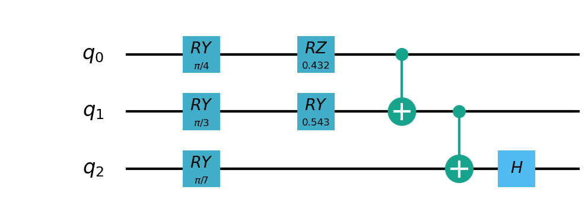
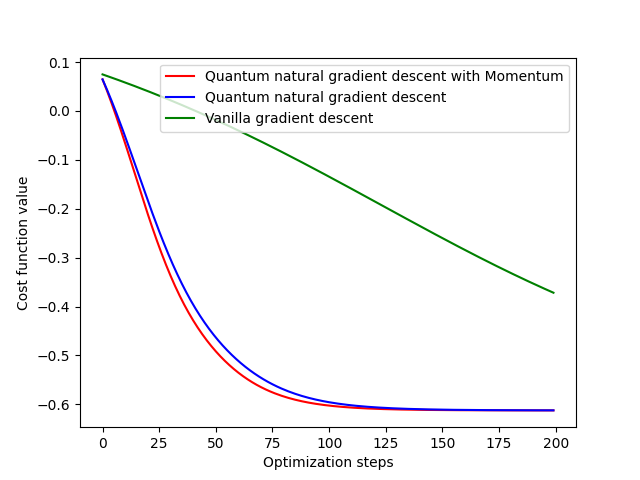

量子机器学习模块
==================================

量子计算层
----------------------------------

.. _QuantumLayer:

QuantumLayer
^^^^^^^^^^^^^^^^^^^^^^^^^^^^^^^^^

QuantumLayer是一个支持量子含参线路作为参数的自动求导模块的封装类。用户定义一个函数作为参数 ``qprog_with_measure`` ，该函数需要包含pyQPanda定义的量子线路：一般包含量子线路的编码线路，演化线路和测量操作。
该类可以嵌入量子经典混合机器学习模型，通过经典的梯度下降法，使得量子经典混合模型的目标函数或损失函数最小。
用户可通过参数 ``diff_method`` 指定 ``QuantumLayer`` 层中量子线路参数的梯度计算方式，``QuantumLayer`` 当前支持有限差分法 ``finite_diff`` 以及 ``parameter-shift`` 方法。

有限差分法是估算函数梯度最传统和最常用的数值方法之一。主要思想是用差分代替偏导数：

.. math::

    f^{\prime}(x)=\lim _{h \rightarrow 0} \frac{f(x+h)-f(x)}{h}

若使用 ``parameter-shift`` 方法，我们使用如下目标函数：

.. math:: O(\theta)=\left\langle 0\left|U^{\dagger}(\theta) H U(\theta)\right| 0\right\rangle

理论上可以通过 ``parameter-shift`` 这一更精确的方法计算量子线路中参数对哈密顿量的梯度：

.. math::

    \nabla O(\theta)=
    \frac{1}{2}\left[O\left(\theta+\frac{\pi}{2}\right)-O\left(\theta-\frac{\pi}{2}\right)\right]

.. py:class:: pyvqnet.qnn.quantumlayer.QuantumLayer(qprog_with_measure,para_num,machine_type_or_cloud_token,num_of_qubits:int,num_of_cbits:int = 1,diff_method:str = "parameter_shift",delta:float = 0.01)

    变分量子层的抽象计算模块。对一个参数化的量子线路进行仿真，得到测量结果。该变分量子层继承了VQNet框架的梯度计算模块，可以计算线路参数的梯度，训练变分量子线路模型或将变分量子线路嵌入混合量子和经典模型。

    :param qprog_with_measure: 用pyQPand构建的量子线路运行和测量函数。
    :param para_num: `int` - 参数个数。
    :param machine_type_or_cloud_token: qpanda量子虚拟机类型或pyQPANDA 量子云令牌 : https://pyqpanda-toturial.readthedocs.io/zh/latest/Realchip.html。
    :param num_of_qubits: 量子比特数。
    :param num_of_cbits: 经典比特数，默认为1。
    :param diff_method: 求解量子线路参数梯度的方法，“参数位移”或“有限差分”，默认参数偏移。
    :param delta: 有限差分计算梯度时的 \delta。
    :return: 一个可以计算量子线路的模块。

    .. note::
        qprog_with_measure是pyQPanda中定义的量子线路函数 :https://pyqpanda-toturial.readthedocs.io/zh/latest/QCircuit.html。
        
        此函数应包含以下参数，否则无法在QuantumLayer中正常运行。

        qprog_with_measure (input,param,qubits,cbits,m_machine)
        
            `input`: 输入一维经典数据。
            
            `param`: 输入一维量子线路的参数。
            
            `qubits`: 量子层分配的量子比特。
            
            `cbits`: cbits由QuantumLayer分配。如果线路不使用cbits，也应保留此参数。
            
            `m_machine`: QuantumLayer创建的模拟器。

    Example::

        import pyqpanda as pq
        from pyvqnet.qnn.measure import ProbsMeasure
        from pyvqnet.qnn.quantumlayer import QuantumLayer
        import numpy as np 
        from pyvqnet.tensor import QTensor
        def pqctest (input,param,qubits,cbits,m_machine):
            circuit = pq.QCircuit()
            circuit.insert(pq.H(qubits[0]))
            circuit.insert(pq.H(qubits[1])) 
            circuit.insert(pq.H(qubits[2]))
            circuit.insert(pq.H(qubits[3]))    

            circuit.insert(pq.RZ(qubits[0],input[0]))  
            circuit.insert(pq.RZ(qubits[1],input[1])) 
            circuit.insert(pq.RZ(qubits[2],input[2]))
            circuit.insert(pq.RZ(qubits[3],input[3]))

            circuit.insert(pq.CNOT(qubits[0],qubits[1]))
            circuit.insert(pq.RZ(qubits[1],param[0]))  
            circuit.insert(pq.CNOT(qubits[0],qubits[1]))

            circuit.insert(pq.CNOT(qubits[1],qubits[2]))
            circuit.insert(pq.RZ(qubits[2],param[1]))  
            circuit.insert(pq.CNOT(qubits[1],qubits[2]))

            circuit.insert(pq.CNOT(qubits[2],qubits[3]))
            circuit.insert(pq.RZ(qubits[3],param[2]))  
            circuit.insert(pq.CNOT(qubits[2],qubits[3]))
            #print(circuit)

            prog = pq.QProg()    
            prog.insert(circuit)    
            # pauli_dict  = {'Z0 X1':10,'Y2':-0.543}
            rlt_prob = ProbsMeasure([0,2],prog,m_machine,qubits)
            return rlt_prob

        pqc = QuantumLayer(pqctest,3,"CPU",4,1)
        #classic data as input       
        input = QTensor([[1,2,3,4],[40,22,2,3],[33,3,25,2]] )
        #forward circuits
        rlt = pqc(input)
        grad =  QTensor(np.ones(rlt.data.shape)*1000)
        #backward circuits
        rlt.backward(grad)
        print(rlt)
        # [
        # [0.2500000, 0.2500000, 0.2500000, 0.2500000],
        # [0.2500000, 0.2500000, 0.2500000, 0.2500000],
        # [0.2500000, 0.2500000, 0.2500000, 0.2500000]
        # ]

QuantumLayerV2
^^^^^^^^^^^^^^^^^^^^^^^^^^^^^^^^^

如您更加熟悉pyQPanda语法，可以使用QuantumLayerV2，自定义量子比特 ``qubits`` ,经典比特 ``cbits`` ,后端模拟器 ``machine`` 加入QuantumLayerV2的参数 ``qprog_with_measure`` 函数中。

.. py:class:: pyvqnet.qnn.quantumlayer.QuantumLayerV2(qprog_with_measure,para_num,diff_method:str = "parameter_shift",delta:float = 0.01)

	变分量子层的抽象计算模块。对一个参数化的量子线路进行仿真，得到测量结果。该变分量子层继承了VQNet框架的梯度计算模块，可以计算线路参数的梯度，训练变分量子线路模型或将变分量子线路嵌入混合量子和经典模型。
    
    :param qprog_with_measure: 用pyQPand构建的量子线路运行和测量函数。
    :param para_num: `int` - 参数个数。
    :param diff_method: 求解量子线路参数梯度的方法，“参数位移”或“有限差分”，默认参数偏移。
    :param delta: 有限差分计算梯度时的 \delta。
    :return: 一个可以计算量子线路的模块。

    .. note::
        qprog_with_measure是pyQPanda中定义的量子线路函数 :https://pyqpanda-toturial.readthedocs.io/zh/latest/QCircuit.html。
        
        此函数应包含以下参数，否则无法在QuantumLayerV2中正常运行。

        与QuantumLayer相比。应该分配量子比特和模拟器: https://pyqpanda-toturial.readthedocs.io/zh/latest/QuantumMachine.html,

        如果qprog_with_measure需要quantum measure，您可能还需要分配cbits: https://pyqpanda-toturial.readthedocs.io/zh/latest/Measure.html
        
        qprog_with_measure (input,param)
        
        `input`: 输入一维经典数据。
        
        `param`: 输入一维量子线路的参数。
        

    Example::

        import pyqpanda as pq
        from pyvqnet.qnn.measure import ProbsMeasure
        from pyvqnet.qnn.quantumlayer import QuantumLayerV2
        import numpy as np
        from pyvqnet.tensor import QTensor
        def pqctest (input,param):
            num_of_qubits = 4

            m_machine = pq.CPUQVM()# outside
            m_machine.init_qvm()# outside
            qubits = m_machine.qAlloc_many(num_of_qubits)

            circuit = pq.QCircuit()
            circuit.insert(pq.H(qubits[0]))
            circuit.insert(pq.H(qubits[1])) 
            circuit.insert(pq.H(qubits[2]))
            circuit.insert(pq.H(qubits[3]))    

            circuit.insert(pq.RZ(qubits[0],input[0]))  
            circuit.insert(pq.RZ(qubits[1],input[1])) 
            circuit.insert(pq.RZ(qubits[2],input[2]))
            circuit.insert(pq.RZ(qubits[3],input[3]))

            circuit.insert(pq.CNOT(qubits[0],qubits[1]))
            circuit.insert(pq.RZ(qubits[1],param[0]))  
            circuit.insert(pq.CNOT(qubits[0],qubits[1]))

            circuit.insert(pq.CNOT(qubits[1],qubits[2]))
            circuit.insert(pq.RZ(qubits[2],param[1]))  
            circuit.insert(pq.CNOT(qubits[1],qubits[2]))

            circuit.insert(pq.CNOT(qubits[2],qubits[3]))
            circuit.insert(pq.RZ(qubits[3],param[2]))  
            circuit.insert(pq.CNOT(qubits[2],qubits[3]))
            #print(circuit)

            prog = pq.QProg()    
            prog.insert(circuit)    
            rlt_prob = ProbsMeasure([0,2],prog,m_machine,qubits)
            return rlt_prob

        pqc = QuantumLayerV2(pqctest,3)

        #classic data as input       
        input = QTensor([[1,2,3,4],[4,2,2,3],[3,3,2,2]] )

        #forward circuits
        rlt = pqc(input)

        grad =  QTensor(np.ones(rlt.data.shape)*1000)
        #backward circuits
        rlt.backward(grad)
        print(rlt)

        # [
        # [0.2500000, 0.2500000, 0.2500000, 0.2500000],
        # [0.2500000, 0.2500000, 0.2500000, 0.2500000],
        # [0.2500000, 0.2500000, 0.2500000, 0.2500000]
        # ]
        

QuantumLayerMultiProcess
^^^^^^^^^^^^^^^^^^^^^^^^^^^^^^^^^

如您更加熟悉pyQPanda语法，可以使用QuantumLayerMultiProcess，自定义量子比特 ``qubits`` ,经典比特 ``cbits`` ,后端模拟器 ``machine`` 加入QuantumLayerMultiProcess的参数 ``qprog_with_measure`` 函数中。

.. py:class:: pyvqnet.qnn.quantumlayer.QuantumLayerMultiProcess(qprog_with_measure,para_num,machine_type_or_cloud_token,num_of_qubits: int,num_of_cbits: int = 1,diff_method:str = "parameter_shift",delta:float = 0.01)

	变分量子层的抽象计算模块。使用多进程技术对量子线路进行加速。
    
    该层对一个参数化的量子线路进行仿真，得到测量结果。该变分量子层继承了VQNet框架的梯度计算模块，可以计算线路参数的梯度，训练变分量子线路模型或将变分量子线路嵌入混合量子和经典模型。

    :param qprog_with_measure: 用pyQPand构建的量子线路运行和测量函数。
    :param para_num: `int` - 参数个数。
    :param machine_type_or_cloud_token: qpanda量子虚拟机类型或pyQPANDA 量子云令牌 : https://pyqpanda-toturial.readthedocs.io/zh/latest/Realchip.html。
    :param num_of_qubits: 量子比特数。
    :param num_of_cbits: 经典比特数，默认为1。
    :param diff_method: 求解量子线路参数梯度的方法，“参数位移”或“有限差分”，默认参数偏移。
    :param delta: 有限差分计算梯度时的 \delta。
    :return: 一个可以计算量子线路的模块。

    .. note::
        qprog_with_measure是pyQPanda中定义的量子线路函数 :https://pyqpanda-toturial.readthedocs.io/zh/latest/QCircuit.html。

        此函数应包含以下参数，否则无法在QuantumLayerMultiProcess中正常运行。

        与QuantumLayer相比。应该分配量子比特和模拟器: https://pyqpanda-toturial.readthedocs.io/zh/latest/QuantumMachine.html,

        如果qprog_with_measure需要quantum measure，您可能还需要分配cbits: https://pyqpanda-toturial.readthedocs.io/zh/latest/Measure.html

        qprog_with_measure (input,param)

        `input`: 输入一维经典数据。

        `param`: 输入一维量子线路的参数。

    Example::

        import pyqpanda as pq
        from pyvqnet.qnn.measure import ProbsMeasure
        from pyvqnet.qnn.quantumlayer import QuantumLayerMultiProcess
        import numpy as np
        from pyvqnet.tensor import QTensor
        def pqctest (input,param,nqubits,ncubits):
            machine = pq.CPUQVM()
            machine.init_qvm()
            qubits = machine.qAlloc_many(nqubits)
            circuit = pq.QCircuit()
            circuit.insert(pq.H(qubits[0]))
            circuit.insert(pq.H(qubits[1]))
            circuit.insert(pq.H(qubits[2]))
            circuit.insert(pq.H(qubits[3]))

            circuit.insert(pq.RZ(qubits[0],input[0]))
            circuit.insert(pq.RZ(qubits[1],input[1]))
            circuit.insert(pq.RZ(qubits[2],input[2]))
            circuit.insert(pq.RZ(qubits[3],input[3]))

            circuit.insert(pq.CNOT(qubits[0],qubits[1]))
            circuit.insert(pq.RZ(qubits[1],param[0]))
            circuit.insert(pq.CNOT(qubits[0],qubits[1]))

            circuit.insert(pq.CNOT(qubits[1],qubits[2]))
            circuit.insert(pq.RZ(qubits[2],param[1]))
            circuit.insert(pq.CNOT(qubits[1],qubits[2]))

            circuit.insert(pq.CNOT(qubits[2],qubits[3]))
            circuit.insert(pq.RZ(qubits[3],param[2]))
            circuit.insert(pq.CNOT(qubits[2],qubits[3]))
            #print(circuit)

            prog = pq.QProg()
            prog.insert(circuit)

            rlt_prob = ProbsMeasure([0,2],prog,machine,qubits)
            return rlt_prob

        pqc = QuantumLayerMultiProcess(pqctest,3,"cpu",4,1)
        #classic data as input
        input = QTensor([[1,2,3,4],[4,2,2,3],[3,3,2,2]] )
        #forward circuits
        rlt = pqc(input)
        grad = QTensor(np.ones(rlt.data.shape)*1000)
        #backward circuits
        rlt.backward(grad)
        print(rlt)

        # [
        # [0.2500000, 0.2500000, 0.2500000, 0.2500000],
        # [0.2500000, 0.2500000, 0.2500000, 0.2500000],
        # [0.2500000, 0.2500000, 0.2500000, 0.2500000]
        # ]

NoiseQuantumLayer
^^^^^^^^^^^^^^^^^^^

在真实的量子计算机中，受制于量子比特自身的物理特性，常常存在不可避免的计算误差。为了能在量子虚拟机中更好的模拟这种误差，VQNet同样支持含噪声量子虚拟机。含噪声量子虚拟机的模拟更贴近真实的量子计算机，我们可以自定义支持的逻辑门类型，自定义逻辑门支持的噪声模型。
现有可支持的量子噪声模型依据QPanda中定义，具体参考链接 `QPANDA2 <https://pyqpanda-toturial.readthedocs.io/zh/latest/NoiseQVM.html>`_ 中的介绍。

使用 NoiseQuantumLayer 定义一个量子线路自动微分类，该类支持QPanda噪声虚拟机。用户定义一个函数作为参数 ``qprog_with_measure`` ，该函数需要包含pyQPanda定义的量子线路，同样需要传入一个参数 ``noise_set_config``，使用pyQPanda接口，设置噪声模型。

.. py:class:: pyvqnet.qnn.quantumlayer.NoiseQuantumLayer(qprog_with_measure,para_num,machine_type,num_of_qubits:int,num_of_cbits:int=1,diff_method:str= "parameter_shift",delta:float=0.01,noise_set_config = None)

	变分量子层的抽象计算模块。对一个参数化的量子线路进行仿真，得到测量结果。该变分量子层继承了VQNet框架的梯度计算模块，可以计算线路参数的梯度，训练变分量子线路模型或将变分量子线路嵌入混合量子和经典模型。

    这一层可以在量子线路中使用噪声模型。

    :param qprog_with_measure: 用pyQPand构建的量子线路运行和测量函数。
    :param para_num: `int` - 参数个数。
    :param machine_type: qpanda机器类型。
    :param num_of_qubits: 量子比特数。
    :param num_of_cbits: 经典比特数，默认为1。
    :param diff_method: 求解量子线路参数梯度的方法，“参数位移”或“有限差分”，默认参数偏移。
    :param delta: 有限差分计算梯度时的 \delta。
    :param noise_set_config: 噪声设置函数。
    :return: 一个可以计算含噪声量子线路的模块。

    .. note::
        qprog_with_measure是pyQPanda中定义的量子线路函数 :https://pyqpanda-toturial.readthedocs.io/zh/latest/QCircuit.html。
        
        此函数应包含以下参数，否则无法在NoiseQuantumLayer中正常运行。
        
        qprog_with_measure (input,param,qubits,cbits,m_machine)
        
            `input`: 输入一维经典数据。
            
            `param`: 输入一维量子线路的参数。
            
            `qubits`: 量子层分配的量子比特。
            
            `cbits`: cbits由QuantumLayer分配。如果线路不使用cbits，也应保留此参数。
            
            `m_machine`: QuantumLayer创建的模拟器。

    Example::

        import pyqpanda as pq
        from pyvqnet.qnn.measure import ProbsMeasure
        from pyvqnet.qnn.quantumlayer import NoiseQuantumLayer
        import numpy as np
        from pyqpanda import * 
        from pyvqnet.tensor import QTensor
        def circuit(weights,param,qubits,cbits,machine):

            circuit = pq.QCircuit()

            circuit.insert(pq.H(qubits[0]))
            circuit.insert(pq.RY(qubits[0], weights[0]))
            circuit.insert(pq.RY(qubits[0], param[0]))
            prog = pq.QProg()
            prog.insert(circuit)
            prog << measure_all(qubits, cbits)

            result = machine.run_with_configuration(prog, cbits, 100)

            counts = np.array(list(result.values()))
            states = np.array(list(result.keys())).astype(float)
            # Compute probabilities for each state
            probabilities = counts / 100
            # Get state expectation
            expectation = np.sum(states * probabilities)
            return expectation

        def default_noise_config(qvm,q):

            p = 0.01
            qvm.set_noise_model(NoiseModel.BITFLIP_KRAUS_OPERATOR, GateType.PAULI_X_GATE, p)
            qvm.set_noise_model(NoiseModel.BITFLIP_KRAUS_OPERATOR, GateType.PAULI_Y_GATE, p)
            qvm.set_noise_model(NoiseModel.BITFLIP_KRAUS_OPERATOR, GateType.PAULI_Z_GATE, p)
            qvm.set_noise_model(NoiseModel.BITFLIP_KRAUS_OPERATOR, GateType.RX_GATE, p)
            qvm.set_noise_model(NoiseModel.BITFLIP_KRAUS_OPERATOR, GateType.RY_GATE, p)
            qvm.set_noise_model(NoiseModel.BITFLIP_KRAUS_OPERATOR, GateType.RZ_GATE, p)
            qvm.set_noise_model(NoiseModel.BITFLIP_KRAUS_OPERATOR, GateType.RY_GATE, p)
            qvm.set_noise_model(NoiseModel.BITFLIP_KRAUS_OPERATOR, GateType.HADAMARD_GATE, p)
            qves =[]
            for i in range(len(q)-1):
                qves.append([q[i],q[i+1]])#
            qves.append([q[len(q)-1],q[0]])
            qvm.set_noise_model(NoiseModel.DAMPING_KRAUS_OPERATOR, GateType.CNOT_GATE, p, qves)

            return qvm

        qvc = NoiseQuantumLayer(circuit,24,"noise",1,1,diff_method= "parameter_shift", delta=0.01,noise_set_config = default_noise_config)
        input = QTensor([
            [0.0000000, 1.0000000, 1.0000000, 1.0000000],

            [0.0000000, 0.0000000, 1.0000000, 1.0000000],

            [1.0000000, 0.0000000, 1.0000000, 1.0000000]
            ] )
        rlt = qvc(input)
        grad =  QTensor(np.ones(rlt.data.shape)*1000)

        rlt.backward(grad)
        print(qvc.m_para.grad)

        #[1195.0000000, 105.0000000, 70.0000000, 0.0000000, 
        # 45.0000000, -45.0000000, 50.0000000, 15.0000000, 
        # -80.0000000, 50.0000000, 10.0000000, -30.0000000, 
        # 10.0000000, 60.0000000, 75.0000000, -110.0000000, 
        # 55.0000000, 45.0000000, 25.0000000, 5.0000000, 
        # 5.0000000, 50.0000000, -25.0000000, -15.0000000]

下面给出一个 ``noise_set_config`` 的例子，这里使得 ``RX`` , ``RY`` , ``RZ`` , ``X`` , ``Y`` , ``Z`` , ``H`` 等逻辑门加入了 p = 0.01 的 BITFLIP_KRAUS_OPERATOR噪声模型。

.. code-block::

	def noise_set_config(qvm,q):

		p = 0.01
		qvm.set_noise_model(NoiseModel.BITFLIP_KRAUS_OPERATOR, GateType.PAULI_X_GATE, p)
		qvm.set_noise_model(NoiseModel.BITFLIP_KRAUS_OPERATOR, GateType.PAULI_Y_GATE, p)
		qvm.set_noise_model(NoiseModel.BITFLIP_KRAUS_OPERATOR, GateType.PAULI_Z_GATE, p)
		qvm.set_noise_model(NoiseModel.BITFLIP_KRAUS_OPERATOR, GateType.RX_GATE, p)
		qvm.set_noise_model(NoiseModel.BITFLIP_KRAUS_OPERATOR, GateType.RY_GATE, p)
		qvm.set_noise_model(NoiseModel.BITFLIP_KRAUS_OPERATOR, GateType.RZ_GATE, p)
		qvm.set_noise_model(NoiseModel.BITFLIP_KRAUS_OPERATOR, GateType.RY_GATE, p)
		qvm.set_noise_model(NoiseModel.BITFLIP_KRAUS_OPERATOR, GateType.HADAMARD_GATE, p)
		qves =[]
		for i in range(len(q)-1):
			qves.append([q[i],q[i+1]])#
		qves.append([q[len(q)-1],q[0]])
		qvm.set_noise_model(NoiseModel.DAMPING_KRAUS_OPERATOR, GateType.CNOT_GATE, p, qves)

		return qvm
		
VQCLayer
^^^^^^^^^^^^^^^^^^^^^^^^

基于pyQPanda的可变量子线路VariationalQuantumCircuit，VQNet提供了抽象量子计算层 ``VQCLayer`` 。用户只需要定义一个类 ``VQC_wrapper`` ，
其中定义相应的量子线路逻辑门和测量函数即可基于pyQPanda的 ``VariationalQuantumCircuit`` ，进行机器学习模型的构建。

在 ``VQC_wrapper`` 中，用户使用普通逻辑门函数 ``build_common_circuits`` 构建模型中线路结构变化的子线路，使用VQG在 ``build_vqc_circuits`` 构建结构不变，参数变化的子线路。使用
``run`` 函数定义线路运行方式以及测量。

.. py:class:: pyvqnet.qnn.quantumlayer.VQC_wrapper

    ``VQC_wrapper`` 是一个抽象类，用于在VQNet上运行VariationalQuantumCircuit。

    ``build_common_circuits`` 线路根据输入的不同而变化。

    ``build_vqc_circuits`` 构建带有可训练重量的VQC线路。

    ``run`` VQC的运行函数。
    
    Example::

        import pyqpanda as pq
        from pyqpanda import *
        from pyvqnet.qnn.quantumlayer import VQCLayer,VQC_wrapper
        class QVC_demo(VQC_wrapper):
            
            def __init__(self):
                super(QVC_demo, self).__init__()

            def build_common_circuits(self,input,qlists,):
                qc = pq.QCircuit()
                for i in range(len(qlists)):
                    if input[i]==1:
                        qc.insert(pq.X(qlists[i]))
                return qc
                
            def build_vqc_circuits(self,input,weights,machine,qlists,clists):

                def get_cnot(qubits):
                    vqc = VariationalQuantumCircuit()
                    for i in range(len(qubits)-1):
                        vqc.insert(pq.VariationalQuantumGate_CNOT(qubits[i],qubits[i+1]))
                    vqc.insert(pq.VariationalQuantumGate_CNOT(qubits[len(qubits)-1],qubits[0]))
                    return vqc

                def build_circult(weights, xx, qubits,vqc):
                    
                    def Rot(weights_j, qubits):
                        vqc = VariationalQuantumCircuit()
                        
                        vqc.insert(pq.VariationalQuantumGate_RZ(qubits, weights_j[0]))
                        vqc.insert(pq.VariationalQuantumGate_RY(qubits, weights_j[1]))
                        vqc.insert(pq.VariationalQuantumGate_RZ(qubits, weights_j[2]))
                        return vqc

                    #2,4,3
                    for i in range(2):
                        
                        weights_i = weights[i,:,:]
                        for j in range(len(qubits)):
                            weights_j = weights_i[j]
                            vqc.insert(Rot(weights_j,qubits[j]))
                        cnots = get_cnot(qubits)  
                        vqc.insert(cnots) 

                    vqc.insert(pq.VariationalQuantumGate_Z(qubits[0]))#pauli z(0)

                    return vqc
                
                weights = weights.reshape([2,4,3])
                vqc = VariationalQuantumCircuit()
                return build_circult(weights, input,qlists,vqc)

将该实例化对象 ``VQC_wrapper`` 作为参数传入 ``VQCLayer``

.. py:class:: pyvqnet.qnn.quantumlayer.VQCLayer(vqc_wrapper,para_num,machine_type_or_cloud_token,num_of_qubits:int,num_of_cbits:int = 1,diff_method:str = "parameter_shift",delta:float = 0.01)

    pyQPanda中变分量子线路的抽象计算模块。详情请访问： https://pyqpanda-toturial.readthedocs.io/zh/latest/VQG.html。
    
    :param vqc_wrapper: VQC_wrapper类。
    :param para_num: `int` - 参数个数。
    :param machine_type: qpanda机器类型。
    :param num_of_qubits: 量子比特数。
    :param num_of_cbits: 经典比特数，默认为1。
    :param diff_method: 求解量子线路参数梯度的方法，“参数位移”或“有限差分”，默认参数偏移。
    :param delta: 有限差分计算梯度时的 \delta。
    :return: 一个可以计算量子VQC线路的模块。

    Example::

        import pyqpanda as pq
        from pyqpanda import *
        from pyvqnet.qnn.quantumlayer import VQCLayer,VQC_wrapper

        class QVC_demo(VQC_wrapper):
            
            def __init__(self):
                super(QVC_demo, self).__init__()

            def build_common_circuits(self,input,qlists,):
                qc = pq.QCircuit()
                for i in range(len(qlists)):
                    if input[i]==1:
                        qc.insert(pq.X(qlists[i]))
                return qc
                
            def build_vqc_circuits(self,input,weights,machine,qlists,clists):

                def get_cnot(qubits):
                    vqc = VariationalQuantumCircuit()
                    for i in range(len(qubits)-1):
                        vqc.insert(pq.VariationalQuantumGate_CNOT(qubits[i],qubits[i+1]))
                    vqc.insert(pq.VariationalQuantumGate_CNOT(qubits[len(qubits)-1],qubits[0]))
                    return vqc

                def build_circult(weights, xx, qubits,vqc):
                    
                    def Rot(weights_j, qubits):
                        vqc = VariationalQuantumCircuit()
                        
                        vqc.insert(pq.VariationalQuantumGate_RZ(qubits, weights_j[0]))
                        vqc.insert(pq.VariationalQuantumGate_RY(qubits, weights_j[1]))
                        vqc.insert(pq.VariationalQuantumGate_RZ(qubits, weights_j[2]))
                        return vqc

                    #2,4,3
                    for i in range(2):
                        
                        weights_i = weights[i,:,:]
                        for j in range(len(qubits)):
                            weights_j = weights_i[j]
                            vqc.insert(Rot(weights_j,qubits[j]))
                        cnots = get_cnot(qubits)  
                        vqc.insert(cnots) 

                    vqc.insert(pq.VariationalQuantumGate_Z(qubits[0]))#pauli z(0)

                    return vqc
                
                weights = weights.reshape([2,4,3])
                vqc = VariationalQuantumCircuit()
                return build_circult(weights, input,qlists,vqc)
            
            def run(self,vqc,input,machine,qlists,clists):

                prog = QProg()
                vqc_all = VariationalQuantumCircuit()
                # add encode circuits
                vqc_all.insert(self.build_common_circuits(input,qlists))
                vqc_all.insert(vqc)
                qcir = vqc_all.feed()
                prog.insert(qcir)
                #print(pq.convert_qprog_to_originir(prog, machine))
                prob = machine.prob_run_dict(prog, qlists[0], -1)
                prob = list(prob.values())
            
                return prob

        qvc_vqc = QVC_demo()
        VQCLayer(qvc_vqc,24,"CPU",4)

Qconv
^^^^^^^^^^^^^^^^^^^^^^^^

Qconv是一种量子卷积算法接口。
量子卷积操作采用量子线路对经典数据进行卷积操作，其无需计算乘法和加法操作，只需将数据编码到量子态，然后通过量子线路进行演化操作和测量得到最终的卷积结果。
根据卷积核的范围中的输入数据数量申请相同数量的量子比特，然后构建量子线路进行计算。

.. image:: ./images/qcnn.png

其量子线路由每个qubit上首先插入 :math:`RY` , :math:`RZ` 门进行编码，接着在任意两个qubit上使用 :math:`Z` 以及 :math:`U3` 进行信息纠缠和交换。下图为4qubits的例子

.. image:: ./images/qcnn_cir.png

.. py:class:: pyvqnet.qnn.qcnn.qconv.QConv(input_channels,output_channels,quantum_number,stride=(1, 1),padding=(0, 0),kernel_initializer=normal,machine:str = "CPU"))

	量子卷积模块。用量子线路取代Conv2D内核，conv模块的输入为形状（批次大小、输入通道、高度、宽度） `Samuel et al. (2020) <https://arxiv.org/abs/2012.12177>`_ 。

    :param input_channels: `int` - 输入通道数。
    :param output_channels: `int` - 输出通道数。
    :param quantum_number: `int` - 单个内核的大小。
    :param stride: `tuple` - 步长，默认为（1,1）。
    :param padding: `tuple` - 填充，默认为（0，0）。
    :param kernel_initializer: `callable` - 默认为正态分布。
    :param machine: `str` - 使用的虚拟机，默认使用CPU模拟。
    :return: 量子卷积层。
    
    Example::

        from pyvqnet.tensor import tensor
        from pyvqnet.qnn.qcnn.qconv import QConv
        x = tensor.ones([1,3,4,4])
        layer = QConv(input_channels=3, output_channels=2, quantum_number=4, stride=(2, 2))
        y = layer(x)
        print(y)

        # [
        # [[[-0.0889078, -0.0889078],
        #  [-0.0889078, -0.0889078]],
        # [[0.7992646, 0.7992646],
        #  [0.7992646, 0.7992646]]]
        # ]

QLinear
^^^^^^^^^^

QLinear 实现了一种量子全连接算法。首先将数据编码到量子态，然后通过量子线路进行演化操作和测量得到最终的全连接结果。

.. image:: ./images/qlinear_cir.png

.. py:class:: pyvqnet.qnn.qlinear.QLinear(input_channels,output_channels,machine: str = "CPU"))

    量子全连接模块。全连接模块的输入为形状（输入通道、输出通道）。

    :param input_channels: `int` - 输入通道数。
    :param output_channels: `int` - 输出通道数。
    :param machine: `str` - 使用的虚拟机，默认使用CPU模拟。
    :return: 量子全连接层。

    Exmaple::

        from pyvqnet.tensor import QTensor
        from pyvqnet.qnn.qlinear import QLinear
        params = [[0.37454012, 0.95071431, 0.73199394, 0.59865848, 0.15601864, 0.15599452], 
        [1.37454012, 0.95071431, 0.73199394, 0.59865848, 0.15601864, 0.15599452],
        [1.37454012, 1.95071431, 0.73199394, 0.59865848, 0.15601864, 0.15599452],
        [1.37454012, 1.95071431, 1.73199394, 1.59865848, 0.15601864, 0.15599452]]
        m = QLinear(6, 2)
        input = QTensor(params, requires_grad=True)
        output = m(input)
        output.backward()
        print(output)

        #[
        #[0.0568473, 0.1264389],
        #[0.1524036, 0.1264389],
        #[0.1524036, 0.1442845],
        #[0.1524036, 0.1442845]
        #]

量子逻辑门
----------------------------------

处理量子比特的方式就是量子逻辑门。 使用量子逻辑门，我们有意识的使量子态发生演化。量子逻辑门是构成量子算法的基础。

基本量子逻辑门
^^^^^^^^^^^^^^^^^^^^^^^^^^^^^^^^^

在VQNet中，我们使用本源量子自研的 `pyQPanda <https://pyqpanda-toturial.readthedocs.io/zh/latest/>`_ 的各个逻辑门搭建量子线路，进行量子模拟。
当前pyQPanda支持的逻辑门可参考pyQPanda `量子逻辑门 <https://pyqpanda-toturial.readthedocs.io/zh/latest/>`_ 部分的定义。
此外VQNet还封装了部分在量子机器学习中常用的量子逻辑门组合：

BasicEmbeddingCircuit
^^^^^^^^^^^^^^^^^^^^^^^^^^^^^^^^^

.. py:function:: pyvqnet.qnn.template.BasicEmbeddingCircuit(input_feat,qlist)

    将n个二进制特征编码为n个量子比特的基态。

    例如, 对于 ``features=([0, 1, 1])``, 在量子系统下其基态为 :math:`|011 \rangle`。

    :param input_feat:  ``(n)`` 大小的二进制输入。
    :param qlist: 构建该模板线路量子比特。
    :return: 量子线路。

    Example::
        
        import numpy as np
        import pyqpanda as pq
        from pyvqnet.qnn.template import BasicEmbeddingCircuit
        input_feat = np.array([0,1,1]).reshape([3])
        m_machine = pq.init_quantum_machine(pq.QMachineType.CPU)

        qlist = m_machine.qAlloc_many(3)
        circuit = BasicEmbeddingCircuit(input_feat,qlist)
        print(circuit)

        #           ┌─┐
        # q_0:  |0>─┤X├
        #           ├─┤
        # q_1:  |0>─┤X├
        #           └─┘

AngleEmbeddingCircuit
^^^^^^^^^^^^^^^^^^^^^^^^^^^^^^^^^

.. py:function:: pyvqnet.qnn.template.AngleEmbeddingCircuit(input_feat,qubits,rotation:str='X')

    将 :math:`N` 特征编码到 :math:`n` 量子比特的旋转角度中, 其中 :math:`N \leq n`。

    旋转可以选择为 : 'X' , 'Y' , 'Z', 如 ``rotation`` 的参数定义为:

    * ``rotation='X'`` 将特征用作RX旋转的角度。

    * ``rotation='Y'`` 将特征用作RY旋转的角度。

    * ``rotation='Z'`` 将特征用作RZ旋转的角度。

     ``features`` 的长度必须小于或等于量子比特的数量。如果 ``features`` 中的长度少于量子比特，则线路不应用剩余的旋转门。

    :param input_feat: 表示参数的numpy数组。
    :param qubits: pyQPanda分配的量子比特。
    :param rotation: 使用什么旋转，默认为“X”。
    :return: 量子线路。

    Example::

        import numpy as np
        import pyqpanda as pq
        from pyvqnet.qnn.template import AngleEmbeddingCircuit
        m_machine = pq.init_quantum_machine(pq.QMachineType.CPU)
        m_qlist = m_machine.qAlloc_many(2)
        m_clist = m_machine.cAlloc_many(2)
        m_prog = pq.QProg()

        input_feat = np.array([2.2, 1])
        C = AngleEmbeddingCircuit(input_feat,m_qlist,'X')
        print(C)
        C = AngleEmbeddingCircuit(input_feat,m_qlist,'Y')
        print(C)
        C = AngleEmbeddingCircuit(input_feat,m_qlist,'Z')
        print(C)
        pq.destroy_quantum_machine(m_machine)

        #           ┌────────────┐
        # q_0:  |0>─┤RX(2.200000)├
        #           ├────────────┤
        # q_1:  |0>─┤RX(1.000000)├
        #           └────────────┘

        #           ┌────────────┐
        # q_0:  |0>─┤RY(2.200000)├
        #           ├────────────┤
        # q_1:  |0>─┤RY(1.000000)├
        #           └────────────┘

        #           ┌────────────┐
        # q_0:  |0>─┤RZ(2.200000)├
        #           ├────────────┤
        # q_1:  |0>─┤RZ(1.000000)├
        #           └────────────┘

AmplitudeEmbeddingCircuit
^^^^^^^^^^^^^^^^^^^^^^^^^^^^^^^^^

.. py:function:: pyvqnet.qnn.template.AmplitudeEmbeddingCircuit(input_feat,qubits)

    将 :math:`2^n` 特征编码为 :math:`n` 量子比特的振幅向量。为了表示一个有效的量子态向量， ``features`` 的L2范数必须是1。

    :param input_feat: 表示参数的numpy数组。
    :param qubits: pyQPanda分配的量子比特列表。
    :return: 量子线路。

    Example::

        import numpy as np
        import pyqpanda as pq
        from pyvqnet.qnn.template import AmplitudeEmbeddingCircuit
        input_feat = np.array([2.2, 1, 4.5, 3.7])
        m_machine = pq.init_quantum_machine(pq.QMachineType.CPU)
        m_qlist = m_machine.qAlloc_many(2)
        m_clist = m_machine.cAlloc_many(2)
        m_prog = pq.QProg()
        cir = AmplitudeEmbeddingCircuit(input_feat,m_qlist)
        print(cir)
        pq.destroy_quantum_machine(m_machine)

        #                              ┌────────────┐     ┌────────────┐
        # q_0:  |0>─────────────── ─── ┤RY(0.853255)├ ─── ┤RY(1.376290)├
        #           ┌────────────┐ ┌─┐ └──────┬─────┘ ┌─┐ └──────┬─────┘
        # q_1:  |0>─┤RY(2.355174)├ ┤X├ ───────■────── ┤X├ ───────■──────
        #           └────────────┘ └─┘                └─┘

IQPEmbeddingCircuits
^^^^^^^^^^^^^^^^^^^^^^^^^^^^^^^^^

.. py:function:: pyvqnet.qnn.template.IQPEmbeddingCircuits(input_feat,qubits,rep:int = 1)

    使用IQP线路的对角门将 :math:`n` 特征编码为 :math:`n` 量子比特。

    编码是由 `Havlicek et al. (2018) <https://arxiv.org/pdf/1804.11326.pdf>`_ 提出。

    通过指定 ``n_repeats`` ，可以重复基本IQP线路。

    :param input_feat: 表示参数的numpy数组。
    :param qubits: pyQPanda分配的量子比特列表。
    :param rep: 重复量子线路块,默认次数1。
    :return: 量子线路。

    Example::

        import numpy as np
        import pyqpanda as pq
        from pyvqnet.qnn.template import IQPEmbeddingCircuits
        m_machine = pq.init_quantum_machine(pq.QMachineType.CPU)
        input_feat = np.arange(1,100)
        qlist = m_machine.qAlloc_many(3)
        circuit = IQPEmbeddingCircuits(input_feat,qlist,rep = 1)
        print(circuit)

        #           ┌─┐ ┌────────────┐
        # q_0:  |0>─┤H├ ┤RZ(1.000000)├ ───■── ────────────── ───■── ───■── ────────────── ───■── ────── ────────────── ──────
        #           ├─┤ ├────────────┤ ┌──┴─┐ ┌────────────┐ ┌──┴─┐    │                     │
        # q_1:  |0>─┤H├ ┤RZ(2.000000)├ ┤CNOT├ ┤RZ(2.000000)├ ┤CNOT├ ───┼── ────────────── ───┼── ───■── ────────────── ───■──
        #           ├─┤ ├────────────┤ └────┘ └────────────┘ └────┘ ┌──┴─┐ ┌────────────┐ ┌──┴─┐ ┌──┴─┐ ┌────────────┐ ┌──┴─┐
        # q_2:  |0>─┤H├ ┤RZ(3.000000)├ ────── ────────────── ────── ┤CNOT├ ┤RZ(3.000000)├ ┤CNOT├ ┤CNOT├ ┤RZ(3.000000)├ ┤CNOT├
        #           └─┘ └────────────┘                              └────┘ └────────────┘ └────┘ └────┘ └────────────┘ └────┘

RotCircuit
^^^^^^^^^^^^^^^^^^^^^^^^^^^^^^^^^

.. py:function:: pyvqnet.qnn.template.RotCircuit(para,qubits)

    任意单量子比特旋转。qlist的数量应该是1，参数的数量应该是3。

    .. math::

        R(\phi,\theta,\omega) = RZ(\omega)RY(\theta)RZ(\phi)= \begin{bmatrix}
        e^{-i(\phi+\omega)/2}\cos(\theta/2) & -e^{i(\phi-\omega)/2}\sin(\theta/2) \\
        e^{-i(\phi-\omega)/2}\sin(\theta/2) & e^{i(\phi+\omega)/2}\cos(\theta/2)
        \end{bmatrix}.

    :param para: 表示参数  :math:`[\phi, \theta, \omega]` 的numpy数组。
    :param qubits: pyQPanda分配的量子比特，只接受单个量子比特。
    :return: 量子线路。

    Example::

        import numpy as np
        import pyqpanda as pq
        from pyvqnet.tensor import QTensor
        from pyvqnet.qnn.template import RotCircuit
        m_machine = pq.init_quantum_machine(pq.QMachineType.CPU)
        m_clist = m_machine.cAlloc_many(2)
        m_prog = pq.QProg()
        m_qlist = m_machine.qAlloc_many(1)
        param = np.array([3,4,5])
        c = RotCircuit(QTensor(param),m_qlist)
        print(c)
        pq.destroy_quantum_machine(m_machine)

        #           ┌────────────┐ ┌────────────┐ ┌────────────┐
        # q_0:  |0>─┤RZ(5.000000)├ ┤RY(4.000000)├ ┤RZ(3.000000)├
        #           └────────────┘ └────────────┘ └────────────┘

CRotCircuit
^^^^^^^^^^^^^^^^^^^^^^^^^^^^^^^^^

.. py:function:: pyvqnet.qnn.template.CRotCircuit(para,control_qubits,rot_qubits)

	受控Rot操作符。

    .. math:: CR(\phi, \theta, \omega) = \begin{bmatrix}
            1 & 0 & 0 & 0 \\
            0 & 1 & 0 & 0\\
            0 & 0 & e^{-i(\phi+\omega)/2}\cos(\theta/2) & -e^{i(\phi-\omega)/2}\sin(\theta/2)\\
            0 & 0 & e^{-i(\phi-\omega)/2}\sin(\theta/2) & e^{i(\phi+\omega)/2}\cos(\theta/2)
        \end{bmatrix}.
    
    :param para: 表示参数  :math:`[\phi, \theta, \omega]` 的numpy数组。
    :param control_qubits: pyQPanda分配的控制量子比特，量子比特的数量应为1。
    :param rot_qubits: 由pyQPanda分配的Rot量子比特，量子比特的数量应为1。
    :return: 量子线路。

    Example::

        import numpy as np
        import pyqpanda as pq
        from pyvqnet.tensor import QTensor
        from pyvqnet.qnn.template import CRotCircuit
        m_machine = pq.init_quantum_machine(pq.QMachineType.CPU)
        m_clist = m_machine.cAlloc_many(2)
        m_prog = pq.QProg()
        m_qlist = m_machine.qAlloc_many(1)
        param = np.array([3,4,5])
        control_qlist = m_machine.qAlloc_many(1)
        c = CRotCircuit(QTensor(param),control_qlist,m_qlist)
        print(c)
        pq.destroy_quantum_machine(m_machine)

        #           ┌────────────┐ ┌────────────┐ ┌────────────┐
        # q_0:  |0>─┤RZ(5.000000)├ ┤RY(4.000000)├ ┤RZ(3.000000)├
        #           └──────┬─────┘ └──────┬─────┘ └──────┬─────┘
        # q_1:  |0>────────■────── ───────■────── ───────■──────

CSWAPcircuit
^^^^^^^^^^^^^^^^^^^^^^^^^^^^^^^^^

.. py:function:: pyvqnet.qnn.template.CSWAPcircuit(qubits)

    受控SWAP线路。

    .. math:: CSWAP = \begin{bmatrix}
            1 & 0 & 0 & 0 & 0 & 0 & 0 & 0 \\
            0 & 1 & 0 & 0 & 0 & 0 & 0 & 0 \\
            0 & 0 & 1 & 0 & 0 & 0 & 0 & 0 \\
            0 & 0 & 0 & 1 & 0 & 0 & 0 & 0 \\
            0 & 0 & 0 & 0 & 1 & 0 & 0 & 0 \\
            0 & 0 & 0 & 0 & 0 & 0 & 1 & 0 \\
            0 & 0 & 0 & 0 & 0 & 1 & 0 & 0 \\
            0 & 0 & 0 & 0 & 0 & 0 & 0 & 1
        \end{bmatrix}.

    .. note:: 提供的第一个量子比特对应于 **control qubit** 。

    :param qubits: pyQPanda分配的量子比特列表第一个量子比特是控制量子比特。qlist的长度必须为3。
    :return: 量子线路。

    Example::

        from pyvqnet.qnn.template import CSWAPcircuit
        import pyqpanda as pq
        m_machine = pq.init_quantum_machine(pq.QMachineType.CPU)

        m_qlist = m_machine.qAlloc_many(3)

        c = CSWAPcircuit([m_qlist[1],m_qlist[2],m_qlist[0]])
        print(c)
        pq.destroy_quantum_machine(m_machine)

        # q_0:  |0>─X─
        #           │
        # q_1:  |0>─■─
        #           │
        # q_2:  |0>─X─

常用量子线路
----------------------------------
VQNet提供了量子机器学习研究中常用的一些量子线路

HardwareEfficientAnsatz
^^^^^^^^^^^^^^^^^^^^^^^^^^^^^^^^^

.. py:class:: pyvqnet.qnn.ansatz.HardwareEfficientAnsatz(n_qubits,single_rot_gate_list,qubits,entangle_gate="CNOT",entangle_rules='linear',depth=1)

    论文介绍的Hardware Efficient Ansatz的实现： `Hardware-efficient Variational Quantum Eigensolver for Small Molecules <https://arxiv.org/pdf/1704.05018.pdf>`__ 。

    :param n_qubits: 量子比特数。
    :param single_rot_gate_list: 单个量子位旋转门列表由一个或多个作用于每个量子位的旋转门构成。目前支持 Rx、Ry、Rz。
    :param qubits: 由 pyqpanda 分配的量子位。
    :param entangle_gate: 非参数化纠缠门。支持CNOT、CZ。默认: CNOT。
    :param entangle_rules: 电路中如何使用纠缠门。 ``linear`` 意味着纠缠门将作用于每个相邻的量子位。 ``all`` 意味着纠缠门将作用于任何两个 qbuits。 默认值：``linear``。
    :param depth: ansatz 的深度，默认：1。

    Example::

        import pyqpanda as pq
        from pyvqnet.tensor import QTensor,tensor
        from pyvqnet.qnn import HardwareEfficientAnsatz
        machine = pq.CPUQVM()
        machine.init_qvm()
        qlist = machine.qAlloc_many(4)
        c = HardwareEfficientAnsatz(4, ["rx", "RY", "rz"],
                                    qlist,
                                    entangle_gate="cnot",
                                    entangle_rules="linear",
                                    depth=1)
        w = tensor.ones([c.get_para_num()])

        cir = c.create_ansatz(w)
        print(cir)
        #           ┌────────────┐ ┌────────────┐ ┌────────────┐        ┌────────────┐ ┌────────────┐ ┌────────────┐
        # q_0:  |0>─┤RX(1.000000)├ ┤RY(1.000000)├ ┤RZ(1.000000)├ ───■── ┤RX(1.000000)├ ┤RY(1.000000)├ ┤RZ(1.000000)├ ────────────── ────────────── 
        #           ├────────────┤ ├────────────┤ ├────────────┤ ┌──┴─┐ └────────────┘ ├────────────┤ ├────────────┤ ┌────────────┐
        # q_1:  |0>─┤RX(1.000000)├ ┤RY(1.000000)├ ┤RZ(1.000000)├ ┤CNOT├ ───■────────── ┤RX(1.000000)├ ┤RY(1.000000)├ ┤RZ(1.000000)├ ──────────────     
        #           ├────────────┤ ├────────────┤ ├────────────┤ └────┘ ┌──┴─┐         └────────────┘ ├────────────┤ ├────────────┤ ┌────────────┐     
        # q_2:  |0>─┤RX(1.000000)├ ┤RY(1.000000)├ ┤RZ(1.000000)├ ────── ┤CNOT├──────── ───■────────── ┤RX(1.000000)├ ┤RY(1.000000)├ ┤RZ(1.000000)├     
        #           ├────────────┤ ├────────────┤ ├────────────┤        └────┘         ┌──┴─┐         ├────────────┤ ├────────────┤ ├────────────┤     
        # q_3:  |0>─┤RX(1.000000)├ ┤RY(1.000000)├ ┤RZ(1.000000)├ ────── ────────────── ┤CNOT├──────── ┤RX(1.000000)├ ┤RY(1.000000)├ ┤RZ(1.000000)├     
        #           └────────────┘ └────────────┘ └────────────┘                       └────┘         └────────────┘ └────────────┘ └────────────┘     

BasicEntanglerTemplate
^^^^^^^^^^^^^^^^^^^^^^^^^^^^^^^^^

.. py:class:: pyvqnet.qnn.template.BasicEntanglerTemplate(weights=None, num_qubits=1, rotation=pyqpanda.RX)

    由每个量子位上的单参数单量子位旋转组成的层，后跟一个闭合链或环组合的多个CNOT 门。

    CNOT 门环将每个量子位与其邻居连接起来，最后一个量子位被认为是第一个量子位的邻居。

    层数 :math:`L` 由参数 ``weights`` 的第一个维度决定。

    :param weights: 形状的权重张量 `(L, len(qubits))`。 每个权重都用作量子含参门中的参数。默认值为： ``None`` ，则使用 `(1,1)` 正态分布随机数作为权重。
    :param num_qubits: 量子比特数,默认为1。
    :param rotation: 使用单参数单量子比特门，``pyqpanda.RX`` 被用作默认值。

    Example::

        import pyqpanda as pq
        import numpy as np
        from pyvqnet.qnn.template import BasicEntanglerTemplate
        np.random.seed(42)
        num_qubits = 5
        shape = [1, num_qubits]
        weights = np.random.random(size=shape)

        machine = pq.CPUQVM()
        machine.init_qvm()
        qubits = machine.qAlloc_many(num_qubits)

        circuit = BasicEntanglerTemplate(weights=weights, num_qubits=num_qubits, rotation=pq.RZ)
        result = circuit.create_circuit(qubits)
        circuit.print_circuit(qubits)

        prob = machine.prob_run_dict(result, qubits[0], -1)
        prob = list(prob.values())
        print(prob)
        #           ┌────────────┐                             ┌────┐
        # q_0:  |0>─┤RZ(0.374540)├ ───■── ────── ────── ────── ┤CNOT├
        #           ├────────────┤ ┌──┴─┐                      └──┬─┘
        # q_1:  |0>─┤RZ(0.950714)├ ┤CNOT├ ───■── ────── ────── ───┼──
        #           ├────────────┤ └────┘ ┌──┴─┐                  │
        # q_2:  |0>─┤RZ(0.731994)├ ────── ┤CNOT├ ───■── ────── ───┼──
        #           ├────────────┤        └────┘ ┌──┴─┐           │
        # q_3:  |0>─┤RZ(0.598658)├ ────── ────── ┤CNOT├ ───■── ───┼──
        #           ├────────────┤               └────┘ ┌──┴─┐    │
        # q_4:  |0>─┤RZ(0.156019)├ ────── ────── ────── ┤CNOT├ ───■──
        #           └────────────┘                      └────┘

        # [1.0, 0.0]

StronglyEntanglingTemplate
^^^^^^^^^^^^^^^^^^^^^^^^^^^^^^^^^

.. py:class:: pyvqnet.qnn.template.StronglyEntanglingTemplate(weights=None, num_qubits=1, ranges=None)

    由单个量子比特旋转和纠缠器组成的层,参考 `circuit-centric classifier design <https://arxiv.org/abs/1804.00633>`__ .

    参数 ``weights`` 包含每一层的权重。 因此得出层数 :math:`L` 等于 ``weights`` 的第一个维度。

    其包含2-qubit CNOT 门，作用于 :math:`M` 个量子比特上，:math:`i = 1,...,M`。 每个门的第二个量子位标号由公式 :math:`(i+r)\mod M` 给出，其中 :math:`r` 是一个称为 ``range``  的超参数，并且 :math:`0 < r < M`。

    :param weights: 形状为 ``(L, M, 3)`` 的权重张量，默认值：None，使用形状为 ``(1,1,3)`` 的随机张量。
    :param num_qubits: 量子比特数，默认值：1。
    :param ranges: 确定每个后续层的范围超参数的序列； 默认值：None，使用 :math:`r=l \ mod M` 作为ranges 的值。

    Example::

        import pyqpanda as pq
        import numpy as np
        from pyvqnet.qnn.template import StronglyEntanglingTemplate
        np.random.seed(42)
        num_qubits = 3
        shape = [2, num_qubits, 3]
        weights = np.random.random(size=shape)

        machine = pq.CPUQVM()  # outside
        machine.init_qvm()  # outside
        qubits = machine.qAlloc_many(num_qubits)

        circuit = StronglyEntanglingTemplate(weights, num_qubits=num_qubits)
        result = circuit.create_circuit(qubits)
        circuit.print_circuit(qubits)

        prob = machine.prob_run_dict(result, qubits[0], -1)
        prob = list(prob.values())
        print(prob)
        #           ┌────────────┐ ┌────────────┐ ┌────────────┐               ┌────┐             ┌────────────┐ >
        # q_0:  |0>─┤RZ(0.374540)├ ┤RY(0.950714)├ ┤RZ(0.731994)├ ───■── ────── ┤CNOT├──────────── ┤RZ(0.708073)├ >
        #           ├────────────┤ ├────────────┤ ├────────────┤ ┌──┴─┐        └──┬┬┴───────────┐ ├────────────┤ >
        # q_1:  |0>─┤RZ(0.598658)├ ┤RY(0.156019)├ ┤RZ(0.155995)├ ┤CNOT├ ───■── ───┼┤RZ(0.832443)├ ┤RY(0.212339)├ >
        #           ├────────────┤ ├────────────┤ ├────────────┤ └────┘ ┌──┴─┐    │└────────────┘ ├────────────┤ >
        # q_2:  |0>─┤RZ(0.058084)├ ┤RY(0.866176)├ ┤RZ(0.601115)├ ────── ┤CNOT├ ───■────────────── ┤RZ(0.183405)├ >
        #           └────────────┘ └────────────┘ └────────────┘        └────┘                    └────────────┘ >
        #
        #          ┌────────────┐ ┌────────────┐        ┌────┐
        # q_0:  |0>┤RY(0.020584)├ ┤RZ(0.969910)├ ───■── ┤CNOT├ ──────
        #          ├────────────┤ └────────────┘    │   └──┬─┘ ┌────┐
        # q_1:  |0>┤RZ(0.181825)├ ────────────── ───┼── ───■── ┤CNOT├
        #          ├────────────┤ ┌────────────┐ ┌──┴─┐        └──┬─┘
        # q_2:  |0>┤RY(0.304242)├ ┤RZ(0.524756)├ ┤CNOT├ ────── ───■──
        #          └────────────┘ └────────────┘ └────┘
        #[0.6881335561525671, 0.31186644384743273]

对量子线路进行测量
----------------------------------

expval
^^^^^^^^^^^^^^^^^^^^^^^^^^^^^^^^^

.. py:function:: pyvqnet.qnn.measure.expval(machine,prog,pauli_str_dict,qubits)

	提供的哈密顿量观测值的期望值。
    
    如果观测值是 :math:`0.7Z\otimes X\otimes I+0.2I\otimes Z\otimes I`,
    那么 Hamiltonian dict 将是 ``{{'Z0, X1':0.7} ,{'Z1':0.2}}`` 。

    expval api现在只支持pyQPanda ``CPUQVM`` 。更多详情请访问  https://pyqpanda-toturial.readthedocs.io/zh/latest/index.html。
    
    :param machine: 由pyQPanda创建的量子虚拟机。
    :param prog: pyQPanda创建的量子工程。
    :param pauli_str_dict: 哈密顿量观测值。
    :param qubits: pyQPanda分配的量子比特。
    :return: 期望值。
               

    Example::

        import pyqpanda as pq
        from pyvqnet.qnn.measure import expval
        input = [0.56, 0.1]
        m_machine = pq.init_quantum_machine(pq.QMachineType.CPU)
        m_prog = pq.QProg()
        m_qlist = m_machine.qAlloc_many(3)
        cir = pq.QCircuit()
        cir.insert(pq.RZ(m_qlist[0],input[0]))
        cir.insert(pq.CNOT(m_qlist[0],m_qlist[1]))
        cir.insert(pq.RY(m_qlist[1],input[1]))
        cir.insert(pq.CNOT(m_qlist[0],m_qlist[2]))
        m_prog.insert(cir)    
        pauli_dict  = {'Z0 X1':10,'Y2':-0.543}
        exp2 = expval(m_machine,m_prog,pauli_dict,m_qlist)
        print(exp2)
        pq.destroy_quantum_machine(m_machine)
        #0.9983341664682731

QuantumMeasure
^^^^^^^^^^^^^^^^^^^^^^^^^^^^^^^^^

.. py:function:: pyvqnet.qnn.measure.QuantumMeasure(measure_qubits:list,prog,machine,qubits,slots:int = 1000)

    计算量子线路测量。返回通过蒙特卡罗方法获得的归一化的测量结果。

    更多详情请访问  https://pyqpanda-toturial.readthedocs.io/zh/latest/Measure.html?highlight=measure_all 。
    
    QuantumMeasure api现在只支持QPanda ``CPUQVM`` 或 ``QCloud`` 。

    :param measure_qubits: 列表包含测量比特索引。
    :param prog: pyQPanda创建的量子工程。
    :param machine: pyQPanda分配的量子虚拟机。
    :param qubits: pyQPanda分配的量子比特。
    :param slots: 测量次数，默认值为1000次。
    :return: 返回通过蒙特卡罗方法获得的归一化的测量结果。

    Example::

        from pyvqnet.qnn.measure import QuantumMeasure
        import pyqpanda as pq
        input = [0.56,0.1]
        measure_qubits = [0,2]
        m_machine = pq.init_quantum_machine(pq.QMachineType.CPU)
        m_prog = pq.QProg()
        m_qlist = m_machine.qAlloc_many(3)

        cir = pq.QCircuit()
        cir.insert(pq.RZ(m_qlist[0],input[0]))
        cir.insert(pq.CNOT(m_qlist[0],m_qlist[1]))
        cir.insert(pq.RY(m_qlist[1],input[1]))
        cir.insert(pq.CNOT(m_qlist[0],m_qlist[2]))
        cir.insert(pq.H(m_qlist[0]))
        cir.insert(pq.H(m_qlist[1]))
        cir.insert(pq.H(m_qlist[2]))

        m_prog.insert(cir)    
        rlt_quant = QuantumMeasure(measure_qubits,m_prog,m_machine,m_qlist)
        print(rlt_quant)
        #[0.25, 0.264, 0.257, 0.229]

ProbsMeasure
^^^^^^^^^^^^^^^^^^^^^^^^^^^^^^^^^

.. py:function:: pyvqnet.qnn.measure.ProbsMeasure(measure_qubits:list,prog,machine,qubits)

	计算线路概率测量。
    
    更多详情请访问 https://pyqpanda-toturial.readthedocs.io/zh/latest/PMeasure.html。

    ProbsMeasure api现在只支持pyQPanda ``CPUQVM`` 或 ``QCloud`` 。

    :param measure_qubits: 列表包含测量比特索引
    :param prog: qpanda创建的量子工程。
    :param machine: pyQPanda分配的量子虚拟机。
    :param qubits: pyQPanda分配的量子比特。
    :return: 按字典顺序测量量子比特。

    Example::

        from pyvqnet.qnn.measure import ProbsMeasure
        import pyqpanda as pq

        input = [0.56,0.1]
        measure_qubits = [0,2]
        m_machine = pq.init_quantum_machine(pq.QMachineType.CPU)
        m_prog = pq.QProg()
        m_qlist = m_machine.qAlloc_many(3)

        cir = pq.QCircuit()
        cir.insert(pq.RZ(m_qlist[0],input[0]))
        cir.insert(pq.CNOT(m_qlist[0],m_qlist[1]))
        cir.insert(pq.RY(m_qlist[1],input[1]))
        cir.insert(pq.CNOT(m_qlist[0],m_qlist[2]))
        cir.insert(pq.H(m_qlist[0]))
        cir.insert(pq.H(m_qlist[1]))
        cir.insert(pq.H(m_qlist[2]))

        m_prog.insert(cir)    

        rlt_prob = ProbsMeasure([0,2],m_prog,m_machine,m_qlist)
        print(rlt_prob)
        #[0.2499999999999947, 0.2499999999999947, 0.2499999999999947, 0.2499999999999947]

DensityMatrixFromQstate
^^^^^^^^^^^^^^^^^^^^^^^^^^^^^^^
.. py:function:: pyvqnet.qnn.measure.DensityMatrixFromQstate(state, indices)

    计算量子态在一组特定量子比特上的密度矩阵。

    :param state: 一维列表状态向量。 这个列表的大小应该是 ``(2**N,)`` 对于量子比特个数 ``N`` ,qstate 应该从 000 ->111 开始。
    :param indices: 所考虑子系统中的量子比特索引列表。
    :return: 大小为“(2**len(indices), 2**len(indices))”的密度矩阵。

    Example::
        
        from pyvqnet.qnn.measure import DensityMatrixFromQstate
        qstate = [(0.9306699299765968+0j), (0.18865613455240968+0j), (0.1886561345524097+0j), (0.03824249173404786+0j), -0.048171819846746615j, -0.00976491131165138j, -0.23763904794287155j, -0.048171819846746615j]
        print(DensityMatrixFromQstate(qstate,[0,1]))
        # [[0.86846704+0.j 0.1870241 +0.j 0.17604699+0.j 0.03791166+0.j]
        #  [0.1870241 +0.j 0.09206345+0.j 0.03791166+0.j 0.01866219+0.j]
        #  [0.17604699+0.j 0.03791166+0.j 0.03568649+0.j 0.00768507+0.j]
        #  [0.03791166+0.j 0.01866219+0.j 0.00768507+0.j 0.00378301+0.j]]

VN_Entropy
^^^^^^^^^^^^^^^
.. py:function:: pyvqnet.qnn.measure.VN_Entropy(state, indices, base=None)

    根据给定 qubits 列表上的状态向量计算Von Neumann熵 。

    .. math::
        S( \rho ) = -\text{Tr}( \rho \log ( \rho ))

    :param state: 一维列表状态向量。 这个列表的大小应该是 ``(2**N,)`` 对于量子比特个数 ``N`` ,qstate 应该从 000 ->111 开始。
    :param indices: 所考虑子系统中的量子比特索引列表。
    :param base: 对数的底。 如果没有，则使用自然对数。

    :return: 冯诺依曼熵的浮点值.

    Example::

        from pyvqnet.qnn.measure import VN_Entropy
        qstate = [(0.9022961387408862 + 0j), -0.06676534788028633j,
                (0.18290448232350312 + 0j), -0.3293638014158896j,
                (0.03707657410649268 + 0j), -0.06676534788028635j,
                (0.18290448232350312 + 0j), -0.013534006039561714j]
        print(VN_Entropy(qstate, [0, 1]))
        #0.14592917648464448

Mutal_Info
^^^^^^^^^^^^^^^
.. py:function:: pyvqnet.qnn.measure.Mutal_Info(state, indices0, indices1, base=None)

    根据给定两个子 qubits 列表上的状态向量计算互信息 。

    .. math::

        I(A, B) = S(\rho^A) + S(\rho^B) - S(\rho^{AB})

    其中 :math:`S` 是冯诺依曼熵。

    互信息是衡量两个子系统之间相关性的指标。更具体地说，它量化了一个系统通过测量另一个系统获得的信息量。

    每个状态都可以作为计算基础中的状态向量给出。

    :param state: 一维列表状态向量。 这个列表的大小应该是 ``(2**N,)`` 对于量子比特个数 ``N`` , qstate 应该从 000 ->111 开始。
    :param indices0: 第一个子系统中的量子比特索引列表。
    :param indices1: 第二个子系统中的量子比特索引列表。
    :param base: 对数的底。 如果为None，则使用自然对数，默认为None。

    :return: 子系统之间的相互信息

    Example::

        from pyvqnet.qnn.measure import Mutal_Info
        qstate = [(0.9022961387408862 + 0j), -0.06676534788028633j,
                (0.18290448232350312 + 0j), -0.3293638014158896j,
                (0.03707657410649268 + 0j), -0.06676534788028635j,
                (0.18290448232350312 + 0j), -0.013534006039561714j]
        print(Mutal_Info(qstate, [0], [2], 2))
        #0.13763425302805887

量子机器学习算法接口
----------------------------------

量子感知机
^^^^^^^^^^^^^^^^

人工神经网络是机器学习算法和人工智能的一种经典方法。从历史上看，人工神经元的最简单实现可以追溯到经典Rosenblatt 的“感知器”，但其长期实际应用可能会受到计算复杂度快速扩展的阻碍，尤其是与多层感知器的训练相关网络。这里我们参照论文 `An Artificial Neuron Implemented on an Actual Quantum Processor <https://arxiv.org/abs/1811.02266>`__ 一种基于量子信息的算法实现量子计算机版本的感知器，在编码资源方面显示出相比经典模型指数优势。

对于该量子感知机，处理的数据是 0 1 二进制比特字符串。其目标是想识别形如下图 :math:`w` 十字形状的模式。

.. image:: ./images/QP-data.png
   :width: 600 px
   :align: center

|

使用二进制比特字符串对其进行编码，其中黑为0，白为1，可知 :math:`w` 编码为（1，1，1，1，1，1，0，1，1，0，0，0，1，1，0，1）。共16位的字符串正好可以编码进4bit的量子态的振幅的符号上，符号为负数编码为0，符号为正数编码为1。通过以上编码方式，我们算法输入input转化为16位的二进制串。这样的不重复的二进制串可以分别对应特定的输入线路 :math:`U_i` 。
 
该论文提出的量子感知机线路结构如下：

.. image:: ./images/QP-cir.png
   :width: 600 px
   :align: center

|

在比特0~3上构建编码线路 :math:`U_i` ，包含多受控的 :math:`CZ` 门， :math:`CNOT` 门， :math:`H` 门；在 :math:`U_i` 后面紧接着构建权重变换线路 :math:`U_w` ，同样由受控门以及 :math:`H` 门构成。使用 :math:`U_i` 可以进行酉矩阵变化，将数据编码到量子态上：

.. math::
    U_i|0\rangle^{\otimes N}=\left|\psi_i\right\rangle

使用酉矩阵变换 :math:`U_w` 来计算输入和权重之间的内积：

.. math::
    U_w\left|\psi_i\right\rangle=\sum_{j=0}^{m-1} c_j|j\rangle \equiv\left|\phi_{i, w}\right\rangle

使用一个目标比特在辅助比特上的多受控 :math:`NOT` 门，并使用一些后续的 :math:`H` 门， :math:`X` 门，:math:`CX` 门作为激活函数可以获取 :math:`U_i` 和 :math:`U_w` 的归一化激活概率值：

.. math::
    \left|\phi_{i, w}\right\rangle|0\rangle_a \rightarrow \sum_{j=0}^{m-2} c_j|j\rangle|0\rangle_a+c_{m-1}|m-1\rangle|1\rangle_a

当输入 :math:`i` 的2进制串和 :math:`w` 完全一致时，该归一化概率值应为最大。

VQNet提供了 ``QuantumNeuron`` 模块实现该算法。首先初始化一个量子感知机 ``QuantumNeuron``。

.. code-block::

    perceptron = QuantumNeuron()

使用 ``gen_4bitstring_data`` 接口生成论文中的各种数据以及其类别标签。

.. code-block::

    training_label, test_label = perceptron.gen_4bitstring_data()

使用 ``train`` 接口遍历所有数据，可以获取最后训练好的量子感知器线路Uw。

.. code-block::

    trained_para = perceptron.train(training_label, test_label)

.. image:: ./images/QP-pic.png
   :width: 600 px
   :align: center

|

在测试数据上，可以获取测试数据上的准确率结果

.. image:: ./images/QP-acc.png
   :width: 600 px
   :align: center

|

QGAN制备任意分布初态
^^^^^^^^^^^^^^^^^^^^^^^^^^^

基于2019年 Christa Zoufal 的论文 `Quantum Generative Adversarial Networks for learning and loading random distributions <https://www.nature.com/articles/s41534-019-0223-2>`_ , VQNet提供了一个QGAN制备任意分布初态的例子。该算法使用纯量子变分线路制备特定随机分布的生成量子态，可以减少原先生成特定量子态所需的逻辑门，降低量子线路复杂度。
QGAN使用经典的GAN模型结构，分为Generator生成器与Discriminator鉴别器两个子模型，Generator为量子线路产生特定分布，而Generator生成的分布generated data samples 以及真实的随机分布training data samples 输入Discriminator模型进行鉴别真伪。

.. image:: ./images/qgan-arch.PNG
   :width: 600 px
   :align: center

|

构建VQNet的量子生成对抗网络接口 ``QGANAPI`` 类，我们可以对真实分布的数据 real_data 使用量子生成器进行初态制备。这里使用量子比特数为3，量子生成器内部含参线路模块重复次数为1。
使用的评价指标为KL散度。

.. code-block::

    import pickle
    import os
    import pyqpanda as pq
    from pyvqnet.qnn.qgan.qgan_utils import QGANAPI
    import numpy as np

    ##################################
    num_of_qubits = 3  # paper config
    rep = 1

    number_of_data = 10000
    # Load data samples from different distributions
    mu = 1
    sigma = 1
    real_data = np.random.lognormal(mean=mu, sigma=sigma, size=number_of_data)

    # intial
    save_dir = None
    qgan_model = QGANAPI(
        real_data,
        # numpy generated data distribution, 1 - dim.
        num_of_qubits,
        batch_size=2000,
        num_epochs=2000,
        q_g_cir=None,
        bounds = [0.0,2**num_of_qubits -1],
        reps=rep,
        metric="kl",
        tol_rel_ent=0.01,
        if_save_param_dir=save_dir  
    )

接下来使用其训练接口 ``train`` 训练。

.. code-block::

    # train
    qgan_model.train()  # train qgan

``eval`` 画出其与真实分布之间的概率分布函数对比:

.. code-block::

    # show probability distribution function of generated distribution and real distribution
    qgan_model.eval(real_data)  #draw pdf

``get_trained_quantum_parameters`` 获取训练参数并输出为一个numpy数组形式。如果 ``save_dir`` 不为空，则该类将保存参数到文件中。可以通过 ``load_param_and_eval`` 函数载入参数，并可以通过
``get_circuits_with_trained_param`` 获取训练完参数的量子生成器pyQPanda线路。

.. code-block::

    # get trained quantum parameters
    param = qgan_model.get_trained_quantum_parameters()
    print(f" trained param {param}")

    #load saved parameters files 
    if save_dir is not None:
        path = os.path.join(
            save_dir, qgan_model._start_time + "trained_qgan_param.pickle")
        with open(path, "rb") as file:
            t3 = pickle.load(file)
        param = t3["quantum_parameters"]
        print(f" trained param {param}")

    #show probability distribution function of generated distribution and real distribution
    qgan_model.load_param_and_eval(param)

    #calculate metric
    print(qgan_model.eval_metric(param, "kl"))

    #get generator quantum circuit
    m_machine = pq.CPUQVM()
    m_machine.init_qvm()
    qubits = m_machine.qAlloc_many(num_of_qubits)
    qpanda_cir = qgan_model.get_circuits_with_trained_param(qubits)
    print(qpanda_cir)

生成lognormal分布的损失函数以及概率分布函数图，一般来说需要使用不同的随机种子多次训练该模型可得到较好结果:

.. image:: ./images/qgan-loss.png
   :width: 600 px
   :align: center

|

.. image:: ./images/qgan-pdf.png
   :width: 600 px
   :align: center

|

量子核SVM算法
^^^^^^^^^^^^^^^^^^^

在机器学习任务中，数据通常不能被原始空间中的超平面分隔。寻找此类超平面的一种常见技术是对数据应用非线性变换函数。
此函数称为特征映射，通过特征映射，我们可以在这个新的特征空间中计算数据点之间的距离有多近，从而进行机器学习的分类任务。

本例参照 `Supervised learning with quantum enhanced feature spaces <https://arxiv.org/pdf/1804.11326.pdf>`_ 论文的第一个方法构建变分线路进行数据分类任务。
``gen_vqc_qsvm_data`` 为生成该例子所需的数据。 ``vqc_qsvm`` 为变分量子线路类，用来对输入数据进行分类。
``vqc_qsvm.plot()`` 函数可视化了数据的分布情况。

.. image:: ./images/VQC-SVM.png
   :width: 600 px
   :align: center

|

    .. code-block::

        """
        VQC QSVM
        """
        from pyvqnet.qnn.svm import vqc_qsvm, gen_vqc_qsvm_data
        import matplotlib.pyplot as plt
        import numpy as np

        batch_size = 40
        maxiter = 40
        training_size = 20
        test_size = 10
        gap = 0.3
        #线路模块重复次数
        rep = 3

        #定义接口类
        VQC_QSVM = vqc_qsvm(batch_size, maxiter, rep)
        #随机生成数据
        train_features, test_features, train_labels, test_labels, samples = \
            gen_vqc_qsvm_data(training_size=training_size, test_size=test_size, gap=gap)
        VQC_QSVM.plot(train_features, test_features, train_labels, test_labels, samples)
        #训练
        VQC_QSVM.train(train_features, train_labels)
        #测试数据测试
        rlt, acc_1 = VQC_QSVM.predict(test_features, test_labels)
        print(f"testing_accuracy {acc_1}")

除了上述直接用变分量子线路将经典数据特征映射到量子特征空间，在论文 `Supervised learning with quantum enhanced feature spaces <https://arxiv.org/pdf/1804.11326.pdf>`_
中还介绍了使用量子线路直接估计核函数，并使用经典支持向量机进行分类的方法。类比经典SVM中的各种核函数 :math:`K(i,j)` , 使用量子核函数定义经典数据在量子特征空间 :math:`\phi(\mathbf{x}_i)` 的内积 :

.. math:: 
    |\langle \phi(\mathbf{x}_j) | \phi(\mathbf{x}_i) \rangle |^2 =  |\langle 0 | U^\dagger(\mathbf{x}_j) U(\mathbf{x}_i) | 0 \rangle |^2

使用VQNet和pyQPanda,我们定义一个 ``QuantumKernel_VQNet`` 产生量子核函数，并使用 ``sklearn`` 的 ``SVC`` 进行分类:

.. image:: ./images/qsvm-kernel.png
   :width: 600 px
   :align: center

|

.. code-block::

    import numpy as np
    import pyqpanda as pq
    from sklearn.svm import SVC
    from pyqpanda import *
    from pyqpanda.Visualization.circuit_draw import *
    from pyvqnet.qnn.svm import QuantumKernel_VQNet, gen_vqc_qsvm_data
    import matplotlib
    try:
        matplotlib.use('TkAgg')
    except:
        pass
    import matplotlib.pyplot as plt

    train_features, test_features,train_labels, test_labels, samples = gen_vqc_qsvm_data(20,5,0.3)
    quantum_kernel = QuantumKernel_VQNet(n_qbits=2)
    quantum_svc = SVC(kernel=quantum_kernel.evaluate)
    quantum_svc.fit(train_features, train_labels)
    score = quantum_svc.score(test_features, test_labels)
    print(f"quantum kernel classification test score: {score}")

同时扰动随机近似优化器
^^^^^^^^^^^^^^^^^^^^^^^^^^^^^^^^^^^^^^

.. py:class:: pyvqnet.qnn.SPSA(maxiter: int = 1000, last_avg: int = 1, c0: float = _C0, c1: float = 0.2, c2: float = 0.602, c3: float = 0.101, c4: float = 0, init_para=None, model=None, calibrate_flag=False)
    
    同时扰动随机近似 (SPSA) 优化器。

    SPSA 提供了一种用于逼近多元可微成本函数梯度的随机方法。
    为实现这一点，使用扰动参数向量对成本函数进行两次评估：原始参数向量的每个分量同时随随机生成的值移动。
    `SPSA 网站 <http://www.jhuapl.edu/SPSA>`__ 上提供了进一步的介绍。

    :param maxiter: 要执行的最大迭代次数。默认值：1000。
    :param last_avg: last_avg 迭代的平均参数。
        如果 last_avg = 1，则只考虑最后一次迭代。默认值：1。
    :param c0: 初始a。更新参数的步长。默认值：0.2*pi
    :param c1: 初始的c。用于近似梯度的步长。默认值：0.1。
    :param c2: 论文中的alpha，用于在每次迭代时调整a(c0)。默认值：0.602。
    :param c3: 论文中的gamma，每次迭代时用来调整c(c1)。默认值：0.101。
    :param c4: 同样用来控制a的参数。默认值：0。
    :param init_para: 初始化参数。默认值：无。
    :param model: 参数模型：模型。默认值：无。
    :param calibrate_flag: 是否校准 hpyer 参数 a 和 c，默认值：False。

    :return: 一个SPSA优化器实例

    Example::

        from pyvqnet.qnn import AngleEmbeddingCircuit, expval, QuantumLayerV2, SPSA
        from pyvqnet.qnn.template import BasicEntanglerTemplate
        import pyqpanda as pq
        
        #定义一个量子变分线路模型
        class Model_spsa(Module):
            def __init__(self):
                super(Model_spsa, self).__init__()
                self.qvc = QuantumLayerV2(layer_fn_spsa_pq, 3)

            def forward(self, x):
                y = self.qvc(x)
                return y

        #本例线路是最小化该VQC的期望值
        def layer_fn_spsa_pq(input, weights):
            num_of_qubits = 1

            m_machine = pq.CPUQVM()
            m_machine.init_qvm()
            qubits = m_machine.qAlloc_many(num_of_qubits)
            c1 = AngleEmbeddingCircuit(input, qubits)
            weights =weights.reshape([4,1])
            bc_class = BasicEntanglerTemplate(weights, 1)
            c2 = bc_class.create_circuit(qubits)
            m_prog = pq.QProg()
            m_prog.insert(c1)
            m_prog.insert(c2)
            pauli_dict = {'Z0': 1}
            exp2 = expval(m_machine, m_prog, pauli_dict, qubits)

            return exp2

        model = Model_spsa()
        #定义一个SPSA优化器
        optimizer = SPSA(maxiter=20,
            init_para=model.parameters(),
            model=model,
        )

.. py:method:: pyvqnet.qnn.SPSA._step(input_data)

    优化 sapa 优化器

    :param input_data: 输入训练数据QTensor
    :return:

        train_para：最终参数。

        theta_best：最后 `last_avg` 次优化后的平均参数。

    Example::

        from pyvqnet.qnn import AngleEmbeddingCircuit, expval, QuantumLayerV2, SPSA
        from pyvqnet.qnn.template import BasicEntanglerTemplate
        import pyqpanda as pq
        
        #定义一个量子变分线路模型
        class Model_spsa(Module):
            def __init__(self):
                super(Model_spsa, self).__init__()
                self.qvc = QuantumLayerV2(layer_fn_spsa_pq, 3)

            def forward(self, x):
                y = self.qvc(x)
                return y

        #本例线路是最小化该VQC的期望值
        def layer_fn_spsa_pq(input, weights):
            num_of_qubits = 1

            m_machine = pq.CPUQVM()
            m_machine.init_qvm()
            qubits = m_machine.qAlloc_many(num_of_qubits)
            c1 = AngleEmbeddingCircuit(input, qubits)
            weights =weights.reshape([4,1])
            bc_class = BasicEntanglerTemplate(weights, 1)
            c2 = bc_class.create_circuit(qubits)
            m_prog = pq.QProg()
            m_prog.insert(c1)
            m_prog.insert(c2)
            pauli_dict = {'Z0': 1}
            exp2 = expval(m_machine, m_prog, pauli_dict, qubits)

            return exp2

        model = Model_spsa()
        #定义一个SPSA优化器
        optimizer = SPSA(maxiter=20,
            init_para=model.parameters(),
            model=model,
        )
        #初始化参数
        data = QTensor(np.array([[0.27507603]]))
        p = model.parameters()
        p[0].data = pyvqnet._core.Tensor( np.array([3.97507603, 3.12950603, 1.00854038,
                        1.25907603]))
        #调用SPSA进行迭代优化
        optimizer._step(input_data=data)
        
        #计算优化后的VQC期望值
        y = model(data)
        print(y)

量子自然梯度
^^^^^^^^^^^^^^^^^^^^^^^^^^^^^^^^^^^^^^
量子机器学习模型一般使用梯度下降法对可变量子逻辑线路中参数进行优化。经典梯度下降法公式如下：

.. math:: \theta_{t+1} = \theta_t -\eta \nabla \mathcal{L}(\theta),

本质上，每次迭代时候，我们将计算参数空间下，梯度下降最陡的方向作为参数变化的方向。
在空间中任何一个方向，在局部范围内下降的速度都不如负梯度方向快。
不同空间上，最速下降方向的推导是依赖于参数微分的范数——距离度量。距离度量在这里起着核心作用，
不同的度量会得到不同的最速下降方向。对于经典优化问题中参数所处的欧几里得空间，最速下降方向就是负梯度方向。
即使如此，在参数优化的每一步，由于损失函数随着参数的变化，其参数空间发生变换。使得找到另一个更优的距离范数成为可能。

`量子自然梯度法 <https://arxiv.org/abs/1909.02108>`_ 借鉴经典自然梯度法的概念 `Amari (1998) <https://www.mitpressjournals.org/doi/abs/10.1162/089976698300017746>`__ ，
我们改为将优化问题视为给定输入的可能输出值的概率分布（即，最大似然估计），则更好的方法是在分布
空间中执行梯度下降，它相对于参数化是无量纲和不变的. 因此，无论参数化如何，每个优化步骤总是会为每个参数选择最佳步长。
在量子机器学习任务中，量子态空间拥有一个独特的不变度量张量，称为 Fubini-Study 度量张量 :math:`g_{ij}`。
该张量将量子线路参数空间中的最速下降转换为分布空间中的最速下降。
量子自然梯度的公式如下：

.. math:: \theta_{t+1} = \theta_t - \eta g^{+}(\theta_t)\nabla \mathcal{L}(\theta),

其中 :math:`g^{+}` 是伪逆。

以下我们基于VQNet实现对一个量子变分线路参数进行量子自然梯度优化的例子，可见使用量子自然梯度(Quantum Nature Gradient)使得某些损失函数下降更快。

我们的目标是使如下的量子变分线路的期望最小，可见其中含有两层共3个量子含参逻辑门，第一层由0和1比特上的 RZ, RY 逻辑门构成，第二层由2比特上的RX 逻辑门构成。

|

.. code-block::

    import pyqpanda as pq
    import numpy as np
    from pyvqnet.tensor import QTensor
    from pyvqnet.qnn.measure import expval, ProbsMeasure
    from pyvqnet.qnn import insert_pauli_for_mt, get_metric_tensor, QNG,QuantumLayer
    import matplotlib.pyplot as plt
    from pyvqnet.optim import SGD
    from pyvqnet import _core
    ###################################################
    # Quantum Nature Gradients Examples
    ###################################################
    class pyqpanda_config_wrapper:
        """
        A wrapper for pyqpanda config,including QVM machine, allocated qubits, classic bits.
        """
        def __init__(self, qubits_num) -> None:
            self._machine = pq.CPUQVM()
            self._machine.init_qvm()
            self._qubits = self._machine.qAlloc_many(qubits_num)
            self._cubits = self._machine.cAlloc_many(qubits_num)
            self._qcir = pq.QCircuit()

        def __del__(self):
            self._machine.finalize()

    # use quantum nature gradient optimzer to optimize circuit quantum_net
    steps = 200

    def quantum_net(
            q_input_features,
            params,
            qubits,
            cubits,
            machine):
        qcir = pq.QCircuit()
        qcir.insert(pq.RY(qubits[0], np.pi / 4))
        qcir.insert(pq.RY(qubits[1], np.pi / 3))
        qcir.insert(pq.RY(qubits[2], np.pi / 7))

        qcir.insert(pq.RZ(qubits[0], params[0]))
        qcir.insert(pq.RY(qubits[1], params[1]))

        qcir.insert(pq.CNOT(qubits[0], qubits[1]))
        qcir.insert(pq.CNOT(qubits[1], qubits[2]))
        qcir.insert(pq.RX(qubits[2], params[2]))

        qcir.insert(pq.CNOT(qubits[0], qubits[1]))
        qcir.insert(pq.CNOT(qubits[1], qubits[2]))
        m_prog = pq.QProg()
        m_prog.insert(qcir)

        return expval(machine, m_prog, {'Y0': 1}, qubits)

要使用量子自然梯度算法，我们首先需要计算出度量张量。
按照算法定义，我们人工定义了如下两个子线路，分别计算两层含参线路的Fubini-Study 张量。
第一个参数层计算度量张量的子线路如下：

|

.. code-block::

    def layer0_subcircuit(config: pyqpanda_config_wrapper, params):
        qcir = pq.QCircuit()
        qcir.insert(pq.RY(config._qubits[0], np.pi / 4))
        qcir.insert(pq.RY(config._qubits[1], np.pi / 3))
        return qcir

    def get_p01_diagonal_(config, params, target_gate_type, target_gate_bits,
                            wires):
        qcir = layer0_subcircuit(config, params)
        qcir2 = insert_pauli_for_mt(config._qubits, target_gate_type,
                                    target_gate_bits)
        qcir3 = pq.QCircuit()
        qcir3.insert(qcir)
        qcir3.insert(qcir2)
        m_prog = pq.QProg()
        m_prog.insert(qcir3)

        return ProbsMeasure(wires, m_prog, config._machine, config._qubits)

第二个参数层计算度量张量的子线路如下：

|

.. code-block::

    def layer1_subcircuit(config: pyqpanda_config_wrapper, params):
        qcir = pq.QCircuit()
        qcir.insert(pq.RY(config._qubits[0], np.pi / 4))
        qcir.insert(pq.RY(config._qubits[1], np.pi / 3))
        qcir.insert(pq.RY(config._qubits[2], np.pi / 7))

        qcir.insert(pq.RZ(config._qubits[0], params[0]))
        qcir.insert(pq.RY(config._qubits[1], params[1]))

        qcir.insert(pq.CNOT(config._qubits[0], config._qubits[1]))
        qcir.insert(pq.CNOT(config._qubits[1], config._qubits[2]))

        return qcir
    def get_p1_diagonal_(config, params, target_gate_type, target_gate_bits,
                            wires):
        qcir = layer1_subcircuit(config, params)
        qcir2 = insert_pauli_for_mt(config._qubits, target_gate_type,
                                    target_gate_bits)
        qcir3 = pq.QCircuit()
        qcir3.insert(qcir)
        qcir3.insert(qcir2)
        m_prog = pq.QProg()
        m_prog.insert(qcir3)
        
        return ProbsMeasure(wires, m_prog, config._machine, config._qubits)

使用 `QNG` 类定义的量子自然梯度类，其中[['RZ', 'RY'], ['RX']]为3个含参逻辑门的门类型，
[[0, 1], [2]]为作用的比特，qcir为计算张量的线路函数列表，[0,1,2]为整个线路的量子比特索引。

.. code-block::

    config = pyqpanda_config_wrapper(3)
    qcir = []
    qcir.append(get_p01_diagonal_)
    qcir.append(get_p1_diagonal_)

    # define QNG optimzer
    opt = QNG(config, quantum_net, 0.02, [['RZ', 'RY'], ['RX']], [[0, 1], [2]],
                qcir, [0, 1, 2])

进行迭代优化，使用 `opt` 函数进行单步优化，其中第一个入参为输入数据，
此处线路没有输入，故为None，第二个入参为待优化参数theta。

.. code-block::

    qng_cost = []
    theta2 = QTensor([0.432, 0.543, 0.233])

    # iteration
    for _ in range(steps):
        theta2 = opt.step(None, theta2)

        qng_cost.append(
            quantum_net(None, theta2, config._qubits, config._cubits,
                        config._machine))

使用SGD经典梯度下降法作为基线比较两者在相同迭代次数下的损失值变化情况，可见使用量子自然梯度，该损失函数下降更快。

.. code-block::

    # use gradient descent as the baseline
    sgd_cost = []
    qlayer = QuantumLayer(quantum_net, 3, 'cpu', 3)

    temp = _core.Tensor([0.432, 0.543, 0.233])
    _core.vqnet.copyTensor(temp, qlayer.m_para.data)
    opti = SGD(qlayer.parameters())

    for i in range(steps):
        opti.zero_grad()
        loss = qlayer(QTensor([[1]]))
        print(f'step {i}')
        print(f'q param before {qlayer.m_para}')
        loss.backward()
        sgd_cost.append(loss.item())
        opti._step()
        print(f'q param after{qlayer.m_para}')
        
    plt.style.use("seaborn")
    plt.plot(qng_cost, "b", label="Quantum natural gradient descent")
    plt.plot(sgd_cost, "g", label="Vanilla gradient descent")

    plt.ylabel("Cost function value")
    plt.xlabel("Optimization steps")
    plt.legend()
    plt.show()

|

随机参数偏移算法
^^^^^^^^^^^^^^^^^^^^^^^^^^^^^^^^^^^^^^

在量子变分线路中，使用参数偏移法 `parameter-shift` 计算量子参数的梯度是一种常用的方法。
参数偏移法并不普遍适用所有的量子含参逻辑门。
在它不成立（或不知道成立）的情况下，我们要么必须将门分解为兼容的门，要么使用梯度的替代估计器，例如有限差分近似。
但是，由于增加了电路复杂性或梯度值中的潜在误差，这两种替代方案都可能存在缺陷。
Banchi 和 Crooks 1 发现一种可以适用在任一酉矩阵量子逻辑门上的 `随机参数偏移算法(Stochastic Parameter-Shift Rule) <https://arxiv.org/abs/2005.10299>`_ 。

下面展示适用VQNet对一个量子变分线路使用随机参数偏移法计算梯度的示例。示例线路定义如下：

.. code-block::

    import pyqpanda as pq
    import numpy as np
    from pyvqnet.qnn.measure import expval
    from scipy.linalg import expm
    import matplotlib
    try:
        matplotlib.use('TkAgg')
    except:
        pass
    import matplotlib.pyplot as plt

    machine = pq.init_quantum_machine(pq.QMachineType.CPU)
    q = machine.qAlloc_many(2)
    c = machine.cAlloc_many(2)

    # some basic Pauli matrices
    I = np.eye(2)
    X = np.array([[0, 1], [1, 0]])
    Z = np.array([[1, 0], [0, -1]])

    def Generator(theta1, theta2, theta3):
        G = theta1.item() * np.kron(X, I) - \
            theta2 * np.kron(Z, X) + \
            theta3 * np.kron(I, X)
        return G

    def pq_demo_circuit(gate_pars):
        G = Generator(*gate_pars)
        G = expm(-1j * G)
        x = G.flatten().tolist()

        cir = pq.matrix_decompose(q, x)
        m_prog = pq.QProg()
        m_prog.insert(cir)
        pauli_dict = {'Z0': 1}
        exp2 = expval(machine, m_prog, pauli_dict, q)
        return exp2

随机参数偏移法首先随机从[0,1]的均匀分布中采样一个变量s，接着对线路分别进行如下的酉矩阵变换：

     a) :math:`e^{i(1-s)(\hat{H} + \theta\hat{V})}`
     b) :math:`e^{+i\tfrac{\pi}{4}\hat{V}}`
     c) :math:`e^{is(\hat{H} + \theta\hat{V})}`

其中 :math:`\hat{V}` 是一个泡利算符的张量积， :math:`\hat{H}` 是任意泡利算符张量积的线性组合。
此时获取的观测量的期望值我们定义为 :math:`\langle r_+ \rangle` 。

.. code-block::

    def pq_SPSRgates(gate_pars, s, sign):
        G = Generator(*gate_pars)
        # step a)
        G1 = expm(1j * (1 - s) * G)
        x = G1.flatten().tolist()

        cir = pq.matrix_decompose(q, x)
        m_prog = pq.QProg()
        m_prog.insert(cir)

        # step b)
        G2 = expm(1j * sign * np.pi / 4 * X)
        x = G2.flatten().tolist()
        cir = pq.matrix_decompose(q[0], x)
        m_prog.insert(cir)

        # step c)
        G3 = expm(1j * s * G)
        x = G3.flatten().tolist()
        cir = pq.matrix_decompose(q, x)
        m_prog.insert(cir)
        pauli_dict = {'Z0': 1}
        exp2 = expval(machine, m_prog, pauli_dict, q)
        return exp2

将上一步骤中 :math:`\tfrac{\pi}{4}` 变成  :math:`-\tfrac{\pi}{4}`，
重复进行 a, b, c 操作，获取观测量的期望 :math:`\langle r_- \rangle` 。

随机参数偏移算法计算的梯度公式如下：

 .. math::

     \mathbb{E}_{s\in\mathcal{U}[0,1]}[\langle r_+ \rangle - \langle r_-\rangle]

我们画出使用随机参数偏移法计算的参数 :math:`\theta_1` 梯度与观测量期望的之间的关系。
通过观察可见，观测量期望符合 :math:`\cos(2\theta_1)` 的函数形式；而使用随机参数偏移法计算梯度
符合 :math:`-2\sin(2\theta_1)` , 正好是 :math:`\cos(2\theta_1)` 的微分。

.. code-block::

    angles = np.linspace(0, 2 * np.pi, 50)
    pos_vals = np.array([[
        pq_SPSRgates([theta1, theta2, theta3], s=s, sign=+1)
        for s in np.random.uniform(size=10)
    ] for theta1 in angles])
    neg_vals = np.array([[
        pq_SPSRgates([theta1, theta2, theta3], s=s, sign=-1)
        for s in np.random.uniform(size=10)
    ] for theta1 in angles])

    # Plot the results
    evals = [pq_demo_circuit([theta1, theta2, theta3]) for theta1 in angles]
    spsr_vals = (pos_vals - neg_vals).mean(axis=1)
    plt.plot(angles, evals, 'b', label="Expectation Value")
    plt.plot(angles, spsr_vals, 'r', label="Stochastic parameter-shift rule")
    plt.xlabel("theta1")
    plt.legend()
    plt.title("VQNet")
    plt.show()

.. image:: ./images/stochastic_parameter-shift.png
   :width: 600 px
   :align: center

|

双随机梯度下降
^^^^^^^^^^^^^^^^^^^^^^^^^^^^^^^^^^^^^^

在变分量子算法中，参数化量子电路通过经典梯度下降法进行优化，以最小化期望函数值。
虽然可以在经典模拟中分析计算期望值，在量子硬件上，程序仅限于从期望值中采样；随着样本数量以及shots次数的增加，这种方式获得的期望值会收敛于理论期望值，但可能永远得到准确值。
Sweke 等人 在 `论文 <https://arxiv.org/abs/1910.01155>`_ 中发现了一种双随机梯度下降法。
在本文中，他们证明了使用有限数量的测量样本（或shots）来估计梯度的量子梯度下降是随机梯度下降的一种形式。
此外，如果优化涉及期望值的线性组合（例如 VQE），从该线性组合中的项中抽样可以进一步减少所需的时间复杂度。

VQNet实现了该算法的一个示例：使用VQE 求解目标Hamiltonian的基态能量。注意此处我们设置量子线路观测的次数shots仅为1次。

.. math::

    H = \begin{bmatrix}
          8 & 4 & 0 & -6\\
          4 & 0 & 4 & 0\\
          0 & 4 & 8 & 0\\
          -6 & 0 & 0 & 0
        \end{bmatrix}.

.. code-block::

    import numpy as np
    import pyqpanda as pq
    from pyvqnet.qnn.template import StronglyEntanglingTemplate
    from pyvqnet.qnn.measure import Hermitian_expval
    from pyvqnet.qnn import QuantumLayerV2
    from pyvqnet.optim import SGD
    import pyvqnet._core as _core
    from pyvqnet.tensor import QTensor
    from matplotlib import pyplot as plt

    num_layers = 2
    num_wires = 2
    eta = 0.01
    steps = 200
    n = 1
    param_shape = [2, 2, 3]
    shots = 1

    H = np.array([[8, 4, 0, -6], [4, 0, 4, 0], [0, 4, 8, 0], [-6, 0, 0, 0]])

    init_params = np.random.uniform(low=0,
                                    high=2 * np.pi,
                                    size=param_shape)

    def pq_circuit(params):
        params = params.reshape(param_shape)
        num_qubits = 2

        machine = pq.CPUQVM()
        machine.init_qvm()
        qubits = machine.qAlloc_many(num_qubits)
        circuit = StronglyEntanglingTemplate(params, num_qubits=num_qubits)
        qcir = circuit.create_circuit(qubits)
        prog = pq.QProg()
        prog.insert(qcir)
        machine.directly_run(prog)
        result = machine.get_qstate()
        return result

该示例中的哈密顿量是厄密特矩阵，我们总是可以将其表示为泡利矩阵的总和。

.. math::

    H = \sum_{i,j=0,1,2,3} a_{i,j} (\sigma_i\otimes \sigma_j),

其中

.. math::

    a_{i,j} = \frac{1}{4}\text{tr}[(\sigma_i\otimes \sigma_j )H], ~~ \sigma = \{I, X, Y, Z\}.

代入以上公式，可见

.. math::

    H = 4  + 2I\otimes X + 4I \otimes Z - X\otimes X + 5 Y\otimes Y + 2Z\otimes X.

为了执行“双随机”梯度下降，我们简单地应用随机梯度下降方法，但另外也均匀采样每个优化步骤的哈密顿期望项的子集。
vqe_func_analytic()函数是使用参数偏移计算理论梯度，vqe_func_shots()则是使用随机采样值以及随机采样哈密顿期望子集的“双随机”梯度计算。

.. code-block::

    terms = np.array([
        2 * np.kron(I, X),
        4 * np.kron(I, Z),
        -np.kron(X, X),
        5 * np.kron(Y, Y),
        2 * np.kron(Z, X),
    ])

    def vqe_func_analytic(input, init_params):
        qstate = pq_circuit(init_params)
        expval = Hermitian_expval(H, qstate, [0, 1], 2)
        return  expval

    def vqe_func_shots(input, init_params):
        qstate = pq_circuit(init_params)
        idx = np.random.choice(np.arange(5), size=n, replace=False)
        A = np.sum(terms[idx], axis=0)
        expval = Hermitian_expval(A, qstate, [0, 1], 2, shots)
        return 4 + (5 / 1) * expval

使用VQNet进行参数优化，对比损失函数的曲线，由于双随机梯度下降法每次仅计算H的部分泡利算符和，
故使用其平均值才能代表最终观测量的期望结果，这里使用滑动平均moving_average()进行计算。

.. code-block::

    for i in range(steps):
        opti_ana.zero_grad()
        loss = qlayer_ana(QTensor([[1]]))

        loss.backward()
        cost_sgd.append(loss.item())
        opti_ana._step()

    for i in range(steps+50):
        opti_shots.zero_grad()
        loss = qlayer_shots(QTensor([[1]]))

        loss.backward()
        cost_dsgd.append(loss.item())
        opti_shots._step()

    def moving_average(data, n=3):
        ret = np.cumsum(data, dtype=np.float64)
        ret[n:] = ret[n:] - ret[:-n]
        return ret[n - 1:] / n
    ta = moving_average(np.array(cost_dsgd), n=50)
    ta = ta[:-26]
    average = np.vstack([np.arange(25, 200),ta ])
    final_param = qlayer_shots.parameters()[0].to_numpy()
    print("Doubly stochastic gradient descent min energy = ", vqe_func_analytic(QTensor([1]),final_param))
    final_param  = qlayer_ana.parameters()[0].to_numpy()
    print("stochastic gradient descent min energy = ", vqe_func_analytic(QTensor([1]),final_param))

    plt.plot(cost_sgd, label="Vanilla gradient descent")
    plt.plot(cost_dsgd, ".", label="Doubly QSGD")
    plt.plot(average[0], average[1], "--", label="Doubly QSGD (moving average)")

    plt.ylabel("Cost function value")
    plt.xlabel("Optimization steps")
    plt.xlim(-2, 200)
    plt.legend()
    plt.show()

    #Doubly stochastic gradient descent min energy =  -4.337801834749975
    #stochastic gradient descent min energy =  -4.531484333030544

.. image:: ./images/dsgd.png
   :width: 600 px
   :align: center

|
