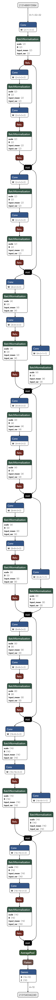

其他函数以及模块
==============

随机种子生成
----------------------------------

set_random_seed
^^^^^^^^^^^^^^^^^^^^^^^^^^^^^

.. py:function:: pyvqnet.utils.set_random_seed(seed)

    设定全局随机种子。

    :param seed: 随机数种子。

    .. note::
            当指定固定随机数种子时，随机分布将依据随机种子产生固定的伪随机分布。
            影响包括： `tensor.randu` , `tensor.randn` ，含参经典神经网络以及量子计算层的参数初始化。

    Example::

        import pyvqnet.tensor as tensor
        from pyvqnet.utils import get_random_seed, set_random_seed

        set_random_seed(256)

        rn = tensor.randn([2, 3])
        print(rn)
        rn = tensor.randn([2, 3])
        print(rn)
        rn = tensor.randu([2, 3])
        print(rn)
        rn = tensor.randu([2, 3])
        print(rn)

        print("########################################################")
        from pyvqnet.nn.parameter import Parameter
        from pyvqnet.utils.initializer import he_normal, he_uniform, xavier_normal, xavier_uniform, uniform, quantum_uniform, normal
        print(Parameter(shape=[2, 3], initializer=he_normal))
        print(Parameter(shape=[2, 3], initializer=he_uniform))
        print(Parameter(shape=[2, 3], initializer=xavier_normal))
        print(Parameter(shape=[2, 3], initializer=xavier_uniform))
        print(Parameter(shape=[2, 3], initializer=uniform))
        print(Parameter(shape=[2, 3], initializer=quantum_uniform))
        print(Parameter(shape=[2, 3], initializer=normal))
        # [
        # [-1.2093765, 1.1265280, 0.0796480],
        #  [0.2420146, 1.2623813, 0.2844022]
        # ]
        # [
        # [-1.2093765, 1.1265280, 0.0796480],
        #  [0.2420146, 1.2623813, 0.2844022]
        # ]
        # [
        # [0.3151870, 0.6721524, 0.0416874],
        #  [0.8232620, 0.6537889, 0.9672953]
        # ]
        # [
        # [0.3151870, 0.6721524, 0.0416874],
        #  [0.8232620, 0.6537889, 0.9672953]
        # ]
        # ########################################################
        # [
        # [-0.9874518, 0.9198063, 0.0650323],
        #  [0.1976041, 1.0307300, 0.2322134]
        # ]
        # [
        # [-0.2134037, 0.1987845, -0.5292138],
        #  [0.3732708, 0.1775801, 0.5395861]
        # ]
        # [
        # [-0.7648768, 0.7124789, 0.0503738],
        #  [0.1530635, 0.7984000, 0.1798717]
        # ]
        # [
        # [-0.4049051, 0.3771670, -1.0041126],
        #  [0.7082316, 0.3369346, 1.0237927]
        # ]
        # [
        # [0.3151870, 0.6721524, 0.0416874],
        #  [0.8232620, 0.6537889, 0.9672953]
        # ]
        # [
        # [1.9803783, 4.2232580, 0.2619299],
        #  [5.1727076, 4.1078768, 6.0776958]
        # ]
        # [
        # [-1.2093765, 1.1265280, 0.0796480],
        #  [0.2420146, 1.2623813, 0.2844022]
        # ]

get_random_seed
^^^^^^^^^^^^^^^^^^^^^^^^^^^^^

.. py:function:: pyvqnet.utils.get_random_seed()

    获取当前随机数种子。

    Example::

        import pyvqnet.tensor as tensor
        from pyvqnet.utils import get_random_seed, set_random_seed

        set_random_seed(256)
        print(get_random_seed())
        #256

VQNet2ONNX模块
----------------------------------

VQNet2ONNX模块 支持将 VQNet 模型以及参数转化到 ONNX 模型格式。通过 ONNX 可以完成将 VQNet 模型到多种推理引擎的部署，包括 TensorRT/OpenVINO/MNN/TNN/NCNN，以及其它对 ONNX 开源格式进行支持的推理引擎或硬件。

环境依赖:onnx>=1.12.0

.. note::

    当前不支持QPanda量子线路模块转换为ONNX，仅支持纯经典算子构成的模型。

使用 ``export_model`` 函数导出ONNX 模型。该函数需要两个以上的参数: 包括VQNet构建的模型 ``model`` ， 模型单输入 ``x`` 或多输入 ``*args``。

以下是对 `ResNet` 模型的ONNX导出的示例代码，并使用 onnxruntime 进行验证.

导入相关库

.. code-block::

    import numpy as np
    from pyvqnet.tensor import *
    from pyvqnet.nn import Module, BatchNorm2d, Conv2D, ReLu, AvgPool2D, Linear
    from pyvqnet.onnx.export import export_model
    from onnx import __version__, IR_VERSION
    from onnx.defs import onnx_opset_version
    print(
        f"onnx.__version__={__version__!r}, opset={onnx_opset_version()}, IR_VERSION={IR_VERSION}"
    )

模型定义

.. code-block::

    class BasicBlock(Module):

        expansion = 1

        def __init__(self, in_chals, out_chals, stride=1):
            super().__init__()
            self.conv2d1 = Conv2D(in_chals,
                                out_chals,
                                kernel_size=(3, 3),
                                stride=(stride, stride),
                                padding=(1, 1),
                                use_bias=False)
            self.BatchNorm2d1 = BatchNorm2d(out_chals)
            self.conv2d2 = Conv2D(out_chals,
                                out_chals * BasicBlock.expansion,
                                kernel_size=(3, 3),
                                padding=(1, 1),
                                use_bias=False)
            self.BatchNorm2d2 = BatchNorm2d(out_chals * BasicBlock.expansion)
            self.Relu = ReLu(name="relu")
            #shortcut
            self.shortcut_conv2d = Conv2D(in_chals,
                                        out_chals * BasicBlock.expansion,
                                        kernel_size=(1, 1),
                                        stride=(stride, stride),
                                        use_bias=False)
            self.shortcut_bn2d = BatchNorm2d(out_chals * BasicBlock.expansion)
            self.need_match_dim = False
            if stride != 1 or in_chals != BasicBlock.expansion * out_chals:
                self.need_match_dim = True

        def forward(self, x):
            y = self.conv2d1(x)
            y = self.BatchNorm2d1(y)
            y = self.Relu(self.conv2d2(y))
            y = self.BatchNorm2d2(y)
            y = self.Relu(y)
            if self.need_match_dim == False:
                return y + x
            else:
                y1 = self.shortcut_conv2d(x)
                y1 = self.shortcut_bn2d(y1)
                return y + y1

    resize = 32

    class ResNet(Module):
        def __init__(self, num_classes=10):
            super().__init__()

            self.in_chals = 64 // resize
            self.conv1 = Conv2D(1,
                                64 // resize,
                                kernel_size=(3, 3),
                                padding=(1, 1),
                                use_bias=False)
            self.bn1 = BatchNorm2d(64 // resize)
            self.relu = ReLu()
            self.conv2_x_1 = BasicBlock(64 // resize, 64 // resize, 1)
            self.conv2_x_2 = BasicBlock(64 // resize, 64 // resize, 1)
            self.conv3_x_1 = BasicBlock(64 // resize, 128 // resize, 2)
            self.conv3_x_2 = BasicBlock(128 // resize, 128 // resize, 1)
            self.conv4_x_1 = BasicBlock(128 // resize, 256 // resize, 2)
            self.conv4_x_2 = BasicBlock(256 // resize, 256 // resize, 1)
            self.conv5_x_1 = BasicBlock(256 // resize, 512 // resize, 2)
            self.conv5_x_2 = BasicBlock(512 // resize, 512 // resize, 1)
            self.avg_pool = AvgPool2D([4, 4], [1, 1], "valid")
            self.fc = Linear(512 // resize, num_classes)

        def forward(self, x):
            output = self.conv1(x)
            output = self.bn1(output)
            output = self.relu(output)
            output = self.conv2_x_1(output)
            output = self.conv2_x_2(output)
            output = self.conv3_x_1(output)
            output = self.conv3_x_2(output)
            output = self.conv4_x_1(output)
            output = self.conv4_x_2(output)
            output = self.conv5_x_1(output)
            output = self.conv5_x_2(output)
            output = self.avg_pool(output)
            output = tensor.flatten(output, 1)
            output = self.fc(output)

            return output

测试代码

.. code-block::

    def test_resnet():

        x = tensor.ones([4,1,32,32])#任意输入一个正确shape的QTensor数据
        m = ResNet()
        m.eval()#为了导出BatchNorm的global mean 以及global variance
        y = m(x)
        vqnet_y = y.CPU().to_numpy()

        #导出onnx model
        onnx_model = export_model(m, x)

        #保存到文件
        with open("demo.onnx", "wb") as f:
            f.write(onnx_model.SerializeToString())

        #onnxruntime 对比运行结果
        import onnxruntime
        session = onnxruntime.InferenceSession('demo.onnx', None)
        input_name = session.get_inputs()[0].name

        v = np.ones([4,1,32,32])
        v = v.astype(np.float32)
        inputs = [v]
        test_data_num = len(inputs)
        outputs = [
            session.run([], {input_name: inputs[i]})[0]
            for i in range(test_data_num)
        ]
        onnx_y = outputs[0]
        assert np.allclose(onnx_y, vqnet_y)

    if __name__ == "__main__":
        test_resnet()

使用 https://netron.app/ 可以可视化VQNet导出的ONNX模型 demo.onnx

|

以下是支持的VQNet模块

.. csv-table:: 已支持VQNet接口列表
   :file: ./images/onnxsupport.csv

VQNet 分布式计算模块
----------------------------------

VQNet分布式计算模块支持将VQNet量子机器学习模型通过分布式计算模块相应接口，实现对数据的切分，模型参数在多进程间的通信，模型参数的更新，基于分布式计算实现对VQNet模型的加速。

环境依赖:mpich，mpi4py

.. note::

    当前仅支持cpu的分布式计算，不支持以gloo、nccl为通信库的分布式计算。

**分布式计算单节点环境部署**

    完成mpich通信库的编译安装，编译前检测gcc、gfortran编译器是否安装。

.. code-block::
        
    which gcc 
    which gfortran

当显示了gcc和gfortran的路径，即可进行下一步的安装，若没有相应的编译器，请先安装编译器。当检查完编译器之后，使用wget命令下载。

.. code-block::
        
    wget http://www.mpich.org/static/downloads/3.3.2/mpich-3.3.2.tar.gz 
    tar -zxvf mpich-3.3.2.tar.gz 
    cd mpich-3.3.2 
    ./configure --prefix=/usr/local/mpich-3.3.2 
    make 
    make install 

完成mpich的编译安装后，需要配置其环境变量。

.. code-block::
        
    vim ~/.bashrc

通过vim打开当前用户下所对应的.bashrc文件，在其中加入一行（建议添加在最下面一行）

.. code-block::
    export PATH="/usr/local/mpich-3.3.2/bin:$PATH"

保存退出之后 ，使用source这一命令执行一下就把新加的命令执行了。

.. code-block::
    source ~/.bashrc

之后，用which来检验下配置的环境变量是否正确。如果显示了其路径，则说明安装顺利完成了。

**分布式计算多节点环境部署**

    在多节点上实现分布式计算，首先需要保证多节点上mpich环境的一致，python环境一致，其次，需要设置节点间的免密通信。
    假设需要设置10.10.8.107、10.10.8.108、10.10.8.109三个节点的免密通信。

    .. code-block::

        在每个节点上执行
        
        ssh-keygen 
        
        之后一直回车，在.ssh文件夹下生成一个公钥（id_rsa.pub）一个私钥（id_rsa）

        将其另外两个节点的公钥都添加到第一个节点的authorized_keys文件中，
        再将第一个节点authorized_keys文件传到另外两个节点便可以实现节点间的免密通信
        在10.10.7.108上执行

        cat ~/.ssh/id_dsa.pub >> 10.10.7.107：~/.ssh/authorized_keys

        在10.10.7.109上执行

        cat ~/.ssh/id_dsa.pub >> 10.10.7.107：~/.ssh/authorized_keys
        
        先删除108、109中的authorized_keys文件后，在10.10.7.107上执行

        scp ~/.ssh/authorized_keys  10.10.7.108：~/.ssh/authorized_keys
        scp ~/.ssh/authorized_keys  10.10.7.109：~/.ssh/authorized_keys

        使三个节点的authorized_keys文件一致，即可实现节点间的免密通信，
        保证三个不同节点生成的公钥都在authorized_keys文件中即可

    除此外，最好还设置一个共享目录，使得改变共享目录下的文件时，不同节点中文件也会进行更改，预防多节点运行模型时不同节点中的文件不同步的问题。

本块介绍如何在cpu硬件平台上，利用VQNet分布式计算模型接口实现数据并行训练模型，用例为example目录下的test_mdis.py文件

导入相关库

.. code-block::

    import sys
    sys.path.insert(0,"../")
    import time
    import os
    import struct
    import gzip
    from pyvqnet.nn.module import Module
    from pyvqnet.nn.linear import Linear
    from pyvqnet.nn.conv import Conv2D

    from pyvqnet.nn import activation as F
    from pyvqnet.nn.pooling import MaxPool2D
    from pyvqnet.nn.loss import CategoricalCrossEntropy
    from pyvqnet.optim.adam import Adam
    from pyvqnet.data.data import data_generator
    from pyvqnet.tensor import tensor
    from pyvqnet.tensor.tensor import QTensor
    import pyqpanda as pq
    import time
    import numpy as np
    import matplotlib
    from pyvqnet.distributed import *  # 分布式计算模块
    import argparse 

数据获取

.. code-block::

    url_base = "http://yann.lecun.com/exdb/mnist/"
    key_file = {
        "train_img": "train-images-idx3-ubyte.gz",
        "train_label": "train-labels-idx1-ubyte.gz",
        "test_img": "t10k-images-idx3-ubyte.gz",
        "test_label": "t10k-labels-idx1-ubyte.gz"
    }
    if_show_sample = 0
    grad_time = []
    forward_time = []
    forward_time_sum = []

    def _download(dataset_dir, file_name):
        """
        Download mnist data if needed.
        """
        file_path = dataset_dir + "/" + file_name

        if os.path.exists(file_path):
            with gzip.GzipFile(file_path) as file:
                file_path_ungz = file_path[:-3].replace("\\", "/")
                if not os.path.exists(file_path_ungz):
                    open(file_path_ungz, "wb").write(file.read())
            return

        print("Downloading " + file_name + " ... ")
        urllib.request.urlretrieve(url_base + file_name, file_path)
        if os.path.exists(file_path):
            with gzip.GzipFile(file_path) as file:
                file_path_ungz = file_path[:-3].replace("\\", "/")
                file_path_ungz = file_path_ungz.replace("-idx", ".idx")
                if not os.path.exists(file_path_ungz):
                    open(file_path_ungz, "wb").write(file.read())
        print("Done")

    def download_mnist(dataset_dir):
        for v in key_file.values():
            _download(dataset_dir, v)

    def load_mnist(dataset="training_data", digits=np.arange(2), path="./"):
        """
        load mnist data
        """
        from array import array as pyarray
        download_mnist(path)
        if dataset == "training_data":
            fname_image = os.path.join(path, "train-images.idx3-ubyte").replace(
                "\\", "/")
            fname_label = os.path.join(path, "train-labels.idx1-ubyte").replace(
                "\\", "/")
        elif dataset == "testing_data":
            fname_image = os.path.join(path, "t10k-images.idx3-ubyte").replace(
                "\\", "/")
            fname_label = os.path.join(path, "t10k-labels.idx1-ubyte").replace(
                "\\", "/")
        else:
            raise ValueError("dataset must be 'training_data' or 'testing_data'")

        flbl = open(fname_label, "rb")
        _, size = struct.unpack(">II", flbl.read(8))
        lbl = pyarray("b", flbl.read())
        flbl.close()

        fimg = open(fname_image, "rb")
        _, size, rows, cols = struct.unpack(">IIII", fimg.read(16))
        img = pyarray("B", fimg.read())
        fimg.close()

        ind = [k for k in range(size) if lbl[k] in digits]
        num = len(ind)
        images = np.zeros((num, rows, cols))
        labels = np.zeros((num, 1), dtype=int)
        for i in range(len(ind)):
            images[i] = np.array(img[ind[i] * rows * cols:(ind[i] + 1) * rows *
                                     cols]).reshape((rows, cols))
            labels[i] = lbl[ind[i]]

        return images, labels

    def data_select(train_num, test_num):
        """
        Select data from mnist dataset.
        """

        x_train, y_train = load_mnist("training_data")  # 下载训练数据
        x_test, y_test = load_mnist("testing_data")
        idx_train = np.append(
                np.where(y_train == 0)[0][0:train_num],
                np.where(y_train == 1)[0][0:train_num])
        x_train = x_train[idx_train]
        y_train = y_train[idx_train]
        x_train = x_train / 255
        y_train = np.eye(2)[y_train].reshape(-1, 2)

        idx_test = np.append(
                np.where(y_test == 0)[0][:test_num],
                np.where(y_test == 1)[0][:test_num])
        x_test = x_test[idx_test]
        y_test = y_test[idx_test]
        x_test = x_test / 255
        y_test = np.eye(2)[y_test].reshape(-1, 2)

        return x_train, y_train, x_test, y_test

模型定义

.. code-block::

    def circuit_func(weights):
        """
        A function using QPanda to create quantum circuits and run.
        """
        num_qubits = 1
        machine = pq.CPUQVM()
        machine.init_qvm()
        qubits = machine.qAlloc_many(num_qubits)
        cbits = machine.cAlloc_many(num_qubits)
        circuit = pq.QCircuit()
        circuit.insert(pq.H(qubits[0]))
        circuit.insert(pq.RY(qubits[0], weights[0]))
        prog = pq.QProg()
        prog.insert(circuit)
        prog << pq.measure_all(qubits, cbits)  #pylint:disable=expression-not-assigned

        result = machine.run_with_configuration(prog, cbits, 1000)

        counts = np.array(list(result.values()))
        states = np.array(list(result.keys())).astype(float)
        # Compute probabilities for each state
        probabilities = counts / 100
        # Get state expectation
        expectation = np.sum(states * probabilities)
        return expectation

    class Hybrid(Module):
        """ Hybrid quantum - Quantum layer definition """
        def __init__(self, shift):
            super(Hybrid, self).__init__()
            self.shift = shift
            self.input = None

        def forward(self, x):
            self.input = x
            expectation_z = circuit_func(np.array(x.data))
            result = [[expectation_z]]
            # requires_grad = x.requires_grad and not QTensor.NO_GRAD
            requires_grad = x.requires_grad
            def _backward_mnist(g, x):
                """ Backward pass computation """
                start_grad_time = time.time()
                input_list = np.array(x.data)
                shift_right = input_list + np.ones(input_list.shape) * self.shift
                shift_left = input_list - np.ones(input_list.shape) * self.shift

                gradients = []
                for i in range(len(input_list)):
                    expectation_right = circuit_func(shift_right[i])
                    expectation_left = circuit_func(shift_left[i])
                    gradient = expectation_right - expectation_left
                    gradients.append(gradient)
                gradients = np.array([gradients]).T

                end_grad_time = time.time()
                grad_time.append(end_grad_time - start_grad_time)
                in_g = gradients * np.array(g)
                return in_g

            nodes = []
            if x.requires_grad:
                nodes.append(
                    QTensor.GraphNode(tensor=x,
                                      df=lambda g: _backward_mnist(g, x)))
            return QTensor(data=result, requires_grad=requires_grad, nodes=nodes)

    class Net(Module):
        """
        Hybird Quantum Classci Neural Network Module
        """
        def __init__(self):
            super(Net, self).__init__()
            self.conv1 = Conv2D(input_channels=1,
                                output_channels=6,
                                kernel_size=(5, 5),
                                stride=(1, 1),
                                padding="valid")
            self.maxpool1 = MaxPool2D([2, 2], [2, 2], padding="valid")
            self.conv2 = Conv2D(input_channels=6,
                                output_channels=16,
                                kernel_size=(5, 5),
                                stride=(1, 1),
                                padding="valid")
            self.maxpool2 = MaxPool2D([2, 2], [2, 2], padding="valid")

            self.fc1 = Linear(input_channels=256, output_channels=64)
            self.fc2 = Linear(input_channels=64, output_channels=1)

            self.hybrid = Hybrid(np.pi / 2)
            self.fc3 = Linear(input_channels=1, output_channels=2)

        def forward(self, x):
            start_time_forward = time.time()
            x = F.ReLu()(self.conv1(x))

            x = self.maxpool1(x)
            x = F.ReLu()(self.conv2(x))

            x = self.maxpool2(x)
            x = tensor.flatten(x, 1)

            x = F.ReLu()(self.fc1(x))
            x = self.fc2(x)

            start_time_hybrid = time.time()
            x = self.hybrid(x)

            end_time_hybrid = time.time()

            forward_time.append(end_time_hybrid - start_time_hybrid)

            x = self.fc3(x)
            end_time_forward = time.time()
            forward_time_sum.append(end_time_forward - start_time_forward)
            return x

以上均未用到分布式计算接口，而仅需要在训练时引用DataSplit、parallel_model、init_p即可实现数据并行的分布式计算。

使用方法如下
.. code-block::

    def run(args):
        """
        Run mnist train function
        """
        x_train, y_train, x_test, y_test = data_select(args.train_size, args.test_size)

        Data = DataSplit(args.shuffle)  # 分布式模块接口对数据切分
        x_train, y_train= Data.split_data(x_train, y_train) # 分布式模块接口对数据切分
        print(get_rank())
        model = Net()
        optimizer = Adam(model.parameters(), lr=0.001)
        loss_func = CategoricalCrossEntropy()

        epochs = 10
        train_loss_list = []
        val_loss_list = []
        train_acc_list = []
        val_acc_list = []
        model.train()

        for epoch in range(1, epochs):
            total_loss = []
            model.train()
            batch_size = 1
            correct = 0
            n_train = 0

            for x, y in data_generator(x_train,
                                       y_train,
                                       batch_size=1,
                                       shuffle=False):

                x = x.reshape(-1, 1, 28, 28)

                optimizer.zero_grad()
                output = model(x)
                loss = loss_func(y, output)
                loss_np = np.array(loss.data)

                np_output = np.array(output.data, copy=False)
                mask = (np_output.argmax(1) == y.argmax(1))
                correct += np.sum(np.array(mask))
                n_train += batch_size

                loss.backward()
                optimizer._step()

                total_loss.append(loss_np)
            model = parallel_model(model) # 对不同rank的模型参数梯度进行allreduce通信

            train_loss_list.append(np.sum(total_loss) / len(total_loss))
            train_acc_list.append(np.sum(correct) / n_train)
            print("{:.0f} loss is : {:.10f}".format(epoch, train_loss_list[-1]))

            model.eval()
            correct = 0
            n_eval = 0

            for x, y in data_generator(x_test, y_test, batch_size=1, shuffle=True):
                x = x.reshape(-1, 1, 28, 28)
                output = model(x)
                loss = loss_func(y, output)
                loss_np = np.array(loss.data)
                np_output = np.array(output.data, copy=False)
                mask = (np_output.argmax(1) == y.argmax(1))
                correct += np.sum(np.array(mask))
                n_eval += 1

                total_loss.append(loss_np)
            print(f"Eval Accuracy: {correct / n_eval}")
            val_loss_list.append(np.sum(total_loss) / len(total_loss))
            val_acc_list.append(np.sum(correct) / n_eval)

    if __name__ == "__main__":

        parser = argparse.ArgumentParser(description='parser example')
        parser.add_argument('--init', default=False, type=bool, help='whether to use multiprocessing')
        parser.add_argument('--np', default=1, type=int, help='number of processes')
        parser.add_argument('--hostpath', default=None, type=str, help='hosts absolute path')
        parser.add_argument('--shuffle', default=False, type=bool, help='shuffle')
        parser.add_argument('--train_size', default=120, type=int, help='train_size')
        parser.add_argument('--test_size', default=50, type=int, help='test_size')
        args = parser.parse_args()
        # p_path = os.path.realpath (__file__)

        if(args.init):
            init_p(args.np, os.path.realpath(__file__), args.hostpath, args.train_size,args.test_size, args.shuffle)
        else:
            a = time.time()
            run(args)
            b=time.time()
            if(get_rank()==0):
                print("time: {}",format(b-a))
                
其中init代表是否基于分布式训练模型，np代表进程数，另外hostpath文件代码在多节点上运行模型时的配置文件的绝对路径，配置文件内容包括多节点的ip以及进程分配情况,如下

.. code-block::

    10.10.8.32:1
    10.10.8.33:1
    10.10.8.34:1
    10.10.8.35:1

在命令行输入

.. code-block::

    python test_mdis.py --init true

    0
    1 loss is : 0.8230862300
    Eval Accuracy: 0.5
    2 loss is : 0.6979023616
    Eval Accuracy: 0.5
    3 loss is : 0.5718536377
    Eval Accuracy: 0.47
    4 loss is : 0.5429712931
    Eval Accuracy: 0.51
    5 loss is : 0.5333395640
    Eval Accuracy: 0.52
    6 loss is : 0.5185367266
    Eval Accuracy: 0.65
    7 loss is : 0.5187034607
    Eval Accuracy: 0.6
    8 loss is : 0.5176532110
    Eval Accuracy: 0.43
    9 loss is : 0.5660219193
    Eval Accuracy: 0.46
    time: {} 15.132369756698608

    python test_mdis.py --init true --np 2

    得到结果

    1
    1 loss is : 0.0316730281
    Eval Accuracy: 0.5
    2 loss is : 0.0082226296
    Eval Accuracy: 0.5
    3 loss is : 0.0041910132
    Eval Accuracy: 0.5
    4 loss is : 0.0026126946
    Eval Accuracy: 0.5
    5 loss is : 0.0018102199
    Eval Accuracy: 0.5
    6 loss is : 0.0013386756
    Eval Accuracy: 0.5
    7 loss is : 0.0010348094
    Eval Accuracy: 0.5
    8 loss is : 0.0008260541
    Eval Accuracy: 0.5
    9 loss is : 0.0006756162
    Eval Accuracy: 0.5
    0
    1 loss is : 0.0072183679
    Eval Accuracy: 0.85
    2 loss is : 0.0014325128
    Eval Accuracy: 0.84
    3 loss is : 0.0009416074
    Eval Accuracy: 0.86
    4 loss is : 0.0006576005
    Eval Accuracy: 0.84
    5 loss is : 0.0004843485
    Eval Accuracy: 0.82
    6 loss is : 0.0003716738
    Eval Accuracy: 0.82
    7 loss is : 0.0002943836
    Eval Accuracy: 0.82
    8 loss is : 0.0002390019
    Eval Accuracy: 0.82
    9 loss is : 0.0001979264
    Eval Accuracy: 0.82
    time: {} 9.132536888122559

以上是在单节点上多进程模型训练，可以明显看出训练时间缩短

在多节点上训练，命令如下

.. code-block::

    python3 test_mdis.py --init true --np 4 --hostpath ~/workspace/hao/vqnet/pyVQNet/examples/host.txt

    0
    1 loss is : 0.8609524409
    Eval Accuracy: 0.5
    2 loss is : 0.7399766286
    Eval Accuracy: 0.5
    3 loss is : 0.6829307556
    Eval Accuracy: 0.5
    4 loss is : 0.6301216125
    Eval Accuracy: 0.49
    5 loss is : 0.5815347036
    Eval Accuracy: 0.38
    6 loss is : 0.5370124817
    Eval Accuracy: 0.24
    7 loss is : 0.4962680499
    Eval Accuracy: 0.06
    8 loss is : 0.4590748787
    Eval Accuracy: 0.44
    9 loss is : 0.4251357079
    Eval Accuracy: 0.5
    time: {} 6.5950517654418945
    Can not use matplot TkAgg
    3
    1 loss is : 0.0034498004
    Eval Accuracy: 0.5
    2 loss is : 0.0007666681
    Eval Accuracy: 0.5
    3 loss is : 0.0005568531
    Eval Accuracy: 0.5
    4 loss is : 0.0004169762
    Eval Accuracy: 0.5
    5 loss is : 0.0003228062
    Eval Accuracy: 0.5
    6 loss is : 0.0002573317
    Eval Accuracy: 0.5
    7 loss is : 0.0002102273
    Eval Accuracy: 0.5
    8 loss is : 0.0001751528
    Eval Accuracy: 0.5
    9 loss is : 0.0001483827
    Eval Accuracy: 0.5
    Can not use matplot TkAgg
    1
    1 loss is : 0.0990966797
    Eval Accuracy: 0.5
    2 loss is : 0.0346243183
    Eval Accuracy: 0.5
    3 loss is : 0.0194720447
    Eval Accuracy: 0.5
    4 loss is : 0.0128109713
    Eval Accuracy: 0.5
    5 loss is : 0.0092022886
    Eval Accuracy: 0.5
    6 loss is : 0.0069948425
    Eval Accuracy: 0.5
    7 loss is : 0.0055302560
    Eval Accuracy: 0.5
    8 loss is : 0.0045029074
    Eval Accuracy: 0.5
    9 loss is : 0.0037492002
    Eval Accuracy: 0.5
    Can not use matplot TkAgg
    2
    1 loss is : 0.8468652089
    Eval Accuracy: 0.5
    2 loss is : 0.7299760183
    Eval Accuracy: 0.5
    3 loss is : 0.6732901891
    Eval Accuracy: 0.5
    4 loss is : 0.6209689458
    Eval Accuracy: 0.5
    5 loss is : 0.5729962667
    Eval Accuracy: 0.5
    6 loss is : 0.5289377848
    Eval Accuracy: 0.5
    7 loss is : 0.4887968381
    Eval Accuracy: 0.5
    8 loss is : 0.4520395279
    Eval Accuracy: 0.53
    9 loss is : 0.4186156909
    Eval Accuracy: 0.52

