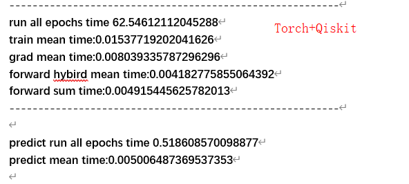
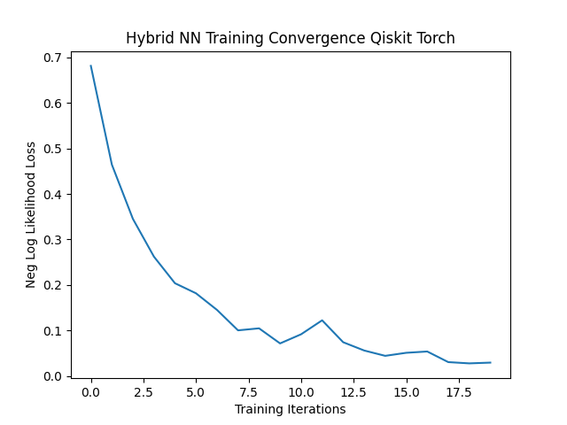
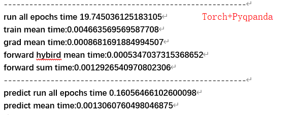
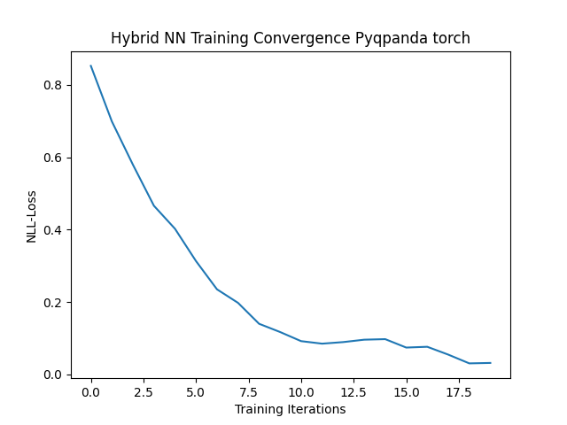
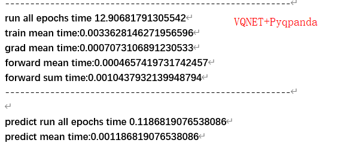
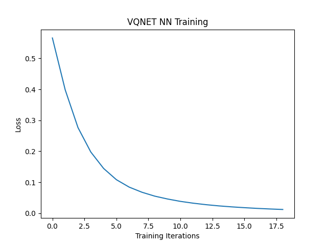

# HQCNN不同框架+量子库对比结果

## 1、Torch+Qiskit

### 运行时间

### 训练结果

### 测试结果

Performance on test data:

​    Accuracy: 100.0%

## 2、Torch+Pyqpanda

### 运行时间

### 训练结果

### 测试结果

Performance on test data:

​    Accuracy: 100.0%

## 3、VQNET+Pyqpanda

### 运行时间

### 训练结果

### 测试结果

Eval Accuracy: 1.0

## 4、对比

|       机器学习框架（量子库）       | Torch （Qiskit） | Torch（ Pyqpanda） | VQNET（ Pyqpanda）  |
| :--------------------------------: | :--------------: | :----------------: | :-----------------: |
|              网络模型              |       相同       |        相同        |        相同         |
|              损失函数              |       Adam       |        Adam        |        Adam         |
|               学习率               |       相同       |        相同        |        相同         |
|              损失函数              | CrossEntropyLoss |  CrossEntropyLoss  |  CrossEntropyLoss   |
|               数据集               |   Mnist数据集    |    Mnist数据集     |     Mnist数据集     |
|          训练集测试集数据          |       相同       |        相同        |        相同         |
|              训练批次              |        20        |         20         |         20          |
|              预测结果              |       100%       |        100%        |        100%         |
|        训练总时长（second）        |  62.5461211204   |   19.7450361251    |  **12.9068179130**  |
|   单个数据训练平均时长（second）   |   0.0153771920   |   0.00466356956    |  **0.0033628146**   |
|   量子反向传播平均时长（second）   |   0.0080393357   |    0.0008681691    | **0.000707310689**  |
|   量子前向传播平均时长（second）   |   0.0041827758   |   0.00053470371    | **0.000465741973**  |
| 整个网络前向传播平均时长（second） |   0.0049154456   |   0.00129265409    | **0.001043793212**  |
|      预测数据总时长（second）      |  0.51860857009   |   0.160564661026   | **0.118681907653**  |
|   单个数据测试平均时长（second）   |   0.005006487    |   0.001306076049   | **0.0011868190765** |

