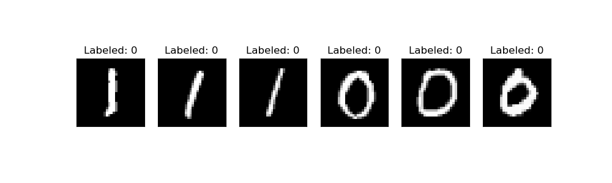
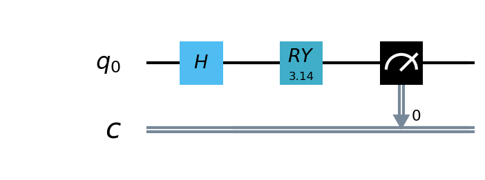
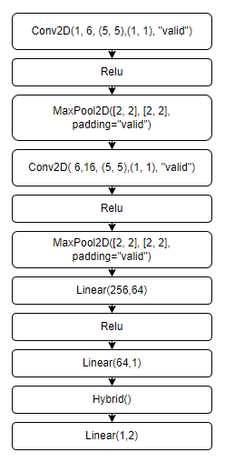

# 基于VQNET的混合量子经典神经网络

## 概述

机器学习 (ML) 已成为一个成功的跨学科领域，旨在从数据中以数学方式提取可概括的信息。量子机器学习寻求利用量子力学原理来增强机器学习，反之亦然。无论您的目标是通过将困难的计算外包给量子计算机来增强经典 ML 算法，还是使用经典 ML 架构优化量子算法——两者都属于量子机器学习 (QML) 的范畴。

在本章中，我们将探讨如何部分量化经典神经网络以创建混合量子经典神经网络。我们将编写一个简单的示例，使用VQNet实现一个神经网络模型训练任务。此示例的目的是展示VQNet的简便性，并鼓励 ML 从业者探索量子计算的可能性，代码可见[hqcnn_test.py](../../pyVQNet/examples/hqcnn_test.py)。

## 流程

### 数据准备

我们将使用[MNIST datasets](http://yann.lecun.com/exdb/mnist/)这一神经网络最基础的手写数字数据库作为分类数据 。本例子中，我们使用其中0，1两类数据做二分类任务。我们首先加载MNIST并过滤包含0和1的数据样本。这些样本分为训练数据 training_data 和测试数据 testing_data，它们每条数据均为1*784的维度大小。

```python
import numpy as np
import matplotlib.pyplot as plt

def load_mnist(dataset="training_data", digits=np.arange(2), path="./MNIST_data"):        
    import os, struct
    from array import array as pyarray
    if dataset == "training_data":
        fname_image = os.path.join(path, 'train-images.idx3-ubyte').replace('\\', '/')
        fname_label = os.path.join(path, 'train-labels.idx1-ubyte').replace('\\', '/')
    elif dataset == "testing_data":
        fname_image = os.path.join(path, 't10k-images.idx3-ubyte').replace('\\', '/')
        fname_label = os.path.join(path, 't10k-labels.idx1-ubyte').replace('\\', '/')
    else:
        raise ValueError("dataset must be 'training_data' or 'testing_data'")

    flbl = open(fname_label, 'rb')
    magic_nr, size = struct.unpack(">II", flbl.read(8))
    lbl = pyarray("b", flbl.read())
    flbl.close()

    fimg = open(fname_image, 'rb')
    magic_nr, size, rows, cols = struct.unpack(">IIII", fimg.read(16))
    img = pyarray("B", fimg.read())
    fimg.close()

    ind = [k for k in range(size) if lbl[k] in digits]
    N = len(ind)
    images = np.zeros((N, rows, cols))
    labels = np.zeros((N, 1), dtype=int)
    for i in range(len(ind)):
        images[i] = np.array(img[ind[i] * rows * cols: (ind[i] + 1) * rows * cols]).reshape((rows, cols))
        labels[i] = lbl[ind[i]]

    return images, labels

def data_select(train_num, test_num):
    x_train, y_train = load_mnist("training_data")  
    x_test, y_test = load_mnist("testing_data")
    # Train Leaving only labels 0 and 1
    idx_train = np.append(np.where(y_train == 0)[0][:train_num],
                    np.where(y_train == 1)[0][:train_num])
    x_train = x_train[idx_train]
    y_train = y_train[idx_train]
    x_train = x_train / 255
    y_train = np.eye(2)[y_train].reshape(-1, 2)
    # Test Leaving only labels 0 and 1
    idx_test = np.append(np.where(y_test == 0)[0][:test_num],
                    np.where(y_test == 1)[0][:test_num])
    x_test = x_test[idx_test]
    y_test = y_test[idx_test]
    x_test = x_test / 255
    y_test = np.eye(2)[y_test].reshape(-1, 2)
    return x_train, y_train, x_test, y_test

n_samples_show = 6

x_train, y_train, x_test, y_test = data_select(100, 50)
fig, axes = plt.subplots(nrows=1, ncols=n_samples_show, figsize=(10, 3))


for img ,targets in zip(x_test,y_test):
    if n_samples_show <= 3:
        break
    
    if targets[0] == 1:
        axes[n_samples_show - 1].set_title("Labeled: 0")
        axes[n_samples_show - 1].imshow(img.squeeze(), cmap='gray')
        axes[n_samples_show - 1].set_xticks([])
        axes[n_samples_show - 1].set_yticks([])
        n_samples_show -= 1

for img ,targets in zip(x_test,y_test):
    if n_samples_show <= 0:
        break
    
    if targets[0] == 0:
        axes[n_samples_show - 1].set_title("Labeled: 0")
        axes[n_samples_show - 1].imshow(img.squeeze(), cmap='gray')
        axes[n_samples_show - 1].set_xticks([])
        axes[n_samples_show - 1].set_yticks([])
        n_samples_show -= 1    
    

plt.show()
```



### 构建量子线路

量子线路是由量子逻辑门组成，它可以运行在量子计算机上或经典计算机的模拟机上进行量子计算。这些量子线路可以像经典神经网络模块的卷积层，池化层一样进行可微分的计算，所以可以将量子线路的计算作为机器学习模型优化的一部分，进行模型的训练和参数的更新。在本例中，我们定义了一个1量子比特的简单量子线路，该线路将经典神经网络层的输出作为输入，通过RY逻辑门进行量子数据编码，并计算z方向的哈密顿期望值作为输出。



```python
from pyqpanda import *
import pyqpanda as pq
def circuit(weights):
    num_qubits = 1
    #
    machine = pq.CPUQVM()
    machine.init_qvm()
    qubits = machine.qAlloc_many(num_qubits)
    cbits = machine.cAlloc_many(num_qubits)
    circuit = pq.QCircuit()

    circuit.insert(pq.H(qubits[0]))
    circuit.insert(pq.RY(qubits[0], weights[0]))

    prog = pq.QProg()
    prog.insert(circuit)
    prog << measure_all(qubits, cbits)

    result = machine.run_with_configuration(prog, cbits, 100)
    counts = np.array(list(result.values()))
    states = np.array(list(result.keys())).astype(float)
    probabilities = counts / 100
    expectation = np.sum(states * probabilities)
    return expectation
```
### 构建混合量子神经网络

由于量子线路可以和经典神经网络一起进行自动微分的计算，因此我们可以使用VQNet的2维卷积层Conv2D，池化层MaxPool2D，全连接层Linear以及刚才构建的量子线路构建模型，将本例中MNIST的数据进行卷积，降维，量子编码，测量，获取分类任务所需的特征。



```python
#量子计算层的前传和梯度计算函数的定义，其需要继承于抽象类Module
class Hybrid(Module):
    """ Hybrid quantum - Quantum layer definition """
    def __init__(self, shift):
        super(Hybrid, self).__init__()
        self.shift = shift
    def forward(self, input): 
        self.input = input
        expectation_z = circuit(np.array(input.data))
        result = [[expectation_z]]
        requires_grad = input.requires_grad and not QTensor.NO_GRAD
        def _backward(g, input):
            """ Backward pass computation """
            input_list = np.array(input.data)
            shift_right = input_list + np.ones(input_list.shape) * self.shift
            shift_left = input_list - np.ones(input_list.shape) * self.shift

            gradients = []
            for i in range(len(input_list)):
                expectation_right = circuit(shift_right[i])
                expectation_left = circuit(shift_left[i])

                gradient = expectation_right - expectation_left
                gradients.append(gradient)
            gradients = np.array([gradients]).T
            return gradients * np.array(g)

        nodes = []
        if input.requires_grad:
            nodes.append(QTensor.GraphNode(tensor=input, df=lambda g: _backward(g, input)))
        return QTensor(data=result, requires_grad=requires_grad, nodes=nodes)

#模型定义
class Net(Module):
    def __init__(self):
        super(Net, self).__init__()
        self.conv1 = Conv2D(input_channels=1, output_channels=6, kernel_size=(5, 5), stride=(1, 1), padding="valid")
        self.maxpool1 = MaxPool2D([2, 2], [2, 2], padding="valid")
        self.conv2 = Conv2D(input_channels=6, output_channels=16, kernel_size=(5, 5), stride=(1, 1), padding="valid")
        self.maxpool2 = MaxPool2D([2, 2], [2, 2], padding="valid")
        self.fc1 = Linear(input_channels=256, output_channels=64)
        self.fc2 = Linear(input_channels=64, output_channels=1)
        self.hybrid = Hybrid(np.pi / 2)
        self.fc3 = Linear(input_channels=1, output_channels=2)

    def forward(self, x):
        x = F.ReLu()(self.conv1(x))  # 1 6 24 24
        x = self.maxpool1(x)
        x = F.ReLu()(self.conv2(x))  # 1 16 8 8
        x = self.maxpool2(x)
        x = tensor.flatten(x, 1)   # 1 256
        x = F.ReLu()(self.fc1(x))  # 1 64
        x = self.fc2(x)    # 1 1
        x = self.hybrid(x)
        x = self.fc3(x)
        return x
```


### 训练和测试

下面的代码为整体训练流程


```python
#实例化
model = Net() 
#使用Adam完成此任务就足够了，model.parameters（）是模型需要计算的参数。
optimizer = Adam(model.parameters(), lr=0.005)
#分类任务使用交叉熵函数
loss_func = CategoricalCrossEntropy()

#训练次数    
epochs = 10
train_loss_list = []
val_loss_list = []
train_acc_list =[]
val_acc_list = []


for epoch in range(1, epochs):
    total_loss = []
    model.train()
    batch_size = 1
    correct = 0
    n_train = 0
    for x, y in data_generator(x_train, y_train, batch_size=1, shuffle=True):

        x = x.reshape(-1, 1, 28, 28)

        optimizer.zero_grad()
        output = model(x)       
        loss = loss_func(y, output)  
        loss_np = np.array(loss.data)
        
        np_output = np.array(output.data, copy=False)
        mask = (np_output.argmax(1) == y.argmax(1))
        correct += np.sum(np.array(mask))
        n_train += batch_size

        loss.backward()
        optimizer._step()

        total_loss.append(loss_np)

    train_loss_list.append(np.sum(total_loss) / len(total_loss))
    train_acc_list.append(np.sum(correct) / n_train)
    print("{:.0f} loss is : {:.10f}".format(epoch, train_loss_list[-1]))


    model.eval()
    correct = 0
    n_eval = 0

    for x, y in data_generator(x_test, y_test, batch_size=1, shuffle=True):
        x = x.reshape(-1, 1, 28, 28)
        output = model(x)
        loss = loss_func(y, output)
        loss_np = np.array(loss.data)
        np_output = np.array(output.data, copy=False)
        mask = (np_output.argmax(1) == y.argmax(1))
        correct += np.sum(np.array(mask))
        n_eval += 1
        
        total_loss.append(loss_np)
    print(f"Eval Accuracy: {correct / n_eval}")
    val_loss_list.append(np.sum(total_loss) / len(total_loss))
    val_acc_list.append(np.sum(correct) / n_eval)
```


### 数据可视化

训练和测试数据上的数据损失函数与准确率的可视化曲线。

```
import os
plt.figure()
xrange = range(1,len(train_loss_list)+1)
figure_path = os.path.join(os.getcwd(), 'HQCNN LOSS.png')
plt.plot(xrange,train_loss_list, color="blue", label="train")
plt.plot(xrange,val_loss_list, color="red", label="validation")
plt.title('HQCNN')
plt.xlabel("Epochs")
plt.ylabel("Loss")
plt.xticks(np.arange(1, epochs +1,step = 2))
plt.legend(loc="upper right")
plt.savefig(figure_path)
plt.show()

plt.figure()
figure_path = os.path.join(os.getcwd(), 'HQCNN Accuracy.png')
plt.plot(xrange,train_acc_list, color="blue", label="train")
plt.plot(xrange,val_acc_list, color="red", label="validation")
plt.title('HQCNN')
plt.xlabel("Epochs")
plt.ylabel("Accuracy")
plt.xticks(np.arange(1, epochs +1,step = 2))
plt.legend(loc="lower right")
plt.savefig(figure_path)
plt.show()
```


测试结果:

```python
n_samples_show = 6
count = 0
fig, axes = plt.subplots(nrows=1, ncols=n_samples_show, figsize=(10, 3))
model.eval()
for x, y in data_generator(x_test, y_test, batch_size=1, shuffle=True):
    if count == n_samples_show:
        break
        x = x.reshape(-1, 1, 28, 28)
        output = model(x)
        pred = QTensor.argmax(output, [1])
        axes[count].imshow(x[0].squeeze(), cmap='gray')
        axes[count].set_xticks([])
        axes[count].set_yticks([])
        axes[count].set_title('Predicted {}'.format(np.array(pred.data)))
        count += 1
        plt.show()
```

