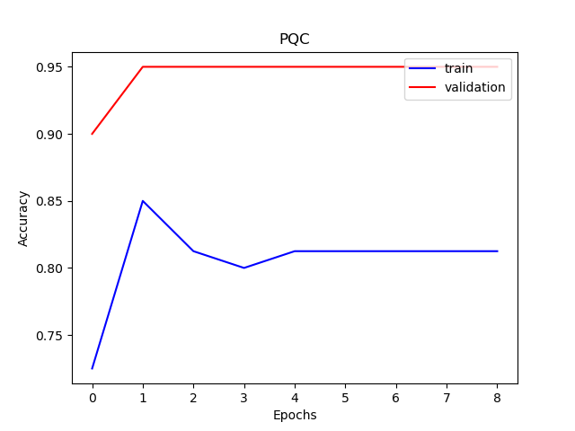

# demo of Parameterized quantum circuit 

## Overview
Parameterized quantum circuit (PQC) is a way to perform quantum machine learning. VQNet can process quantum circuits with parameters, and use the backprop of quantum neural networks to optimize  each parameter.

The general pipeline follows:

    1.Initialize the quantum circuit.
    
    2.According to requirements, add parameterized quantum gates or non-parametric quantum gates to the quantum circuit.
    
    3.Use PQC simulator operator to perform state evolution.
    
    4.Use sgd optimzer and backprop to find best parameters.


## Pipeline

### data preparation

this demo demonstrates classification task using iris dataset .This data have two classes and 100 samples,we use 80 samples as trainsets and the rest as validsets. 

```python
x_train,x_test,y_train,y_test = load_iris("training_data")    
```

### PQC construct

Module is abstract class for autograd layer

```python
class Model(Module):
    def __init__(self):
        super().__init__()
        self.pqc = PQCLayer()
    def forward(self, x):
        x = self.pqc(x)
        return x
```
Parameterized quantum circuit cosntruct,using PyQpanda 
```python
class PQCLayer(Module):
    """
    parameterized quantum circuit Layer.It contains paramters can be trained.

    """
    def __init__(self,machine:str="cpu",quantum_number:int=4,rep:int=3,measure_qubits:str="Z0 Z1"):

        """
        machine: 'str' - compute machine
        quantum_number: 'int' - should tensor's gradient be tracked, defaults to False
        rep: 'int' - Ansatz circuits repeat block times
        measure_qubits: 'str' - measure qubits
        """
        super().__init__()

        self.machine = machine
        if machine!="cpu":
            raise ValueError("machine onyl tested on cpu simulation")

        self.machine = pq.CPUQVM()
        self.machine.init_qvm()
        self.qlist = self.machine.qAlloc_many(quantum_number)

        self.history_expectation = []

        self.weights = Parameter(quantum_number*rep +quantum_number,zeros)

        measure_qubits = re.split(r'\s',measure_qubits)

        self.measure_qubits = measure_qubits
        self._rep = rep

    def forward(self, x):
        """
            forward function 
        """
        self.history_expectation = []
        batchsize = x.shape[0]
        batch_exp = np.zeros([batchsize,len(self.measure_qubits)])

        if batchsize == 1:
            prog = paramterized_quautum_circuits(x.data,self.weights.data,self.qlist,self._rep)
            for i,mq in enumerate(self.measure_qubits):
                hamiltion = Hamiltonian(mq)
                exp = self.machine.get_expectation(prog, hamiltion, self.qlist)      
                self.history_expectation.append(exp)
                batch_exp[0,i] = exp
        else:
            for b in range(batchsize):
                xdata = x.data
                b_str = str(b)
                x_ = xdata.select([b_str, ":"])
                prog = paramterized_quautum_circuits(x_,self.weights.data,self.qlist,self._rep)

                for i,mq in enumerate(self.measure_qubits):
                    hamiltion = Hamiltonian(mq)
                    exp = self.machine.get_expectation(prog, hamiltion, self.qlist)      
                    self.history_expectation.append(exp)
                    batch_exp[b,i] = exp
            
        requires_grad = (x.requires_grad or self.weights.requires_grad) and not QTensor.NO_GRAD
        nodes = []
        if x.requires_grad:
            nodes.append(QTensor.GraphNode(tensor=x, df=lambda g: 1))
        if  self.weights.requires_grad:
            nodes.append(
                QTensor.GraphNode(
            tensor = self.weights, df=lambda g: _parashift_grad(g,
                                                      paramterized_quautum_circuits,
                                                     x.data, 
                                                     self.weights.data, 
                                                     self.machine,
                                                     self.qlist,
                                                     self._rep,
                                                     self.measure_qubits,
                                                     self.history_expectation)
                                            )
                    )
        return QTensor(data = batch_exp,requires_grad = requires_grad,nodes =nodes)


def _parashift_grad(g,ForwardFunc,x:CoreTensor,weights:CoreTensor,
                machine,qlists,rep,measure_qubits:str,history_expectation:list,delta:float = 1e-2):
    num_para = 1
    g = np.array(g)
    batchsize = x.shape[0]
    for _ in weights.shape:
        num_para = num_para * _
    grad = np.zeros_like(weights)

    for _ in range(num_para):
            iter = 0

            for b in range(batchsize):
                b_str = str(b)
                x_ = x.select([b_str, ":"])


                for i,mq in enumerate(measure_qubits):
                    hamiltion = Hamiltonian(mq)
                    weights_theta = np.array(weights)
                    weights_theta[_] = weights_theta[_] + delta
                    weights_theta = CoreTensor(weights_theta)
                
                    prog = ForwardFunc(x_,weights_theta,qlists,rep)
                    exp2 = machine.get_expectation(prog, hamiltion, qlists)   # exp w.r.t measure_qubits

                    weights_theta = np.array(weights)
                    weights_theta[_] = weights_theta[_] - delta
                    weights_theta = CoreTensor(weights_theta)
                
                    prog = ForwardFunc(x_,weights_theta,qlists,rep)
                    exp3 = machine.get_expectation(prog, hamiltion, qlists)   # exp w.r.t measure_qubits
                    grad[_] += g[b,i]*(exp2 - exp3) / 2

    grad = CoreTensor(grad)

    return grad
```

### quantum circuits definition

A quantum circuits with variable parameters.
The quantum circuits can be constructed by [qpanda](https://pyqpanda-toturial.readthedocs.io/zh/latest/).

for PQC model,we normally use a data-encoding layer to encode classic data to quantum state.

Here, the encoding method we use is IQP encoding (Instantaneous Quantum Polynomial encoding). 
Generally speaking, the encoding method of the Encoder is not fixed, and different encoding methods can be selected according to the problem. 
Sometimes the Encoder will be adjusted according to the final performance.

we have 7 parameters of 7 RX gates,7 classic data features are used as these quantum circuits' parameters 


```python
def paramterized_quautum_circuits(input:CoreTensor,param:CoreTensor,qubits,rep:int):
    """
    use qpanda to define circuit

    """
    w = input
    w = np.array(w)
    w = w.squeeze()

    circuit = pq.QCircuit()

    circuit.insert(pq.H(qubits[0]))
    circuit.insert(pq.H(qubits[1])) 
    circuit.insert(pq.H(qubits[2]))
    circuit.insert(pq.H(qubits[3]))    

    circuit.insert(pq.RZ(qubits[0],w[0]))  
    circuit.insert(pq.RZ(qubits[1],w[1])) 
    circuit.insert(pq.RZ(qubits[2],w[2]))
    circuit.insert(pq.RZ(qubits[3],w[3]))

    circuit.insert(pq.CNOT(qubits[0],qubits[1]))
    circuit.insert(pq.RZ(qubits[1],w[4]))  
    circuit.insert(pq.CNOT(qubits[0],qubits[1]))

    circuit.insert(pq.CNOT(qubits[1],qubits[2]))
    circuit.insert(pq.RZ(qubits[2],w[5]))  
    circuit.insert(pq.CNOT(qubits[1],qubits[2]))

    circuit.insert(pq.CNOT(qubits[2],qubits[3]))
    circuit.insert(pq.RZ(qubits[3],w[6]))  
    circuit.insert(pq.CNOT(qubits[2],qubits[3]))
    
    cir = CNOT_RZ_REP_CIRCUITS(qubits,param,rep)
    
    circuit.insert(cir)
    prog = pq.QProg()    
    prog.insert(circuit)    
   
    return prog
```

Here, we use HardwareEfficientAnsatz, which is the encoding method shown in the above quantum circuit diagram.


```python
###circuits define
def CNOT_RZ_REP_CIRCUITS(qubits,param,rep:int = 3):
    
    para = param
    para = np.array(para)
    para = para.squeeze()

    circuit = pq.QCircuit()

    for q in range(len(qubits)):
        circuit.insert(pq.RX(qubits[q],para[q]))    

    for r in range(rep):
        for q in range(len(qubits) - 1):
            circuit.insert(pq.CNOT(qubits[q],qubits[q+1]))
            
        for q in range(len(qubits)):
            #print(q)
            circuit.insert(pq.RZ(qubits[q],para[(r+1)*len(qubits) + q]))
    
    return circuit

```

Here,we use Hamiltonian Operator to measure quantum states

```

def Hamiltonian(input:str):
    """
        Interchange two axes of an array.

        :param input: expect measure qubits.
        :return: hamiltion operator
    
        Examples::
        Hamiltonian("Z0 Z1" )
    """
     
    pauli_str = input  
    pauli_map = PauliOperator(pauli_str, 1)    
    hamiltion = pauli_map.toHamiltonian(True)
    return hamiltion  
```
### optimizer definition

Use SGD for this task is enough,model.parameters() is parameters need to be calculated
```
    optimizer = SGD(model.parameters(),lr=0.1)                        
```

### train

    model contains quantum circuits or classic data layer 
    CategoricalCrossEntropy() is loss function
    backward() calculates model.parameters gradients 
```

    for epoch in range(1,10):
        model.train()
        batch_size = 5
        for x, y in data_generator(x_train, y_train, batch_size=batch_size, shuffle=True):

            x0 = (np.pi/2-x[:,:-1])*(np.pi/2-x[:,1:])
            x = np.concatenate([x,x0],axis = 1)
            optimizer.zero_grad()
            output = model(x)
            CCEloss = CategoricalCrossEntropy()
            loss = CCEloss( y,output)
            loss.backward()
            optimizer._step()
            
```

### eval
``` 
    # Evaluation
        model.eval()
        correct = 0
        full_loss = 0
        n_loss = 0
        n_eval = 0
        batch_size = 1
        for x, y in data_generator(x_test, y_test, batch_size=batch_size, shuffle=True):
            x0 = (np.pi/2-x[:,:-1])*(np.pi/2-x[:,1:])
            x = np.concatenate([x,x0],axis = 1)
            output = model(x)
            CCEloss = CategoricalCrossEntropy()            
            loss = CCEloss( y,output)
            full_loss += loss.item()
            print("Epoch:", epoch, "iter:", n_loss, "loss:", loss.item())
            np_output = np.array(output.data,copy=False)
            mask  = np_output.argmax(1) == y.argmax(1)
            correct += sum(mask)
            n_eval += 1
            n_loss += 1

        print(f"Eval Accuracy: {correct/n_eval}")
        F1.write(f"{full_loss / n_loss}\t{correct/n_eval}\n")
    F1.close()
    print("\ndone\n")
    del model

```

### results


   
   

