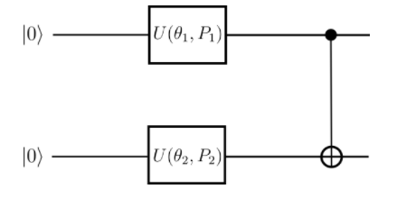
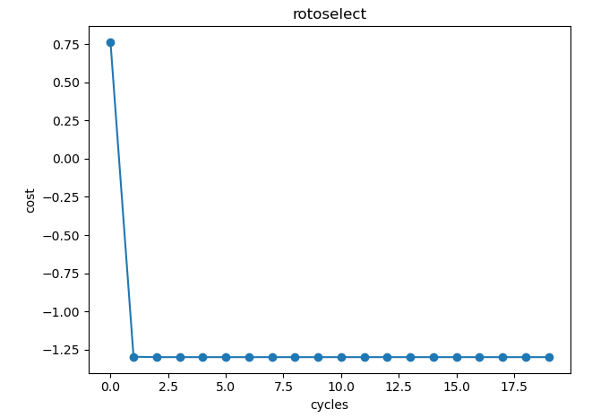
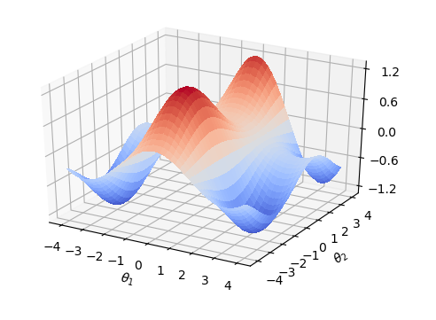

## demo of Parameterized quantum circuit for Quantum Circuit Structure Learning task


## Overview

QCSL task aims to select the best parameterized quantum gates to minimize the loss function 

The general pipeline follows:

    1. Initialize the quantum circuit and parameters

    2. For each member in parameters, the model find the best quantum gates in RX, RY, RZ via minimizing the loss function

    3. Update the member above via Rotoselect operation

    4. Repeat 1-3 until all members in parameters are updated

## Pipeline

### data preparation

this demo has a simple structure which consists of two gates with parameters $$\theta_1$$ and $$\theta_2$$ respectively, and initializes generator = ["X","Y"], so the demo allows the gates to be specified with the generators keyword rather than fixed gates RX and RY and the length of generator must equal to number of parameters and each member in generator can be "X", "Y" or "Z"

```python
params = QTensor(np.array([0.3,0.25]))
params = params.data.getdata()
generator = ["X","Y"]
generators = copy.deepcopy(generator)
epoch = 20
```

## QCSL construct

Parameterized quantum circuit cosntruct,using PyQpanda, variable quantum gates

### quantum circuit like 

```python
def gen(param:CoreTensor,generators,qbits,circuit):
    if generators == "X":
        circuit.insert(pq.RX(qbits,param))
    elif generators =="Y":
        circuit.insert(pq.RY(qbits,param))
    else:
        circuit.insert(pq.RZ(qbits,param))
def circuits(params,generators,circuit):
    gen(params[0], generators[0], nqbits[0], circuit)
    gen(params[1], generators[1], nqbits[1], circuit)
    circuit.insert(pq.CNOT(nqbits[0], nqbits[1]))
    prog = pq.QProg()
    prog.insert(circuit)
    return prog

def ansatz1(params:QTensor,generators):
    circuit = pq.QCircuit()
    params = params.data.getdata()
    prog = circuits(params,generators,circuit)
    return expval(machine,prog,{"Z0":1},nqbits), expval(machine,prog,{"Y1":1},nqbits)

def ansatz2(params:QTensor,generators):
    circuit = pq.QCircuit()
    params = params.data.getdata()
    prog = circuits(params, generators, circuit)
    return expval(machine,prog,{"X0":1},nqbits)
```

### loss function

The criterion for judging the best circuit in this demo is that if a gate combination can make the loss function achieve the minimum value, then the combination is the optimal solution, corss = 0.5*Y + 0.8*Z - 0.2*X

```python
def loss(params,generators):
    Z, Y = ansatz1(params,generators)
    X = ansatz2(params,generators)
    return 0.5 * Y + 0.8 * Z - 0.2 * X
```

### update parameters

During the update process, we update only one of them at a time i.e. when we update $$\theta_1 $$, $$\theta_2$$ is fixed. And then select the best quantum gates from RX, RY, RZ

```python
def rotosolve(d, params, generators, cost, M_0):  # M_0 only calculated once
    params[d] = np.pi / 2.0
    M_0_plus = cost(QTensor(params), generators)
    params[d] = -np.pi / 2.0
    M_0_minus = cost(QTensor(params), generators)
    a = np.arctan2(
        2.0 * M_0 - M_0_plus - M_0_minus, M_0_plus - M_0_minus
    )  # returns value in (-pi,pi]
    params[d] = -np.pi / 2.0 - a
    if params[d] <= -np.pi:
        params[d] += 2 * np.pi
    return cost(QTensor(params), generators)

def optimal_theta_and_gen_helper(index,params,generators):
    params[index] = 0.
    M_0 = loss(QTensor(params),generators)#init value
    for kind in ["X","Y","Z"]:
        generators[index] = kind
        params_cost = rotosolve(index, params, generators, loss, M_0)
        if kind == "X" or params_cost <= params_opt_cost:
            params_opt_d = params[index]
            params_opt_cost = params_cost
            generators_opt_d = kind
    return params_opt_d, generators_opt_d


def rotoselect_cycle(params:np,generators):
    for index in range(params.shape[0]):
        params[index], generators[index] = optimal_theta_and_gen_helper(index,params,generators)
    return params,generators
```

### main function
```python
for i in range(epoch):
    state_save.append(loss(QTensor(params), generators))
    params, generators = rotoselect_cycle(params,generators)
```

### result




According to the quantum circuit obtained in the result (the gates is fixed), it can be found that the loss function is associated with $$\theta_1,\theta_2$$, and the local extreme point can be obtained near (4, -3)
