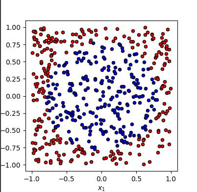
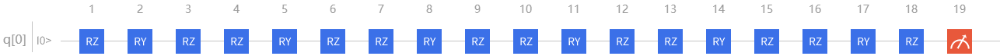
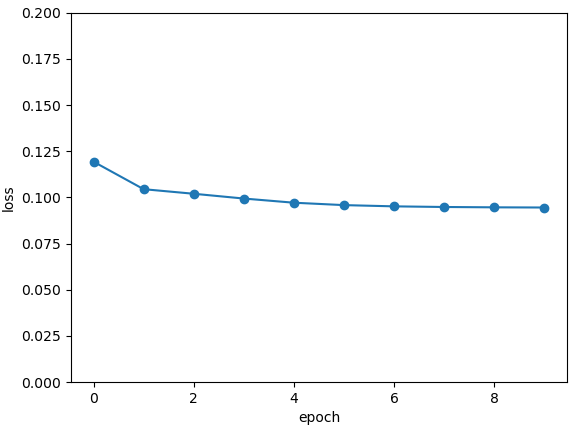

## demo of Parameterized quantum circuit for Quantum Data Re upLoading

## Overview
In neural network, each neuron receives neurons from all the layers above it. In contrast, a single qubit classifier receives information processing units and inputs from the previous one. Generally speaking, for classical quantum circuit, after data upload is completed, the result can be obtained directly through several unitary operations $$U(\theta_1,\theta_2,\theta_3)$$. However, data needs to be reuploaded before each unitary operation in Quantum Data Re upLoading (QDRL) task 

### 

The general pipeline follows:

    1.Re-uploading: create a single-bit quantum circuit, which realizes several unitary operation, and then decide whether to add additional quantum gates according to the parameters obtained by training operation and training samples
    
    2.Classification: There is enough space on the surface of the Bloch sphere, so a set of target states representing different tags can be defined, and the final quantum state of the circuit can be selected in the "maximum orthogonal" manner

## Pipeline

### data preparation 
There are two types of points: blue (1,0) and red (0,1), with coordinates (0,0) as the center of the circle and radius $$\sqrt {\frac{1}{2}}$$, blue if inside the circle and red otherwise

```python
def circle(samples:int,  reps =  np.sqrt(1/2)) :
    data_x, data_y = [], []
    for i in range(samples):
        x = np.random.rand(2)
        y = [0,1]
        if np.linalg.norm(x) < reps:
            y = [1,0]
        data_x.append(x)
        data_y.append(y)
    return np.array(data_x), np.array(data_y)
```


### QDRL construct

Module is abstract class for autograd layer

```python
class Model(Module):

    def __init__(self):
        super().__init__()
        self.pqc = vmodel(params.shape)
        #self.fc1 = Linear(3,2)
        self.fc2 = Linear(2,2)
    def forward(self, x):
        x = self.pqc(x)
        return x
```
Parameterized quantum circuit cosntruct,using PyQpanda 
```python
class vmodel(Module):
    def __init__(self,shape, num_layers = 3, q_delta = 1e-4):
        super().__init__()
        self.delta = q_delta
        self.num_layers = num_layers
        self.machine  = pq.CPUQVM()
        self.machine.init_qvm()
        self.n_qubits = self.machine.qAlloc_many(1)
        self.params = Parameter(num_layers*3) 
        self.last = []
  
    def forward(self,x):#x:QTensor
        self.last = []
        nodes = []
        requires_grad = (x.requires_grad or self.params.requires_grad) and not QTensor.NO_GRAD
        batch_save = np.zeros((x.data.shape[0],2))
        for i in range(x.data.shape[0]):
            xx = x.data.select([str(i),":"])
            prog = build_circult(self.params.data,xx, self.n_qubits)
            prob = self.machine.prob_run_dict(prog, self.n_qubits, -1)
            prob = list(prob.values())
            batch_save[i] = prob
            for ii in prob:
                self.last.append(ii)
        if x.requires_grad:
            nodes.append(QTensor.GraphNode(tensor=x,df=lambda g:1))
        if self.params.requires_grad:
            nodes.append(QTensor.GraphNode(tensor=self.params, df=lambda g:get_grad(g, x.data, self.params.data, build_circult,self.delta,self.machine,self.n_qubits,self.last)))
        
        return QTensor(data = batch_save,requires_grad = requires_grad,nodes=nodes)
def get_grad(g:CoreTensor, x:CoreTensor, params:CoreTensor, forward_circult,delta,machine,nqubits,last):
        num_params  = 1
        g = np.array(g)
        batch_size = x.shape[0]
        for _ in params.shape:
            num_params *= _
        grad = np.zeros(num_params)
        
        for i in range(num_params):
            iter = 0
            params_ = np.array(params)
            params_[i] += delta
            params_ = CoreTensor(params_)
            for tinybatch in range(batch_size):
                xx = x.select([str(tinybatch),":"])
                prog = forward_circult(params_,xx,nqubits)
                
                prob = machine.prob_run_dict(prog, nqubits, -1)
                prob = list(prob.values())
                for m in range(len(prob)):
                    grad[i] += g[tinybatch,m]* (prob[m]-last[iter])/delta
                    iter+=1
            grad[i] /= batch_size
        return CoreTensor(grad)
```
### quantum circuits definition 
we have 6 Rot operations(RX,RY,RZ) for qbit and measure qbits[0] to obtain the final probability(two values)
```python
def build_circult(param, x, n_qubits):#param 3*3, x=[1,2,3], x[i]   
    
        x1 = np.array(x).squeeze()
        param1 = np.array(param).squeeze()
        circult = pq.QCircuit()
        circult.insert(pq.RZ(n_qubits[0], x1[0]))
        circult.insert(pq.RY(n_qubits[0], x1[1]))
        circult.insert(pq.RZ(n_qubits[0], x1[2]))
        circult.insert(pq.RZ(n_qubits[0], param1[0]))
        circult.insert(pq.RY(n_qubits[0], param1[1]))
        circult.insert(pq.RZ(n_qubits[0], param1[2]))
        circult.insert(pq.RZ(n_qubits[0], x1[0]))
        circult.insert(pq.RY(n_qubits[0], x1[1]))
        circult.insert(pq.RZ(n_qubits[0], x1[2]))
        circult.insert(pq.RZ(n_qubits[0], param1[3]))
        circult.insert(pq.RY(n_qubits[0], param1[4]))
        circult.insert(pq.RZ(n_qubits[0], param1[5]))
        circult.insert(pq.RZ(n_qubits[0], x1[0]))
        circult.insert(pq.RY(n_qubits[0], x1[1]))
        circult.insert(pq.RZ(n_qubits[0], x1[2]))
        circult.insert(pq.RZ(n_qubits[0], param1[6]))
        circult.insert(pq.RY(n_qubits[0], param1[7]))
        circult.insert(pq.RZ(n_qubits[0], param1[8]))
        prog = pq.QProg()
        prog.insert(circult)

        return prog
```

### optimizer definition
Use SGD for this task is enough,model.parameters() is parameters need to be calculated
```python
optimizer = sgd.SGD(model.parameters(),lr =1)
```

### train
    model contains quantum circuits or classic data layer 
    CategoricalCrossEntropy() is loss function
    backward() calculates model.parameters gradients 

```python
def train():
    model.train()
    x_train, y_train = circle(500)
    x_train = np.hstack((x_train, np.ones((x_train.shape[0], 1))))  # 500*3
    x_train, y_train = QTensor(x_train),QTensor(y_train)
    epoch = 10
    print("start training...........")
    for i in range(epoch):
        accuracy = 0
        count = 0
        loss = 0
        for data, label in get_minibatch_data(x_train, y_train,batch_size):
            optimizer.zero_grad()
            data,label = QTensor(data), QTensor(label)
            output = model(data)
            Closs = CategoricalCrossEntropy()
            losss = Closs(label, output)

            losss.backward()
            optimizer._step()
            accuracy += get_score(output,label)
            
            loss += losss.item()
            print(f"epoch:{i}, train_accuracy:{accuracy}")
            print(f"epoch:{i}, train_loss:{losss.data.getdata()}")
            count += batch_size
            
        print(f"epoch:{i}, train_accuracy_for_each_batch:{accuracy/count}")
        print(f"epoch:{i}, train_loss_for_each_batch:{loss/count}")

```

### eval
```python
def test():
    model.eval()
    print("start eval...................")
    x_test, y_test = circle(500)
    test_accuracy = 0
    count = 0
    x_test = np.hstack((x_test, np.ones((x_test.shape[0], 1))))
    x_test, y_test = QTensor(x_test), QTensor(y_test)
    for test_data, test_label in get_minibatch_data(x_test,y_test, batch_size):

        test_data, test_label = QTensor(test_data),QTensor(test_label)
        output = model(test_data)
        test_accuracy += get_score(output, test_label)
        count += batch_size
    print(f"test_accuracy:{test_accuracy/count}")
```


### result



