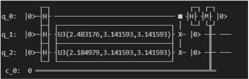
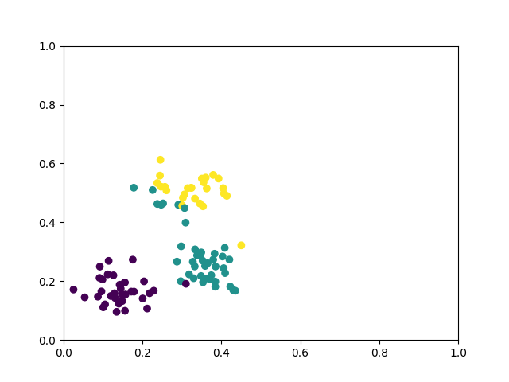

## Quantum K-means

Clustering algorithm is a typical unsupervised learning algorithm, which is mainly used to automatically classify similar samples into one category.In the clustering algorithm, according to the similarity between the samples, the samples are divided into different categories. For different similarity calculation methods, different clustering results will be obtained. The commonly used similarity calculation method is the Euclidean distance method. What we want to show is the quantum K-Means algorithm. The K-Means algorithm is a distance-based clustering algorithm that uses distance as an evaluation index for similarity, that is, the closer the distance between two objects is, the greater the similarity. The algorithm considers the cluster to be composed of objects that are close together, so the compact and independent cluster is the ultimate target.

#### Algorithm design

The implementation of the quantum K-Means algorithm mainly uses the swap test to compare the distances among the input data points. Select K points randomly from N data points as centroids, measure the distance from each point to each centroid, and assign it to the nearest centroid- class, recalculate centroids of each class that has been obtained, and iterate 2 to 3 steps until the new centroid is equal to or less than the specified threshold, and the algorithm ends. In our example, we selected 6 data points, 2 centroids, and used the swap test circuit to calculate the distance. Finally, we obtained two clusters of data points. $|0\rangle$​ is an auxiliary qubit, through left $H$​​ gate, it will be changed to $\frac{1}{\sqrt{2}}(|0\rangle + |1\rangle)$​. Then under the control of $|1\rangle$​, the circuit will swap two vectors $|x\rangle$​ and |y\rangle$. Finally, we get the result at the right end of the circuit:

​                                                                             $$|0_{anc}\rangle |x\rangle |y\rangle \rightarrow \frac{1}{2}|0_{anc}\rangle(|xy\rangle + |yx\rangle) + \frac{1}{2}|1_{anc}\rangle(|xy\rangle - |yx\rangle)$$

If we measure auxiliary qubit alone, then the probability of final state in the ground state  is:

​                                                                             $$P(|1_{anc}\rangle) = \frac{1}{2} - \frac{1}{2}|\langle x | y \rangle|^2$$​​​

The Eucildean distance between two vectors is:

​                                                                            $$Euclidean \ distance = \sqrt{(2 - 2|\langle x | y \rangle|)}$$

So, we can see that the probability of measuring $|1\rangle$ has positive correlation with the Euclidean distance. The schematic diagram of quantum K-Means is as the follow picture.



#### VQNet implementation

##### 1 generate data

We use scipy.make_blobs to genrate 2d Gaussian data for cluster.

```
def get_data(n, k, std):
    data = make_blobs(n_samples=n, n_features=2, centers=k, cluster_std=std, random_state=100)
    points = data[0]
    centers = data[1]
    return points, centers

```

#### 2 Quantum Circuits

Use VQNet and pyQpanda to create Quantum Circuits

```

def get_theta(d):
    x = d[0]
    y = d[1]
    theta = 2 * math.acos((x.item() + y.item()) / 2.0)
    return theta

def qkemas_circuits(x, y):
    
    theta_1 = get_theta(x)
    theta_2 = get_theta(y)

    num_qubits = 3
    machine = pq.CPUQVM()
    machine.init_qvm()
    qubits = machine.qAlloc_many(num_qubits)
    cbits = machine.cAlloc_many(num_qubits)
    circuit = pq.QCircuit()

    circuit.insert(pq.H(qubits[0]))
    circuit.insert(pq.H(qubits[1]))
    circuit.insert(pq.H(qubits[2]))

    circuit.insert(pq.U3(qubits[1], theta_1, np.pi, np.pi))
    circuit.insert(pq.U3(qubits[2], theta_2, np.pi, np.pi))

    circuit.insert(pq.SWAP(qubits[1], qubits[2]).control([qubits[0]]))

    circuit.insert(pq.H(qubits[0]))

    prog = pq.QProg()
    prog.insert(circuit)
    prog << pq.Measure(qubits[0], cbits[0])
    prog.insert(pq.Reset(qubits[0]))
    prog.insert(pq.Reset(qubits[1]))
    prog.insert(pq.Reset(qubits[2]))

    result = machine.run_with_configuration(prog, cbits, 1024)

    data = result

    if len(data) == 1:
        return 0.0
    else:
        return data['001'] / 1024.0
```

#### 3 cluster iteration

Iterate some epoches to find nearest centroids for data.

```
def draw_plot(points, centers, label=True):
    points = np.array(points)
    centers = np.array(centers)
    if label==False:
        plt.scatter(points[:,0], points[:,1])
    else:
        plt.scatter(points[:,0], points[:,1], c=centers, cmap='viridis')
    plt.xlim(0, 1)
    plt.ylim(0, 1)
    plt.show()


def initialize_centers(points,k):
    return points[np.random.randint(points.shape[0],size=k),:]


def find_nearest_neighbour(points, centroids):
    n = points.shape[0]
    k = centroids.shape[0]
    

    centers = zeros([n])

    for i in range(n):
        min_dis = 10000
        ind = 0
        for j in range(k):

            temp_dis = qkemas_circuits(points[i, :], centroids[j, :])

            if temp_dis < min_dis:
                min_dis = temp_dis
                ind = j
        centers[i] = ind

    return centers

def find_centroids(points, centers):


    k = int(tensor.max(centers).item()) + 1

    centroids = tensor.zeros([k, 2])

    for i in range(k):

        cur_i = centers == i
    
        x = points[:,0]
        x = x[cur_i]
        y = points[:,1]
        y = y[cur_i]
        centroids[i, 0] = tensor.mean(x)
        centroids[i, 1] = tensor.mean(y)

    return centroids

def preprocess(points):
    n = len(points)
    x = 30.0 * np.sqrt(2)
    for i in range(n):
        points[i, :] += 15
        points[i, :] /= x

    return points


def qkeman_run():
    n = 100  # number of data points
    k = 3  # Number of centers
    std = 2  # std of datapoints

    points, o_centers = get_data(n, k, std)  # dataset

    points = preprocess(points)  # Normalize dataset

    centroids = initialize_centers(points, k)  # Intialize centroids

    epoch = 5
    points = QTensor(points)
    centroids = QTensor(centroids)
    # run k-means algorithm
    for i in range(epoch):
            centers = find_nearest_neighbour(points, centroids)  # find nearest centers
            centroids = find_centroids(points, centers)  # find centroids
            plt.figure()
            draw_plot(points.data, centers.data)
			
```

#### 4 result

data before clustered


data after clustered




