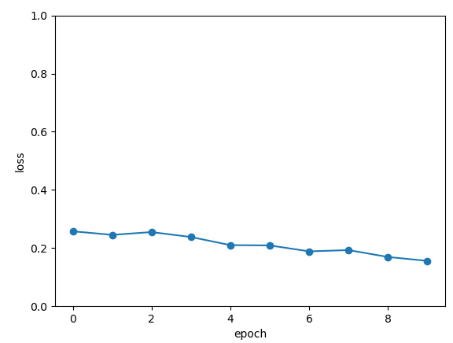
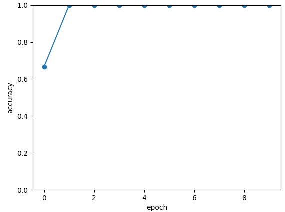

## demo of Parameterized quantum circuit for Quantum Variational Classifier
## Overview

This demo aims to determine the number of 1, just a binary classification task. Unlike other task, Quantum Variational Classifier(QVC) task can change initial quantum state by adding Pauliz gate i.e. map |0000> -> |0101> (according to input parameters)

The general pipeline follows:

    1.Initialize the quantum circuit.
    
    2.According to requirements, add parameterized quantum gates or non-parametric quantum gates to the quantum circuit.
    
    3.Use QVC operator to perform state evolution.
    
    4.Use sgd optimzer and backprop to find best parameters.

## Pipeline

### data preparation
the data of this demo is qvc_data.txt and qvc_data_test.txt (16 samples totally), each sample consists of 0 and 1 (five members), sample[1:4] is data used to train or test, and the last value is label for corresponding data. If you choose shuffle = true, the model get data via shuffle manner(by batch rather than each sample)

```python

def get_data(PATH):
    datasets = np.loadtxt(PATH) 
    data = datasets[:,:-1]
    label = datasets[:,-1].astype(int)
    label = np.eye(2)[label].reshape(-1,2)
    return data, label

def dataloader(data,label,batch_size, shuffle = True)->np:
    if shuffle:
        for _ in range(len(data)//batch_size):
            random_index = np.random.randint(0, len(data), (batch_size, 1))
            yield data[random_index].reshape(batch_size,-1),label[random_index].reshape(batch_size,-1)
    else:
        for i in range(0,len(data)-batch_size+1,batch_size):
            yield data[i:i+batch_size], label[i:i+batch_size]

```

### QVC construct

Module is abstract class for autograd layer
```python
class Model(Module):
    def __init__(self,shape):
        self.qvc = Qvc(shape)
        self.fc1 = Linear(4,16)
        self.fc2 = Linear(16,2)
    def forward(self, x):
        return self.qvc(x)
        # x = self.fc1(x)
        # return self.fc2(x)

```
Parameterized quantum circuit cosntruct,using PyQpanda, the ndims of input parameters is 4
```python
class Qvc(Module):
    def __init__(self,shape,  q_delta = 1e-2):
        super().__init__()
        self.weights = Parameter(shape) #2*4*3
        self.delta = q_delta
        self.machine  = pq.CPUQVM()
        self.machine.init_qvm()
        self.n_qubits = self.machine.qAlloc_many(4)
        #self.params = Parameter(num_layers*3)
        self.bias = Parameter([1])
        #self.measure_qubits = re.split('\s',"Z0 Z1")
        self.last = []
    def forward(self,x:QTensor):#5*4, all x[i] must =0 or 1
        nodes = []
        self.last.clear()
        requires_grad = x.requires_grad and not QTensor.NO_GRAD
        batch_size = x.data.shape[0]
        data = np.zeros((batch_size,2))
        for mini in range(batch_size):
            xx = x.data.select([str(mini)])#xx.shape[1,4]
            prog = build_circult(self.weights.data, xx, self.n_qubits)
            prob = self.machine.prob_run_dict(prog, self.n_qubits[0], -1)
            prob = list(prob.values())
            for i in prob:
                self.last.append(i)
            data[mini] = prob
        if self.weights.requires_grad:
            nodes.append(QTensor.GraphNode(tensor=self.weights,df = lambda g:_get_grad(g, x.data, self.weights.data, build_circult,self.delta,self.machine,self.n_qubits,self.last)
            ))
        return QTensor(data,requires_grad,nodes)
def _get_grad(g:CoreTensor, x:CoreTensor, weights:CoreTensor, forward_circult,delta,machine,nqubits,last):
    num = 1
    batch_size = x.shape[0]
    gn = np.array(g)
    grad = tensor.zeros(weights.shape).data
    gg = grad.getdata()
    gg = gg.flatten()
    for i in weights.shape:
        num *= i
    for i in range(num):
        iter = 0
        paras = weights.clone()
        para = paras.getdata()
        para = para.flatten()
        para[i] += delta
        para = CoreTensor(para).reshape(paras.shape)
        for j in range(batch_size):
            xx = x.select([str(j)])
            prog = forward_circult(para, xx, nqubits)
            prob = machine.prob_run_dict(prog, nqubits[0], -1)
            prob = list(prob.values())
            for m in range(len(prob)):
                gg[i] += gn[j,m]*(prob[m]-last[iter])/delta
                iter += 1
        gg[i]/=batch_size

    gg = gg.reshape(grad.shape)
    grad = CoreTensor(gg)
    return grad

```

### quantum circuits definition
we have 2 Rot operations(RX,RY,RZ) for each qbits and measure qbits[0] to obtain the final probability. And we can change initial quantum state by adding Pauliz gate according to input

```python

def get_cnot(nqubits):
	cir = pq.QCircuit()
	for i in range(len(nqubits)-1):
		cir.insert(pq.CNOT(nqubits[i],nqubits[i+1]))
	cir.insert(pq.CNOT(nqubits[len(nqubits)-1],nqubits[0]))
	return cir

def build_circult(weights, xx, nqubits):
	
	def Rot(weights_j, qubits):
		circult = pq.QCircuit()
		
		circult.insert(pq.RZ(qubits, weights_j[0]))
		circult.insert(pq.RY(qubits, weights_j[1]))
		circult.insert(pq.RZ(qubits, weights_j[2]))
		return circult
	def basisstate():
		circult = pq.QCircuit()
		for i in range(len(nqubits)):
			if xx[i]==1:
				circult.insert(pq.X(nqubits[i]))
		return circult

	circult = pq.QCircuit()
	circult.insert(basisstate())

	for i in range(weights.shape[0]):
		
		weights_i = weights[i,:,:]
		for j in range(len(nqubits)):
			weights_j = weights_i[j]
			circult.insert(Rot(weights_j,nqubits[j]))
		cnots = get_cnot(nqubits)  
		circult.insert(cnots) 

	circult.insert(pq.Z(nqubits[0]))#pauli z(0)
	
	prog = pq.QProg()  
	prog.insert(circult)
	return prog

```

### optimizer definition
Use SGD for this task is enough,model.parameters() is parameters need to be calculated
```python
optimizer = sgd.SGD(model.parameters(),lr =0.5)
```

### train

model contains quantum circuits or classic data layer 
CategoricalCrossEntropy() is loss function
backward() calculates model.parameters gradients 

```python
nqubits = 4
num_layer = 2
model = Model([num_layer,nqubits,3])

optimizer = sgd.SGD(model.parameters(),lr =0.5)
batch_size = 3
epoch = 10
loss = CategoricalCrossEntropy()
print("start training..............")
model.train()
PATH = os.path.abspath('./dataset/qvc_data.txt')
datas,labels = get_data(PATH)
for i in range(epoch):
    count=0
    sum_loss = 0
    accuary = 0
    for data,label in dataloader(datas,labels,batch_size):
        optimizer.zero_grad()
        data,label = QTensor(data,requires_grad=True), QTensor(label)
        result = model(data)

        loss_b = loss(label,result)
        loss_b.backward()
        optimizer._step()
        sum_loss += loss_b.item()
        count+=batch_size
        accuary += get_accuary(result,label)

    print(f"epoch:{i}, #### loss:{sum_loss/count} #####accuray:{accuary/count}")
print("start testing..............")

```


### eval
```python
model.eval()
count = 0
test_PATH = os.path.abspath('./dataset/qvc_data_test.txt')
test_data, test_label = get_data(test_PATH)
test_batch_size = 1
accuary = 0
sum_loss = 0
for testd,testl in dataloader(test_data,test_label,test_batch_size):
    testd = QTensor(testd)
    test_result = model(testd)
    test_loss = loss(testl,test_result)
    sum_loss += test_loss
    count+=test_batch_size
    accuary += get_accuary(test_result,testl)
print(f"test:--------------->loss:{sum_loss/count} #####accuray:{accuary/count}")
```

### result




