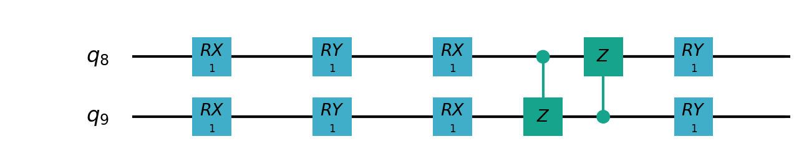

# 												10量子比特下的mnist分类对比经典全连接网络的VQNet实例

## 概述
使用可变量子线路构建2分类模型，在与相似参数精度的神经网络对比分类精度，两者精度相近。而量子线路的参数量远小于经典神经网络。参考论文：[VSQL: Variational Shadow Quantum Learning for Classification](https://arxiv.org/pdf/2012.08288.pdf)

模型步骤：

1. 将经典数据 $\mathbf{x}^i$ 归一化，并使用振幅编码到量子态上 $\left|\mathbf{x}^i\right>$.
2. 使用$Rx，Ry，Rz，Cnot$ 等基本量子逻辑门构建含参量子线路 $U(\mathbf{\theta})$ .
3. 使用 $U(\mathbf{\theta})$​​ 在量子比特上进行滑窗，计算量子线路的观测量作为多个量子比特之间的局部特征.
4. 将第三步得到的局部特征拼接起来，并送入全连接网络进行分类任务
5. 通过计算分类任务的交叉熵损失函数 $\mathcal{L}(\mathbf{\theta}, \mathbf{W}, \mathbf{b})$​.通过梯度下降法，优化调整量子线路的参数 $\mathbf{\theta}$​, 全连接层的权重$\mathbf{W}$​, 和偏置$\mathbf{b}$​​. 

## 实验设置

实验数据：

​		MNIST手写数据库中的‘0’，‘1’数字进行2分类任务。

实验模型：

​	    经典机器学习模型，我们原始图像28*28的输入，用1570个参数的全连接层进行2分类任务。

​		量子机器学习模型，使用28*28的原始图像输入，将图像特征展平为一维，并补0到1024维。将1024维特征输入量子线路输出9维的特征，并使用18个参数的全连接进行分类，参数量为8+18 = 26个参数。


量子整体模型如下：


10个量子比特的相邻量子比特$(q0,q1),(q1,q2),...(q8,q9)$上加入如下由$Rx，Ry，Rz，Cnot$ 等基本量子逻辑门构建含参量子线路 $U(\mathbf{\theta})$：




在每个量子线路$U(\mathbf{\theta})$​​后加入泡利算子观测量作为经典数据的隐含特征。该模型可得到9个这样的隐含特征。将9维特征输入全连接层进行2分类。

## 数据准备

```python
def load_mnist(dataset="training_data", digits=np.arange(10), 
                path="..\\..\\data\\MNIST_data\\"):         # 下载数据
    import os, struct
    from array import array as pyarray
    if dataset == "training_data":
        fname_image = os.path.join(path, 'train-images.idx3-ubyte').replace('\\', '/')
        fname_label = os.path.join(path, 'train-labels.idx1-ubyte').replace('\\', '/')
    elif dataset == "testing_data":
        fname_image = os.path.join(path, 't10k-images.idx3-ubyte').replace('\\', '/')
        fname_label = os.path.join(path, 't10k-labels.idx1-ubyte').replace('\\', '/')
    else:
        raise ValueError("dataset must be 'training_data' or 'testing_data'")

    flbl = open(fname_label, 'rb')
    magic_nr, size = struct.unpack(">II", flbl.read(8))

    lbl = pyarray("b", flbl.read())
    flbl.close()

    fimg = open(fname_image, 'rb')
    magic_nr, size, rows, cols = struct.unpack(">IIII", fimg.read(16))
    img = pyarray("B", fimg.read())
    fimg.close()

    ind = [k for k in range(size) if lbl[k] in digits]
    N = len(ind)
    images = np.zeros((N, rows, cols))

    labels = np.zeros((N, 1), dtype=int)
    for i in range(len(ind)):
        images[i] = np.array(img[ind[i] * rows * cols: (ind[i] + 1) * rows * cols]).reshape((rows, cols))
        labels[i] = lbl[ind[i]]

    return images, labels
```

## VSQL线路结构

```python
def circuits_of_vsql(input,weights,qlist,clist,machine):
    
    n = 10
    n_qsc=2
    depth=1
    weights = weights.reshape([depth + 1, 3, n_qsc])
    
    def subcir(weights,qlist,depth,n_qsc,n_start):
        cir = pq.QCircuit()

        for i in range(n_qsc):
            cir.insert(pq.RX(qlist[n_start + i],weights[0][0][i] ))
            cir.insert(pq.RY(qlist[n_start + i],weights[0][1][i]))
            cir.insert(pq.RX(qlist[n_start + i],weights[0][2][i]))
        for repeat in range(1, depth + 1):
            for i in range(n_qsc - 1):
                cir.insert(pq.CNOT(qlist[n_start + i], qlist[n_start + i + 1]))
            cir.insert(pq.CNOT(qlist[n_start + n_qsc - 1],qlist[ n_start]))
            for i in range(n_qsc):
                cir.insert(pq.RY(qlist[ n_start + i], weights[repeat][1][i]))

        return cir
    def get_pauli_str(n_start, n_qsc=2):
        pauli_str = ','.join('X' + str(i) for i in range(n_start, n_start + n_qsc))
        return {pauli_str:1.0}
    
    f_i = []

    for st in range(n - n_qsc + 1):
        psd = get_pauli_str(st,n_qsc)
        cir = pq.QCircuit()
        cir.insert(AmplitudeEmbeddingCircuit(input,qlist))
        cir.insert(subcir(weights,qlist,depth,n_qsc,st))
        prog = pq.QProg()
        prog.insert(cir)
        
        f_ij = expval(machine,prog,psd,qlist)
        f_i.append(f_ij)
    f_i = np.array(f_i)
    return f_i
```

## VSQL整体程序

```python
import os
from pyvqnet.nn.module import Module
from pyvqnet.nn.linear import Linear

from pyvqnet.nn.loss import CategoricalCrossEntropy

from pyvqnet.optim.adam import Adam
from pyvqnet.data.data import data_generator
from pyvqnet.tensor import tensor
import numpy as np

import pyqpanda as pq
import matplotlib
try:
    matplotlib.use('TkAgg')
except:
    pass
import matplotlib.pyplot as plt

import matplotlib.pyplot as plt
from pyvqnet.qnn.measure import expval
from pyvqnet.qnn.quantumlayer import QuantumLayer
from pyvqnet.qnn.template import AmplitudeEmbeddingCircuit
from pyvqnet.nn.linear import Linear

if not os.path.exists("./result"):
    os.makedirs("./result")
else:
    pass

def circuits_of_vsql(input,weights,qlist,clist,machine):
    
    n = 10
    n_qsc=2
    depth=1
    weights = weights.reshape([depth + 1, 3, n_qsc])
    
    def subcir(weights,qlist,depth,n_qsc,n_start):
        cir = pq.QCircuit()

        for i in range(n_qsc):
            cir.insert(pq.RX(qlist[n_start + i],weights[0][0][i] ))
            cir.insert(pq.RY(qlist[n_start + i],weights[0][1][i]))
            cir.insert(pq.RX(qlist[n_start + i],weights[0][2][i]))
        for repeat in range(1, depth + 1):
            for i in range(n_qsc - 1):
                cir.insert(pq.CNOT(qlist[n_start + i], qlist[n_start + i + 1]))
            cir.insert(pq.CNOT(qlist[n_start + n_qsc - 1],qlist[ n_start]))
            for i in range(n_qsc):
                cir.insert(pq.RY(qlist[ n_start + i], weights[repeat][1][i]))

        return cir
    def get_pauli_str(n_start, n_qsc=2):
        pauli_str = ','.join('X' + str(i) for i in range(n_start, n_start + n_qsc))
        return {pauli_str:1.0}
    
    f_i = []

    for st in range(n - n_qsc + 1):
        psd = get_pauli_str(st,n_qsc)
        cir = pq.QCircuit()
        cir.insert(AmplitudeEmbeddingCircuit(input,qlist))
        cir.insert(subcir(weights,qlist,depth,n_qsc,st))
        prog = pq.QProg()
        prog.insert(cir)
        
        f_ij = expval(machine,prog,psd,qlist)
        f_i.append(f_ij)
    f_i = np.array(f_i)
    return f_i

#GLOBAL VAR    
n = 10
n_qsc = 2
depth = 1
class QModel(Module):
    def __init__(self):
        super().__init__()
        self.vq = QuantumLayer(circuits_of_vsql,(depth + 1)*3* n_qsc,"cpu",10)
        self.fc = Linear(n - n_qsc + 1, 2)
    def forward(self, x):
        x = self.vq(x)
        x = self.fc(x)

        return x
class Model(Module):

    def __init__(self):
        super().__init__()
        self.fc1 = Linear(input_channels=28*28,output_channels=2)
        
    def forward(self, x):

        x = tensor.flatten(x,1)
        x = self.fc1(x)
        return x

def load_mnist(dataset="training_data", digits=np.arange(10), 
                path="..\\..\\data\\MNIST_data\\"):         # 下载数据
    import os, struct
    from array import array as pyarray
    if dataset == "training_data":
        fname_image = os.path.join(path, 'train-images.idx3-ubyte').replace('\\', '/')
        fname_label = os.path.join(path, 'train-labels.idx1-ubyte').replace('\\', '/')
    elif dataset == "testing_data":
        fname_image = os.path.join(path, 't10k-images.idx3-ubyte').replace('\\', '/')
        fname_label = os.path.join(path, 't10k-labels.idx1-ubyte').replace('\\', '/')
    else:
        raise ValueError("dataset must be 'training_data' or 'testing_data'")

    flbl = open(fname_label, 'rb')
    magic_nr, size = struct.unpack(">II", flbl.read(8))

    lbl = pyarray("b", flbl.read())
    flbl.close()

    fimg = open(fname_image, 'rb')
    magic_nr, size, rows, cols = struct.unpack(">IIII", fimg.read(16))
    img = pyarray("B", fimg.read())
    fimg.close()

    ind = [k for k in range(size) if lbl[k] in digits]
    N = len(ind)
    images = np.zeros((N, rows, cols))

    labels = np.zeros((N, 1), dtype=int)
    for i in range(len(ind)):
        images[i] = np.array(img[ind[i] * rows * cols: (ind[i] + 1) * rows * cols]).reshape((rows, cols))
        labels[i] = lbl[ind[i]]

    return images, labels

def show_image():
    image, label = load_mnist()
    for img in range(len(image)):
        plt.imshow(image[img])
        plt.show()

"""
compared classic fc model
"""
def run_fc01():

    digits = [0,1]
    x_train, y_train = load_mnist("training_data",digits)                     
    x_train = x_train / 255                                             


    y_train = y_train.reshape(-1, 1)      
    y_train = np.eye(len(digits))[y_train].reshape(-1, len(digits)) 
                
    x_test, y_test = load_mnist("testing_data",digits)    
    x_test = x_test / 255
    y_test = y_test.reshape(-1, 1)  
    y_test = np.eye(len(digits))[y_test].reshape(-1, len(digits)) 
    

    x_train = x_train[:500]        
    y_train = y_train[:500] 
                  
    x_test = x_test[:100]                       
    y_test = y_test[:100]                       
    print("model start")
    model = Model()

    optimizer = Adam(model.parameters(),lr=0.01)                        # 使用SGD优化，学习率为0.01

    model.train()
    F1 = open("./result/qfcrlt.txt","w")
    for epoch in range(1,20):

        model.train()
        full_loss = 0
        n_loss = 0
        n_eval =0
        batch_size = 128
        correct = 0
        iter = 0
        for x, y in data_generator(x_train, y_train, batch_size=batch_size, shuffle=True):#shuffle batch rather than data
            
            optimizer.zero_grad()
            
            try:
                x = x.reshape(batch_size, 1, 28, 28)
            except:
                x = x.reshape(-1,1,28,28) 

            output = model(x)
            iter +=1
            
            CCEloss = CategoricalCrossEntropy()
            loss = CCEloss( y,output)    
            loss.backward()
            optimizer._step()

            full_loss += loss.item()
            n_loss += batch_size
            np_output = np.array(output.data,copy=False)
            mask  = np_output.argmax(1) == y.argmax(1)
            correct += sum(mask)


        print(f"Train Accuracy: {correct/n_loss}%")
        print(f"Epoch: {epoch}, Loss: {full_loss / n_loss}")
        F1.write(f"{epoch}\t{full_loss / n_loss:.4f}\t{correct/n_loss:.4f}\t")
        
    # Evaluation
        model.eval()
        print("eval")
        correct = 0
        full_loss = 0
        n_loss = 0
        n_eval = 0
        batch_size = 1
        for x, y in data_generator(x_test, y_test, batch_size=batch_size, shuffle=True):
            x = x.reshape(1, 1, 28, 28)
            output = model(x)

            CCEloss = CategoricalCrossEntropy()
            
            loss = CCEloss( y,output)

            full_loss += loss.item()
            np_output = np.array(output.data,copy=False)
            mask  = np_output.argmax(1) == y.argmax(1)
            correct += sum(mask)
            n_eval += 1
            n_loss += 1

        print(f"Eval Accuracy: {correct/n_eval}")
        F1.write(f"{full_loss / n_loss:.4f}\t{correct/n_eval:.4f}\n")
            
    F1.close()
    del model
    print("\ndone\n")

"""
VQSL MODEL
"""
def run_VQSL():
    digits = [0,1]
    x_train, y_train = load_mnist("training_data",digits)                     
    x_train = x_train / 255                                             
    y_train = y_train.reshape(-1, 1)         
    y_train = np.eye(len(digits))[y_train].reshape(-1, len(digits))          
    x_test, y_test = load_mnist("testing_data",digits)    
    x_test = x_test / 255
    y_test = y_test.reshape(-1, 1)  
    y_test = np.eye(len(digits))[y_test].reshape(-1, len(digits))    
    
    x_train_list =[]
    x_test_list = []
    for i in range(x_train.shape[0]):
        x_train_list.append(np.pad(x_train[i,:,:].flatten(),(0, 240), constant_values=(0, 0)))
    x_train = np.array(x_train_list)
    
    for i in range(x_test.shape[0]):
        x_test_list.append(np.pad(x_test[i,:,:].flatten(),(0, 240), constant_values=(0, 0)))

    x_test = np.array(x_test_list)

    x_train = x_train[:500]        
    y_train = y_train[:500] 
                  
    x_test = x_test[:100]                       
    y_test = y_test[:100]                       
    print("model start")
    model = QModel()

    optimizer = Adam(model.parameters(),lr=0.1)                        # 使用SGD优化，学习率为0.01

    model.train()
    F1 = open("./result/vqslrlt.txt","w")
    for epoch in range(1,20):

        model.train()
        full_loss = 0
        n_loss = 0
        n_eval =0
        batch_size = 1
        correct = 0
        iter = 0
        for x, y in data_generator(x_train, y_train, batch_size=batch_size, shuffle=True):
            optimizer.zero_grad()
            try:
                x = x.reshape(batch_size, 1024)
            except:
                x = x.reshape(-1,1024) 

            output = model(x)
            iter +=1
            
            CCEloss = CategoricalCrossEntropy()
            loss = CCEloss( y,output)
            loss.backward()
            optimizer._step()

            full_loss += loss.item()
            n_loss += batch_size
            np_output = np.array(output.data,copy=False)
            mask  = np_output.argmax(1) == y.argmax(1)
            correct += sum(mask)
            print(f"{iter}")
        print(f"Train Accuracy: {correct/n_loss}%")
        print(f"Epoch: {epoch}, Loss: {full_loss / n_loss}")
        F1.write(f"{epoch}\t{full_loss / n_loss}\t{correct/n_loss}\t")
        
    # Evaluation
        model.eval()
        print("eval")
        correct = 0
        full_loss = 0
        n_loss = 0
        n_eval = 0
        batch_size = 1
        for x, y in data_generator(x_test, y_test, batch_size=batch_size, shuffle=True):
            x = x.reshape(1, 1024)
            output = model(x)

            CCEloss = CategoricalCrossEntropy()
            loss = CCEloss( y,output)
            full_loss += loss.item()

            np_output = np.array(output.data,copy=False)
            mask  = np_output.argmax(1) == y.argmax(1)
            correct += sum(mask)
            n_eval += 1
            n_loss += 1
            
        print(f"Eval Accuracy: {correct/n_eval}")
        F1.write(f"{full_loss / n_loss}\t{correct/n_eval}\n")
        
    
    F1.close()
    del model
    print("\ndone vqsl\n")


if __name__ == '__main__':
    
    run_VQSL()
```


## 结果

训练和测试图表

|   模型   | 参数量 | 损失函数 | 验证集准确率 |
| :------: | :----: | :------: | :----------: |
| 量子模型 |   26   |   0.02   |     0.99     |
| 经典模型 |  1570  |  0.003   |      1       |

训练和测试曲线


